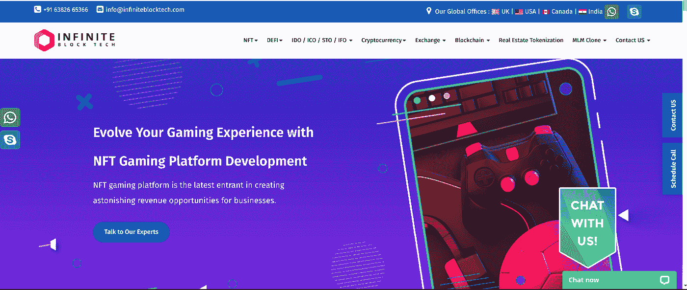
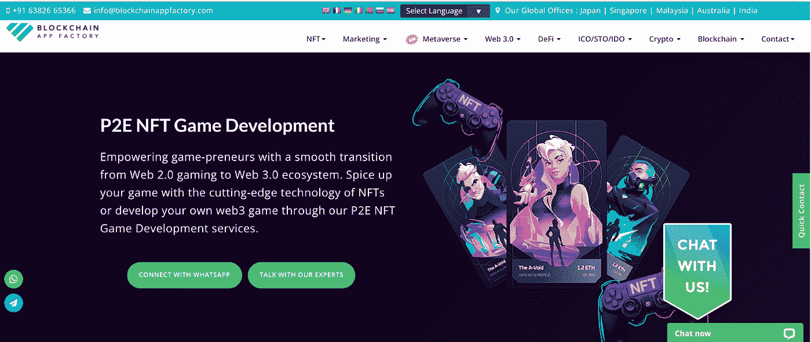
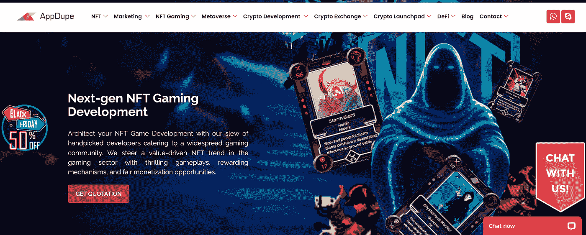
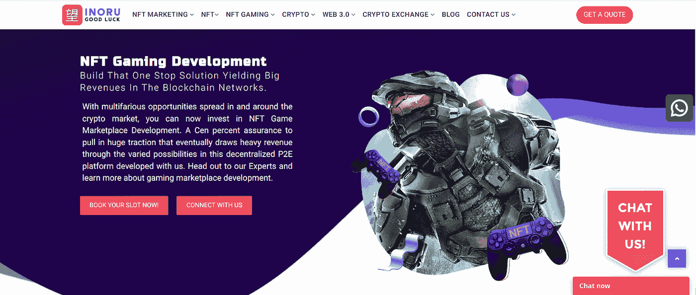
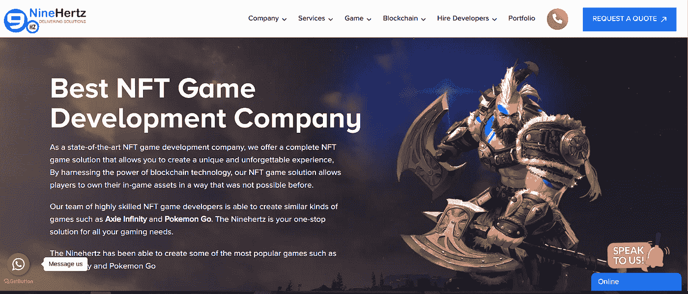
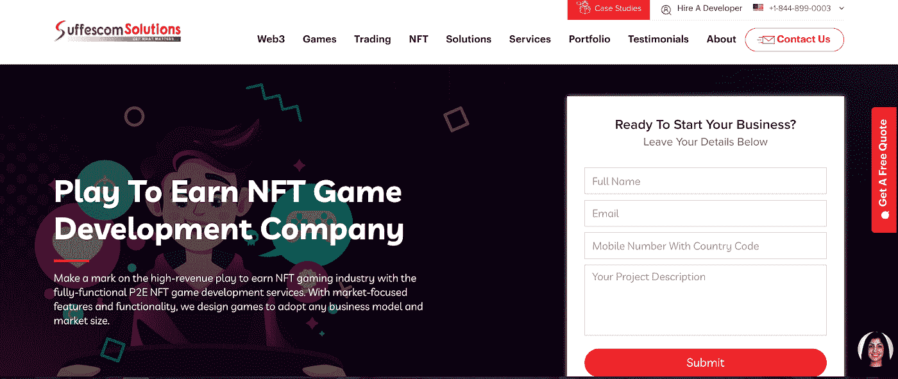
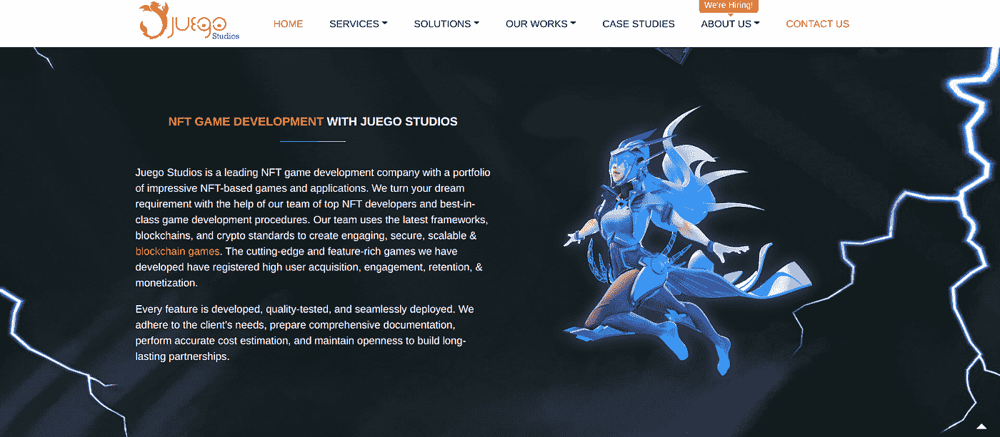
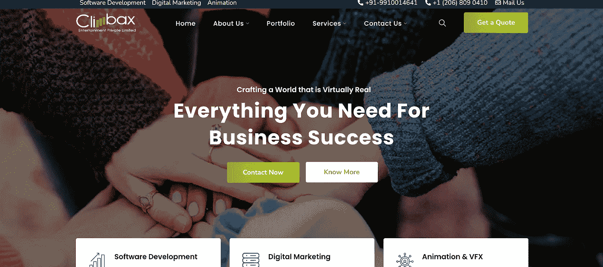
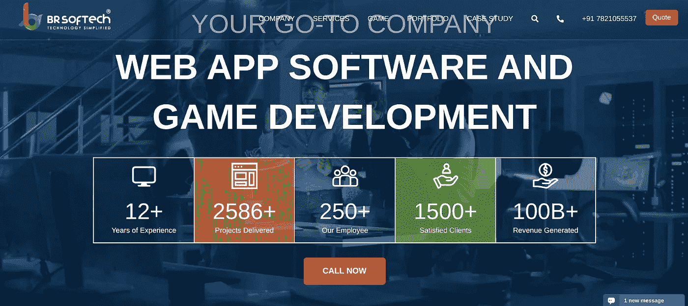
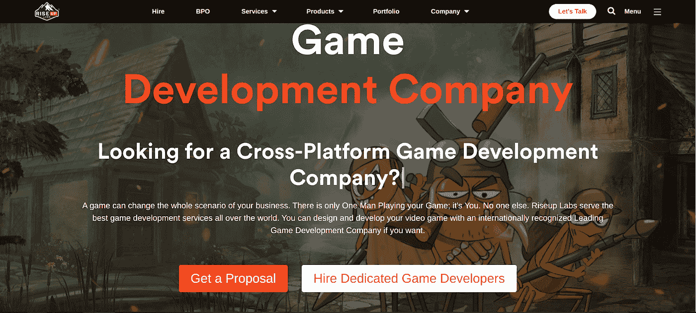

# 2023 年最佳 NFT 游戏开发公司

> 原文：<https://medium.com/geekculture/finest-nft-gaming-development-companies-in-2023-5dd67d0ad335?source=collection_archive---------12----------------------->

NFT 游戏因其潜在的收入而在游戏社区中变得流行。参与 NFT 游戏的玩家可以轻松获得密码。与传统游戏只允许国际玩家赚钱不同，NFT 游戏允许每个人从游戏中赚钱。这个机会增加了玩家对 NFT 游戏的需求，从而增加了游戏世界的商业潜力。企业家已经开始利用市场上提供的 NFT 游戏开发服务来轻松推出他们的游戏。

NFT Gaming Development Company

如果你是一个 NFT 爱好者，正在寻找一家 NFT 游戏开发公司，这篇文章就是为你准备的。我们下面列出了提供最佳服务的公司。您可以选择一个适合您和您的企业。

# 以下是 NFT 顶级游戏开发公司

# 无限块技术

在 NFT 商界，Infinite Block Tech 是一家著名的 NFT 游戏开发公司。它拥有超过七年的区块链技术经验，并提供高质量的开发服务。他们的员工擅长设计、开发和部署游戏应用程序，并且熟悉游戏社区。

# 区块链 App 工厂

区块链应用工厂为所有企业家和商业机构提供客户游戏开发服务。他们有成熟的游戏开发人员，他们都是专业人士，并按时完成了许多项目。他们在 NFT 博彩业有超过 7 年的经验。他们帮助企业家和企业主通过游戏平台成功拓展他们在 NFT 地区的业务。

# AppDupe

AppDupe 是一家 NFT 开发和营销公司，提供端到端的 NFT 游戏开发服务。他们支持那些想要快速成功地开发游戏的用户。他们与拥有 NFT 行业商业经验的高技能区块链开发人员合作。AppDupe 游戏开发团队已经按时交付了每一个客户端项目。

# 伊诺鲁

大公司和企业家可以和他们一起创业来改善他们的生意。Inoru 及其游戏开发团队帮助客户快速推出他们的 NFT 游戏。它有一个团队成功地策划，创造，并推出游戏到 NFT 部门。他们提供知识丰富的技术团队来解决客户的游戏和业务相关问题。

# 九赫兹

NineHertz 是 NFT 顶级游戏开发公司，也是游戏领域的全球创新者。它提供了强大和可靠的 NFT 游戏开发解决方案，可以在 NFT 世界成功实施。该公司成立于 2008 年，在印度、美国、英国、澳大利亚和阿拉伯联合酋长国设有办事处。

# 常见解决方案

Suffescom 是一家制作优秀视频游戏的知名公司，是 IT 和咨询行业的重要参与者。该业务已通过 ISO 认证，并在全球范围内提供值得信赖和可靠的 NFT 游戏开发服务。该公司拥有一批精通 2D 和 3D 游戏开发的专业人员，并创造了 2000 多个全球公认的获奖游戏解决方案。

# Juego 工作室

Juego Studios 是美国最好的 NFT 游戏开发公司之一，是一家受欢迎的区块链技术组织，专注于为游戏、应用、虚拟现实、增强现实、人工智能、机器学习、模拟、大数据、物联网和其他应用提供高质量的设计和开发。它为各种行业提供组织模型和服务，包括制造业、金融服务、医疗保健、国防、建筑和金融。它利用尖端技术，帮助企业家收集关键数据，在竞争中领先一步，并鼓励创新。

# Climbax 娱乐私人有限公司

Climbax 帮助制作安卓 NFT 游戏的美国公司与全球玩家分享他们的想法，通过技术改造社会。他们提供动画、数字营销、移动应用程序开发、计算机编程、网站设计和 NFT 游戏创作。由于他们的知识和人才的工作人员，高潮提供了市场上最快的游戏部署之一，而不损害质量。他们目前在十多个国家有客户，在三个国家有分公司。

# BR 软技术私人有限公司

BR Softech 是开发最新软件和游戏应用程序的全球领导者。这是一家拥有 ISO 9001: 2008 认证的网站、应用程序和移动应用程序开发公司。自 8 月份成立以来，它一直专注于开发基于尖端技术的独特游戏产品和解决方案。因此，它是美国顶级的 NFT 游戏开发组织之一。

# Riseup 实验室

是知名的互联网服务提供商和游戏技术解决方案提供商。Riseup 实验室专门研究互联网、智能手机、虚拟现实和模拟软件。他们自 2009 年以来一直在 NFT 游戏，并已成为一家重要的游戏开发公司。他们在各种平台上设计和开发智能、原创和持久的 NFT 游戏系统、移动应用程序、视频游戏和互动娱乐体验。

# 结论

NFT 游戏开发 的市场正在扩大，因为它为玩家提供了在 cryptos 中赚取资金的机会。这个新的游戏世界为希望从 NFT 世界赚钱的企业主和企业家打开了一个新的市场。感兴趣的企业家可以联系上面列出的任何 NFT 开发公司，在 NFT 空间开发和部署他们的游戏。