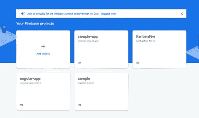
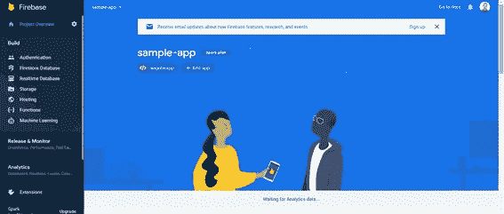
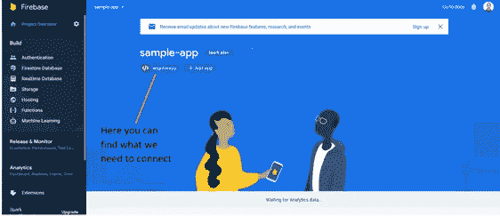
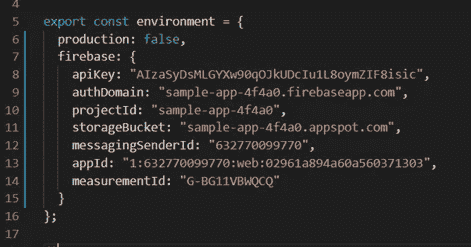
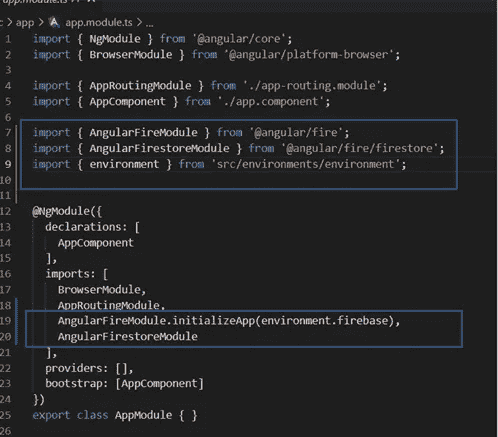
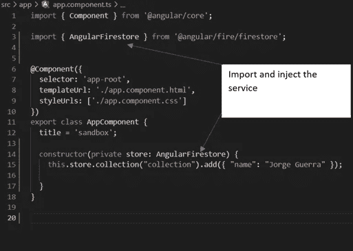
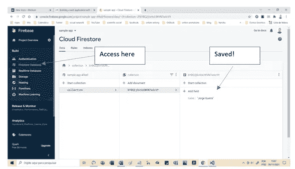
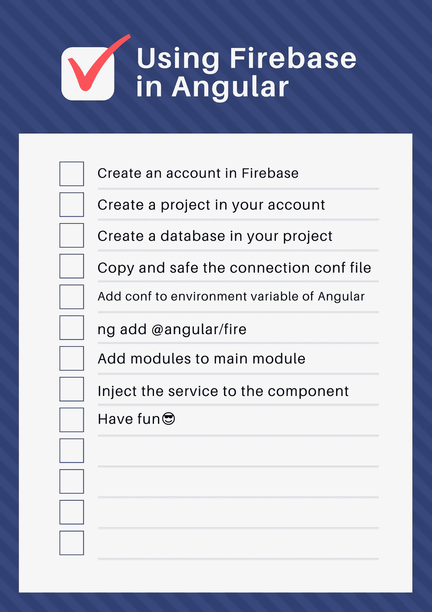

# Firebase 和 Angular:将你的前端应用程序连接到 noSQL 数据库

> 原文：<https://medium.com/geekculture/firebase-and-angular-connect-your-frontend-app-to-a-nosql-database-quickies-1-974c298316a9?source=collection_archive---------10----------------------->

真正困扰我的一件事是，当你想给你的应用程序添加一些东西时，你必须浏览整个教程，只是为了测试一个功能:我们很容易陷入所谓的“教程地狱”的祈祷。

我喜欢对我的学生说，每当你学习新东西的时候，你应该把复杂性隔离开来:*多任务处理是一个神话*，已经被科学质疑过几次了。

 [## 学的快，学的妥！“短暂的不活动和休息——约格·格拉·皮雷斯在 LinkedIn 上

### 学的快，学的妥！“短暂的不活动和休息真的会对记忆产生很大的影响……

www.linkedin.com](https://www.linkedin.com/posts/jorgeguerrapires_how-to-turn-information-into-intelligence-activity-6947488462224674817-7QxC?utm_source=linkedin_share&utm_medium=member_desktop_web)  [## 我在 MongoDB 上开始了我的现代数据库(即 NoSQL)之路——Jorge Guerra Pires 在 LinkedIn 上

### 我已经在 MongoDB 上开始了我的现代数据库(即 NoSQL)之路。最近，我偶然发现了 Firebase(谷歌)。“哦…

www.linkedin.com](https://www.linkedin.com/posts/jorgeguerrapires_firebase-and-angular-connect-your-frontend-activity-6952564554182594560-LTnz?utm_source=linkedin_share&utm_medium=member_desktop_web) 

不要相信我们可以一次做很多事情的常识和错误的想法:卡斯帕罗夫曾经说过，他最多可以预测未来 5 步，我曾经听说有人说他可以预测 20 步！我们开门见山吧！当你在学习中受到伤害时，最大的风险是当你实际上不明白的时候，你会认为你明白了:根据我自己作为私人教师的经验，你可以很容易地说并认为你理解了一个概念，这是令人惊讶的，因为你不得不在战斗中承认你不知道你在说什么！代码有这样的魔力:如果你不知道，你的代码就不起作用，就像这样，没有谎言，没有政治！如果你不能描述，你不能建模，你不能编码！

> 代码有这样的魔力:如果你不知道，你的代码就不起作用，就像这样，没有谎言，没有政治！

我将快速向你展示如何配置 Firebase 到你的应用程序，使用一个简单的应用程序，一个自动生成的应用程序，使用 Angular CLI。这里我们挑出复杂的部分，让事情简单明了。

# 创建简单的应用程序

## 创建有角度的基本应用程序

使用以下命令创建一个新的应用程序，这需要一些时间，所以请耐心等待！余波，这是一个完整的应用程序，你可以运行没有额外的努力。

`ng new app`

## 启动你的应用程序

启动你的应用程序:

`npm start`

此命令将启动您的应用程序，其中包含已配置并运行的最少组件和功能。

# 创建 Firebase 数据库

前往:【https://console.firebase.google.com/ 

你需要一个免费且易于创建的账户。

Windows to create your project, if you do not have it yet

After your project was created

你需要这样的东西:

**const firebaseConfig = {
API key:" xxxxxxxxxxxxxxxxxxxxxxxxxxxxxxxxx "，
authDomain:" xxxxxxxxxxxxxxxxxxxxxxxxxxx "，
project id:" xxxxxxxxxxxxxxxxxxxxxxxxxxxxxx "，
storage bucket:" xxxxxxxxxxxxxxxxxxxxxxxxxxx "，
messaging senderid:" xxxxxxxxxxxxxxxxxxxxxxxxxxxxxxxxx "，
appId:" xxxxxxxxxxxxxxxxxxxxxxxxxxxxxxxxxxxxxxx "，
measurement id:" xxxxxxxxxxxxxxxxxxxxxxxxxxxxxxxxxxxxxxxxxxxxxxxxxxxxxx "
}；**

这将放在您的环境变量中。

# **创建数据库(不要忘记，我已经做了几次)**

这一步真的让我浪费了时间:我甚至差点放弃了，开始讨厌 Firebase，他们在你的 app 响应里说什么都没有，没有错误，根本没有响应！如果愿意，可以在测试模式下创建数据库。对于创建您的应用程序，甚至部署，这就足够了！

Amost there!

# 将 Firebase 添加到您的应用程序

只是打字，可能需要一段时间，耐心点！

`ng add @angular/fire`

与旧教程相比，这是惊人的，因为现在 Firebase 是 Angular 的一部分，就像 Angular Material 一样！太棒了。

# 连接数据库

您需要将连接信息添加到环境变量文件中。如果您愿意，您也可以添加生产环境变量。

Full main module

最后但同样重要的是，将信息添加到您的主模块中:

# 简单的例子

这个简单的例子只是将一个文档添加到数据库中。注意 JSON 格式，Firebase 是一个基于文档的数据库，一个 noSQL，像 MongoDB 一样。

You should see this, otherwise, you forgot to create the database, as I did, and took me time to finally figure it out!

您可以在此找到该应用程序:

 [## GitHub-JorgeGuerraPires/firebase _ app 上的示例

### 此项目是使用 Angular CLI 版本 11.2.7 生成的。为开发服务器运行 ng serve。导航到…

github.com](https://github.com/JorgeGuerraPires/firebase_sample/tree/app) 

# 结束语

通常，我使用 MongoDB 来连接数据库:我已经发现用 Mongoose 和 MongoDB Atlas 可以直接连接到数据库，用 NestJS 甚至更容易。现在，有了 Firebase，事情似乎变得更简单了。

Firebase 是一个完整的环境，甚至具有机器学习能力，这很自然，因为 TensorFlow.js 和 AutoDraw 也来自谷歌:他们在预告片中声称，如果你需要更定制的东西，你可以使用基于 TensorFlow.js 的解决方案。

有一次我从一份股市分析中听到 MongoDB 不是 Google 的竞争对手，为了证明 MongoDB 的潜在增长:谁想继续走 Google 的路？😅我曾经投资过 MongoDB，但现在它引发了一些担忧。不确定 Firebase 会对 MongoDB 造成多大的干扰，但他们需要发展，因为他们作为一个公司还不稳定:这些数字可能会引起一些关注。据我所知，我们无法从 Angular 连接到 MongoDB，它运行在浏览器上。因为我不是巫师，事情总是在变化，我在谷歌上搜索了一下，似乎情况仍然如此。

因此，Firebase 可以替代 MongoDB/mongose，比如说在快速应用程序测试/原型开发方面:如果编码正确，您可以轻松地将数据库访问系统从数据库中分离出来，这样在以后需要时更容易更改:记住，单元测试需要良好的分离。尽管通过 Mongoose 连接到 MongoDB 很容易，现在使用 NestJS 甚至更容易，但如果您已经因为快速编码而感到压力，这仍然很痛苦:一旦您配置 Firebase 来执行 CRUD 操作，这是非常容易的，我对 Firebase 感到非常惊讶。现在。甚至使用谷歌的认证也可以很容易地完成，刚刚做到了:[https://miyagi-do-lab.herokuapp.com/](https://miyagi-do-lab.herokuapp.com/)！

Check list, no need to feel shame, I have several of them!

 [## Jorge Guerra Pires 在 LinkedIn 上:刚刚向自己发起了自我炸弹挑战:用我自己的文章

### 刚刚向自己发起了一个自我炸弹挑战:用我自己的文章来设置一个应用程序。我几个月前写的一篇文章，不…

www.linkedin.com](https://www.linkedin.com/posts/jorgeguerrapires_firebase-and-angular-connect-your-frontend-activity-6947295185382887424-Gkk_?utm_source=linkedin_share&utm_medium=member_desktop_web) 

**参考**

*   [用 Angular 和 Firebase 构建 web 应用](https://developers.google.com/codelabs/building-a-web-app-with-angular-and-firebase#10)

# 电子书的一部分

我从 Medium 中选择的关于计算机编程的分析:Angular，JavaScript，Machine Learning，TensorFlow.js 等等！

 [## 我选择了计算机编程的中级分析:Angular，JavaScript，机器学习…

### 包括我从计算机编程中选择的分析:Angular，JavaScript，机器学习，TensorFlow.js 和…

www.amazon.com.br](https://www.amazon.com.br/dp/B09PGT697D) 

# 下一步是什么？

MongoDB vs. Firebase:比较创建应用程序的两个最佳 noSQL 选项之一！

===
捐款

给我买杯☕☕☕☕☕咖啡或者一本书！！📚📚📚📚📚
如果这些内容对您有用！这是一次性捐赠，没有必要再捐赠了！

 [## Jorge Guerra Pires 正在创建在线免费课程和教程

### 嘿👋我刚刚在这里创建了一个页面。你现在可以给我买杯咖啡了！我想我已经在某种程度上帮助了你我的在线免费…

www.buymeacoffee.com](https://www.buymeacoffee.com/jorgepires) 

现在你也可以支持我的任何项目！🥰🥰
更多信息:

 [## 项目| IdeaCodingLab

### jorgeguerrabrazil+ideacodinglab@gmail.com

jorgeguerrabrazil.wixsite.com](https://jorgeguerrabrazil.wixsite.com/ideacodinglab/publications) 

访问我的课程:[https://www.udemy.com/user/jorge-guerra-pires](https://www.udemy.com/user/jorge-guerra-pires/)