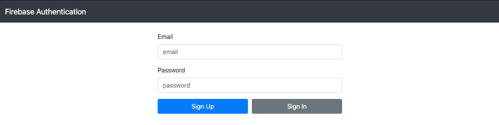
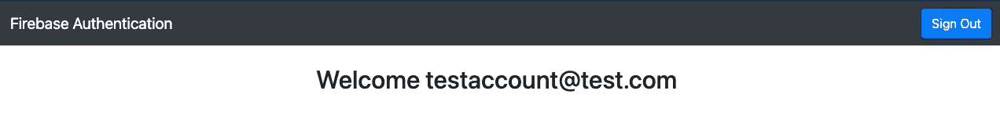
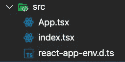
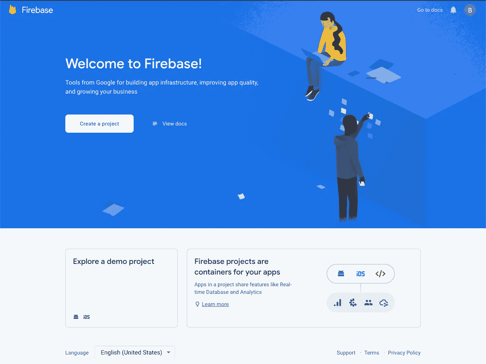
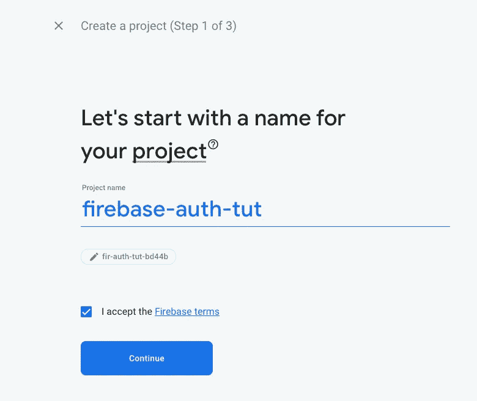
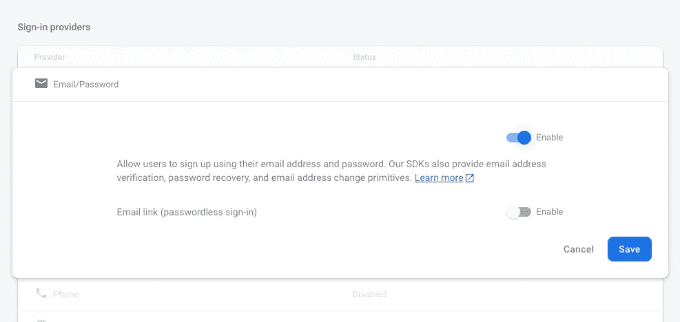
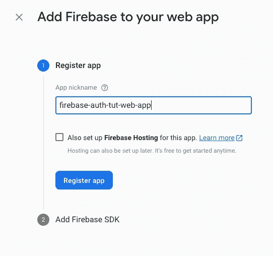
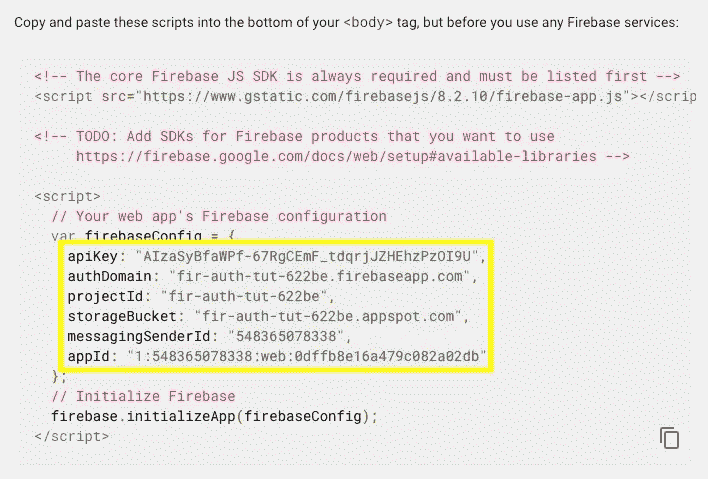
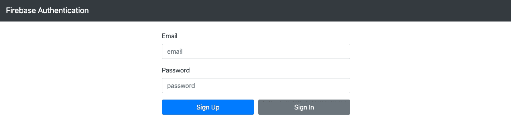

# 具有反应和类型脚本的 Firebase Auth

> 原文：<https://medium.com/geekculture/firebase-auth-with-react-and-typescript-abeebcd7940a?source=collection_archive---------0----------------------->

## 了解在 React 项目中使用 Firebase 集成身份验证系统是多么容易。


今天，我们将通过一个非常简单的例子来演示如何在 React 应用程序中设置身份验证。身份验证可能是一个非常可怕的话题，但由于 Firebase 等工具，现在向应用程序添加身份验证变得非常简单。

# 先决条件

为了更好地理解本演练，您需要对以下技术有基本的了解:

*   反应
*   Typescript(我将详细介绍 typescript 的各个部分，所以如果您不太熟悉，也不用担心)
*   Java Script 语言

*节点和 NPM 也需要安装*

# 我们将建造什么

为了演示使用 Firebase 在 React 应用程序中设置身份验证是多么简单，我也将保持这个应用程序极其简单。基本上，我们要建立的是一个应用程序，将欢迎用户登录时，他们在网站上，如果没有用户将显示一个登录屏幕。这将提供一个很好的构建模块，可以在任何需要身份验证的应用程序中使用。

**用户未登录时会是这样的**



Sign In Screen

**用户登录**后会是这样



Signed In Screen

# 我们将如何建造它

如上所述，我们将使用 react 和 typescript 来构建这个应用程序。为了进一步简化这个过程，我们将使用 create-react-app，它抽象出创建 react 应用程序背后的设置过程。第一步是打开一个新的终端，并导航到您想要创建项目的目录。一旦你选择了一个你满意的目录，你将运行下面的命令来创建我们将要使用的 react 应用程序。

```
npx create-react-app --template typescript firebase-auth-tutorial
```

本质上，这是要做的是样板一个反应应用程序，使用 typescript。安装完成后，运行此命令切换到项目。

```
cd firebase-auth-tutorial
```

一旦我们在命令行中导航到该项目，我们将安装该项目所需的几个包

```
npm install firebase react-bootstrap bootstrap
```

我们需要 **firebase** 包来为教程做认证设置，我们将使用 **react-bootstrap** 和 **bootstrap** 包来设计我们的应用程序。由于本教程的重点不是学习 css，我们将使用 bootstrap 来简化事情。

现在项目已经设置好了，你可以在你选择的代码编辑器中打开 *firebase-auth-tutorial* 文件夹。我强烈推荐 Visual Studio 代码。它是由微软创建的免费代码编辑器。如果你想试试的话，我在下面放了一个链接。

[](https://code.visualstudio.com/) [## Visual Studio 代码-代码编辑。重新定义的

### Visual Studio Code 是一个重新定义和优化的代码编辑器，用于构建和调试现代 web 和云…

code.visualstudio.com](https://code.visualstudio.com/) 

在您选择的代码编辑器中打开项目后，下一步是删除本教程中不必要的文件。您可以删除 src 文件夹中的以下文件:

*   App.css
*   App.test.tsx
*   index.css
*   徽标. svg
*   reportWebVitals.ts
*   setupTest.ts

完成后，src 文件夹应该如下所示



我们现在将使用以下代码替换 App.tsx 和 index.tsx 文件。基本上，我们将尽可能简化它。

完成这些更改后，您现在应该能够运行代码了。为此，您只需在终端的项目文件夹中运行以下命令

```
npm start
```

# Firebase 设置

设置 Firebase 是一个相当简单的过程。在接下来的几分钟里，我将向您介绍如何进行这项工作。

重要的事情是第一位的。你需要一个 gmail 账户来使用 firebase。我假设大多数人已经有了这个，但如果没有，你将需要一个。

之后，您可以导航到以下链接

[](https://console.firebase.google.com/) [## 登录- Google 帐户

### 编辑描述

console.firebase.google.com](https://console.firebase.google.com/) 

如果您尚未登录，系统会提示您登录您的 google 帐户。一旦你登录，你会看到一个类似这样的屏幕



如果你已经有了项目，或者如果他们将来改变了这个屏幕的外观，它可能会稍有变化，但是屏幕应该看起来像这样。接下来，我们将单击“创建项目”按钮。对于项目名称，您可以随意称呼它，但是为了清楚起见，我将称它为 firebase-auth-tut



接下来，它将询问您是否要为项目设置分析。您可以取消选中该框，因为我们不会在该项目中使用分析。


现在继续并点击创建项目。这可能需要一段时间来为您设置好一切，但还不算太糟。

你将会看到一个类似如下的屏幕，但是在本教程中，我们只对认证感兴趣。那么，继续操作，单击“authentication ”,我们接下来将进行设置。


一旦你点击了认证。继续并点击开始。之后，你会看到一个屏幕，上面有所有不同的签名提供者和配置选项。这个屏幕可能看起来令人生畏，但它真的不是。我们真正关心的唯一事情是登录提供商下面的电子邮件/密码部分。请点击启用，然后按保存。你可以参考下面的截图了解更多信息。



启用此功能后，在我们开始编码之前，firebase 控制台中还有最后一件事情要处理🎉🎉🎉

最后一步是创建我们的网络应用程序，这也非常简单。我们只需要再点击几下按钮。

单击返回项目概述页面，然后单击 web 应用程序图标，如下图中黄色框所示。


你会看到一个类似这样的屏幕，要求输入一个应用昵称，这是 firebase 中 web 应用所必需的。任何名字都可以，但我会像下面的截图一样称呼我的名字。



命名后点击注册应用程序。然后，您应该会看到类似这样的代码块。你不会需要它的大部分，但你可以继续复制和存储截图中的黄色框。

我给你看我的证书，因为我将在本教程结束后删除我的项目。尽管只要设置了适当的安全规则(另一个主题),共享 firebase 凭证通常是安全的，但最好不要与其他人共享这些凭证。



好吧，就这样。您可以点击继续进入控制台。Firebase 已经准备就绪。现在开始编码！

# 如何在 React 应用程序中编写使用 Firebase 的代码

我们要对代码做的第一件事是在 src 目录下创建一个名为 **firebaseSetup.ts.** 的新文件，名字并不重要，但这就是我要给它起的名字。这是我们需要你的证件的地方。我将在下面解释。

基本上，这个文件负责建立与 firebase 的连接，并为我们提供从 react 应用程序与它交互所需的工具。因为我们在 firebase 应用程序中唯一要做的事情就是身份验证，这是我们必须引入应用程序的唯一库。您可以在第 2 行看到我们正在导入 firebase/auth 名称空间。在第 15 行，我们导出 auth，这基本上是我们需要在 react 应用程序中登录和退出的所有方法和函数。还要记住**非常重要的一点是**，你**用我让你复制并保存在某个地方的行来替换**行**5–10**(否则你的应用将无法工作)。

安装好 firebase 并准备在项目中使用。是时候进入本教程的反应部分了。我们要做的第一件事是设置一个上下文和提供者，这将允许我们在 react 应用程序中的任何地方传递登录的用户。在这么小的应用程序中这样做没有太大的意义，但这将是中型到大型 react 应用程序的救命稻草，在这些应用程序中，将道具传递到深度嵌套的组件会变得非常困难。

我们将在 src 目录中创建两个新文件夹和文件。**context/auth context . tsx**和**provider/auth provider . tsx**

我们的 **AuthContext.tsx** 文件非常简单。它基本上只是创建我们的上下文，给它一个 typescript 类型，并给它一个 null 初始值。<燃烧基地。对于不熟悉的人来说，创建上下文后的 User | null >就是所谓的 typescript 泛型。在这个场景中，我们所说的是我们的 AuthContext 的类型可以是两种情况之一。要么是*的火力基地。用户*或*为空*。当用户未登录时，值将为 Null。

这是我们的 **AuthProvider.tsx** 文件，它所做的高级总结是，每当我们登录、创建帐户或注销时，它都会相应地设置我们用户的状态。当没有用户登录时，它将状态设置为登录用户或 null。

## 该文件的类型脚本部分的简短描述

在第 6 行，我们将 AuthProvider 的类型设置为 React。FC(基本上是功能组件)。我们这样做是因为 typescript 无法自己推断 AuthProvider 的类型。这很重要，因为如果它不知道正确的类型，我们就无法在这一行分解子元素。

## 对使用效果中实际发生情况的解释

在第 10 行，我们创建了一个对 firebase 的订阅，每当用户的状态改变时，它都会向我们反馈信息。firebase 反馈的信息是我们函数的第一个参数(我称之为 firebaseUser)。这要么会作为一个*火基回来。用户*类型或*为空*。这非常方便，因为这正是我们所期望的🤔

# 现在是时候编写 UI 了

就像我之前在教程中说的，为了简单起见，我们不会为这个应用编写自己的 css，而是使用 react-bootstrap。在我们开始使用 bootstrap 编写 ui 之前，我们将首先在之前创建的 AuthProvider 组件中包装我们的应用程序，并导入 bootstrap 所需的 css 文件。

所有这些都是在整个应用程序中提供身份验证上下文，因此无论您在应用程序中的哪个位置，都可以获取登录的用户。

## 现在该使用 react-bootstrap 了

我不会详细解释 react-bootstrap 组件的功能，但是它们没有什么特别的。如果你想为此创建自己的设计，请随意(我鼓励你这样做)。如果没有，你可以跟着我做什么。

这是我们应用程序的基本布局

现在，您应该能够使用

```
npm start
```

如果你跟着我，你应该得到类似这样的东西。如果不多呆一会儿。我们即将为我们的应用程序实现登录注销逻辑。



在我们能够创建帐户之前，我们需要引用电子邮件和密码的值。

创建参照后，可以将它们添加到表单控件中。

添加了 refs 之后，是时候进行身份验证逻辑了。登录、注销和创建帐户的时间到了。

我们可以将以下函数添加到 refs 下面的应用程序函数中。

这就是使用 firebase 进行身份验证的好处。所有的逻辑都由 firebase 处理，所以你不用担心。创建了这些函数后，只需点击按钮调用它们，然后更新我们的 ui 以反映变化。我们快完成了。

让我们将点击事件添加到按钮中

将这些添加到我们的应用程序后，登录和创建帐户功能现在就可以工作了。最后一个问题。我们的用户界面没有更新以指示我们已登录，我们需要一个注销按钮当我们登录时。

这里有一个解决方案，我将用于演示目的，但请随意使用您自己的想法。

# 包裹

仅此而已。我们现在已经使用 typescript、react 和 firebase 创建了一个身份验证系统。使用 firebase auth 之类的东西进行身份验证的好处在于，您不必精通与身份验证相关的所有事情。如果 auth 实现得不好，很容易给代码库带来安全缺陷，但是有了这样的工具，这就不再是问题了。