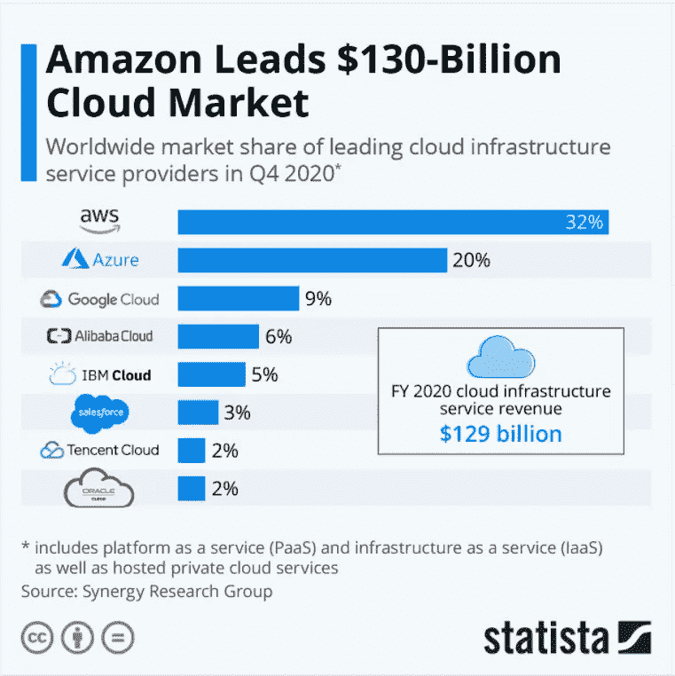

# Firebase 与 AWS 放大器

> 原文：<https://medium.com/geekculture/firebase-vs-aws-amplify-2286389c63cf?source=collection_archive---------3----------------------->

## 燃烧器自动报警系统——概述

Source [Statista](http://cloud%20market%20share%202020/)

从信息图封面图片可以看出，AWS 是 BAAS 中的大玩家。作为一个 Firebase 用户，我想看看我是否错过了什么。这是我将比较这两种服务的系列文章中的第一篇。

我将介绍产品供应、定价和开发人员体验。在后来…