# 世博应用的一级推送通知

> 原文：<https://medium.com/geekculture/first-class-push-notifications-for-expo-apps-4bd7bbb9a01a?source=collection_archive---------0----------------------->

所以是时候让你的精彩世博应用程序开始发送推送通知了。你已经看了多种选择，但仍然不确定选择哪一种。不管你现在在哪里，在 2021 年 8 月在你管理的 Expo 应用上实现推送通知以及如何实现之前，你都需要知道这些。

# 介绍

## 通知网关

最终，通知通过推送通知网关到达用户的设备:用于 Android 设备的 FCM (Firebase Cloud Messaging)和用于 iOS 设备的 APNs(Apple Push Notification service)。这两个网关都是公开 Web API 的服务，用于通过 HTTP 请求向用户发送推送通知。

我们不需要了解更多关于这些网关的信息，但是使用它们是向我们的用户发送推送通知的唯一方式。我们需要配置 FCM 和 APNs 凭证，并为我们的应用程序调用它们的 API 来成功交付通知。

## 推送代币

推送令牌是唯一的密钥，用于标识特定设备中安装的应用程序。推送令牌由苹果或谷歌推送通知网关发布，只允许向预期的应用程序设备组合发送消息。它们的格式因操作系统而异，但看起来有点像`03df25c845d460b...f99cc3edcb63a85ea2ef2`。

## 服务器端要求

任何形式的消息传递都涉及发送方和接收方，此外，发送方需要知道接收方的 ID 才能找到他们。对于推送通知，接收者的 ID 就是他们的推送令牌。

因此，在向用户发送通知之前，需要收集用户的推送令牌并将其存储在某个地方。虽然这并不一定意味着您需要一个后端服务器，但是您肯定需要一个可信的环境来存储推送令牌和调用通知网关 API。


Push token collection

如果您已经在利用后端基础设施，它绝对是处理通知相关操作的好地方。如果您没有这样的基础设施，并且希望保持简单，您可以使用无服务器解决方案。

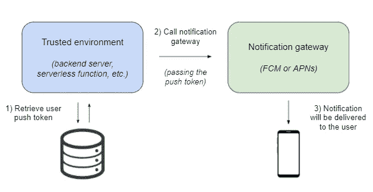

Sending a push notification to a specific push token

*通知也可以发送给应用程序的所有受众。如果您不需要向特定用户发送通知，则可以跳过收集推送令牌和设置服务器端环境来发送通知，而是使用图形通知编辑器工具(例如 Firebase notification composer)。*

# 技术考虑

## 推动代币收集:世博之路

Expo 为设置和处理推送通知提供了一个很棒的模块，它不仅工作起来很有魅力，而且还被很好地记录了:`expo-notifications`。这是我将用来在客户端处理推送通知的模块，它提供了两种不同的收集推送令牌的方法:

*   [**getDevicePushTokenAsync**](https://docs.expo.dev/versions/latest/sdk/notifications/#getdevicepushtokenasync-devicepushtoken):该方法返回设备原生推送令牌，对于 iOS 和 Android 不同，这是我们在与通知网关直接通信时需要使用的令牌。
*   [**getexpushtokensync**](https://docs.expo.dev/versions/latest/sdk/notifications/#getexpopushtokenasyncoptions-expotokenoptions-expopushtoken):该方法返回一个 Expo 推送令牌(类似于`ExponentPushToken[lBc...ZsM]`)，这是一个定制令牌，Expo 推送通知服务使用它来传递通知，而不是本地推送令牌。这是我们在使用 Expo 的服务时需要使用的方法。

## 推送代币收集:Firebase 方式

Firebase 包括一个消息传递模块，可用于管理推送通知。根据 [Firebase 文档](https://firebase.google.com/docs/cloud-messaging/js/client)，`messaging.getToken`是我们需要调用的函数，以便检索设备推送令牌，它将首先请求通知权限，以防它们尚未被授予。

不幸的是，Firebase 消息传递模块与 React native 不兼容💔长话短说，试图调用消息传递模块将导致无法处理的异常(关于此问题的更多详细信息，请参见本 [stackoverflow 问题](https://stackoverflow.com/questions/61300018/typeerror-firebase-default-messaging-is-not-a-function-in-firebase-default-m/64855286#64855286))。

```
firebase.default.messaging is not a function. (In '_firebase.default.messaging()', '_firebase.default.messaging' is undefined)
at App.tsx:34:4 in <global>
at node_modules\metro\src\lib\polyfills\require.js:321:11 in loadModuleImplementation
at node_modules\expo\AppEntry.js:3:0 in <global>
- ... 4 more stack frames from framework internals
```

## 世博会推送通知服务

虽然直接与通知网关 Web APIs 通信是一种完全可以接受的发送推送通知的方式，但我将在本文中使用一种不同的方法。如[世博会文件](https://docs.expo.dev/push-notifications/sending-notifications-custom)中所述，通知网关直接沟通需要处理一定的复杂性:

*   区分原生 iOS 和 Android 设备令牌
*   要编写和维护的代码量增加了一倍
*   FCM 和 APNs 响应错误处理

我们当然可以处理这种复杂性，但是 Expo 恰好提供了一个不依赖于 iOS 的推送通知服务，已经可以处理这种复杂性了。另外，我们将使用`expo-notifications`来处理客户端的通知，所以我觉得使用 Expo 推送通知服务很有意义(例如，通知`data`在两端都由 Expo 自动序列化和反序列化)。该服务是这样工作的:

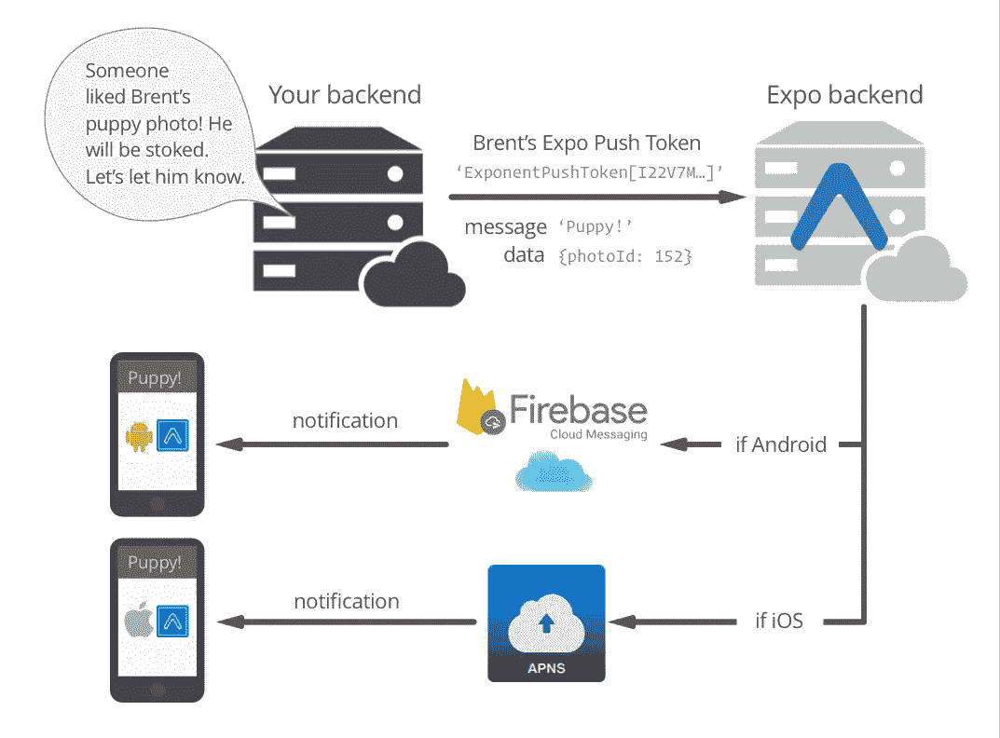

# 用例

在开始编码之前，我们需要一个推送通知的用例。假设我们将创建一个允许用户订阅每日天气通知的应用程序。为简单起见，我们将从一个城市开始(例如🕶️的巴塞罗纳)，通知将总是在同一时间发送(例如上午 8:00)。

除了订阅/取消订阅按钮，该应用程序还将包括一个“发送”按钮，以接收用户需求的测试通知。用户将是匿名的:我们将只存储用户的 ExpoPushToken，这样我们就可以确定在预定时间需要通知的设备。

收到/点击通知后，应用程序将显示通知内容(出于演示目的，我将使用 JSON 查看器)和一个清除通知的按钮。ExpoPushToken 也会显示，以便用户可以使用 [Expo 通知工具](https://expo.dev/notifications)向自己的设备发送测试通知。

因为这是一个演示应用程序，我们不需要花太多时间来设计它。

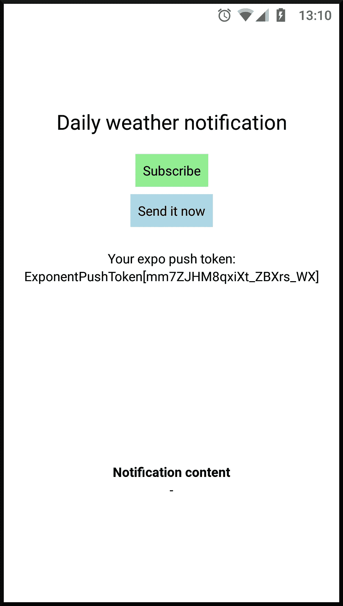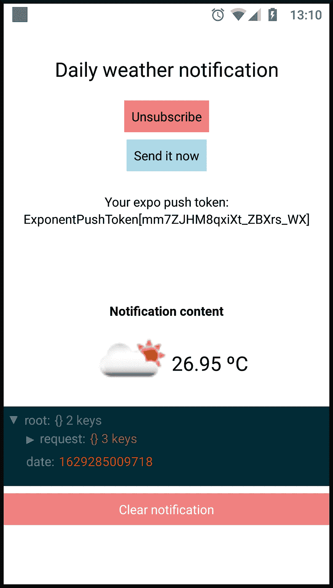

# 实现:客户端

在 Expo 上处理推送通知相当简单。让我们继续安装博览会通知模块。我们将使用本模块来:

```
expo install expo-notifications
```

*   显示收到的通知。当接收到通知时，Expo 调用`handleNotification`函数参数，我们传递给`Notifications.setNotificationHandler`来决定通知是否必须显示给用户。
*   收到通知时更新应用程序。只有当应用程序被**前台**接收到通知时，世博会才会运行通过`Notifications.addNotificationReceivedListener`提供的回调。
*   点击通知时更新应用程序。当用户点击通知 Expo 将启动应用程序，并运行通过`Notifications.addNotificationResponseReceivedListener`提供的回调。
*   获取设备推送令牌。

为了使下面的代码片段尽可能简单，我在一个单独的文件中提取了与服务器相关的函数(即`server-operations.ts`)，并且省略了所有的样式标签。

然后，我们需要通过添加`NOTIFICATIONS`权限并将`android.useNextNotificationsApi`设置为`true`来稍微调整一下`app.json`文件。

这就是我们在 Expo Go 客户端上获得通知所需的全部内容🍾您现在可以通过使用 [Expo 通知工具](https://expo.dev/notifications)来测试它们，提供将在应用程序中显示的 ExpoPushToken。在我们实现服务器端之前，按下应用程序上的按钮将不起作用。

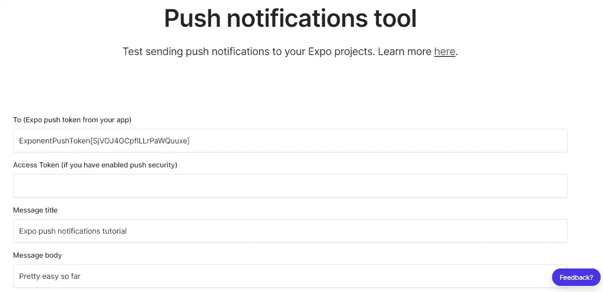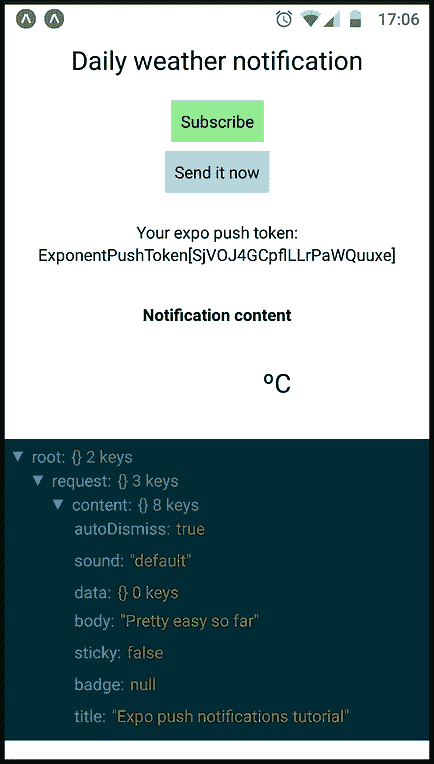

关于`server-operations.ts`，请注意，与服务器相关的操作很大程度上取决于服务器端的选择。下面是在服务器端使用 Firebase 实时数据库和 Firebase 函数时的操作(省略了错误管理)。

现在让我们为发布做好准备🚀当在 Expo Go 客户端中测试通知时，我们使用 Expo 的 FCM 和 APNs 凭据，但在发布应用程序时，这不会起作用。我们需要做的下一件事是配置并向 Expo 应用程序添加 FCM 和 APNs 凭证，以使推送通知在我们应用程序的发布版本(例如独立版本)上工作。

## 配置 APN

因为我们是在 Expo 上构建的，所以配置 APN 变得非常容易。我们需要做的就是启动世博会证书管理器，并从列表中选择选项。

```
expo credentials:managerAccessing credentials for <…> in project expo-notifications-tutorial? Select platform › — Use arrow-keys. Return to submit.
❯ ios
 android? What do you want to do? › - Use arrow-keys. Return to submit.
❯   Use existing Push Notifications Key in current project
    Use existing Distribution Certificate in current project
    Remove Provisioning Profile
    Add new Push Notifications Key
    Remove Push Notification credentials
    Update Push Notifications Key
    Add new Distribution Certificate
    Remove Distribution Certificate
    Update Distribution Certificate
```

*如果您收到“命令错误:需要输入，但 Expo CLI 处于非交互模式。”错误，您需要使用不同的命令行实用程序。在我的例子中，在 Windows 10 上开发，Linux 的 Windows 子系统是唯一成功的终端。*

如果你有 Expo 应用程序，你可以使用现有的推送通知键。请注意，同一个 Apple 开发者帐户只能有两个推送通知键，这些键将在您的所有应用程序中使用。

如果您当前的 Apple Developer 帐户没有推送通知密钥，请创建一个新的推送通知密钥。尝试创建第三个推送通知键将导致 Expo 凭证管理器和 Apple 开发者门户都出现错误消息。

```
✖ Failed to create Apple push key
CommandError:
You can have only two Apple Keys generated on your Apple Developer account.
Please revoke the old ones or reuse existing from your other apps.
Please remember that Apple Keys are not application specific!
```

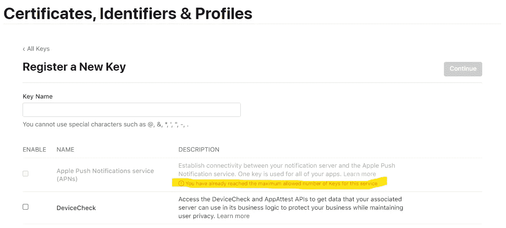

Apple Developer Portal error message

无论是重用现有的密钥还是在过程结束时创建一个新的密钥，您都应该看到与下面类似的消息。您也可以在[https://expo.dev/](https://expo.dev/)中查看您应用程序的**凭证**部分。

```
Successfully assigned Push Notifications Key to <...>/expo-notifications-tutorial (expo.notifications.tutorial)
```

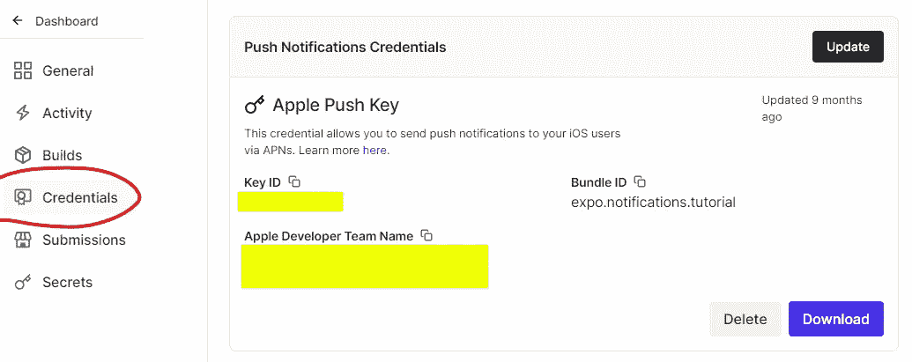

在添加推送通知键后，您需要至少重新构建一次 iOS 版应用程序`expo build:ios`，以使更改生效。

## 配置 FCM

如 Expo 文档中所述，我们需要将 Firebase 项目链接到 Expo 应用程序，以便使用 FCM。这并不意味着您需要将应用程序迁移到 Firebase，但是您需要创建一个 Firebase 项目，并将 Firebase 证书添加到 Expo 应用程序中。直接来自[本页面的世博文件](https://docs.expo.dev/push-notifications/using-fcm/):

*   选择您的 Firebase 项目。创建新项目或使用现有项目。在这两种情况下，您都需要将 Firebase 添加到您的 Android 应用程序中(使用您的`app.json`文件的`android.package`值)。

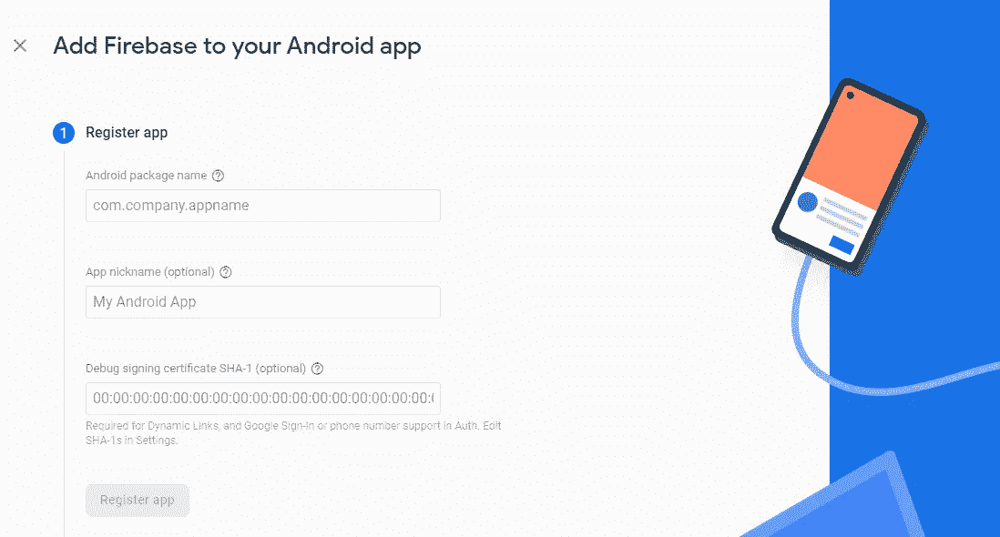

*   下载你的 Firebase 应用程序的`google-services.json`文件，放在你的 Expo 应用程序的根目录下。将该文件从源代码管理中排除是一个好主意。

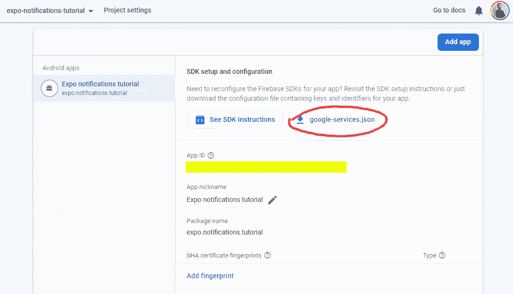

*   在您的`app.json`文件中添加一个`android.googleServicesFile`字段，其中包含您刚刚下载的`google-services.json`文件的相对路径。

*   为 Android 重建应用程序`expo build:android`，以使更改生效。

*如果您已经在应用程序中使用 Firebase，并且之前已经添加了* `*google-services.json*` *文件，请跳过前面的步骤。*

这就是我们在 Expo app 端需要做的全部工作，但我们还需要完成一个步骤。因为我们使用 Expo 通知服务，而不是直接调用 FCM，所以我们需要将 Firebase 项目服务器密钥上传到 Expo 的服务器，这样 Expo 的服务就可以在调用 FCM 时为我们提供密钥。

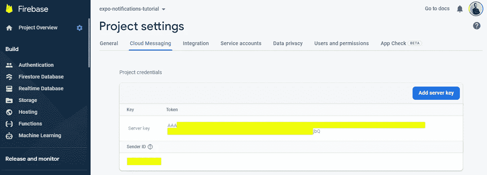

Firebase 服务器密钥可以在**项目设置** > **云消息** > **服务器密钥**中找到。找到服务器密钥后，您需要运行以下命令将其上传到 Expo 的服务器:

```
expo push:android:upload --api-key AAA…jbQ
```

之后，您可以在[https://expo.dev/](https://expo.dev/)再次检查您应用程序的**凭证**部分，以确保服务器密钥已正确上传。

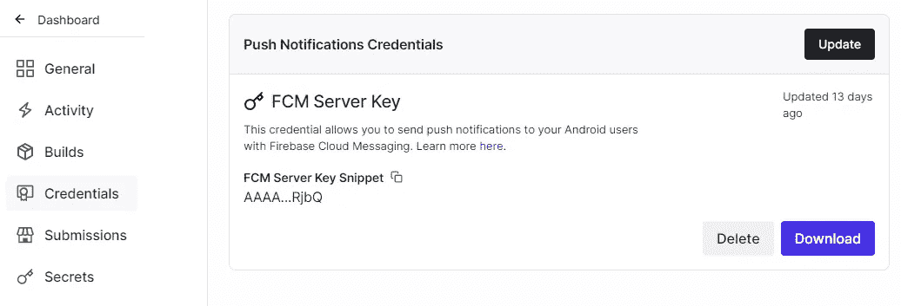

# 实现:服务器端

服务器代码需要处理的最相关的任务是编写和发送推送通知。因为我们依赖于 Expo 推送通知服务，所以我们将使用 Expo 服务器 SDK(因为我是用 Typescript 编码的，所以使用了 [Node.js 版本](https://www.npmjs.com/package/expo-server-sdk))。

`expo-server-sdk`公开了一个名为`sendPushNotificationAsync`的方法，该方法接收一组消息对象，并调度这些消息向相应通知网关的传递。消息对象必须根据 Expo 进行格式化。这两件事都可以在一个简单的函数中完成，如下所示(省略错误管理)。

关于检索我们需要提供给函数的推送令牌，这也取决于服务器端的选择。坚持 Firebase 实时数据库和 Firebase 函数，可以这样做:

这不是一个 Firebase 教程，所以我不打算详细解释上面的代码。我们只需要知道，创建一个每天运行的云调度程序作业，通知订阅的用户，并公开一个可用于随时发送单独通知的 HTTPS 端点。

最后，唯一缺少的是获取天气数据的函数。如果你对此感到好奇，这种功能可以实现为对提供相应城市名称的[开放天气](https://openweathermap.org/) web API 的 HTTPS 调用:

# 包扎

给自己一点掌声👏如果你已经做到这一步，你的应用应该可以成功地在 Android 和 iOS 设备上发送推送通知。我将通过解决您在测试应用程序时可能会发现的几个问题来结束这篇文章。

## 未处理的 Firebase composer 通知单击

Firebase 有一个通知编辑器，可以用来向应用程序的所有用户发送通知。通过这个图形工具发送通知确实会将通知传递给我们应用程序的所有用户(至少在 Android 设备上；我没有在 iOS 上测试过)。

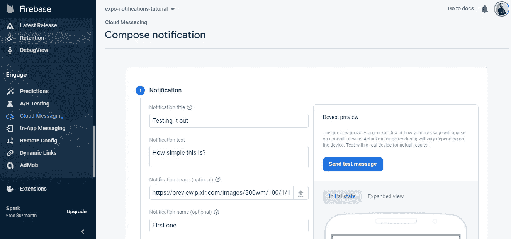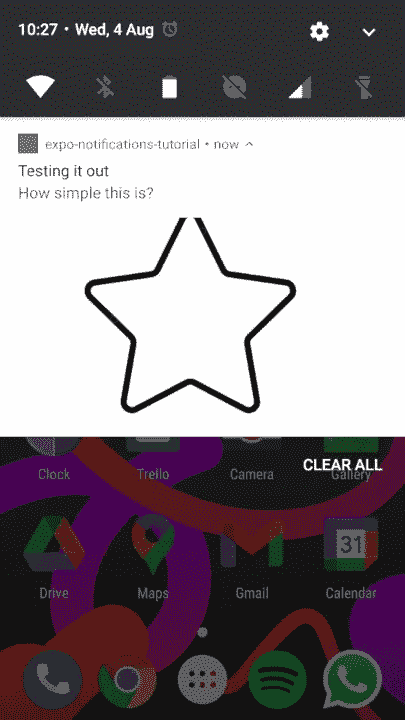

Firebase Cloud Messaging notification composer

然而，当点击通知时，一个令人不快的惊喜出现了:应用程序打开了，但是 Expo 通知处理程序没有被触发，导致通知点击被错过😢起初，这可能看起来像一个博览会的错误，但在通读博览会的仓库问题后，我们发现这实际上是预期的行为。

正如本评论中[所解释的，有两种类型的 FCM 通知:数据消息和通知消息。查看](https://github.com/expo/expo/issues/10789#issuecomment-716624242)[提供的 Firebase 文档页面](https://firebase.google.com/docs/cloud-messaging/concept-options#notifications_and_data_messages)，我们找到了问题的原因:

> 使用 FCM，您可以向客户端发送两种类型的消息:
> 
> 通知信息，有时被认为是“显示信息”这些由 FCM SDK 自动处理。
> 
> 数据消息，由客户端应用程序处理。

所以 Expo 没有空间来处理 Firebase composer 通知。我们将不得不接受这一点，并为我们需要通知应用程序的所有受众的情况编写更多的代码。

## 点击应用程序启动时出现未处理的通知(在 Android 上)

在上面的代码中，我们从 app 组件内部的`useEffect`中定义了通知处理程序，因为我们需要 React 来更新 App 以显示收到的通知的内容。

这没有什么问题，但是，正如在[github 问题](https://github.com/expo/expo/issues/6943#issuecomment-677901678)中解释的，如果在应用程序启动时没有尽快定义处理程序，当从关闭状态启动应用程序时，通知点击可能会被忽略。这正是当应用程序处于关闭状态时点击通知所发生的情况。

幸运的是，这个问题可以解决。一种简单的方法是在应用启动时，在任何组件之外定义存根通知处理程序，并在稍后定义实际处理程序的行为(例如，从组件内部的`useEffect`)。这种方法的要点是存根处理程序允许我们在定义实际处理程序的行为之前跟踪收到的通知。

看起来比听起来容易，不管优雅与否，它确实有效💪：

就这样结束了！您可以在[这个资源库](https://github.com/capelski/expo-notifications-tutorial)中找到您可能需要检查的所有源代码。快乐编码🥳