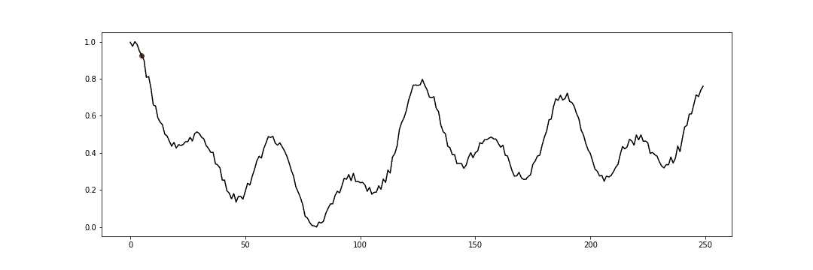

# 运用强化学习进行交易前的第一步

> 原文：<https://medium.com/geekculture/first-steps-before-applying-reinforcement-learning-for-trading-579a5b0299a1?source=collection_archive---------2----------------------->

## 金融市场强化学习的基本原则

## 你能在真实市场之前交易余弦波吗？

How do reinforcement learning agents learn to trade like this? | Illustration by the author

算法交易有很多方法——从基于技术和基本面的自动交易进场和收盘点…