# OpenCV-Python 的第一步

> 原文：<https://medium.com/geekculture/first-steps-to-the-opencv-python-55106ec66dbd?source=collection_archive---------16----------------------->

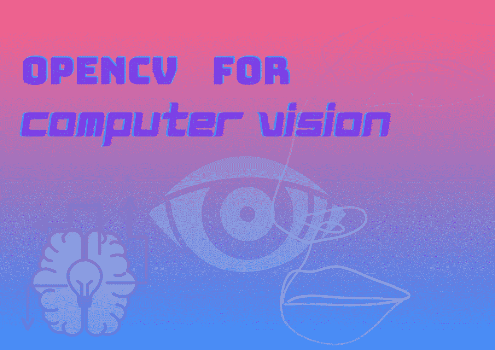

**可以去我的** [**Github 账号**](https://github.com/GuldenizBektas) **找一些入门级的项目。我与他们的来源分享它们，所以你可以检查它们，并为你自己找到更多的项目来学习🌈**

在我上一篇[文章](/@gdenizbektass/cnns-building-blocks-23e6b7b4a4b7)中，我简单提到了计算机视觉。计算机视觉背后的所有想法是计算机能从数字视频或图像中分辨出什么。这是一个旨在自动完成人类视觉可以完成的任务的领域。计算机视觉操作需要一些方法，如图像的处理、分析和提取。显然，我们不能用直接的图像来填充模型。如你所知，计算机只理解数字，为了训练模型，我们必须将图片转换成矩阵或张量。我们还可以对图像进行修改，以使操作更容易。

**🤔*什么是 OpenCV 库？***

> OpenCV-Python 是一个 Python 绑定库，旨在解决计算机视觉问题。

OpenCV 支持多种编程语言，如 Python、C++、Java 等。它可以处理图像和视频来识别物体、人脸，甚至是人的笔迹。

在这篇文章中，我将尝试向初学者提供一些关于 OpenCV 图像预处理功能的友好信息。我们将剪切，变换，旋转和改变图片的颜色等。让我们开始吧🚀

## 1.导入 OpenCV

```
import cv2 as cv
```

## 2.读取图像

在我们想对我们的形象做什么之前，我们首先需要阅读我们的形象。

```
img = cv.imread("bojack-horseman.png") # image I choose
```

据我所知，图片文件的扩展名可以是 jpeg 或 png。实际上我还没有尝试过任何其他的扩展，但是如果你想，你可以在任何时候谷歌它！

📌有一点很重要，每次我们写完代码，我们都应该在文件末尾添加两行代码:

```
cv.waitKey(0)
cv.destroyAllWindows()
```

`cv.waitKey(0)`将无限显示窗口，直到任何按键。你可以通过按下键盘上的任意一个键来关闭图像窗口，比如“q”或 escape 键。如果你在`waitKey`中输入任何其他数字，它将等待那么长的毫秒，然后自动关闭。

`cv.destroyAllWindows()`简单地摧毁我们创造的所有窗户。

我们读取我们的图像，现在我们应该这样显示它:

```
cv.imshow("Image", img)
```

代码的最终版本:

```
*import* cv2 as cvimg = cv.imread("bojack-horseman.png")cv.imshow("Image", img) # first argument is the window's namecv.waitKey(0)
cv.destroyAllWindows()
```

输出:

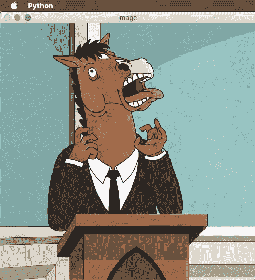

⭐️ **如果你想在灰度模式下读取图像，只需加一个零。**

```
img = cv.imread("bojack-horseman.png", 0)
```

## 3.在图像中绘制形状和书写文本

使用 NumPy 创建黑色图像:

```
import numpy as npblank = np.zeros((500, 500, 3), dtype = "uint8")# display the blank image first
cv.imshow("Blank", blank)
```

让我们用绿色打印图像:

```
blank[:] = 0, 255, 0 # green
cv.imshow("Green", blank)
```

输出:


**画一个长方形:**

```
cv.rectangle(img, (0,0), (250,250), (0, 250, 0), thickness = cv.FILLED)
cv.imshow("Rectangle", blank)
```

输出:

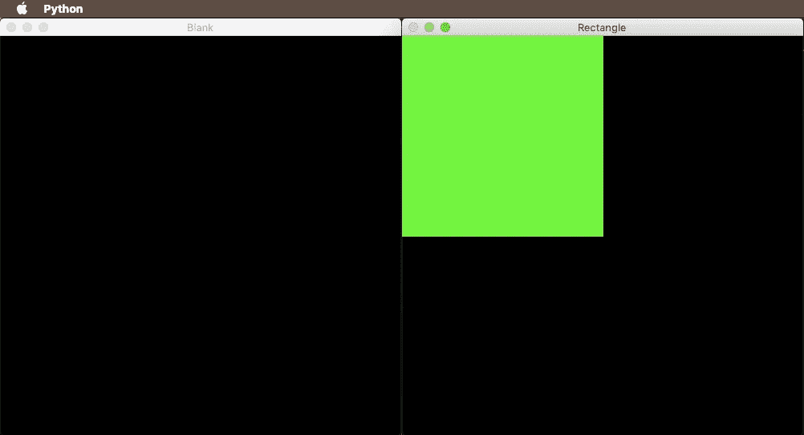

第一个参数是我们要在其上绘制矩形的图像，第二个参数是矩形的起点，第三个参数是端点，第四个参数是颜色，将其作为元组传递，第五个参数是矩形线条的粗细，在这里我们将其作为 cv 传递。填充，这意味着填充形状，为了同样的目的，可以将-1 传递给。

**画一个圆:**

```
cv.circle(blank, (250, 250), 40, (0, 0, 255), thickness = 3)
```

我们要画的第一个图像，第二个是圆的中心坐标，第三个是它的半径，第四个是它的颜色，第五个是它的厚度，这次我们不想填充形状。

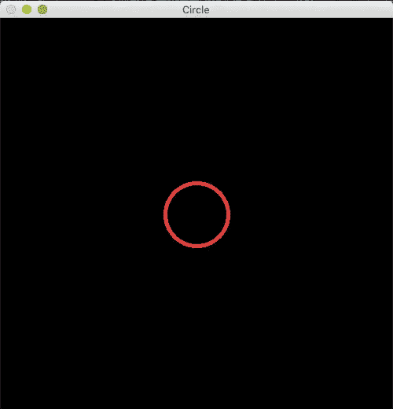

**划清界限:**

```
cv.line(blank, (0, 0), (250, 250), (255, 250, 255), thickness = 3)
```

我们要绘制的第一幅图像，第二条线的起点坐标，第三条线的终点坐标，第四是它的颜色，第五是它的粗细。

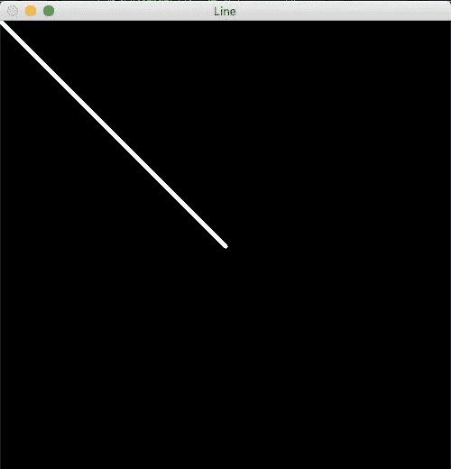

**在图像上书写文字:**

```
cv.putText(blank, "Geronimo", (0, 255), cv.FONT_HERSHEY_TRIPLEX, 1.0, (0, 255, 0), 2, cv.LINE_AA)
```

第一个参数是一样的，第二个参数是图像的位置，第三个参数是字体大小，你可以在[这里选择](https://docs.opencv.org/master/d6/d6e/group__imgproc__draw.html#ga0f9314ea6e35f99bb23f29567fc16e11)，第四个参数是字体大小，第五个是颜色，第六个是粗细，为了更好的看 cv。LINE_AA 是 OpenCV 推荐的。

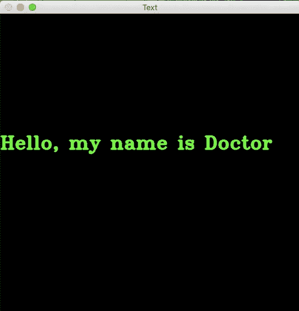

Doctor Who Fan ♥️

## 4.图像的几何变换

OpenCV 有两个转换函数；cv.warpAffine，cv.warpPerspective .虽然 cv.warpAffine 函数以 2×3 矩阵作为输入，但 cv.wrapPerspective 函数以 3×3 矩阵作为输入。

**调整图像大小:**

它只是调整图像的大小。函数也很靠前，cv.resize()。您可以指定新的大小，也可以指定比例因子。

```
height, width = img.shape[:2]
resized = cv.resize(img, (2*width, 2*height), cv.INTER_LINEAR)
cv.imshow("resized", resized)
```

第三个论点是内插法。

> **图像插值**发生在你从一个像素网格到另一个像素网格调整**图像**的大小或扭曲图像的时候。缩放是指增加像素的数量，这样当您缩放一幅**图像**时，您将看到更多细节。**插值**通过使用已知数据来估计未知点的值。

OpenCV 库中有不同类型的插值方法。比较可取的插补方法有 [**cv。INTER_AREA**](https://docs.opencv.org/4.5.2/da/d54/group__imgproc__transform.html#gga5bb5a1fea74ea38e1a5445ca803ff121acf959dca2480cc694ca016b81b442ceb) 为缩小而 [**为 cv。INTER_CUBIC**](https://docs.opencv.org/4.5.2/da/d54/group__imgproc__transform.html#gga5bb5a1fea74ea38e1a5445ca803ff121a55e404e7fa9684af79fe9827f36a5dc1) 【慢】& [**cv。用于缩放的 INTER_LINEAR**](https://docs.opencv.org/4.5.2/da/d54/group__imgproc__transform.html#gga5bb5a1fea74ea38e1a5445ca803ff121ac97d8e4880d8b5d509e96825c7522deb) 。默认情况下，插补方法[cv**。INTER_LINEAR**](https://docs.opencv.org/4.5.2/da/d54/group__imgproc__transform.html#gga5bb5a1fea74ea38e1a5445ca803ff121ac97d8e4880d8b5d509e96825c7522deb) 用于所有调整大小的目的。

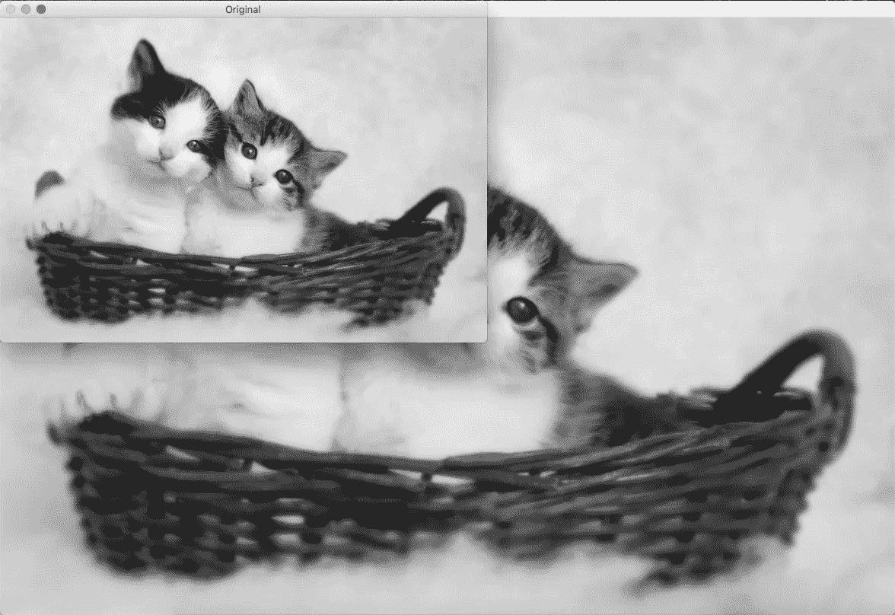

**转换**

您可以移动对象的位置。

您可以将 x 和 y 方向的变换值生成一个 NumPy 数组，并将其传递给***cv . wrap affine()***函数。以下示例针对(100，50)位移:

```
rows, cols = img.shape
M = np.float32([[1,0,100], [0,1,50]]) # marked
trans = cv.warpAffine(img, M, (cols,rows)) # 3rd is the size of the # output image 
cv.imshow("Transformated", trans)
```

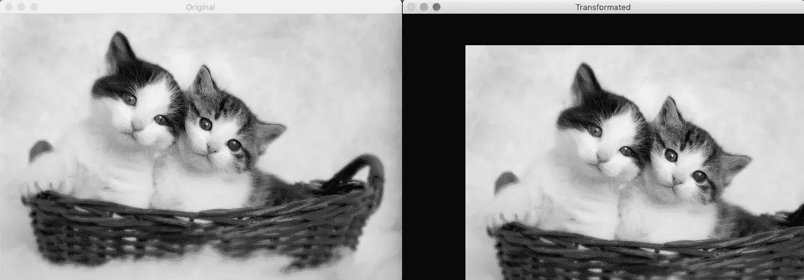

变换矩阵定义为(标记代码行的原因):

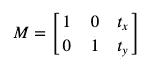

📍**[**cv . warpaffine()**](https://docs.opencv.org/4.5.2/da/d54/group__imgproc__transform.html#ga0203d9ee5fcd28d40dbc4a1ea4451983)**函数的第三个参数是输出图像的大小，应该是(width，height)的形式。记住，宽度等于列数，高度等于行数。****

****旋转****

**OpenCV 提供可调节旋转中心的缩放旋转，因此您可以在任何您喜欢的位置旋转。修改后的变换矩阵由下式给出:**

**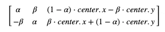**

**其中:**

**α=scale⋅cosθ，**

**β=scale⋅sinθ.**

**为了找到这个变换矩阵，OpenCV 提供了一个函数，[**cv . getrotationmatrix 2d**](https://docs.opencv.org/4.5.2/da/d54/group__imgproc__transform.html#gafbbc470ce83812914a70abfb604f4326)。以下示例将图像相对于中心旋转 90 度，不进行任何缩放:**

```
M = cv.getRotationMatrix2D(((cols-1)/2.0, (rows-1)/2.0), 90, 1)
rotated = cv.warpAffine(img, M, (cols, rows))
cv.imshow("Rotated", rotated)
```

**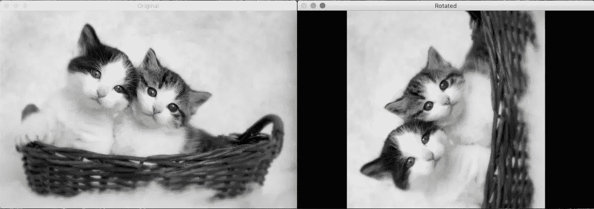**

## **5.图像阈值处理**

**对于每个像素，应用相同的阈值。如果像素值小于阈值，则设置为 0，否则设置为最大值。函数 [**cv.threshold**](https://docs.opencv.org/4.5.2/d7/d1b/group__imgproc__misc.html#gae8a4a146d1ca78c626a53577199e9c57) 用于应用阈值。第一个参数是源图像，其中**应该是灰度图像**。第二个参数是用于对像素值进行分类的阈值。第三个参数是分配给超过阈值的像素值的最大值。OpenCV 提供了不同类型的阈值，由函数的第四个参数给出。使用 [**cv 类型完成上述基本阈值处理。THRESH _ BINARY**。](https://docs.opencv.org/4.5.2/d7/d1b/group__imgproc__misc.html#ggaa9e58d2860d4afa658ef70a9b1115576a147222a96556ebc1d948b372bcd7ac59)**

**该方法返回两个输出。第一个是使用的阈值，第二个输出是**阈值图像**。**

```
# binarizing the image, 0 --> black, above (255) --> white
ref, thresh = cv.threshold(gray, 125, 255, cv.THRESH_BINARY)
cv.imshow("thresh", thresh)
```

**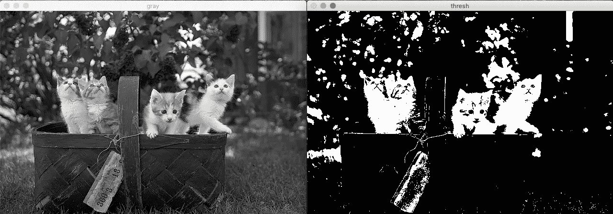**

## **6.模糊**

**图像模糊是通过将图像与低通滤波器核进行卷积来实现的。这对于去除噪声是有用的。它实际上从图像中移除了高频内容。因此，在这个操作中，边缘有点模糊(也有模糊技术，不会模糊边缘)。**

****高斯模糊****

**用高斯函数模糊图像。高斯滤波器采用像素周围的邻域，并找到其高斯加权平均值。**

**我们应该指定内核的宽度和高度。给定零的第三个参数表示 x 和 y 方向的标准偏差，xSigma 和 ySigma 将从内核大小计算得出。也可以指定。**

```
blur = cv.GaussianBlur(img, (5,5), cv.BORDER_DEFAULT)
```

**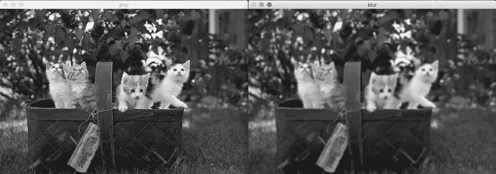**

****双边过滤****

**在大多数模糊技术中，边缘也会变得模糊，但是双边滤波在保持边缘清晰的同时消除了噪声。缺点是这种操作比其他模糊技术要慢。**

```
blur = [cv.bilateralFilter](https://docs.opencv.org/4.5.2/d4/d86/group__imgproc__filter.html#ga9d7064d478c95d60003cf839430737ed)(img,9,75,75)
```

**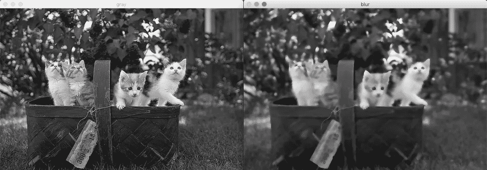**

## **7.Canny 边缘检测**

**边缘检测有多个阶段，我将逐一介绍。**

**第一步:**

**首先，我们应该用 5x5 高斯滤波器(高斯模糊)去除图像中的噪声，因为这种操作容易受到噪声的影响。**

**第二步:**

**然后，用 Sobel 核在水平和垂直方向对平滑的图像进行滤波，以获得水平方向(Gx)和垂直方向(Gy)的一阶导数。通过这两幅图像，我们可以找到每个像素的边缘梯度和方向。**

**📍*渐变方向始终垂直于边缘。它被四舍五入为代表垂直、水平和两个对角线方向的四个角度之一。***

**第三步:**

**在这个步骤中，检查每个像素在梯度方向上是否是其邻域中的局部最大值。**

**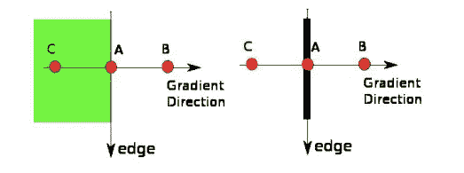**

**如上图， **A 点**在边缘， **B 点**， **C 点**在渐变方向。**检查点**是否是其邻域的局部最大值。如果它被考虑用于下一阶段，如果它不被考虑，它被抑制为零。**

**第四步:**

**最后一步是决定选择的边是否真的是边。为此，我们需要一个阈值，minVal 和 maxVal。强度梯度大于 maxVal 的边缘被视为确定边缘，小于 minVal 的边缘被视为非边缘。位于这两条线之间的那些线基于它们与确定边缘和非边缘的连通性来分类。**

**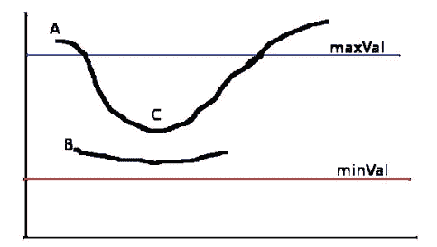**

****一个点**在最大值之上，因此被归类为确定边缘。**

****B 点**介于两者之间，与 sure-edge 没有联系，归类为非边缘。**

****C 点**介于两者之间，与 A 点的确定边有联系，归类为确定边。**

```
canny = cv.Canny(img, 125, 175)
```

**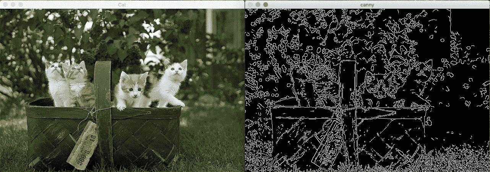**

**第一个参数是我们的输入图像。第二个和第三个参数分别是我们的 minVal 和 maxVal。第三个参数是孔径大小。这是用于查找图像梯度的 Sobel 内核的大小(默认情况下为 3)。**

## **8.直方图**

**直方图给你一个关于强度分布的总体概念。在 x 轴上有范围从 0 到 255 的像素值(非强制)，在 y 轴上有图像中相应数量的像素值。**

**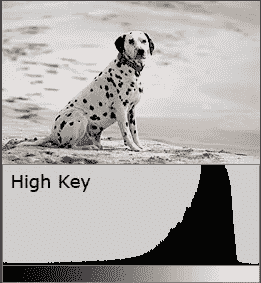**

**[Cambridge in color](https://www.cambridgeincolour.com/tutorials/histograms1.htm)**

```
gray_hist = cv.calcHist([img], [0], None, [256], [0, 256])
plt.figure()plt.title("Grayscale Histogram")plt.xlabel("Bins")plt.ylabel("# of pixels")plt.plot(gray_hist)plt.xlim([0, 256])plt.show()
```

**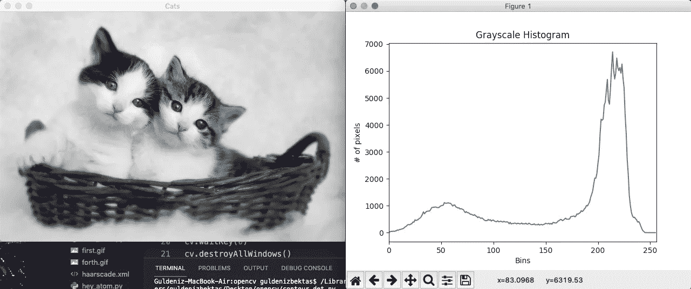**

**第一个参数是我们希望看到其直方图的图像，应该在方括号中给出。第二个参数是通道，应该放在方括号中，我们给 0 是因为我们的图像是灰度级的。你可以根据你的形象来改变它。第三个参数是遮罩图像。如果你想看到完整图像的分布，不要像我这样，但是如果你想找到图像的特定区域，你必须创建一个蒙版图像。第四个参数是 histSize，它代表我们的 BIN 计数。第五个参数是范围。我给出了正常范围。**

****

**上面的大多数定义来自 OpenCV 的文档。他们的文档是伟大的，你甚至不需要寻找另一个网站来理解。你绝对应该去看看。这些只是一个开始。我建议你看两个教程视频，上面我提到的，还有更多:**

****可以去我的** [**Github 账号**](https://github.com/GuldenizBektas) **找一些入门级的项目。我与他们的来源分享它们，所以你可以检查它们，并为你自己找到更多的项目来学习🌈****

****

**另一篇文章再见！**

## **参考**

**[](https://docs.opencv.org/4.5.2/d6/d00/tutorial_py_root.html) [## OpenCV: OpenCV-Python 教程

### 编辑描述

docs.opencv.org](https://docs.opencv.org/4.5.2/d6/d00/tutorial_py_root.html) [](https://en.wikipedia.org/wiki/Computer_vision) [## 计算机视觉-维基百科

### 计算机视觉是一个跨学科的科学领域，处理计算机如何获得高层次的…

en.wikipedia.org](https://en.wikipedia.org/wiki/Computer_vision) [](https://www.geeksforgeeks.org/opencv-python-tutorial/) [## OpenCV Python 教程- GeeksforGeeks

### OpenCV 是一个巨大的开源库，用于计算机视觉、机器学习和图像处理。OpenCV 支持一个…

www.geeksforgeeks.org](https://www.geeksforgeeks.org/opencv-python-tutorial/) [](https://stackoverflow.com/questions/51143458/difference-in-output-with-waitkey0-and-waitkey1/51143586) [## 等待键(0)和等待键(1)的输出差异

### 感谢贡献一个堆栈溢出的答案！请务必回答问题。提供详细信息并分享…

stackoverflow.com](https://stackoverflow.com/questions/51143458/difference-in-output-with-waitkey0-and-waitkey1/51143586) [](https://analyticsindiamag.com/getting-started-with-opencv-in-python/) [## Python - Analytics India 杂志中的 OpenCV 入门

### OpenCV 是一个用于计算机视觉任务的强大而通用的开源库。许多语言都支持它…

analyticsindiamag.com](https://analyticsindiamag.com/getting-started-with-opencv-in-python/) 

[https://sisu.ut.ee/imageprocessing/book/3](https://sisu.ut.ee/imageprocessing/book/3)**