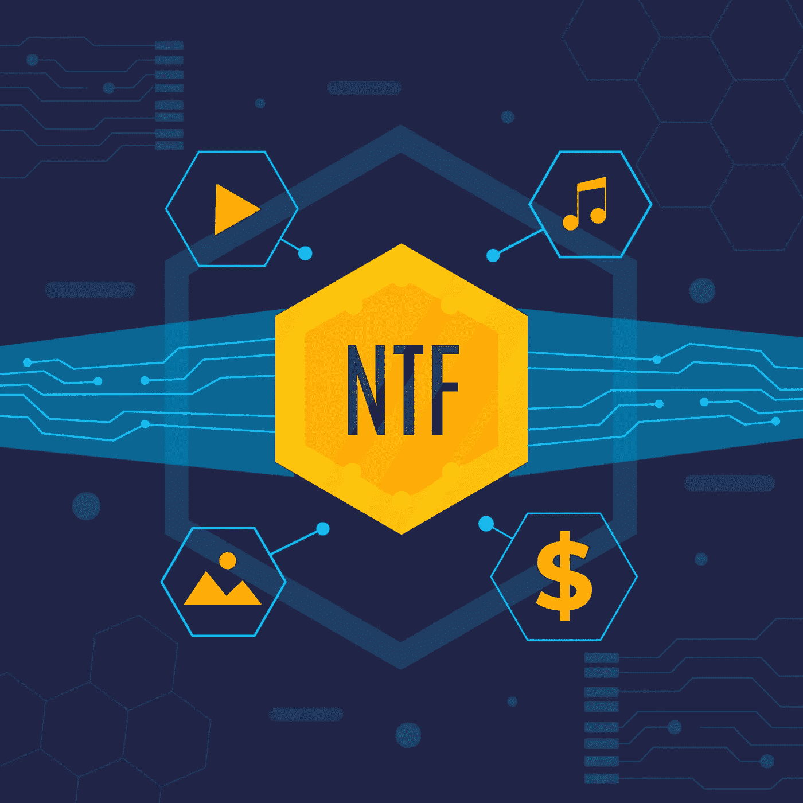

# 先是 Web3，然后是 Crypto。下一步？NFTs。

> 原文：<https://medium.com/geekculture/first-web3-then-crypto-the-next-step-nfts-7070cbb712a4?source=collection_archive---------17----------------------->

## 数字的，分散的，独特的，非常非常有价值的。非传统艺术不仅仅是区块链艺术

Vector work by [freepik](https://www.freepik.com/free-vector/flat-design-nft-concept-illustration_13862453.htm#query=nft&position=21&from_view=keyword).

万维网已经进入了被称为 Web 3.0 的新阶段，通常被称为“Web 3”。基本上，它是一个基于区块链技术的去中心化的在线世界(区块链是一个记录列表，或块…