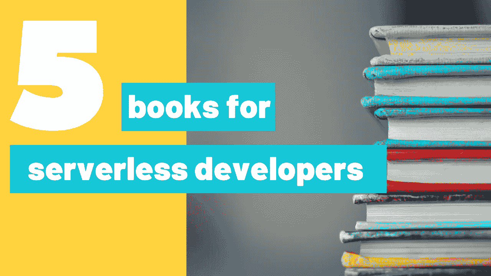

# 给无服务器开发者的五本书推荐

> 原文：<https://medium.com/geekculture/five-book-recommendations-for-serverless-developers-5e1748a74aeb?source=collection_archive---------11----------------------->

Photo by [Kimberly Farmer](https://unsplash.com/@kimberlyfarmer?utm_source=unsplash&utm_medium=referral&utm_content=creditCopyText) on [Unsplash](/s/photos/books?utm_source=unsplash&utm_medium=referral&utm_content=creditCopyText)

## 帮助你成为更好的无服务器开发者的书籍列表

事情是这样的:你是一个经验丰富的开发人员，被无服务器架构的机遇所震撼。你阅读书籍，观看任何可能的视频课程，但当开始构建一个真正的无服务器解决方案时，你会感到完全…