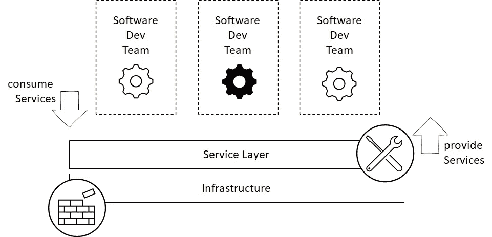

# 五种 DevOps 反模式以及如何避免它们

> 原文：<https://medium.com/geekculture/five-devops-antipattern-and-how-to-avoid-them-c5b3dfcabe20?source=collection_archive---------3----------------------->

When implementing DevOps, it’s essential to follow suitable patterns. 📸 Photo by [Angèle Kamp](https://unsplash.com/@angelekamp?utm_source=unsplash&utm_medium=referral&utm_content=creditCopyText) on [Unsplash](https://unsplash.com/s/photos/tiles?utm_source=unsplash&utm_medium=referral&utm_content=creditCopyText)

## 几乎每个开发人员都在实现 DevOps 的项目或公司中工作，或者朝着 DevOps 策略努力。在实现 DevOps 时，基本的事情经常做错。本文解释了错误使用 DevOps 时发生的五种反模式。

## 什么是 DevOps

DevOps 是开发和运营的结合。DevOps 的目标是软件团队可以在整个应用程序生命周期中独立开发和运行他们的软件，如下图所示。

DevOps Application Lifecycle — Plan, Develop, Build, Test, Release, Deploy, Monitor, Feedback — Iterations.

与 DevOps 团队构建广泛的运营知识来运行应用程序的普遍看法相反，他们使用允许他们管理其应用程序运营的服务。这些服务旨在简化开发运维团队的应用操作，由专家提供。

## 服务层

这些服务构建在特定的基础设施或其他软件之上，并提供更易访问的抽象。服务可以是数据库即服务(DBaaS)、运行应用程序的平台即服务(PaaS)等。下图显示了 DevOps 团队如何使用服务层的服务，这些服务通过为他们的问题提供现成的解决方案来简化他们的工作。

The Service Layer provides Services to Software Development Teams —Software Development Teams can consume Services to be able to manage the whole Software Lifecycle.

应用程序的开发人员被进一步称为消费者，因为他们使用服务。服务层的开发人员被进一步称为提供者，因为他们提供服务。

## 反模式 1:服务层不是自助服务层。

假设一个服务层需要它的消费者与某人或某事取得联系。在这种情况下，依赖关系的引入减缓了开发过程，浪费了消费者和提供者的时间，因为它很可能是自动化的。

> 在 DevOps 团队中，更少的依赖导致更高的生产率！

为了提高效率并使服务层能够扩展，有必要自始至终提供自助服务功能。这样，消费者可以独立地消费服务，而不需要等待时间，也不依赖于提供者。

## 反模式 2:消费者需要知道服务实现的技术细节才能使用它。

如果人们想要使用某个特定服务，那么它的技术规范应该是不必要的。例如，如果引入了新的语言或框架，消费者需要知道，DevOps 团队所需的知识会增加。这种增加使人们效率低下，因为他们需要在核心堆栈和服务层的附加语言和框架之间切换。如果不能通过服务接口快速完成配置，就需要大量的技术知识。

> 抽象技术实现，使您的服务易于使用！但是只抽象不相关的复杂性，仍然提供重要的功能。

消费者也是特定应用程序的开发者。他们需要了解他们的应用程序堆栈，并且是该堆栈中的专家。如果他们使用提供者的服务，技术实现必须与他们无关。当然，他们需要知道服务和它是如何工作的，但是实现细节永远不应该是相关的。

## 反模式 3:您的服务对消费者来说不是自我解释的。

如果事情不是不言自明的，服务要么不被使用，要么消费者将联系提供方以获得他们需要的信息。接触到人们大大减缓了这一过程。时间被浪费了，因此金钱也被浪费了。

> 请记住，消费者不是运营专家！

为了提供更好的消费者体验，构建您的不言自明的服务。通过创建描述必要步骤的向导或提供内置于服务界面的逐步指南。此外，听听你的消费者告诉你什么。反馈是关键，消费者和提供者之间的有效反馈循环是高质量服务层的支柱。

## 反模式 4:开发人员不知道服务的存在或者找不到它。

营销是关键！作为供应商，你的工作是向消费者宣传你提供的产品以及他们如何消费。提供所有服务的集中、最新概述，其中包含消费者需要的所有信息。让新信息也成为自助服务的一个很好的方法是提供订阅功能，通知消费者有关更改或新版本的信息。

博客文章是描述和介绍服务层的新服务以及更深入地解释它们的好方法。

> 如果你的服务不为人知，它可能不会被使用。

如果您有一个大型服务层，可以组织定期讲座或小型活动，让您的客户了解最新的新闻和功能。

## 反模式 5:您的服务层中没有版本控制。

当没有实现版本控制时，所有消费者必须在新版本发布时立即切换到新版本。这既不稳定也不安全。为了提供一个安全的环境，请确保支持旧版本的服务层，直到所有用户都切换到新版本。一旦旧版本不再使用，提供商可以安全地删除它。

> 如果服务发生变化，总是通过保持旧版本的活力来提供新版本的服务！

不要强迫消费者立即更换新版本。这将导致他们去做那些不能为他们的应用程序提供附加值的任务，并且可能会阻止他们首先做更重要的改变。

看一下[语义版本化](https://semver.org/)来学习如何使用提供自我解释结构的版本号，并自动描述实现的变更。Semver.org 将其描述为:

> 给定主要版本号。小调。补丁，增加:
> 
> -主要版本当您进行不兼容的 API 更改时，
> 
> -以向后兼容的方式添加功能时的次要版本，以及
> 
> -补丁版本，当你做向后兼容的错误修复。”——[semver.org](https://semver.org/)

# 结论

服务层的不充分实现会使事情变得更糟，而不是更好，并且会使公司远离高效、高质量和令人满意的开发运维组织的目标。

因此，如果您正在构建 DevOps 基础架构，请确保您的服务层…

*   …是一个自助服务层。
*   …提供功能并且易于使用。
*   …向用户抽象出技术细节。
*   …在 DevOps 团队中广为人知。
*   …具有适合大多数使用情形的默认配置，但可以根据需要进行更改。

# 参考资料/来源

 [## 软件中的自动化协作和处理

### 2018 | original paper | Buchkapitel in Gegensatz zum klassischen verstndnis einer rein functional en…

www.springerprofessional.de](https://www.springerprofessional.de/automatisierte-kollaboration-und-prozesse-in-der-softwareentwick/15125184)  [## 面向开发人员的 devo PS | Michael hüttermann | Springer

### DevOps for Developers 提供了一个实用的，全面的方法，过程和工具介绍，以促进…

www.springer.com](https://www.springer.com/de/book/9781430245698)  [## 持续交付和开发运维:快速入门指南| Packt

### 在我们进入持续交付(CD)和 DevOps 的核心内容之前，我想向您介绍…

www.packtpub.com](https://www.packtpub.com/product/continuous-delivery-and-devops-a-quickstart-guide/9781849693684)  [## 释放它！:设计和部署生产就绪软件(务实的程序员)

### 释放它！:设计和部署生产就绪软件(务实的程序员)| Nygard，Michael T. | ISBN…

www.amazon.de](https://www.amazon.de/Release-Production-Ready-Software-Pragmatic-Programmers/dp/0978739213)  [## 语义版本 2.0.0

### 给定主要版本号。补丁，增加:主要版本当你做不兼容的 API 改变，次要…

semver.org](https://semver.org/)