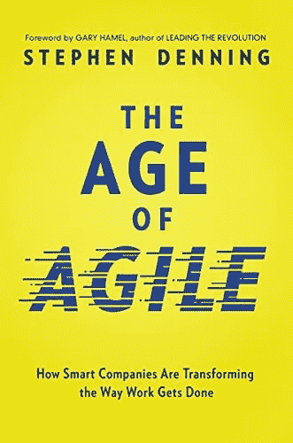
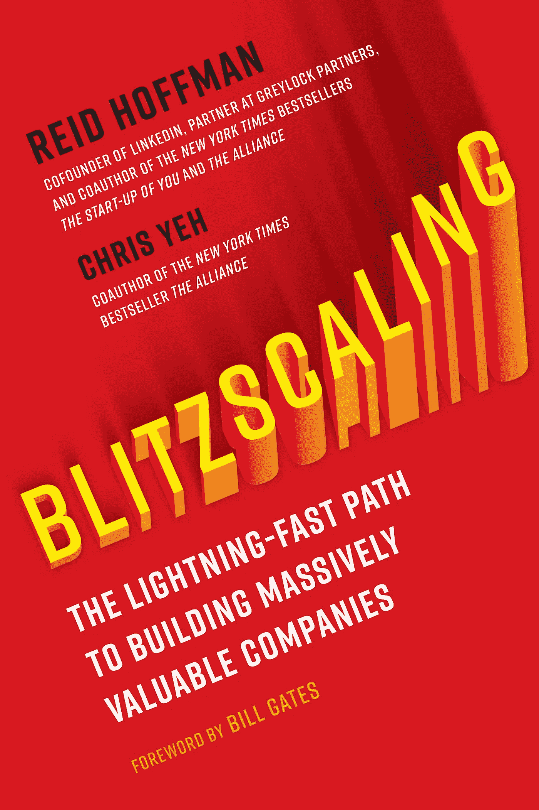
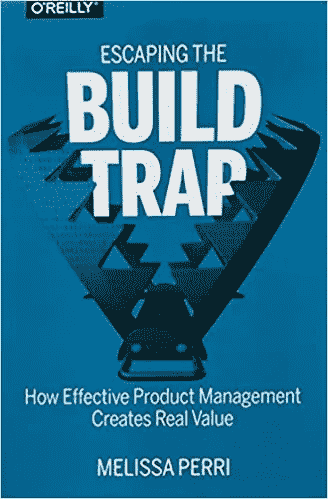

# 产品人员必读的五本书

> 原文：<https://medium.com/geekculture/five-essential-reads-for-product-people-5c255dd5d659?source=collection_archive---------17----------------------->

我每天都和各个级别的产品人员交流。

当我与产品人员交谈时，我们会交流如何打造更好的产品，以及如何在产品人员的职业生涯中取得进步。这些对话无一例外地强化了产品人对知识的渴望，并希望了解更多——我发现自己一遍又一遍地推荐相同的伟大读物。

产品人员不仅仅是产品经理，还有设计师、工程师和研究人员/分析师。这些人[都是为现代科技组织带来产品生命的肉菜饭](/ezcater-design/moving-past-the-four-legged-stool-355e1267cbba)的一部分。

这些建议通常会因产品开发进度的不同而有所不同，因此以下是我为个人贡献者和领导者推荐的阅读清单。

*注意:作为一名亚马逊助理，我从这篇文章推荐的任何亚马逊链接的合格购买中获利。*

# 为新产品人员阅读

## Spotify Squad 框架—第一部分

成为一名优秀的中高级产品人员意味着在既定战略内有效工作，与您的产品、设计、研究、工程和分析团队一起交付成果。2021 年，许多科技组织都采用了由 Spotify 推广的团队模型框架。

如果你是构建产品的新手，Spotify 的这篇 2017 年博客文章是理解如何在这个跨职能框架内有效运营以为你的组织交付成果的佳能。

 [## 了解 Spotify Squad 框架的更多信息—第一部分

### 我去年看了这个关于 Spotify 工程文化的视频，然后，我的脑子就爆炸了。我摔倒了…

medium.com](/pm101/spotify-squad-framework-part-i-8f74bcfcd761) 

## 敏捷时代:聪明的公司如何改变完成工作的方式

Stephen Denning 的[向敏捷](https://amzn.to/3DO3bCs)致敬的前半部分是一组精彩的案例研究，这些案例研究分解了现代科技公司如何使用敏捷软件开发和以客户为中心的方法来快速迭代和构建伟大的产品。

我喜欢读这本书。it 的终极目标—为您的客户创造价值！—应该由参与产品开发过程的任何人内部消化。

这本书的后半部分也非常有趣，深入探讨了更多哲学问题，比如“企业的意义是什么？”。我认为前半部分是所有产品人员的必读内容。

[*敏捷时代:聪明的公司如何改变完成工作的方式*](https://amzn.to/3DO3bCs)

# 面向产品资深人士和领导者的读物

## 闪电战:打造高价值公司的捷径

作为产品人的成长伴随着范围的扩大。

随着你的注意力从只关注你的团队或交付你面前的指标或功能转移到关注更广泛和更高层次的目标，与你的范围如何影响业务保持一致变得更加重要。

闪电战绝对是一部引人入胜的作品。它提供的快速扩展业务的技术对于产品人员来说是非常有用的，因为他们的思维模式是扩展他们自己在组织中的范围和影响。

当你作为一名产品人员在职业生涯中前进时，将你的努力与企业的目标和战略联系起来是必不可少的，这本书有助于将这一点放在背景中。

[*闪电战:打造高价值公司的捷径*](https://amzn.to/3kXa7G2)

## 逃离构建陷阱:有效的产品管理如何创造真正的价值

如果你开发产品已经有一段时间了，你可能会发现自己在某个时候已经踏上了开发新功能的跑步机。您很可能也发现自己发布了组织中其他人让您去构建的特性(或者您至少被要求这么做)。

不错，好的想法来自各个地方，我们的内部合作伙伴从与客户的互动中获得了非常有价值的信息，但比构建您被要求构建的东西更重要的是构建能够解决客户问题的东西。

只有客户最终知道什么能解决他们的问题，而我们作为产品人员的工作就是找出答案。

[逃离构建陷阱](https://amzn.to/3oQeeVP)为您提供了策略和工具来驾驭这种动态，并确保您通过构建能够为您的客户增加价值并带来您的组织需要的结果的特性来为业务交付*真正的*价值。

这本书是生产产品结果而不仅仅是产量的终极指南。

[*逃离构建陷阱:有效的产品管理如何创造真正的价值*](https://amzn.to/3oQeeVP)

## 所有权:卓越的产品经理和领导者背后的思维模式

这是我的最新建议，我发现这篇文章对提升产品人员最困难的步骤之一提供了有益的建议:从有经验的个人贡献者(高级经理)跃升为领导者(主管+)。

这篇文章展示了关注“所有权”如何帮助你实现目标，以及如何有效地扩大你在组织中的范围和影响。

[*所有权:令人惊叹的产品经理和领导者背后的心态*](https://www.productleaders.blog/blog/ownership-makes-great-product-managers)

这是我的清单——你有什么推荐给我的吗？