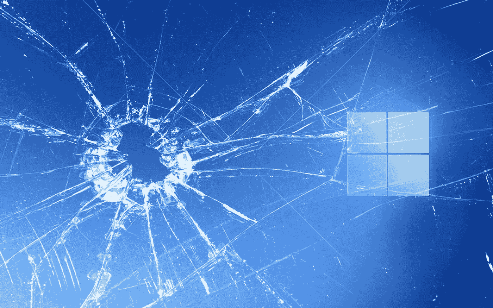

# Windows 11 尚未交付的五件重要事情

> 原文：<https://medium.com/geekculture/five-important-things-windows-11-has-yet-to-deliver-803c29868d97?source=collection_archive---------8----------------------->

## 经过一年的炒作和操作系统更新，微软打破了哪些承诺？

It’s been roughly a year since Windows 11 were first unveiled. Features were described in detail. Promises were made. Did Microsoft keep enough of those? (Image: Microsoft/Custom)

鉴于世界上发生的一切，似乎很难相信……自 Windows 11 [正式向公众发布](/geekculture/windows-11-is-official-but-is-microsoft-up-to-the-challenge-db8292b5d74f)以来，已经过去了一年多——可能有几天的误差。微软最新的操作系统已经…