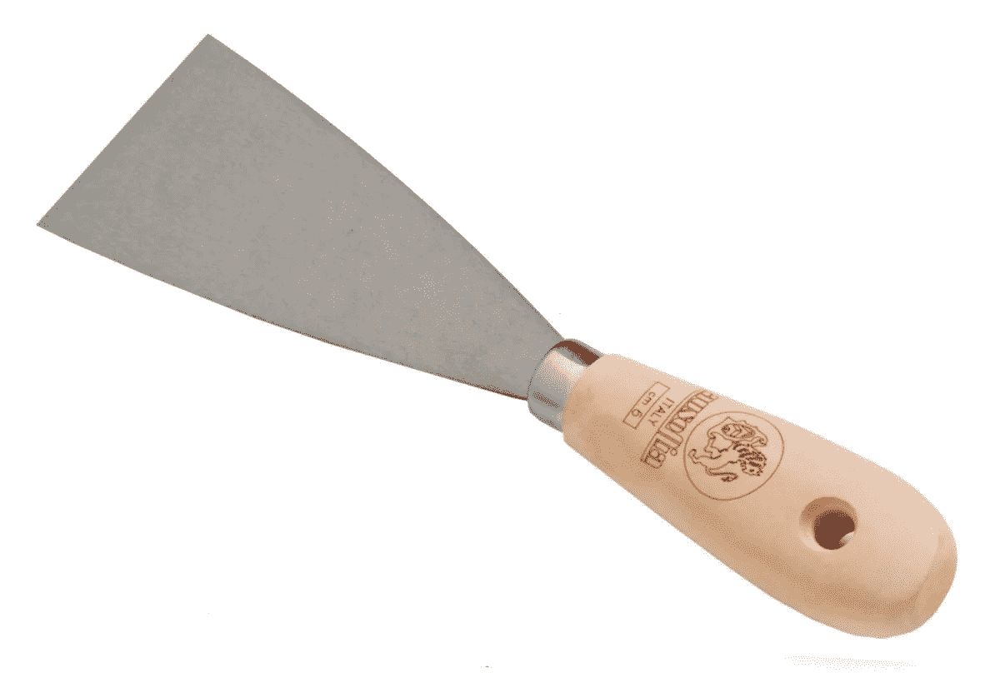

# 抓取网站时要避免的五个错误

> 原文：<https://medium.com/geekculture/five-mistakes-to-avoid-when-scraping-a-website-a01f8b8bf54c?source=collection_archive---------15----------------------->

## 不要陷入这些常见的错误

Image by [Masterfer](https://www.masterfer.it/spatola-per-stucco-professionale-5-cm)

Web 抓取非常有趣，当你需要启动一个数据项目，或者当你需要从报纸或社交媒体中提取数据时，它非常有用。事实上估计在 2020 年，人们每秒钟创造出 ***1.7 MB 的数据*** :你可以用来训练自己的机器学习算法或者做出一些…