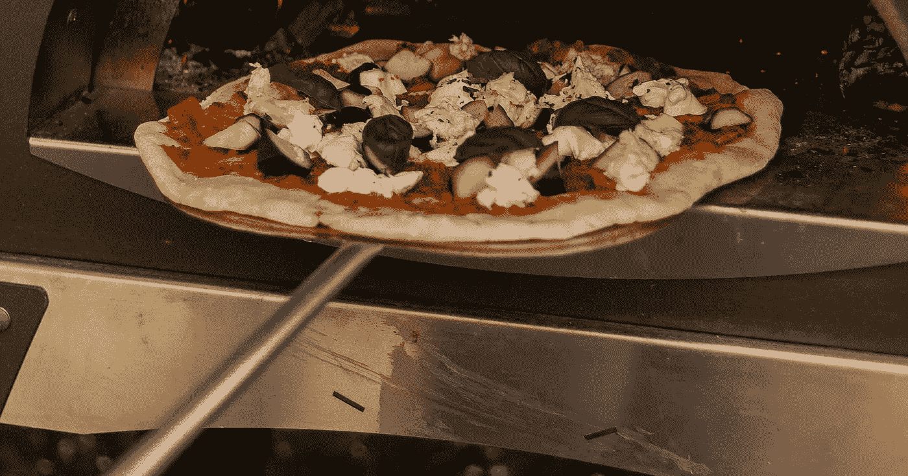
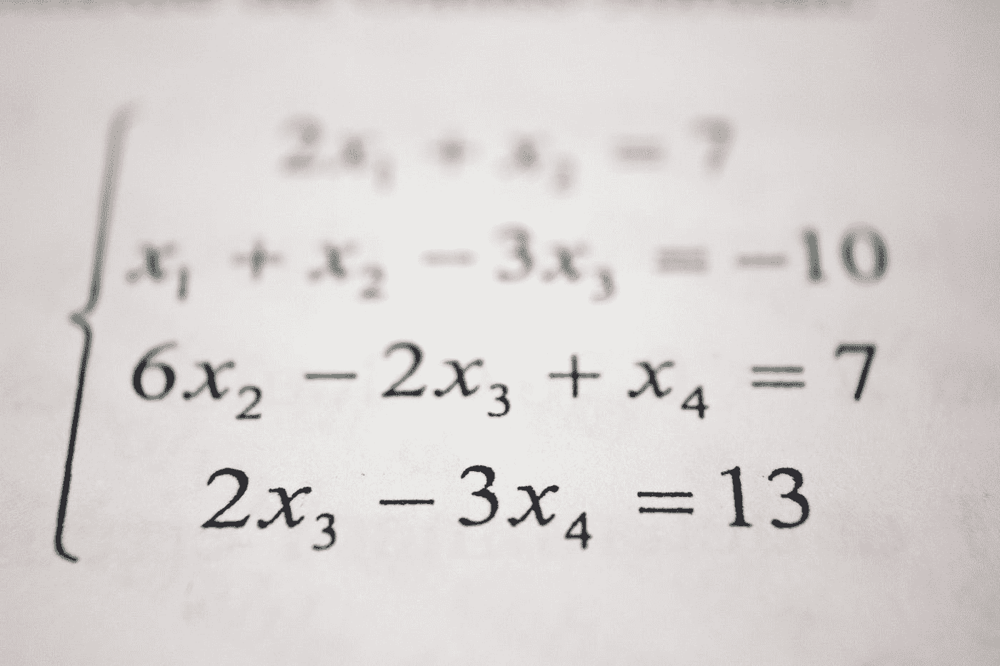
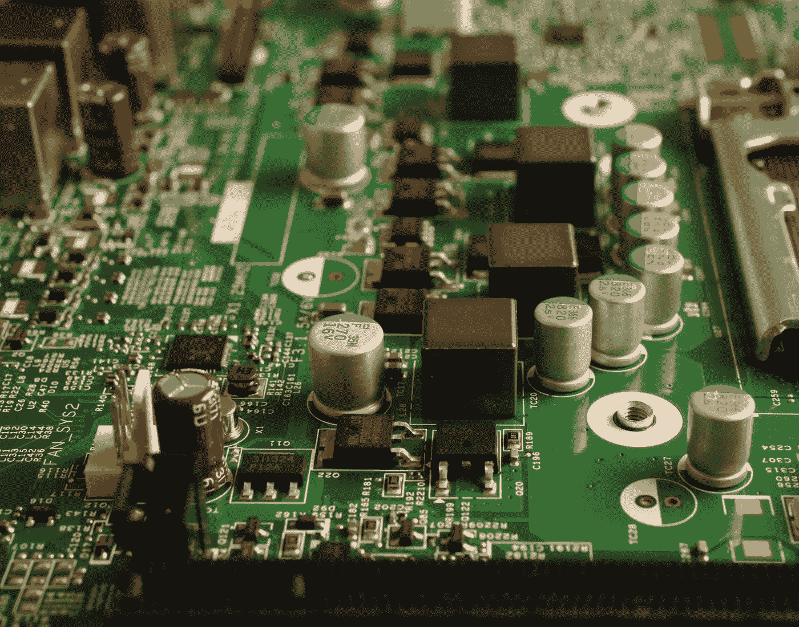

# 成为数据科学家的五个“秘密”要素

> 原文：<https://medium.com/geekculture/five-secret-ingredients-to-become-a-data-scientist-76fdae42cda7?source=collection_archive---------49----------------------->

## 大量的资源，而你不知道从哪里开始？我的目标是使用披萨食谱作为类比，为您提供一个个人数据科学路线图。

如果你在问自己，这和数据科学有什么关系……继续读下去，你会发现神奇是如何开始的。

当我在人行道上捡玉米饼的时候(是的，我是墨西哥人，哈哈！我在我家附近偶然发现了一家新开的比萨饼店。老实说，我很惊讶，因为标志和地方真的很棒；我为他们感到高兴！

所以当我带着玉米饼回到家时，我问妻子是否能为我们做一个比萨饼。

令我惊讶的是，我得到了“是”的答案，原因有二:

1.  她说我不知道怎么做饭
2.  我妻子告诉我这很容易

这似乎是一个巧合，但我妻子提到的两点是现在我可以自信地对数据科学领域的任何人说的。

无论如何，仅仅因为我最近做了一个自制的披萨，我将使用披萨食谱类比来解释成为数据科学家的可能路线图。

*注意:这是一个自制披萨/个人路线图，所以也许你有更好的方法来创建一个，或者也许我遗漏了一些配料；请让我知道！*

# 配料#1:水、糖和酵母

据我所知，这些在某种程度上是基础、支柱、核心；翻译成路线图，这肯定是**的编程。**

你可以用很多工具做数据科学:Python，Java，VBA，Scala，C，Julia，R，SQL 等等。

乍一看，听起来令人生畏，但这将标志着我们的数据科学家之路的基础。我们真的需要深入钻研这些话题，也请不要压倒自己；放轻松，按照你自己的节奏。

# 编程；编排

无论你想选择什么样的编程语言，你都必须把它学得非常好，因为那将是你每天的面包。就我个人而言，我没有和编程语言结婚，因为如果你想得到想要的结果，你可以使用任何你想要的东西。

当你完成你的第一个要素时，你将理解公共数据结构，管理库和包，并理解面向对象编程。

同样，这完全是个人问题，因此您可能知道一些更好的路线图资源。最终，您可以使用自己的配置！

## 资源

*   Python — [互动 Python 教程](https://www.learnpython.org/)
*   R — [互动 R 教程](https://swirlstats.com/)
*   SQL — [初级](https://www.kaggle.com/learn/intro-to-sql)和[高级](https://www.kaggle.com/learn/advanced-sql)
*   Git—[FreeCodeCamp.org 的 Git 和 GitHub 速成班](https://www.youtube.com/watch?v=RGOj5yH7evk)

# 配料#2:盐和面粉

这些配料让披萨更有形状，所以**数学和统计学**在数据科学世界里给你答案。

我在网上看到的大多数路线图都没有给予数学与统计应有的重视。基本上，我知道有些人开始编写一些花哨的机器学习算法。他们根本不知道幕后发生了什么！

# 数学和统计学

也许你在学校的时候学过数学和统计学，但是如果没有，不要担心！这没什么大不了的，因为下面的网站让它变得非常简单和互动。

## 资源

*   统计和概率— [可汗学院的课程轨道](https://www.khanacademy.org/math/statistics-probability)将向您介绍描述性和推断性的统计世界。
*   数学— [线性代数](https://www.khanacademy.org/math/linear-algebra)和[微积分](https://www.khanacademy.org/math/ap-calculus-ab)会给你未来要看的一些机器学习算法的核心。如果从头到脚不了解也不用担心。尽管如此，在将来，当你处理 ML 算法时，你将再次回顾这些主题。你已经有了如何解决未来问题的想法。

*奖励:如果你来自 R 背景，你应该看看这个网站* 的

# *配料#3:番茄酱*

*谁知道没有番茄酱的披萨？据我所知，这种成分对于要吃它的人来说不是那么直观，但却是必不可少的，所以是**数据清洗**。*

# *数据清理*

**

*根据这些年我在许多论坛和 Twitter 上看到的帖子，数据争论大约是数据科学工作的 80%。想一想；你有很多来自不同来源的数据。您必须收集它并清理它，因为您必须处理数据以获得最终数据。*

*也就是说，当您从一个数据源获取数据时，您不能期望数据的格式是您想要的，所以您应该认真对待这个“成分”。*

## *资源*

*   *python—[ka ggle 的数据清理](https://www.kaggle.com/learn/data-cleaning)*
*   *r—[r .](https://bookdown.org/scconner7/r_census_data_cleaning_tutorial/)中的数据清洗教程不是交互式的，但它向你展示了 [tidyverse](https://www.tidyverse.org/) 的世界！*

# *配料#4:莫扎里拉奶酪*

*谁不爱吃奶酪？我认识的大多数人在他们的生活中都想要一点奶酪——切达奶酪、羊乳酪、帕尔马干酪，不管你喜欢什么。*

*好吧，我来告诉你:**探索性数据分析**就像披萨里的奶酪！*

# *探索性数据分析*

**

*正如我上面提到的，你可以选择任何你喜欢的奶酪，对吗？当你在做探索性数据分析(EDA)时，你可以选择直方图、箱线图、散点图、热图等。*

*这是你品尝数据的部分。这是你“玩”分析的部分，你试图获得一些见解。*

## *资源*

*   *Python—[FreeCodeCamp 的 Python 数据分析](https://www.youtube.com/watch?v=r-uOLxNrNk8)是一个非常详细的教程，你会看到很多像 pandas 和 seaborn 这样的库。*
*   *R — [这里有一个链接](https://towardsdatascience.com/exploratory-data-analysis-in-r-for-beginners-fe031add7072)，如果你喜欢 r，你可以去看看。*

# *配料#5:意大利辣香肠(或者任何你想要的配料)*

*我喜欢意大利香肠，但是你可以选择另一种奶酪(如果你是一个奶酪爱好者)，或者肉丸，蘑菇，或者任何你想要的东西。*

*我有一些坏消息…这是我个人路线图的结束，也是我个人自制披萨的结束:(但结果是你终于可以吃了！当然……首先，你得把它烤熟。*

*这是你偶然发现**机器学习的部分。**如果你看数据科学新闻，你每天听到的著名的、时髦的、热门的话题。*

# *机器学习*

**

*把机器学习当做工具箱，而不是目的。我的意思是，有时人们会混淆数据科学和机器学习，因为有时即使没有它，你也可以交流和解决问题。*

*有时候，你不需要使用最先进的 ML 算法。事实上，给出简单的结果更好，因为这对任何人来说都更容易理解。*

## *资源*

*   *Python — [用 Python 从零开始学习机器](https://dafriedman97.github.io/mlbook/content/introduction.html)*
*   *R — [整洁的建模和 R](https://www.tmwr.org/) 确实是一个奇妙的来源；即使您来自不同的编程语言，您也应该检查一下。*

# *结论*

*这是个人路线图；如果你愿意，你可以找一些比我更好的其他资源。*

*正如我之前所说的，您可以使用自己的配置来实现您想要的任何目标。*

*顺便说一句，我必须告诉你，有些话题我没有涉及，因为这些话题比较难，你需要有一些经验才能开始:*

*   *特征工程*
*   *数据工程*
*   *深度学习*

*我希望这个个人路线图可以帮助你实现关于数据科学世界的一些目标，我也希望你在看完这个教程后可以做你的自制披萨:)*

**P.S .我猜你已经注意到 Python 比 R 有更好的资源，关于你是选择 R 还是 Python，我的看法如下:**

*   **如果你是统计出身，就用 R**
*   **如果你来自计算机科学背景，用 Python 搞定了**

*这些是最常用的语言，请记住它们并不相互排斥。*

*我的建议是两者都要学，因为你会在工作中用到它们。*

**就这么简单！**