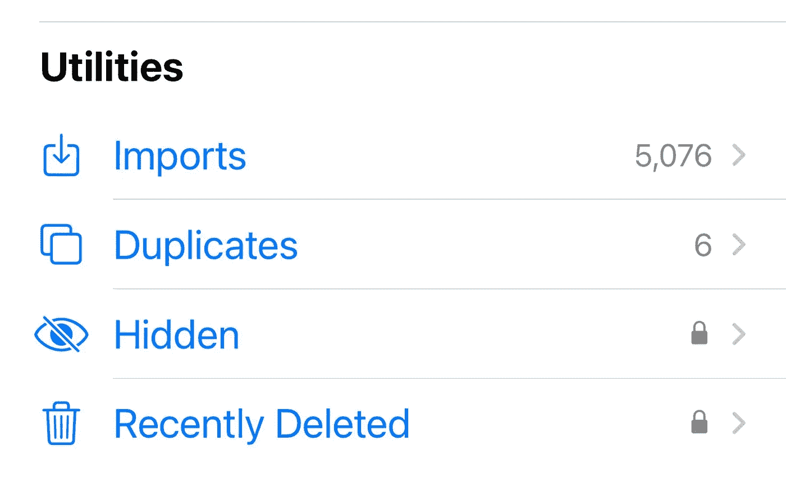
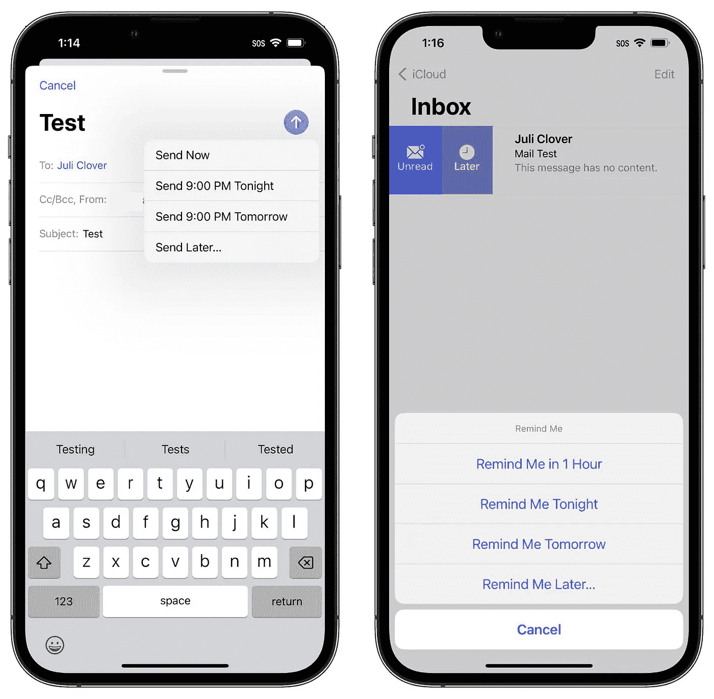
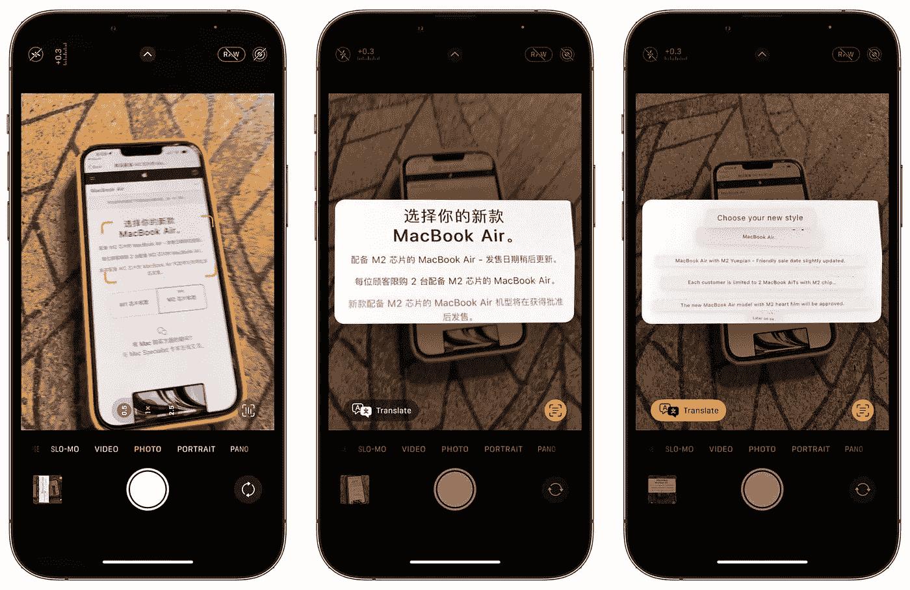
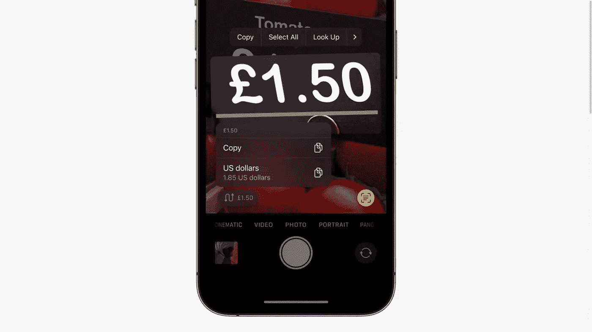
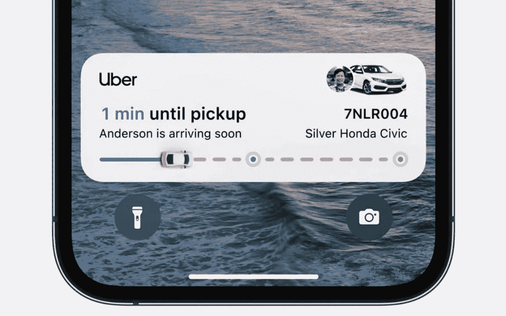
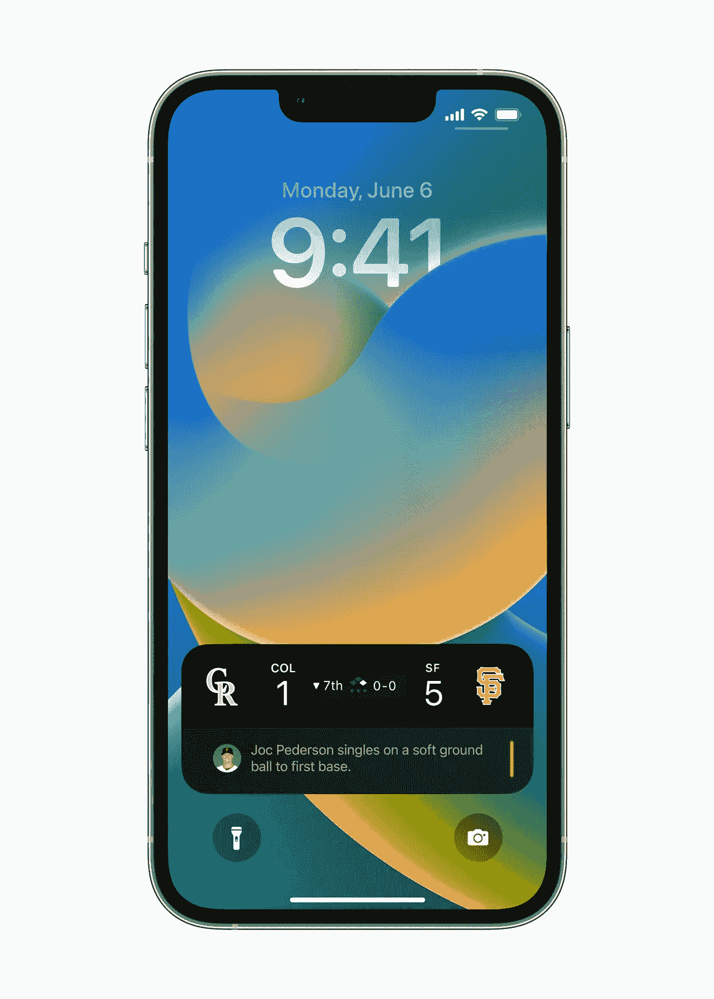

# iOS 16 的五个有用功能

> 原文：<https://medium.com/geekculture/five-useful-updates-from-ios-16-166f9967c369?source=collection_archive---------14----------------------->

忘掉 WWDC 的头条新闻吧。

**iOS 16 lock screen**

苹果的 WWDC 活动又结束了一年，iOS 16 更新的所有宣传都是关于新的锁屏设计，新的 home 应用和 iMessage 升级。这些都是很棒的新功能，但是有一些非常酷和有用的更新你可能还没有听说过，因为苹果没有谈论它们。

以下是 iOS 16 发布时需要检查的 5 件事。

1.  **照片 App**

照片应用程序在 iOS 16 中获得了一些没有得到关注的新技巧，你现在可以锁定隐藏或最近删除的相册，因此它们需要面部/触控 ID 来解锁。

**New options within Photos**

你还会得到一个副本文件夹，这样你就可以清除任何误存的副本，释放空间。

我认为这些对于更多的隐私和更少的混乱是非常方便和有用的。

**2。新输入法**

这对我来说是一个大问题，当你打字时键盘上的**触觉反馈**是我喜欢的安卓系统上的东西，但在默认的苹果键盘上从来没有。

当你打字时，你会感觉到轻微的触觉反馈，就好像你在触摸一个真正的键，这使得打字更加身临其境，更不容易错过触摸。

**Nintendo Joy cons**

另一种输入方法是能够用任天堂 Switch Joy cons 或 Pro 控制器玩游戏，Playstation 和 Xbox 控制器是以前唯一可用的。

**3。电子邮件应用**

股票电子邮件应用程序目前的形式非常有限，但 iOS 16 增加了一些实际的桌面功能。

您现在可以在发送邮件后 10 秒内取消发送，安排邮件在您喜欢的时间稍后发送，还可以设置提醒您稍后阅读收到的邮件，以防您忙或忘记。

**New send later and reminder options within the Mail app**

另一个很好的更新是邮件应用程序中的新搜索功能，它在电子邮件中提供了更多的信息，甚至给你最近的附件和文件的图像。

对于那些总是在电子邮件中寻找特定附件或信件的人来说，这是一个巨大的帮助。

**4。现场特写**

在 iOS 15 中，我们有了 **live text** 来从照片和图像中获取信息，但现在苹果更进一步，增加了 live translate 和 live currency conversion。

**Live translate**

对于那些经常旅行或只是度假的人来说，这些功能非常有用，只需将相机对准你需要实时翻译或转换的任何内容，就会弹出一个翻译或货币选项，就像二维码上的网络链接一样。

**Live currency conversion**

当我在度假的时候，我肯定会使用货币转换器，试图让自己保持在预算之内，在旅行或者仅仅是阅读的时候，这个转换器也会非常有用。

**5。现场活动**

好吧，现场活动不是一个秘密功能或小花絮，它是一个主要功能，但不会在 iOS 16 发布后推出。可能在 iOS 16.1 更新中，开发者又一次有时间将这个功能添加到他们的应用程序中。

我想强调它将带给用户的一些很酷的东西。

**Live Activities give you a up to date widget on your lock screen.**

目前，似乎只有优步、优步、耐克、MLB 和星巴克准备好了现场活动。

这个功能对于交付、订单、航班和实时体育比分非常方便。它将消除你通常会从这些应用程序中收到的多种通知的所有混乱。

**Live scores on the lock screen**

这也将使锁屏更加有用，只需一瞥，减少对通知或进入特定应用程序检索信息的依赖。

当然，如果传言中的 iPhone 14 Pro 系列真的配备了类似于最近苹果手表的永远显示选项，让你甚至不用唤醒你的设备就可以看到信息，这些功能可能会更加有用。

总的来说，这是今年一次体面的更新，比 iOS 15 有趣得多。新的锁屏显然是明星，它真正展示了苹果近年来如何开放更多的定制，但我提到的这些功能真的很好，很有用，将改变你日常使用设备的方式，并增强用户体验。