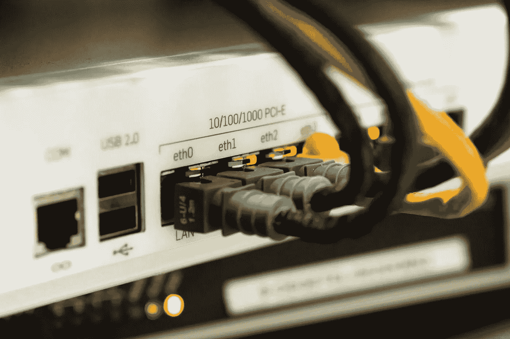

# 修复 Wi-Fi 慢:5 个调整，使您的 Wi-Fi 快速和稳定

> 原文：<https://medium.com/geekculture/fix-wi-fi-slow-5-tweaks-to-make-your-wi-fi-fast-and-stable-3b1825a9b58?source=collection_archive---------15----------------------->

## 家里 Wi-Fi 一直断线吗？正在寻找修复慢速家庭 Wi-Fi 的方法？希望改善家庭 Wi-Fi 连接？

Source:

你是否感到沮丧并面临以下问题:

*   Wi-Fi 保持**断开**。
*   **大部分地区无线信号微弱**