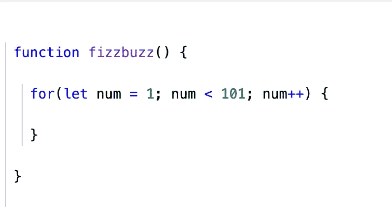
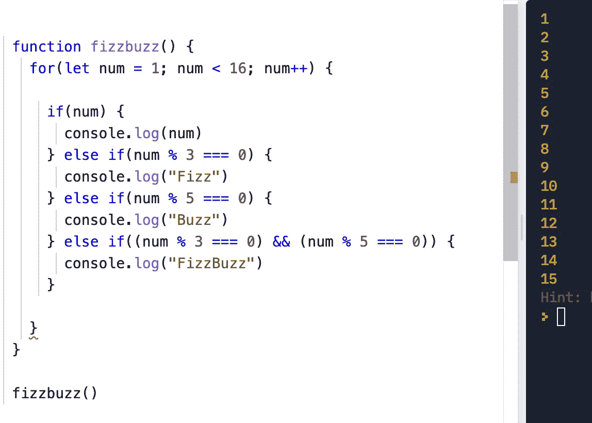
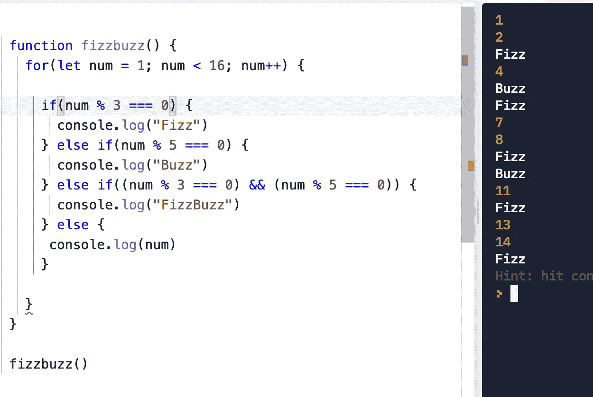
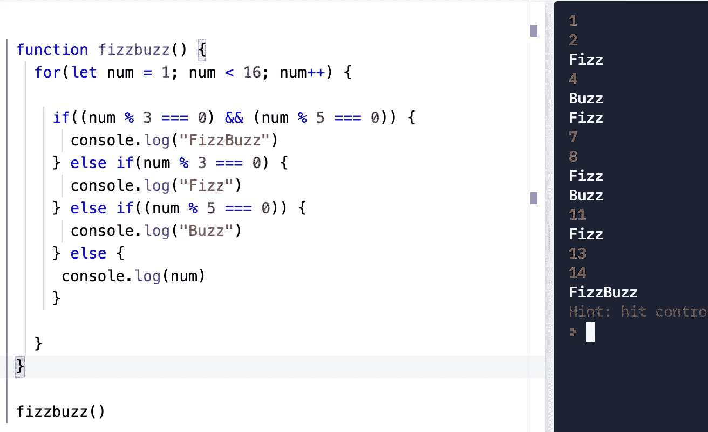
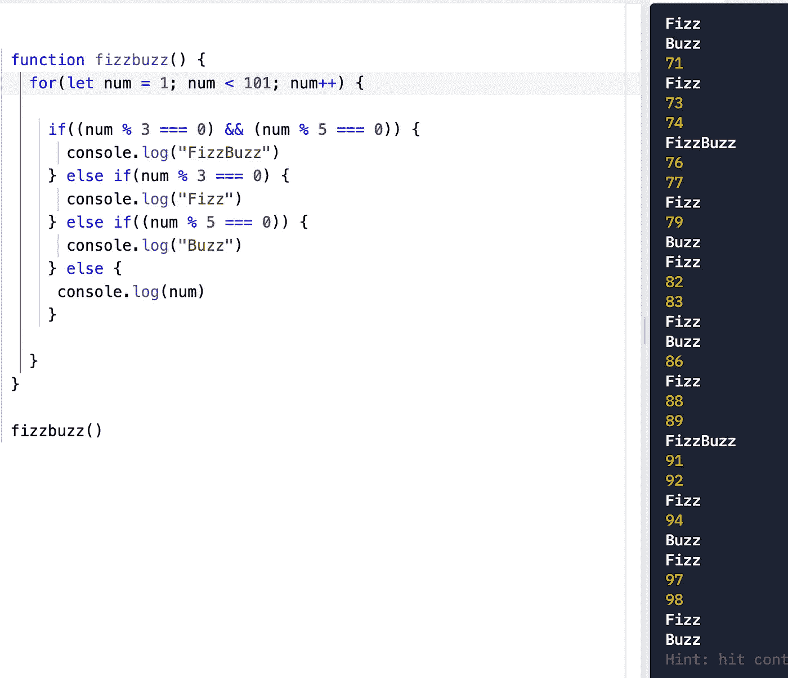

# 嘶嘶作响

> 原文：<https://medium.com/geekculture/fizzbuzz-34e72a423543?source=collection_archive---------46----------------------->

## 你真的知道如何编码吗？

Photo by [**Charlotte May**](https://www.pexels.com/@charlotte-may?utm_content=attributionCopyText&utm_medium=referral&utm_source=pexels) from [**Pexels**](https://www.pexels.com/photo/glass-with-cocktail-on-black-background-5947012/?utm_content=attributionCopyText&utm_medium=referral&utm_source=pexels) || Photo by [**현덕 김**](https://www.pexels.com/@1951162?utm_content=attributionCopyText&utm_medium=referral&utm_source=pexels) from [**Pexels**](https://www.pexels.com/photo/swarm-of-bees-making-honey-in-hive-5336243/?utm_content=attributionCopyText&utm_medium=referral&utm_source=pexels)

我目前专注于算法和数据结构，这是技术测试的重点。技术测试是程序员在获得梦寐以求的技术职位之前经常需要清除的一个重大障碍。算法和数据结构几乎是这些技术考试的唯一内容。

今天我想讨论我在科技之旅开始时遇到的最早的算法之一，FizzBuzz。根据维基百科，FizzBuzz 起源于一种儿童文字游戏，教他们除法。玩家轮流数数，用 Fizz 替换被 3 整除的数字，用 Buzz 替换被 5 整除的数字，用 FizzBuzz 替换被 3 整除的数字和被 5 整除的数字。

Imran Ghory 被认为将这种儿童游戏转化为一种技术挑战，以确定编程职位候选人是否可以实际编码。

伊姆兰所展示的 FizzBuzz 任务:

> 写一个程序打印从 1 到 100 的数字。但是对于三的倍数打印“嘶嘶”而不是数字，对于五的倍数打印“嗡嗡”。对于同时是 3 和 5 的倍数的数字，打印“FizzBuzz”。

在求解算法时，写伪代码有助于你解决问题。练习时大声说话也是一个好主意，因为当你被面试时，你需要向面试官解释你的思维过程。

首先，为了阐明这个挑战，我写下并提出以下问题:

打印数字 1 到 100
(计数中包含数字 1 和 100？)
3 的倍数=嘶嘶声
5 的倍数=嗡嗡声
3 的倍数& 5 =嘶嘶声

这段伪代码以一种您可以开始看到它在代码中的样子的方式分解了这个问题。例如，为了确定一个数的倍数，我们的代码将如下所示:

10 % 5 === 0

这种说法是正确的，因为 10 可以被 2 整除，并且余数为 0。

10% 3 === 0

这将是错误的，因为 10 除以 3 会有一个不是 0 的余数。

在技术面试中，你经常被允许使用你选择的语言。我将使用 JavaScript。首先，我会快速声明一个函数，并建立一个从 1 数到 100 的循环(并假设数字 1 和 100 都包括在内)。循环用于多次运行相同的代码，并在每次循环后获得不同的值。

声明了一个名为 fizzbuzz 的函数，它包含一个起始编号(num)设置为 1 的 for 循环。因此，计数将包括 1，并使用 num++通过每个循环递增 1。为了确保数字 100 包含在内，我将计数设置为只要小于 101 就继续。现在，我将在 for 循环中使用 if 语句来获得指定的输出。如果我按照任务显示的顺序编写这个函数，我会设置它首先打印数字，然后检查 3 的倍数，然后检查 5 的倍数，最后检查 3 和 5 的倍数。注意，出于演示的目的，我在一个更小的数量(少于 16 而不是 101)上测试它。所以这个函数看起来像这样:

我的函数写在左边，我在左下角用 fizzbuzz()调用它，右边的结果是所有数字的计数(没有 Fizz，buzz，也没有 FizzBuzz ),从顶部的 1 一直到 15。所以我们马上看到这个函数失败了，因为 Fizz 应该替换数字 3，Buzz 应该替换数字 5，等等。这表明我的实际代码不一定遵循我的伪代码的顺序。我必须使用逻辑来重新安排事情，以确保正确的输出。

因此，看起来我们必须在打印出我们的数字之前进行一些检查，以确保我们捕捉到将触发 Fizz，Buzz & Fizz Buzz 的数字案例。因此，我们最初的重构可以是将 num 的 console.log 放在 if 语句的末尾，以确保所有其他检查首先发生:

好吧，这看起来更接近我们要找的东西了。我们看到数字 1 和 2 被列出，因为它们都不能被 3 或 5 整除。我们有 3 的嘶嘶声，因为它能被 3 整除，然后列出 4，因为它不能被 3 和 5 整除，还有 5 的嘶嘶声，因为它能被 5 整除，等等。一切看起来都井井有条，直到我们看到最后一种代替数字 15 的汽水。这是一个问题，因为 15 可以被 3 & 5 整除。所以这应该是 FizzBuzz 而不仅仅是 Fizz。

我们需要再做一次重构。在我们检查 Fizz 和 Buzz 之前，我们需要检查 FizzBuzz 数字:

我们做到了！FizzBuzz 印刷价格为 15 英镑。现在，我们将 101 限制放回我们的计数中，这样它将一直达到并包括 100:

我的屏幕不够大，无法显示从 1 到 100 的完整结果，但在计数的最后，我们看到 100 位被包括在内，并被 Buzz 所取代，因为 100 可以被 5 整除。我们还看到数字 75 和 90 用 FizzBuzz 表示，因为它们都可以被 3 和 5 整除。因此该功能工作正常。我们征服了 FizzBuzz！

我们通过了伊姆兰的筛选测试；我们实际上可以编码。这意味着现在我们有机会获得梦寐以求的技术职位了！