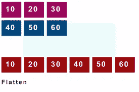

# 在 JavaScript | Microsoft 面试问题中展平数组中的数组

> 原文：<https://medium.com/geekculture/flatten-array-of-array-in-javascript-microsoft-interview-question-345c71ff9ccd?source=collection_archive---------9----------------------->

在微软、沃尔玛、LinkedIn 等精英公司中，扁平化数组已经成为最常见的面试问题之一。实际上，只要你知道递归和 JavaScript 数组函数的基础，这是一个非常简单的问题。为了帮助你在面试中回答这个问题，我写下了我的答案。



Pic Credits: Dot net Paris

问题:展平数组中的数组

输入:[1，[2，3]，4，[5，6，7]]

产出:1，2，3，4，5，6，7

你可以看我的 Youtube 视频，详细解决这个问题。

**方法:**

*   回答这个问题首先要考虑的是如何确定给定的数组索引是否是数组。在上面给出的输入中，arr[1] ([2，3])实际上是一个数组。这可以通过使用 JavaScript 的内置函数**数组**来确定。**艾萨里()。**
*   在识别给定的索引是否包含数组之后，如果它是一个数组，那么递归地将这个数组作为输入传递给同一个函数，并在转到下一个数组索引之前先遍历它。

现在让我们编写工作片段。

```
let arr = [1,[2,3],4,[5,[6,7]]]
let output = ''
function flatten(arr) {
  for (let i = 0; i < arr.length; i++) {
    if(Array.isArray(arr[i])){
      flatten(arr[i])
    }else{
      output += arr[i]
    }
  }
  return output
}
console.log(flatten(arr))
```

在这里，我将这些数字连接成一个字符串，你可以使用一个数组并将所有的值(纯粹是你的面试官期望的输出)压入。

这篇文章就讲到这里，你可以在我的 YouTube 频道[不凡极客获取更多这样的面试问题。](https://www.youtube.com/channel/UCSCNvSCk_Z9mBvUM-FJexRg/videos)。如果你还没有在媒体上关注我，那么请关注我，你可以在链接的[这里](https://www.linkedin.com/in/vasanth-bhat-4180909b/)上关注我。别忘了订阅我的 Youtube 频道[。](https://www.youtube.com/channel/UCSCNvSCk_Z9mBvUM-FJexRg/videos)

如果你想亲自和我讨论模拟面试，面试或简历审核的技巧和诀窍，你可以在这里预约:

[https://topmate.io/vasanth_bhat](https://topmate.io/vasanth_bhat)

# 同一作者的更多文章:

1.  [我在 MPL 的面试经历](https://mevasanth.medium.com/my-interview-experience-at-reliance-jio-react-native-jio-money-2805086d851e)
2.  我在信实纪的面试经历
3.  [JavaScript array . push()是深度拷贝还是浅度拷贝？](https://javascript.plainenglish.io/array-push-in-javascript-is-it-deep-or-shallow-copy-90cd195ec5b7)
4.  [异步 Await 函数返回值的问题](https://javascript.plainenglish.io/array-push-in-javascript-is-it-deep-or-shallow-copy-90cd195ec5b7)