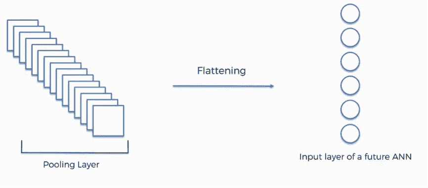

# 计算机视觉中的展平层

> 原文：<https://medium.com/geekculture/flattening-in-computer-vision-32ea85f2c9a3?source=collection_archive---------26----------------------->

在本文中，您将了解什么是扁平化，为什么它必须包含在计算机视觉架构中，以及如果我们忘记将它添加到网络中会发生什么。

## ***什么是扁平化？***

与其跳到技术语言，不如用简单的话来理解。 ***展平*** *是将多维汇集的特征图转换成一维矢量的过程。*

Flattening on Multi-Dimensional Pooled Feature map (Credits: [Super Data Science](http://www.superdatascience.com) and [Codicals](https://www.instagram.com/codicals_/))

在理解扁平化的必要性之前，让我们快速了解一下计算机视觉的架构。

**图像→卷积处理→特征图→合并处理→合并特征图→展平→一维向量**

为了更好地理解，用一幅图像来概括这一切

The architecture of Computer Vision Network mentioning Flattening layer at last (Credits: [Towards Data Science](http://www.towardsdatascience.com) and [Codicals](https://www.instagram.com/codicals_/) )

## ***为什么展平在每个计算机视觉网络中都很重要？***

从上面的图像中可以清楚地看到，我们使用了一个展平层来将多维汇集和卷积的特征地图转换为一维矢量。

*这很重要，因为我们希望将这个汇集的特征图插入到神经网络中，而神经网络只能接受一维输入，这是我们在计算机视觉架构中使用展平层的主要原因。*

我们在网络中反复使用卷积和汇集层来提取特征并创建特征图，而展平层在我们将其作为神经网络的输入之前仅应用一次。

## ***如果我们忘记在建筑中加入展平层会怎么样？***

这是计算机视觉架构中非常关键的一部分，我们永远不会忘记。但是后果也将是我们将不能训练我们的网络，因为我们不能把我们的数据给网络。我们的网络无法与扁平化层一起工作，现在你会理解这一层的重要性，这一层做着非常简单的工作，但它在网络中发挥着重要作用。

扁平化是一个非常简单的话题，它在网络中扮演着简单的角色。我希望你从这篇文章中学到了一些新的东西。

敬请关注，继续学习。