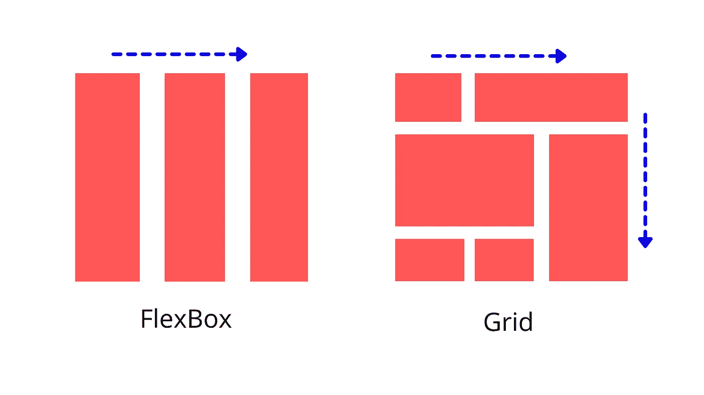

# Flexbox 还是 Grid:选择什么？

> 原文：<https://medium.com/geekculture/flexbox-or-grid-what-to-choose-e07fdd7df2b6?source=collection_archive---------12----------------------->

## 了解 flexbox 和 Grid 之间的区别！

Flexbox 是 CSS3 中的一个新布局属性，它允许您使用列和行创建灵活的布局。Grid 是一个类似的布局属性，但适用于任意数量的列和行。关于使用哪种布局属性，没有正确或错误的答案，但是 Flexbox 比 Grid 更现代，也更容易使用。如果…