# 机票价格预测:机器学习项目

> 原文：<https://medium.com/geekculture/flight-fare-prediction-93da3958eb95?source=collection_archive---------0----------------------->

# 您的航班票价预测机器学习项目的分步指南！

在本文中，我将带您了解我们如何训练一个模型来帮助我们预测机票价格。您将练习到目前为止所学的机器学习工作流，以使用价格的属性来预测价格。

Photo by [Tim Gouw](https://unsplash.com/@punttim?utm_source=unsplash&utm_medium=referral&utm_content=creditCopyText) on [Unsplash](https://unsplash.com/s/photos/plane?utm_source=unsplash&utm_medium=referral&utm_content=creditCopyText)

**潜在的业务问题**--

机票价格很难猜测。我们已经获得了 2019 年 3 月至 6 月期间各航空公司和各城市之间的机票价格，我们旨在利用这些价格建立一个模型，该模型使用各种输入特征预测航班价格。

**关于数据集，请访问**:

[*https://www . ka ggle . com/nikhilmittal/flight-fare-prediction-MH/*](https://www.kaggle.com/nikhilmittal/flight-fare-prediction-mh/)

我们这里有 2 个数据集—训练集和测试集。

训练集包含这些功能，以及航班的价格。它包含 10683 条记录、10 个输入特征和 1 个输出列—“价格”。

测试集包含 2671 条记录和 10 个输入特征。需要在该集合中预测输出“价格”列。这里我们将使用回归技术，因为预测的输出将是一个连续的值。

以下是数据集中可用的要素-航空公司、旅行日期、来源、目的地、路线、停靠时间、到达时间、持续时间、总停靠站、附加信息、价格。

# 数据科学项目的整个生命周期分为四个部分:

1.  [探索性数据分析](https://medium.com/p/93da3958eb95/edit#e6a5)
2.  [特征工程](https://medium.com/p/93da3958eb95/edit#1aee)
3.  [功能选择](https://medium.com/p/d25559cf2d2a/edit#7edb)
4.  [模型部署](https://medium.com/p/d25559cf2d2a/edit#61e6)

## [**探索性数据分析**](https://medium.com/p/93da3958eb95/edit#e6a5)

现在，让我们从机器学习预测航班票价的任务开始。首先，我将导入完成此任务所需的所有必要的库，并导入训练数据集。

1)导入库

2)导入数据集

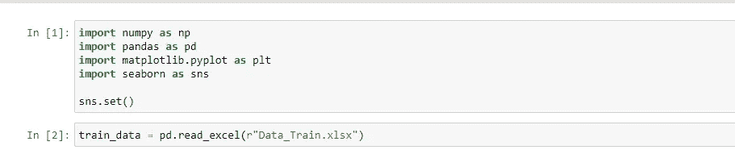

在处理数据科学问题时，我们可以做的第一件事是了解您正在处理的数据集。记录下数据中的主要观察结果和趋势。监控变量和输出价格之间的所有相关性。为此，您可以使用 **df.info** 、 **df.head()等。**

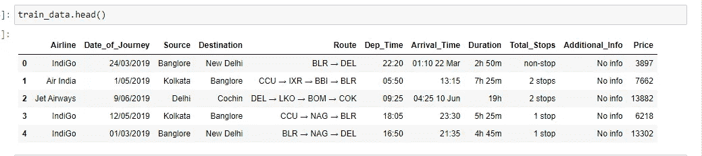

通过观察训练数据集，我们注意到:

**Route** 列包含我们需要分离的城市列表，因为我们的数据集中有多个组合。

**到达时间**列附带了日期，我们需要将它们分开。

**Duration，Date_of_Journy** 列为字符串格式，需要转换为整型。

**Total_stops** 列中添加了单词“stops”以及停止次数，并且 **Dep_Time、Duration** 列也不是我们需要转换为整数的适当形式。

**在数据分析中，我们将尝试找出以下内容**

1.  数据集中缺少值。

2.所有的数值变量和数值变量的分布

3.分类变量

4.极端值

5.独立功能和从属功能之间的关系(*价格*)

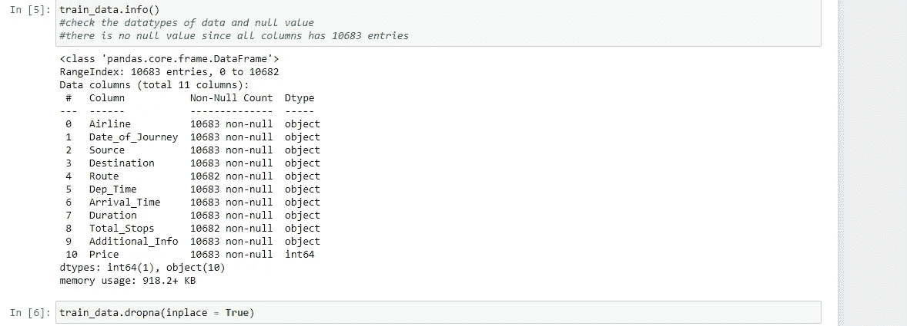

我们的训练数据集中没有缺失值，因为所有列都有 10683 个条目。正如我们在 train_data.info()中看到的，所有相关列都是“对象”数据类型，为了将这些列正确用于模型，我们必须将这些数据类型转换为适当的形式，我们将在特征工程中看到。

探索性数据分析以两种不同的方式交叉分类，每种方法都是图形化的或非图形化的。然后，每种方法都是单变量、双变量或多变量的。

**单变量分析**

在单变量分析中，只有一个可靠变量。单变量分析的目的是导出数据并分析其中的模式。在训练数据集中，它分别研究每个分类列。

条形图在比较数据类别时非常方便。它有助于跟踪随时间的变化。它最适合可视化离散数据。

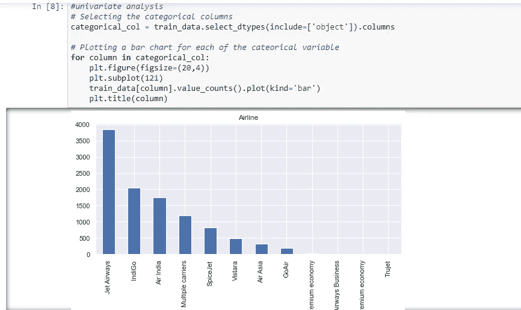

*   Jet Airways 是最受欢迎的航空公司，排在第一位，其次是 Indigo 和 AirIndia。喷气航空业务是最昂贵的航空公司。
*   Vistara Premium economy、Trujet、Multiple carries premium economy 和 Jet airways 的业务很低。

在数据分析之后，我们将尝试在特征工程中对上述内容进行如下处理。

## [**特征工程**](https://medium.com/p/93da3958eb95/edit#1aee)

您可以看到数据的样子，但是在使用它之前，我们需要对它进行定制。我们将在特征工程中执行以下所有步骤。

*   **分类变量的替代**

我们发现所有的列都是“object”数据类型，只有“Price”列是整数类型。人们可以找到许多处理分类数据的方法。其中一些分类数据是，

1.  名义数据→数据没有任何顺序→在这种情况下使用 OneHotEncoder
2.  序数数据→数据按顺序→ LabelEncoder 在这种情况下使用。

“航空公司”列有 12 个唯一值—“IndiGo”、“印度航空公司”、“Jet 航空公司”、“SpiceJet”、“多家航空公司”、“GoAir”、“Vistara”、“亚洲航空公司”、“Vistara 高级经济舱”、“Jet 航空公司商务”、“多家航空公司高级经济舱”、“Trujet”。

Airline 列是名义分类数据，基数较小，因此我们将执行一次热编码。

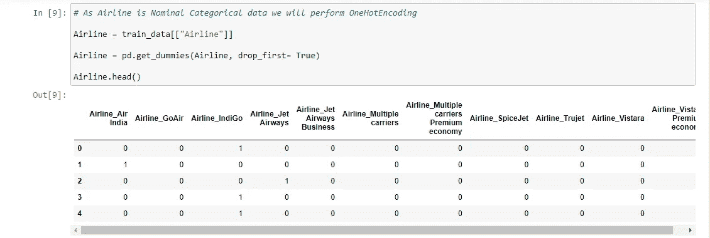

从。info()我们知道 Date_of_Journey 是一个对象数据类型。为了处理这种分类数据，我们使用特征提取方法，其中我们使用**旅行日期**导出新特征。为此，我们需要 pandas **to_datetime** 将对象数据类型转换为 datetime dtype。

1.  旅程之日 2。旅行的月份

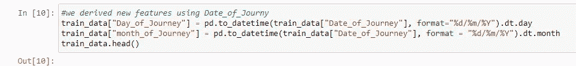

类似地，我们从 Dep_Time 和 Arrival_Time 中提取值，并为出发时间[“Dep _ hour”]和分钟[“Dep _ min”]、到达时间、到达分钟创建单独的列。

由于我们已经将 Date_of_Journey、Dep_Time 和 Arrival_Time 列转换为整数，现在我们可以删除它，因为它没有用。

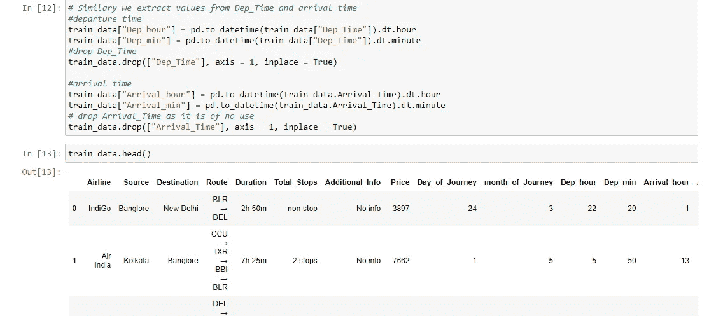

持续时间列不是帮助预测机器学习模型的适当形式。我们必须用同样的格式。在数据集中，一些飞行持续时间可能只有“30 分钟”，所以我们将它写成“0 小时 30 分钟”。因此，我们从“持续时间”中提取两个新列“持续时间 _ 小时”和“持续时间 _ 分钟”。

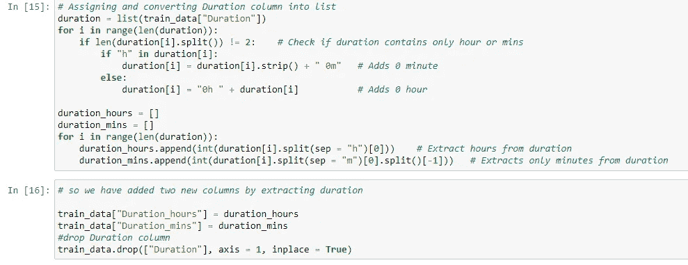

源列有 5 个唯一值-“班加罗尔”、“加尔各答”、“钦奈”、“德里”和“孟买”。因为源是名义分类数据，基数较小，所以我们将执行 OneHotEncoding。

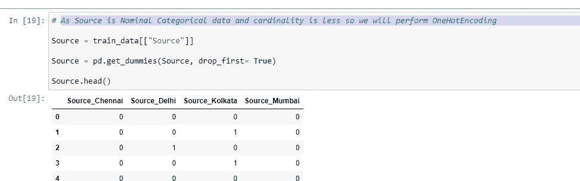

目的地列有 6 个唯一值-“新德里”、“邦洛尔”、“科钦”、“加尔各答”、“德里”、“海德拉巴”。目标是名义分类数据，基数较小，因此我们将执行 OneHotEncoding。

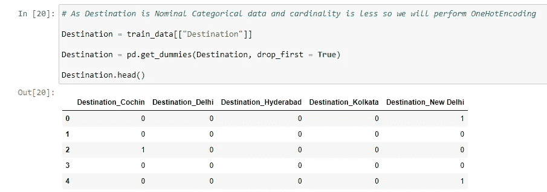

附加信息包含几乎 80%的无信息，路线和总停靠站也相互关联。因此我们将删除这两列。

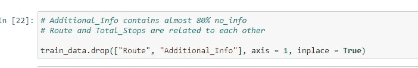

Total_Stops 有 5 个唯一值:“1 站”、“不停”、“2 站”、“3 站”、“4 站”。在这种情况下，我们执行标签编码器。
数值由相应的键分配。

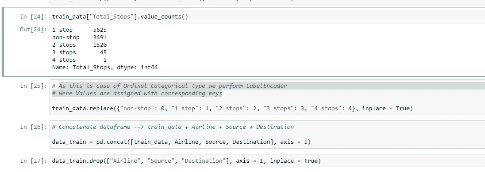

我们为这个模型使用 kaggle 数据集，其中训练和测试数据已经存储在不同的文件中。我们不应该合并测试数据集和训练数据集，这可能导致数据泄漏。

同样的，

我们为训练数据集所做的所有功能工程与我们将为测试数据集所做的相同。

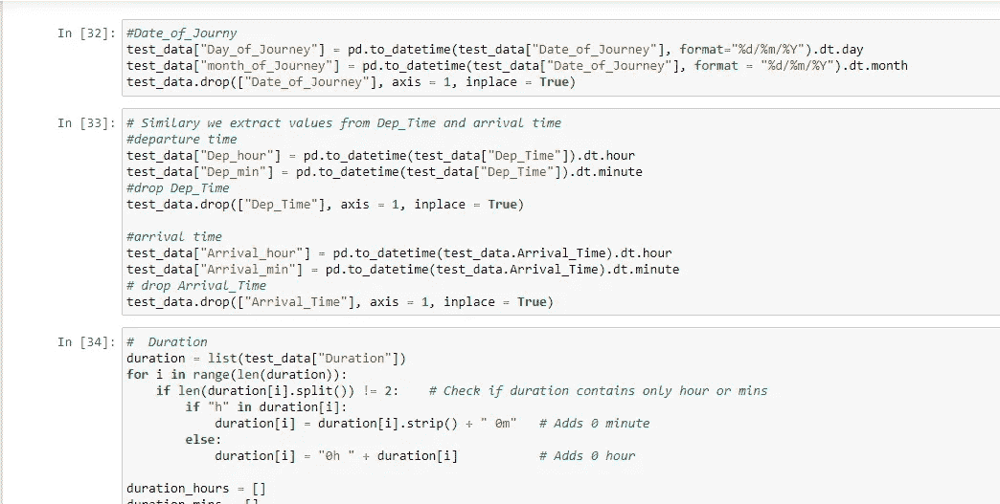

## [功能选择](https://medium.com/p/d25559cf2d2a/edit#7edb)

**模特培训:**

我们事先不知道哪个模型在这个问题上表现最好，因为它是不可知的。我们在训练集上使用额外的树回归器、随机森林回归模型(特征选择)。您可以尝试任意数量的回归模型，并从中选择一个最合适的模型。

我们从训练数据集中删除“价格”列，并使(y)成为独立变量，以找到独立数据和非独立数据之间的相关性。清理完数据后，我们可以将数据可视化，更好地理解不同变量之间的关系。为了更好地了解数据集，您还可以做更多的可视化工作，如散点图、直方图、箱线图等。

使用 **sns.heatmap()** 我们可以看到,【总停站数】*与*价格*正相关，导致燃料成本增加，价格上涨。此外，总停留次数与持续时间高度相关，这意味着如果停留次数增加，飞行的持续时间也会增加。*

*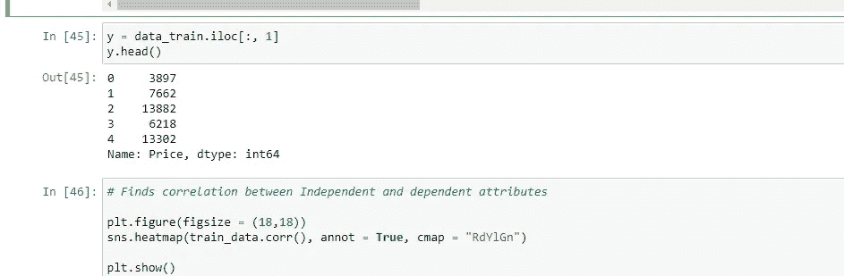**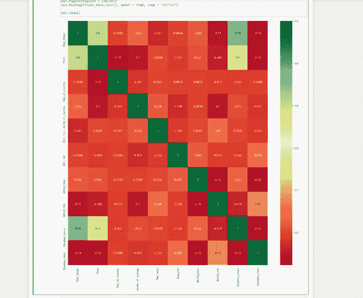*

## *树外回归模型*

*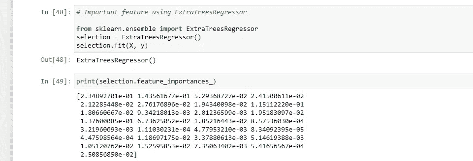**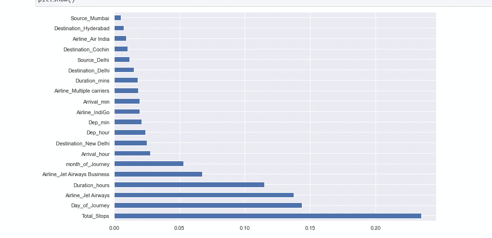*

*我们可以看到 Total_stops 是决定价格时最重要的特征。*

# *使用随机森林拟合模型*

*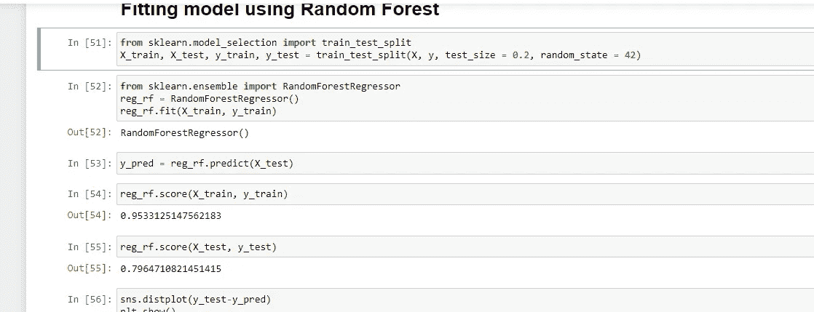*

***拟合参数分布***

*您还可以使用`**distplot()**`来拟合数据集的参数分布，并直观地评估它与观察数据的对应程度。它应该是一个封闭的高斯分布图，并且“y_test”(真实值)和“预测值”之间的差异也应该是最小的。这里大部分残差都是 0，这意味着我们的模型泛化能力很好。*

*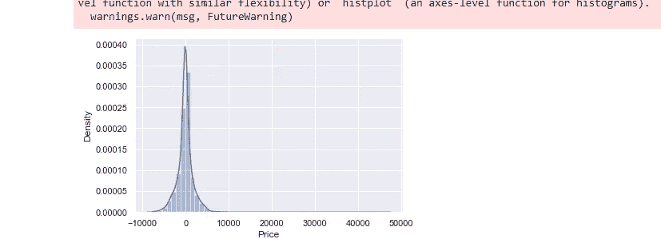*

## *绘制 y_test 与预测。*

*散点图用于观察变量之间的关系，并用点来表示变量之间的关系。这里的点几乎排成一条线。*

*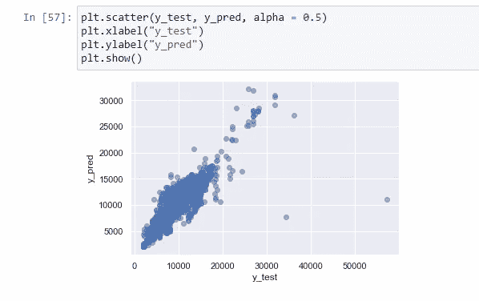*

# *超参数调谐*

*我们使用随机搜索 CV 寻找最佳超参数。参数的随机搜索，在 100 个不同的组合中使用 5 折交叉验证搜索。*

***检查模型的准确性***

*评估模型准确性是创建机器学习模型以描述模型在预测中表现如何的过程中的一个重要部分。MSE、MAE 和 RMSE 度量主要用于评估回归分析中的预测误差率和模型性能。*

*   ***MAE** (平均绝对误差)代表原始值和预测值之间的差异，通过对数据集的绝对差异进行平均来提取。*
*   ***MSE** (均方误差)代表原始值和预测值之间的差异，通过对数据集的平均差异进行平方来提取。*
*   ***RMSE** (均方根误差)是以 MSE 的平方根表示的误差率。*

*回归器保存为 pickle 文件，以便将来加快执行速度。*

*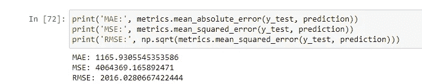*

## *保存模型*

*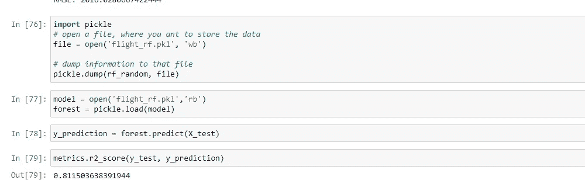*

## *[模型部署](https://medium.com/p/d25559cf2d2a/edit#61e6)*

*模型部署是任何机器学习项目的最后阶段之一。在这里，我们将设计一个用户界面。我们用一个烧瓶制作了一个 HTML 文件，用于航班价格预测。这将获取每个要素的输入值，并计算航班的价格，如下图所示。*

*您可以通过 GitHub 链接在 Heroku 上部署您的模型。*

*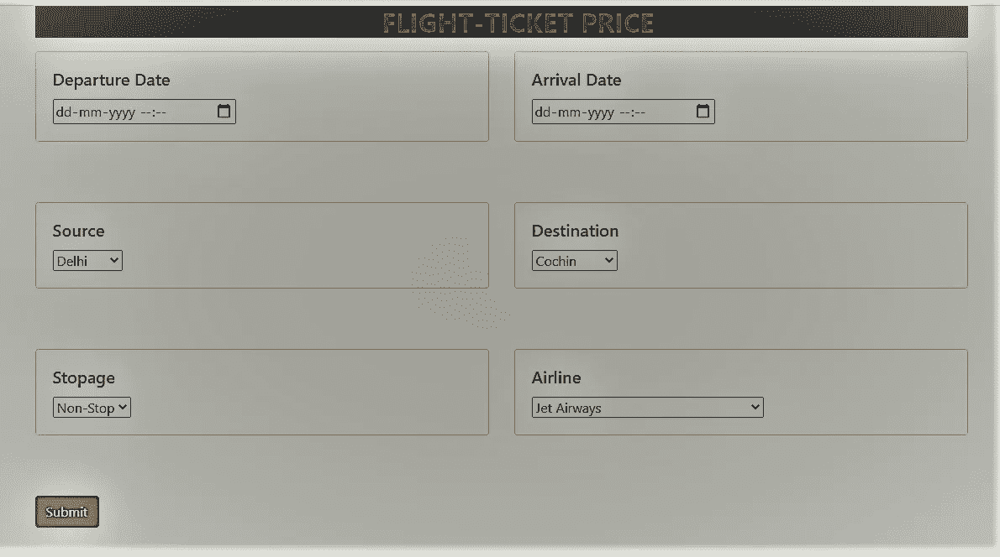*

*我希望你喜欢这篇关于如何用机器学习预测机票价格的文章。欢迎在下面的评论区提出你有价值的问题:)*