# 基于机器学习的航班价格预测

> 原文：<https://medium.com/geekculture/flight-price-prediction-using-machine-learning-f18b4bdc70e6?source=collection_archive---------2----------------------->

旅游业变化很快，每年都吸引着更多的游客。航空业被认为是使用复杂定价策略最复杂的行业之一。现在每天的航班价格很难预测。票价经常变化。顾客们都在寻求最低的机票价格，而航空公司则试图保持尽可能高的总收入。使用技术实际上有可能减少航班价格的不确定性。因此，在这里，我们将使用高效的机器学习技术来预测航班价格。

# 资料组

我们将使用两个数据集，训练数据和测试数据。可以使用此链接下载数据集:*[*https://github . com/urvashithakre/Flight-Price-Prediction-Using-Machine-Learning*](https://github.com/urvashithakre/Flight-Price-Prediction-Using-Machine-Learning)。训练数据包括 10683 行和 11 个属性，而测试数据有 2671 行。*

***让我们从编码开始吧！***

1.  *让我们首先导入必要的库。*

*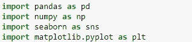*

*2.导入培训数据并显示前五行，以获得数据的整体视图。*

*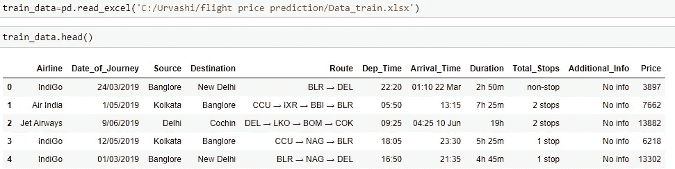*

*3.我们将使用 isna()和 sum()方法检查数据是否包含任何空值，然后使用 dropna()方法删除 NaN 值，这样我们的数据中就不会有差异，我们可以通过这些差异进行精确预测。*

*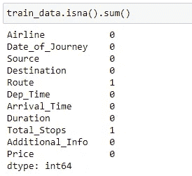**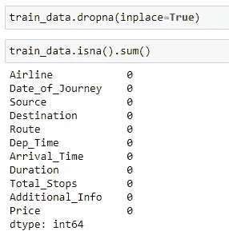*

*3.现在我们的数据是干净的，没有 NaN 值，我们将看看数据类型。*

*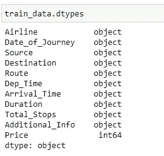*

*可以观察到，默认情况下，旅行日期、到达时间和到达时间已被指定为对象。我们将把这个数据类型转换成时间戳，以便使用这个列进行预测。*

*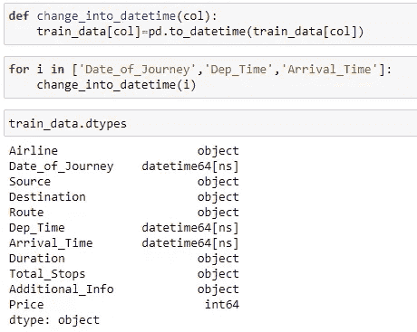*

*4.将“Date_of_Journey”列分为“journey_day”和“journey_month”，以帮助我们的机器学习模型理解并使用该列进行预测。之后，我们将删除对我们不再有用的“旅行日期”栏。*

*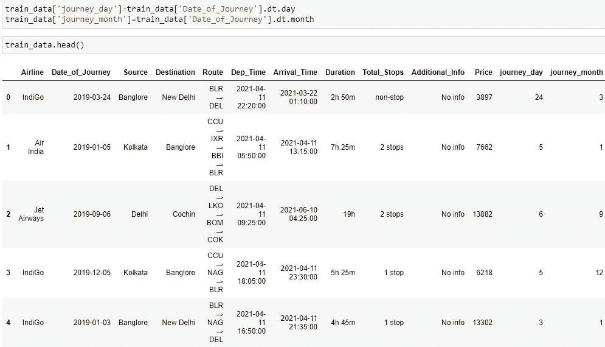*

*5.现在，我们将处理“Dep_time”和“Arrival_Time”功能，因为机器学习模型无法理解时间或日期。我们将从这两列中获取分钟和小时，如下所示:*

*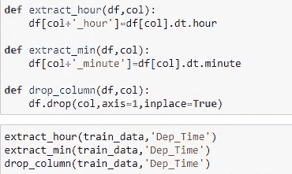*

*6.现在我们将处理“持续时间”列，因为在某些情况下，该列中没有小时(hr)项或分钟(m)项。我们将使用 split 函数，然后在需要的地方添加“0h”或“0m”。*

*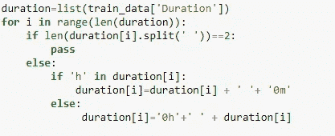**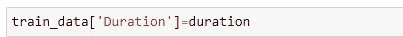*

*7.让我们使用 apply 函数将“持续时间”属性分为“持续时间 _ 小时”和“持续时间 _ 分钟”。*

*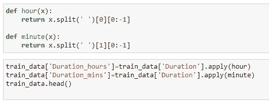*

*8.为了提取分类数据或连续特征，我们将迭代数据集中的每一列，无论谁拥有 datatype 对象，我们都将该列视为分类数据。*

*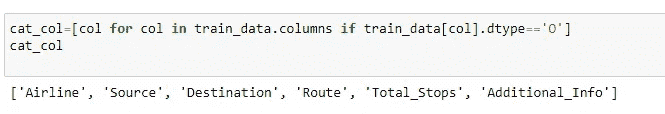*

*Categorical Data*

*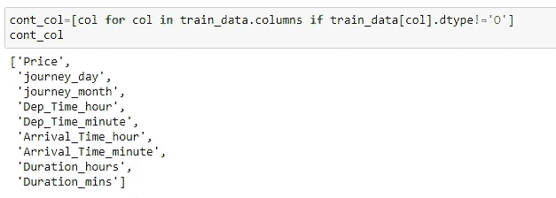*

*Continuous Data*

*9.现在，我们将处理分类数据，并基本上执行特征编码，因为机器学习只对数字数据有效。*

*首先，我们将绘制一个箱线图*

*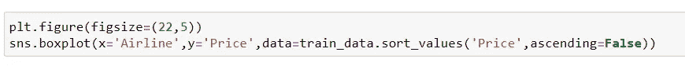**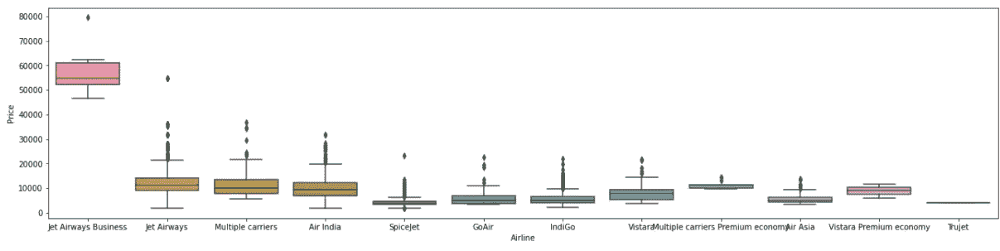*

*我们可以得出结论，Jet airways 的价格最高，而其他航空公司的价格几乎相同，波动很小。*

*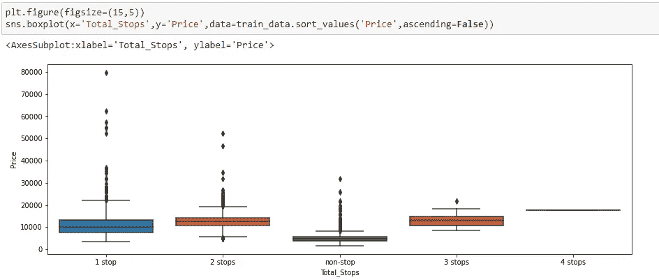*

*有 1 或 2 个停靠站的航空公司有很多异常值，因此它们的价格会有所不同。相反，有 4 个经停站的航空公司的价格没有波动。*

*10.在这里，我们将使用一个热编码将“航空公司”特性更改为整数格式*

*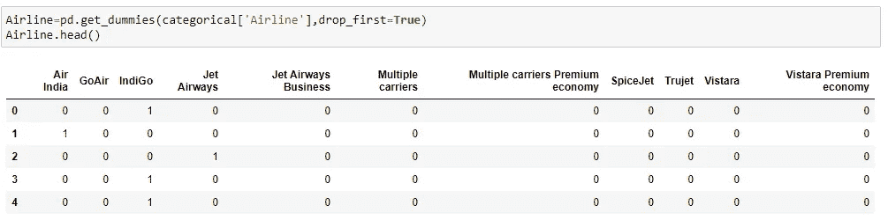*

*使用 get_dummies 函数将所有特征转换为整数值。*

*我们还将对“源”和“目的”列应用 get_dummies 函数。*

*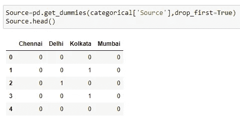**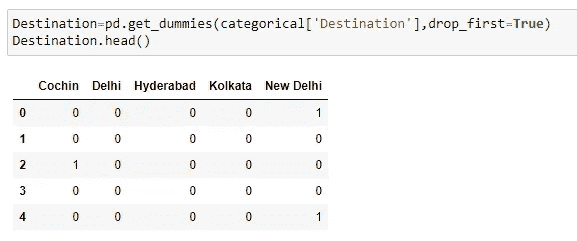*

*11.“路线”栏主要告诉我们他们从出发地到目的地经过了多少个城市。所以我们在分隔符的基础上拆分 Route 列，即(→)来提取信息。关于“Nan”值，我们将这些“Nan”值替换为“None”。*

*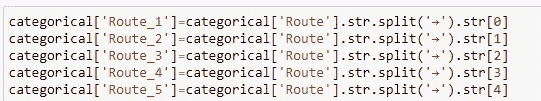**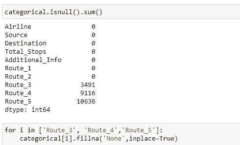*

*Filling ‘Route_3’ , ‘Route_4’ , ’Route_5' with None.*

*12.为了消除高维数的问题，我们将使用标签编码器类。*

*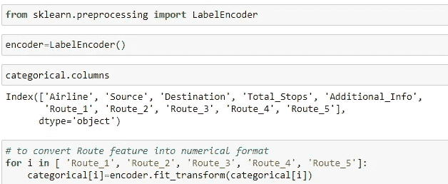*

*13.处理“Total_Stops”属性，并为“1 站”分配 1，为“2 站”分配 2，依此类推。*

*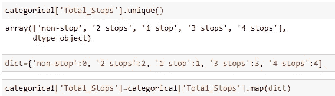**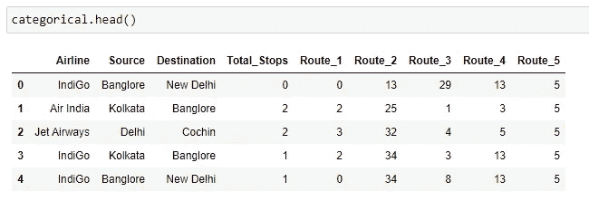*

*14.将分类数据帧与我们之前定义的所有数据帧连接起来。为此，我们将使用 pandas 库中的 concat()。此外，我们将删除数据中不必要的列。*

*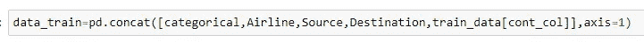*

*15.通过绘制子图、距离图和箱线图来检查“价格”列中的异常值。*

*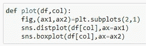**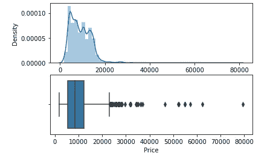*

*在有异常值的地方，中位数起着非常重要的作用。因此，我们将使用“where”函数将价格> 4000 的所有列替换为中值。*

*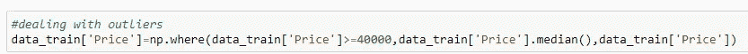**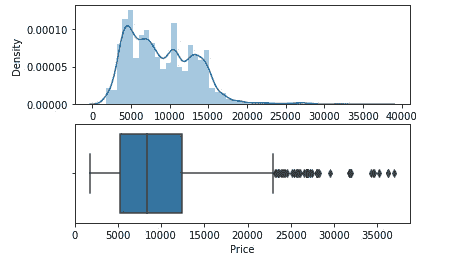*

*Minimized outliers*

*16.分离独立和从属特征。*

*现在，我们所有的数据在标签编码后都是数字，所以我们将数据分为测试和训练，并从测试集中删除价格列，因为我们必须用测试数据集预测价格*

*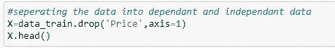**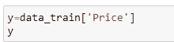*

***特征选择**无非是找到贡献最大且与目标值有良好关系的最佳特征。应用特征选择的主要原因是选择重要的特征，这样我们就不会面临多维度的问题。*

*我们将把独立数据和从属数据传递给 mutual_info_classif()函数。*

*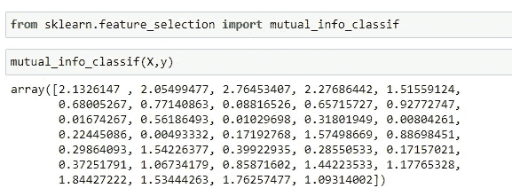**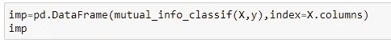**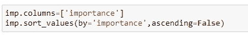*

*根据重要性对值进行排序，这样我们就可以知道哪个列的贡献最大，哪个属性的贡献最小。*

*17.将数据分为训练和测试数据。我们将 80%的数据用于训练，剩下的 20%用于测试。*

*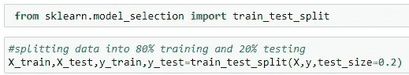*

*18.现在让我们定义一个函数来预测训练分数、预测值、r2 分数、平均绝对误差(MAE)、均方误差(MSE)和均方根误差(RMSE)。*

*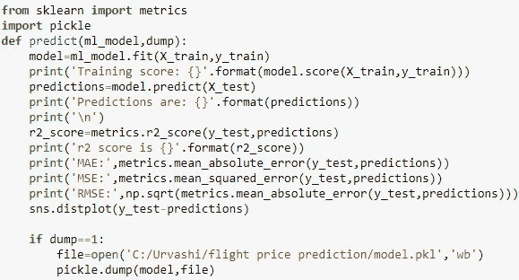**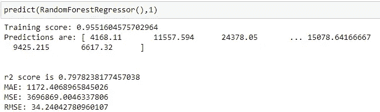**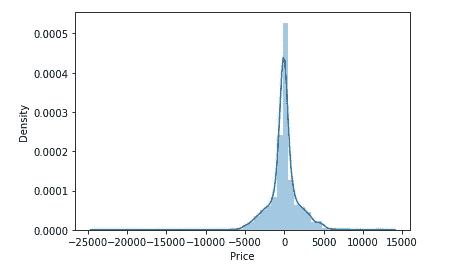*

*同样，我们可以测试不同的方法，如 LinearRegression()、DecisionTreeRegressor()、KNeighborsRegressor 等。*

*19.交叉验证我们的模型。这里我们将使用 RandomizedSearchCV*

*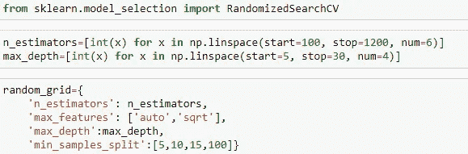*

*Creating a dictionary random_grid with all the parameters and we will pass this dictionary to RandomizedSearchCV*

*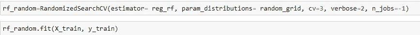*

*Fitting the data.*

*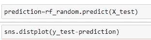*

*通过绘制分布图来预测 X_test 的值*

*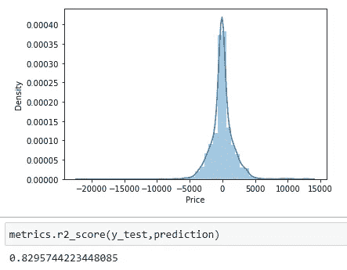*

*我们已经达到了大约 83%的准确率，但是之前当我们使用 RandomForest 时，准确率在 80%左右，这是模型超参数调整的结果。你可以在这个 Github [链接](https://github.com/urvashithakre/Flight-Price-Prediction-Using-Machine-Learning)中看到上传的 jupyter 笔记本的完整代码。*

*请让我知道你对这篇文章的想法，如果你面临任何问题，请发表评论。*