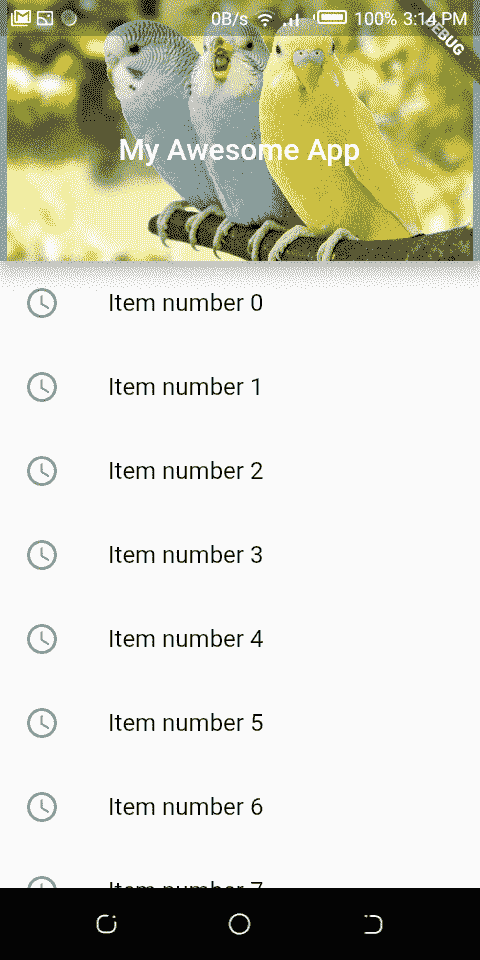
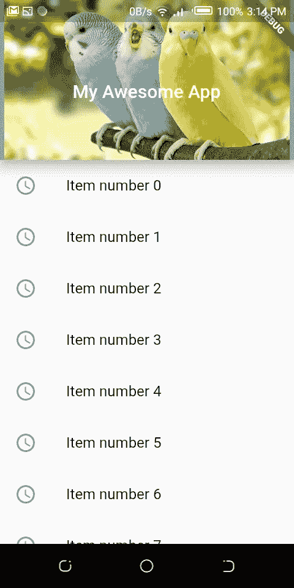

# 颤动中的浮动应用程序栏

> 原文：<https://medium.com/geekculture/floating-app-bar-in-flutter-6a5ac0cd35e7?source=collection_archive---------0----------------------->


有时候你有一个很长的列表和一个很大的显示图片的应用程序栏，但是让你的用户看到完整的列表是很痛苦的，不要再说了！本文将带您了解构建一个带有项目列表的可滚动应用程序栏的过程。

在这篇文章的最后，你将建立一个像这样的应用程序！



**CustomScrollView 小工具**

这个小部件负责呈现 SliverAppBar、SliverList、SliverGridView 等小部件。

slide 窗口小部件是 Flutter 中默认的可滚动窗口小部件，ListView 和 GridView 都是建立在 slide 窗口小部件之上的

**定义自定义滚动视图**

```
CustomScrollView (
  slivers: []
)
```

这个小部件允许您添加小部件，

**定义 SliverAppBar**

```
SliverAppBar(
 title: Text("My Awesome App"),
 expandedHeight: 150, //the expanded height of the app bar
)
```

这个基本部件创建了一个简单的应用程序栏，如下所示


你也可以添加更多的属性

```
floating: true,
elevation: 10.0,
backgroundColor: Colors.grey,
toolbarHeight: 150, //the actual height of the appBar
flexibleSpace: Image.asset("assets/images/bird.jpg")
```


**添加 SliverListView**

最后一步，我们将添加一个 SliverListView 小部件

```
SliverList(
 delegate: 
  SliverChildBuilderDelegate((context, index) => 
   ListTile(
      leading: Icon(Icons.access_time),
      title: Text("Item number $index")
   ),
   childCount: 100)
)
```

这将创建 100 个列表项，并将只显示一个标签，请记住，一切都是小部件，所以我们可以在列表中添加我们想要的任何东西，它将与应用程序栏滚动。

现在把它们放在一起！



我希望你喜欢这个浮动演示的旅程！

