# 利用卫星图像进行洪水影响分析

> 原文：<https://medium.com/geekculture/flood-influence-analysis-with-satellite-imagery-f378ac4642dc?source=collection_archive---------3----------------------->

## 用卫星数据探测和监测洪水泛滥地区

2021 年 7 月 15 日发生的洪水是一场严重的灾难，其影响波及到了国外。7 月 14 日，荷兰皇家气象研究所认为，由于暴雨，林堡省面临被淹没的重大风险(也称为红色预警)。然而，就在下雨之前，他们对危险的估计没有那么悲观。

洪水有第五级危险。它在同一天袭击了该省，由于设备故障造成电力中断。在此期间，一天的降雨量为 100 毫米(3.9 英寸)，三天的降雨量为 200 毫米(7.9 英寸)。获救的公民报告说，甚至缺乏必要的供应，如食品供应。

哥白尼应急管理服务(CEMS)发布了一份[的简短报告](https://emergency.copernicus.eu/mapping/sites/default/files/files/IB_144_EMSR517-EMSR518-EMSR519-EMSR520_Flood%20in%20Germany%2C%20Belgium%2CSwitzerland%20and%20The%20Netherlands_0.pdf)调查遭受暴雨袭击的地区。马斯河收到了大量的水，暴雨导致下游河水水位上涨。CEMS 还提供了与此次活动相关的[地理信息](https://emergency.copernicus.eu/mapping/list-of-components/EMSR520)。我们可以在图 1 中看到蓝色的洪水淹没区域。图中的其他形状是当地城镇基础设施和建筑占用的土地。

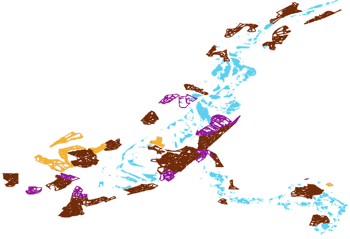

Figure 1\. Visualization of flooded areas in the investigated region

截至 7 月 21 日，该地区的居民仍然服从疏散命令，灾难的后果并没有消除。在此之后，2000 多所房屋被认为不适合居住。

更糟糕的是，结果是德国和比利时。在图像中，你可以看到遭受洪水的城市和几个田地。

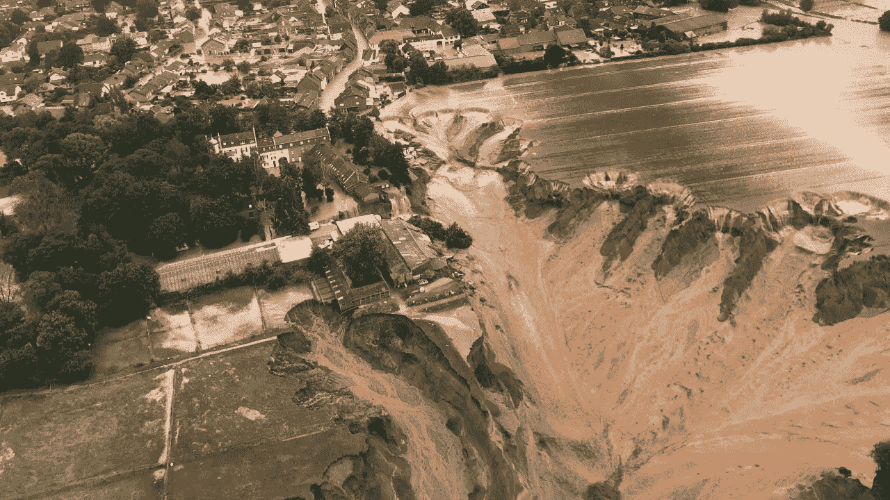

Picture 2\. The city and fields are suffering from flooding. Source: CNN

从卫星图像处理的角度来看，在灾难的确切后果方面，除了研究一种特殊的气候现象之外，几乎没有什么可做的。几乎不变的云量在事件发生后的近两个月和之前的近一个月都是阴云密布。灾难应对项目和气候科学家应该研究这样一种现象。

# 对农业部门的影响

据欧盟农民协会 COPA-COGECA 称，这一事件对农业部门造成了严重破坏，预计会出现收成中断，受影响最严重的仍然是德国和比利时。洪水造成了严重的土壤侵蚀。水果和蔬菜植物实际上被认为是消失了。

除了空旷的田野，德国园艺公司 Gartenbau-Versicherung 报告说，许多温室被超过 3 米的水淹没，摧毁了至少一些收获的希望。

“现在说(对欧洲而言)还为时过早，但林堡省种植的作物已经失传。德国 Pfalz 地区是每年这个时候的主要产区。损失有多大，到目前为止，没有任何迹象。肯定会有问题，但有多大，没人知道。”荷兰一家颇具影响力的水果和蔬菜农业控股公司 Staay-Hispa Papendrecht 的商务总监 Nico Veldhoen 说。

根据世界气象组织的说法，洪水对整个生态系统有一些好处。根据具体的土壤成分，它可以增加土壤肥力，增强生物多样性。然而，必须考虑每个地区的具体情况。

# 数据

我们决定使用我们的自动化地理空间分析平台来分析洪灾地区。关于最近欧洲洪水演进图边界检测模型的研究事项已应用于荷兰的洪水区域。

我们通过检测感兴趣区域内被淹没的部分开始了我们的研究。我们用哨兵 1 号探测洪水。遗憾的是，没有卫星图像数据覆盖所有调查区域。我们使用了两次捕获:7 月 12 日(洪水前三天)和 7 月 18 日(洪水后三天)。

为了分析洪水对农作物的影响，我们使用了 Sentinel-2 数据。

值得强调的是，灾难前后最接近的日期在时间上相距甚远；也就是说，在 6 月 1 日和 8 月 25 日发现了几乎没有云百分比的 Sentinel-2 瓦片，而暴雨发生在 7 月 15 日。然而，在 7 月 21 日有一个半多云的图像。

需要指出几个问题:

*   通常情况下，欧洲国家的油田面积相当小；当可视化时，每个场都是高度像素化的。
*   一些田地几乎没有受到洪水的影响。对于其他人来说，异常的实际原因和性质可以假设是由于洪水；仍然存在不确定性。

在图 3 中，我们可以看到调查区域两个日期的 TCI(真彩色图像):6 月 1 日(洪水前的日期)和 8 月 25 日(洪水后的日期)。栅格图像位于 Sentinel-2 卫星的 31UGS 切片中。分析的总面积约为 80 平方英尺。公里。该数据是从我们的平台上使用 TCI_NDVI 选项在选定的地区获得的。

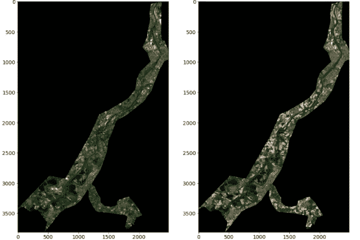

Figure 3\. TCI rasters, left — 1st of June, right — 25th of August

# 分析

为了检测 AoI 内的洪水区域，我们比较了洪水前后 Sentinel 的遥感数据。在图 4 中，您可以看到红色区域——洪水过后检测到的最多的水。

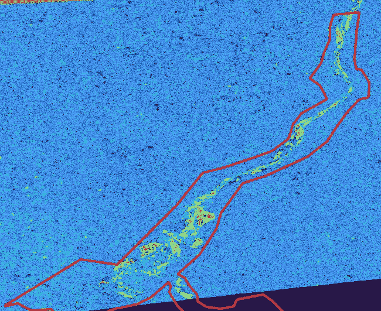

Figure 4\. Flooded areas. Red Line — investigation area.

我们使用服务中的神经网络处理器执行[田地边界检测](https://quantumobile.com/rd-blog/crop-field-boundary-detection-approaches-and-main-challenges/)，这可以帮助农民和政府分析田地使用情况。

我们比较了洪水前后的田地。地块边界检测管道分别为 7 月 1 日和 8 月 25 日拍摄的图像生成了 1503 和 1357 个区域。正如你所看到的，探测到的区域数量减少了，所以我们可以假设一些区域被毁坏了，并被合并到卫星图像中。通过这种方式，我们可以认识到灾难的规模。

根据收到的数据，我们提出了几个假设(对于每个假设，有几个示例显示为 5 个图像:1，2-之前/之后的真彩色，3，4-之前/之后的场形状，5-场区域的交集):

1.  一些田地在洪水过后还残留着小块的水，或者由于湖水泛滥而萎缩了。在图 5 中，您可以看到这些区域的例子。

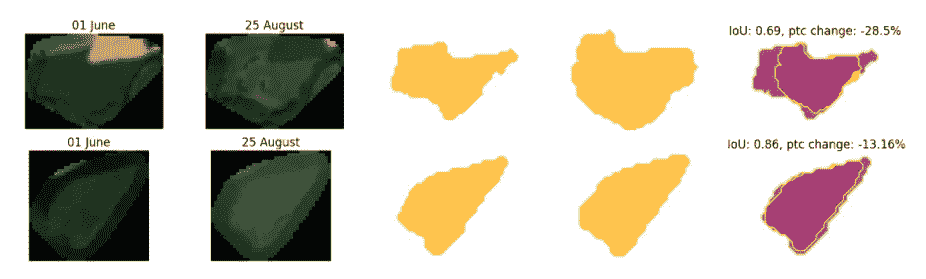

Figure 5\. Partly flooded fields.

2.在图 6 中，在某些区域可以观察到一些类似侵蚀的现象。

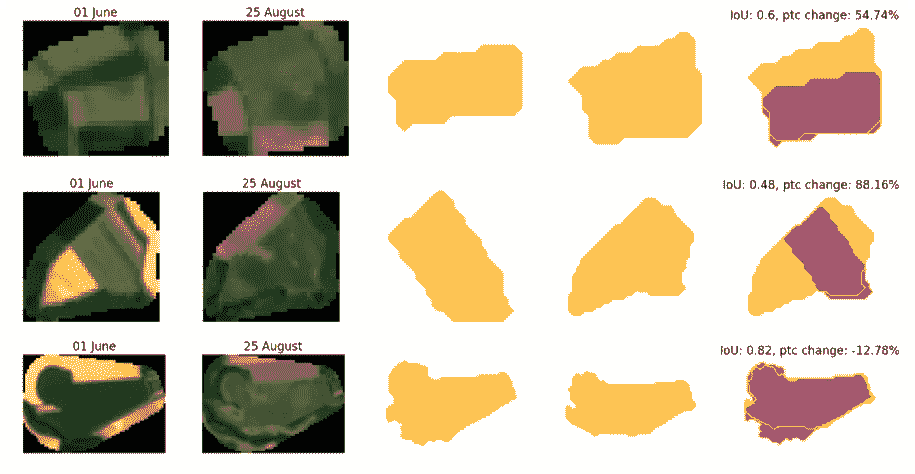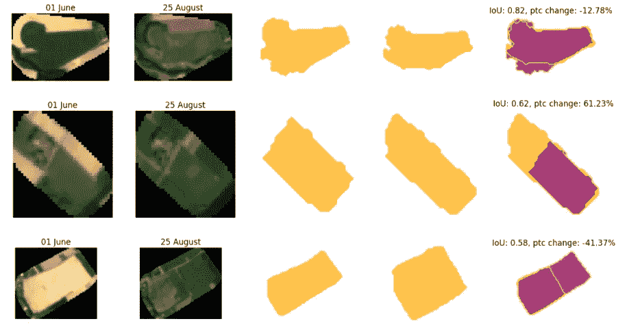

Figure 6\. Fields with erosion

3.由于与洪水无关(或不直接相关)的其他事件，一些区域改变了它们的形状和/或内容。示例如图 7 所示。

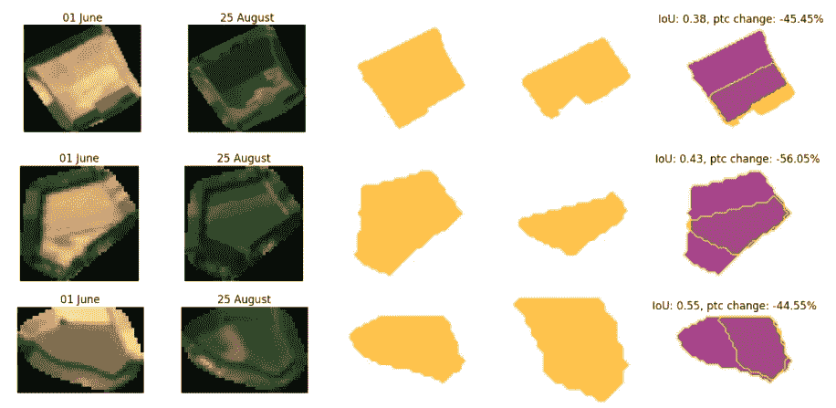

Figure 7\. Changes in field boundaries due to other events

在这里，一些田地甚至在洪水过后一个月仍然积水。

洪水过后三天，我们用一张洪水淹没区的地图计算了被淹田地的数量。灾难发生后，我们检测到 51 块田地被淹。在图 8 中，您可以看到淹没的(蓝色)和未淹没的(红色)字段。

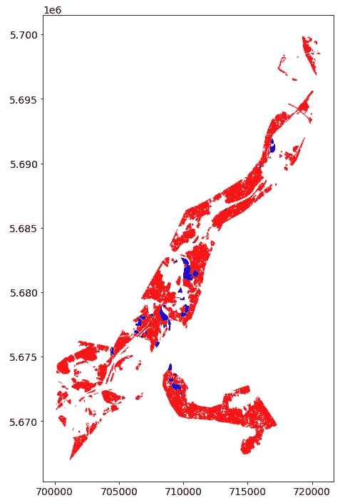

Figure 8\. Field boundaries with flooded fields (blue).

我们的目标是确定植物是否受到洪水的胁迫。我们的平台提供了在每个领域检测植物胁迫的功能。植物胁迫是 NDVI(归一化差异植被指数)的异常。NDVI 是一个无量纲的指数，它描述了植被覆盖的可见光和近红外反射率之间的差异，可以估计一片土地上的绿色密度。我们计算并比较了被洪水淹没的田地和未受洪水影响的田地的平均植物应力。在图 9 中，你可以看到平均植物应力的分布。

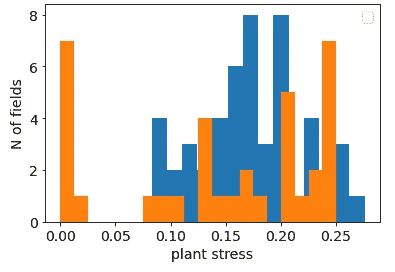

Figure 9\. Mean plant stress distribution on the 21st of July. Orange — flooded fields, blue — non-flooded fields

如你所见，分布是完全不同的。水淹油田主要有两种类型——无应力和比其他油田更有应力。这是因为被淹没的土地上有水，所以由于水的存在，NDVI 几乎没有变化或者压力更大。

在获得这样的分布之后，我们决定在一个月内(8 月 25 日)比较相同的字段。在图 10 中得到的分布。这里我们可以看到分布几乎相同。使用 Kolmogotov-Smirnov 检验对分布进行比较，并以 0.05 的阈值成功通过。然而，我们可以看到，总的来说，有更多的领域具有更显著的植物胁迫。

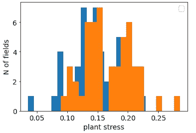

Figure 10\. Mean plant stress distribution on 25th of July. Orange — flooded fields, blue — non-flooded fields

# 结论

1.  使用我们平台的地块边界分析表明洪水的影响，如局部小水体，甚至在洪水后一个月。
2.  观察到土壤退化现象。虽然这样的灾难是水侵蚀最可能的解释，但是还需要更多的证据来证明洪水事件是水侵蚀出现的唯一原因。
3.  洪水过后一个月，当地的水体(湖泊)似乎已经泛滥。
4.  Sentinel-1 图像有助于准确探测洪水淹没的地区和田地。
5.  植物压力可以作为确定农田水分的一个指标。
6.  洪水过后一个月，植物可以正常生长。