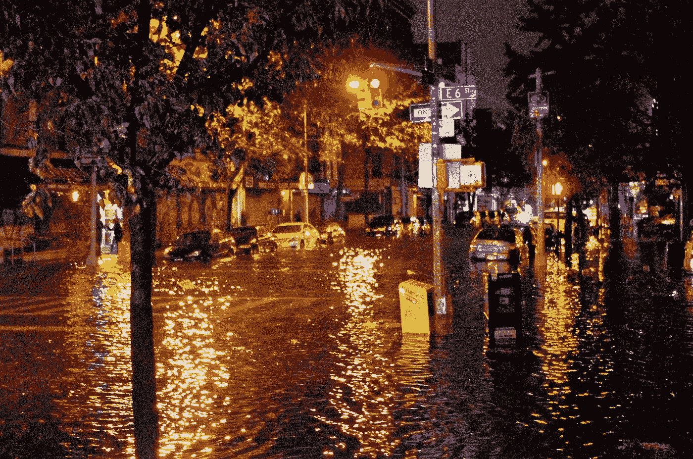

# 洪水灾害:新常态

> 原文：<https://medium.com/geekculture/flooding-the-new-normal-d3ca393b28fc?source=collection_archive---------13----------------------->

## 洪水似乎越来越严重，导致数据不可靠。过去的百年一遇的洪水可能要重新定义为十年一遇的洪水

Flooding in New York City (source: [Wikimedia](https://commons.wikimedia.org/wiki/File:Hurricane_Sandy_Flooding_Avenue_C_2012.JPG))

作为一名大型项目专家，我参与了世界上一些最大的基础设施投资项目。我一再发现洪水风险被低估了，因为所谓的…