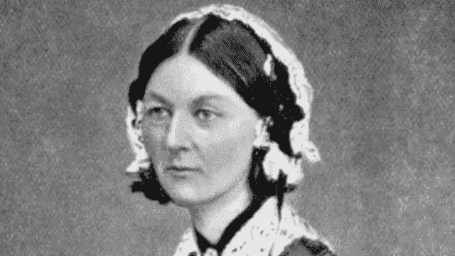

# 弗洛伦斯·南丁格尔:短篇小说

> 原文：<https://medium.com/geekculture/florence-nightingale-a-short-story-10e20ea32f04?source=collection_archive---------21----------------------->

Jess.sweeney, CC BY-SA 4.0 <[https://creativecommons.org/licenses/by-sa/4.0](https://creativecommons.org/licenses/by-sa/4.0)>, via Wikimedia Commons

## 使用数据可视化传播卫生习惯并永远改变护理的 19 世纪女性

# 她为什么重要？

如果你不是来自英国，你可能从未听说过她，但她在数据可视化和卫生领域做出了重要贡献，是一个例子…