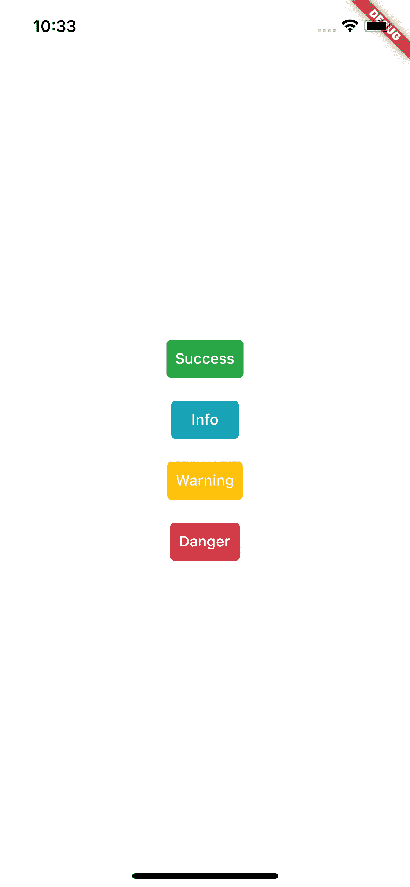

# 扑 3:如何扩展主题数据

> 原文：<https://medium.com/geekculture/flutter-3-how-to-extend-themedata-56b8923bf1aa?source=collection_archive---------0----------------------->

在 2019，我写过[一篇关于利用](https://crizantlai.medium.com/flutter-how-to-extend-themedata-b5b987a95bb5)`[Extension methods](https://dart.dev/guides/language/extension-methods)`扩展 flutter `ThemeData`类的文章。在我看来，这只是一种变通办法；它有一些缺点，而且不是很优雅。随着 Flutter 3.0 的发布，它带来了一个更好的解决方案:`[ThemeExtension](https://api.flutter.dev/flutter/material/ThemeExtension-class.html)`类。

# 新的解决方案

我们将制作自助调味配色方案，就像上次一样:

