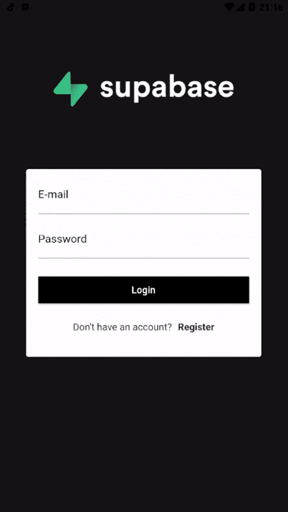
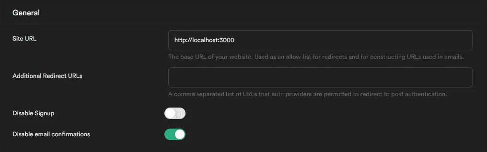
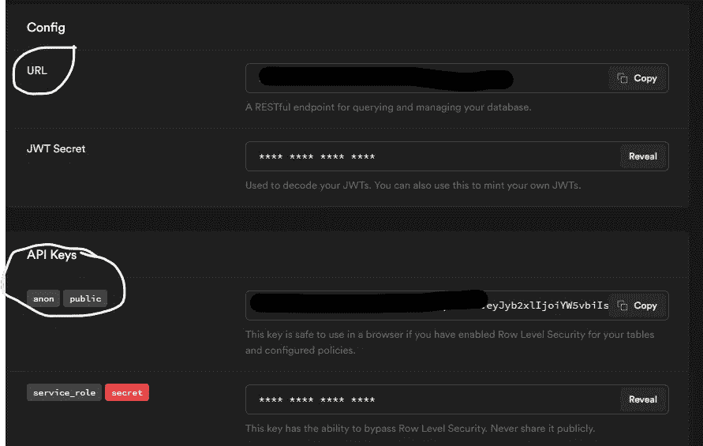
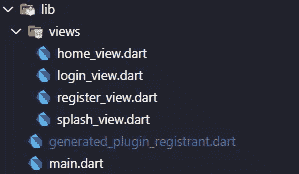

# 使用 Supabase(开源 Firebase 替代方案)的 Flutter 认证流程

> 原文：<https://medium.com/geekculture/flutter-authentication-flow-with-supabase-opensource-firebase-alternative-438646c5703a?source=collection_archive---------14----------------------->

Supabase + Flutter

# 介绍

[Supabase](https://supabase.io/) 是一个开源的 Firebase 替代方案，它提供了身份验证、与 API/实时 API 集成的关系(Postgres)数据库、文件存储以及更多即将推出的功能。

在这篇文章中，我们将建立一个简单的用户注册/登录应用程序(从零开始！)使用 Supabase 认证和 Flutter。

本指南结束时，您将拥有一款允许用户注册并登录 supabase 的应用程序:

无论何时你在任何一点被卡住，看看[这个回购](https://github.com/fabiojansenbr/supabase_flutter)。

# 项目设置

在我们开始建设之前，我们要建立我们的 Supabase 帐户。

1.  转到 [app.supabase.io](https://app.supabase.io) 。
2.  使用您的 Github 帐户登录。
3.  点击“新建项目”。
4.  输入您的项目详细信息。
5.  等待新数据库启动。

为了简化流程，让我们取消 supabase 门户网站上的电子邮件确认限制。

现在你已经设置了你的 Supabase 帐号，你可以登录并注册你的用户了。我们只需要从 API 设置中获取`URL`和`anon`键。

# 构建 Flutter 应用

让我们从头开始构建 Flutter 应用程序。

在终端上:

然后在你喜欢的编辑器上打开 supabase_flutter 文件夹。

## **项目设置:**

在开始之前，让我们创建项目文件夹结构和视图文件

*   在 lib 文件夹中，创建一个名为“views”的文件夹
*   在“views”文件夹中，创建 4 个文件(home_view.dart、login_view.dart、register_view.dart 和 splash_view.dart)

这是我们最终的文件/文件夹结构:

folder strucutre

现在，在我们的终端上，让我们安装一些依赖项来帮助我们:

*   [Supabase —用于颤振的 Supabase 客户端](https://pub.dev/packages/supabase)
*   [get_it —帮助我们在页面上注入 Supabase 客户端的服务定位器](https://pub.dev/packages/get_it)
*   [shared_preferences —在我们的应用程序上保留用户会话](https://pub.dev/packages/shared_preferences)

并检查 pubspec.yaml 文件(软件包版本可能与我的不同):

让我们打开 **main.dart** 文件，将 Supabase 客户端设置为单例实例，并配置应用程序路由:

*   别忘了把 **SUPABASE_URL** 和 **SUPABASE_ANON_KEY** 改成之前生成的 URL 和 KEY。

在 main()方法中，我们创建了 supabaseClient 的单例实例，使用 supabase_url 和 supabase_anon_key 将该项目与我们的 Supabase 帐户链接起来。在 MyApp 方法中，我们定义了应用程序的路径。

## 注册视图:

打开 register_view.dart 文件并放置以下代码:

在这个视图中，我们定义了树 TextFormField()、email、password 和 password confirm，以及一个 _register()方法，该方法将在按下 register 按钮时被调用。

当按下 Register 按钮时，将调用 SupabaseClient 的一个实例，并使用提供的电子邮件和密码字段调用方法. auth.signup。

如果 result.data 不同于 null，我们将被重定向到登录视图，并显示一个对话框。如果我们在注册时遇到一些问题，比如重复的电子邮件字段，就会出现一个错误对话框，显示注册错误消息。

## 登录视图:

打开 login_view.dart 文件并放置以下代码:

在这个视图中，我们定义了两个 TextFormField()、email 和 password 以及一个 _login()方法，当按下 login 按钮时将调用这个方法。

当单击登录按钮时，将调用 SupabaseClient 的一个实例，并使用提供的电子邮件和密码字段调用方法. auth.signin。

如果 result.data 不同于 null，我们将使用 shared_preferences 用 signin 方法返回的 persistSessionString 的值设置一个字符串“user”键。

该密钥将在 SplashView 上使用(我们将在接下来的步骤中创建该密钥),以检查用户是否已经登录到应用程序，并将用户重定向到 HomeView 并更新 Supabase 凭据(令牌),而无需再次登录。

## 主页视图:

这个观点很简单。只有一个 Text()小部件显示登录用户的电子邮件和一个注销按钮。

在 build()方法中，我们使用`final currentUser = GetIt.instance<SupabaseClient>().auth.user();`获取当前登录的用户，并使用 currentUser.email 属性在屏幕上显示用户的电子邮件。

_logout()方法负责将用户从 Supabase 服务器注销，并清除 shared_preferences，以便用户需要再次登录。

## 飞溅视图:

正如我之前提到的，Splash 视图将是我们应用程序的入口点路径('/')。它将检查用户是否已经在应用程序上有一个会话。如果有一个会话，用户将被重定向到主视图，他们的凭证将在 Supabase 服务器上更新。如果会话不存在，用户将被重定向到登录视图。

在这个阶段，您已经有了一个功能齐全的应用程序！让我们在仿真器/设备上运行应用程序:

* *一些设计模式可以用来使代码更好，但是它们会增加本文的难度。

# 后续步骤

*   有问题吗？[问这里](https://github.com/supabase/supabase/discussions)或者回复本文。
*   登录:app.supabase.io