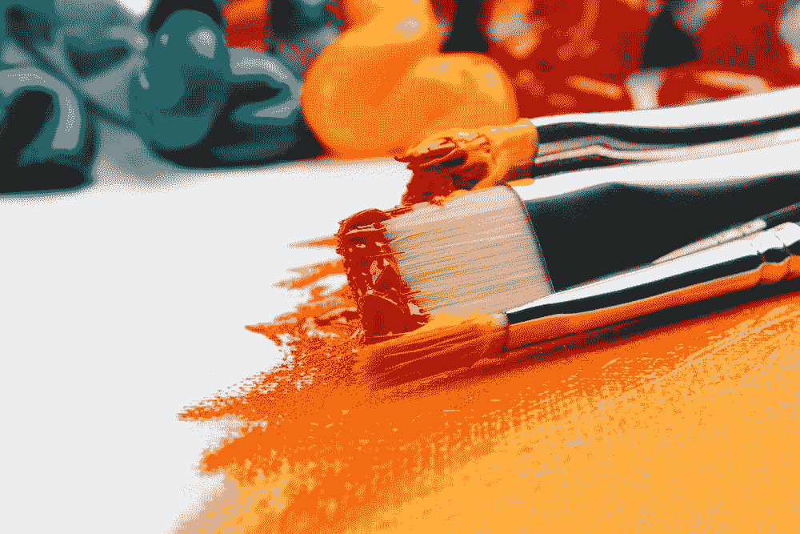
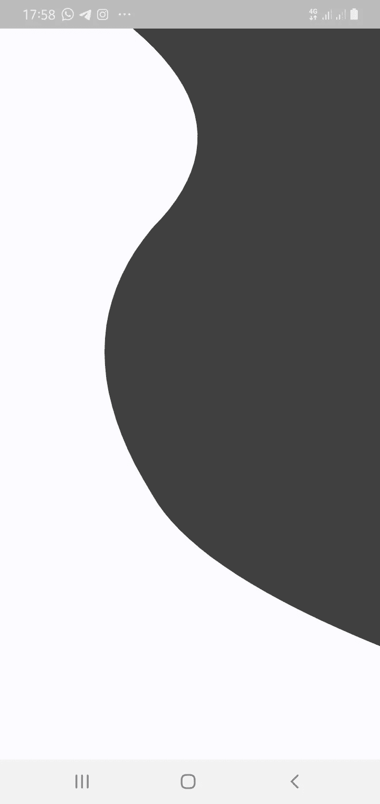
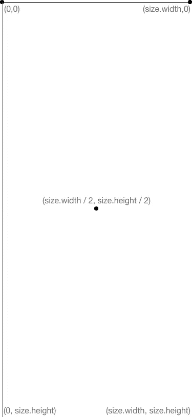

# 颤动:自定义绘画

> 原文：<https://medium.com/geekculture/flutter-custom-paint-27c4aba498?source=collection_archive---------22----------------------->



Image from [Unsplash](https://images.unsplash.com/photo-1513364776144-60967b0f800f?ixid=MnwxMjA3fDB8MHxzZWFyY2h8MXx8YXJ0JTIwYnJ1c2h8ZW58MHx8MHx8&ixlib=rb-1.2.1&w=1000&q=80)

在 flutter 中，一些 UI 设计不能从常规的 shapes 小部件中派生出来。这就是定制油漆发挥作用的地方。Custom Paint 是一个小部件，它为您提供了一个画板(称为`canvas`)、一个画笔(称为`paint`)、一个画板大小(称为`size`)和一个用于绘制形状的`path`。

> 在本文中，我们将学习如何利用自定义绘图在 flutter 应用程序中绘制自定义形状。这会让你的 UI 更有吸引力。

在本文的最后，我们将从下面的图片中获得结果。您可以在本文末尾找到 Github 源代码。



final output

让我们设置我们的 flutter 应用程序。

创建一个新的颤振项目`custompaint`

```
 import 'package:flutter/material.dart';import 'package:custompaint/home.dart';void main() {
  runApp(MyApp());
}

class MyApp extends StatelessWidget {
  const MyApp({Key? key}) : super(key: key);

  @override
  Widget build(BuildContext context) {
    return MaterialApp(
      title: 'Drawing Custom shapes',
      debugShowCheckedModeBanner: false,
      home: Home(),
    );
  }
}
```

**接下来，创建** `Home` **属性。**

```
class Home extends StatefulWidget {
  const Home({Key? key}) : super(key: key);

  @override
  _HomeState createState() => _HomeState();
}

class _HomeState extends State<Home> {
  @override
  Widget build(BuildContext context) {
    return Scaffold(
      body: SafeArea(
        child: SingleChildScrollView(
          child: Container(
            height: MediaQuery.of(context).size.height,
            width: MediaQuery.of(context).size.width,
            color: Color(0xfffbfaff),
            child: CustomPaint(
              painter: BackgroundPaint(),
            ),
          ),
        ),
      ),
    );
  }
}
```

我们将应用程序包装成一个`Container`，并将其背景设置为定义的颜色。然后我们有了把`BackgroundPaint()`当做`painter`的`CustomPaint`。

`BackgroundPaint()`是一个自定义类，我们将创建它来包含我们的绘图。

## 自定义绘画类别

下面是绘图的类结构。

```
class BackgroundPainter extends CustomPainter {
  @override
  void paint(Canvas canvas, Size size) {
    var paint = Paint();
    // *TODO: Set properties to paint* var path = Path();

    // *TODO: Draw your path* canvas.drawPath(path, paint);
  }

  @override
  bool shouldRepaint(CustomPainter oldDelegate) => true;
}
```

该类提供画布、路径、大小和绘画。使用下图更好地理解`size`变量。



image depicting size variable

我们的设计希望从应用程序宽度的 25%开始绘制曲线，并在应用程序高度的 85%处结束曲线。然后，把它排好，画出路径。

**接下来，创建** `CustomPainter` **属性**

```
class BackgroundPaint extends CustomPainter {
  @override
  void paint(Canvas canvas, Size size) {
    // *TODO: implement paint* final height = size.height;
    final width = size.width;

    Paint paint = Paint()
      ..style = PaintingStyle.fill
      ..isAntiAlias = true
      ..color = Color(0xff404040);

    Path myPath = Path();

    myPath.moveTo(width * 0.25, 0);

    //myPath.quadraticBezierTo(
    //width * 0.70, height * 0.20, width * 0.40, height * 0.35);
    myPath.quadraticBezierTo(
        width * 0.7, height * 0.15, width * 0.4, height * 0.3);
    myPath.quadraticBezierTo(
        width * 0.15, height * 0.45, width * 0.4, height * 0.65);
    myPath.quadraticBezierTo(
        width * 0.51, height * 0.75, width * 1, height * 0.85);
    //myPath.quadraticBezierTo(
    //width * 0.2, height * 0.75, width * 1, height * 0.75);
    myPath.lineTo(width * 25, 0);
    myPath.lineTo(width, 0);

    canvas.drawPath(myPath, paint);
  }

  @override
  bool shouldRepaint(covariant CustomPainter oldDelegate) => true;
}
```

## 代码解释

首先，我们创建了两个变量(高度和宽度),并将它们分配给应用程序的高度和宽度。然后，我们定义我们的`paint`,给它一个颜色和填充样式来填充绘制的`path`。

接下来，我们定义了`path`并提供了绘制设计的方法。

`moveTo()`方法有两个参数:x 和 y。我们从 25%(0.25)的宽度开始，高度为 0。

`quadraticBezierTo()`方法采用四个参数(X1，Y1，X2，Y2)。控制点是 X1 和 Y1。最后一点是 X2 和 Y2。

```
myPath.quadraticBezierTo(
        width * 0.7, height * 0.15, width * 0.4, height * 0.3);
```

这里，`quadraticBezierTo()`取 X1 =宽* 0.7，Y1=高* 0.15 为控制点，然后画一条曲线到点(X2 =宽* 0.4，Y2 =高* 0.3)。

最后，我们需要将`path`排成一行，用我们的`paint`填充它。

```
myPath.lineTo(width * 25, 0);
    myPath.lineTo(width, 0);
```

`lineTo()`方法取两个参数:X 和 Y，这里`lineTo()`从 point (X = width * 25，Y = 0)开始，用 point (X = width，height = 0)排到最后。

然后，我们调用`cavas`来使用我们定义的`path`和`paint`绘制路径。

```
canvas.drawPath(myPath, paint);
```

结果:


final result

*让我与你分享我的小秘密*😉😊

> 当使用自定义油漆时，请确保绘制出您的设计草图。这将为您节省大量调试时间😰。

查看源代码[这里](https://github.com/funmi-cod/custompaint)。

在下一篇文章中，我们将利用 Stack 为这个设计添加更多的功能。在那里见😊！

❤ ❤谢谢你坚持到最后。❤❤

