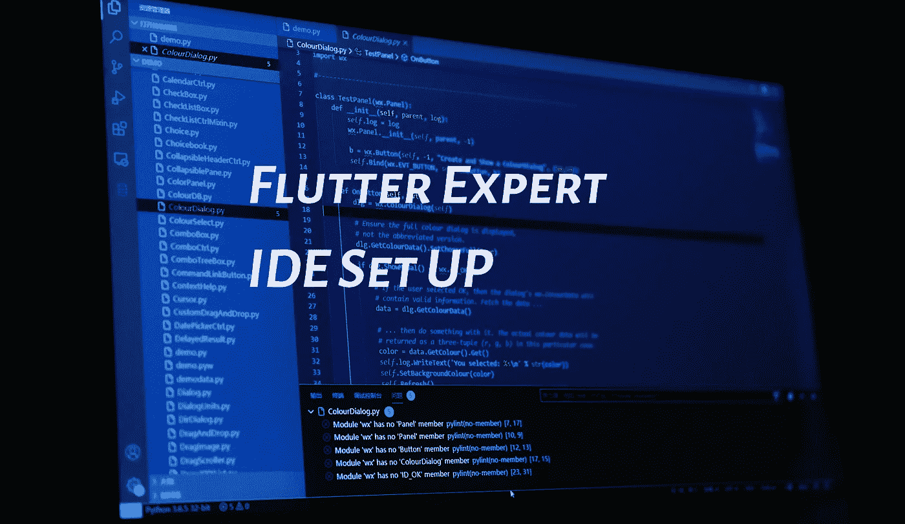

# 颤振专家 IDE 设置

> 原文：<https://medium.com/geekculture/flutter-expert-ide-set-up-25791ce690c?source=collection_archive---------7----------------------->

Photo by [Riku Lu](https://unsplash.com/@riku?utm_source=unsplash&utm_medium=referral&utm_content=creditCopyText) on [Unsplash](https://unsplash.com/s/photos/ide?utm_source=unsplash&utm_medium=referral&utm_content=creditCopyText)

抱歉 Google，最好的 flutter 开发 IDE 是 MS 的 Vscode。作为一个节点，IDE 是开发人员工具的未来。我将向你展示一个非常固执己见的 IDE 设置，让你成为一个更有效的 flutter 应用程序开发人员。

# **背景**

问题是，虽然谷歌在向你介绍小工具方面做得很好；你真正需要掌握的不是技术…