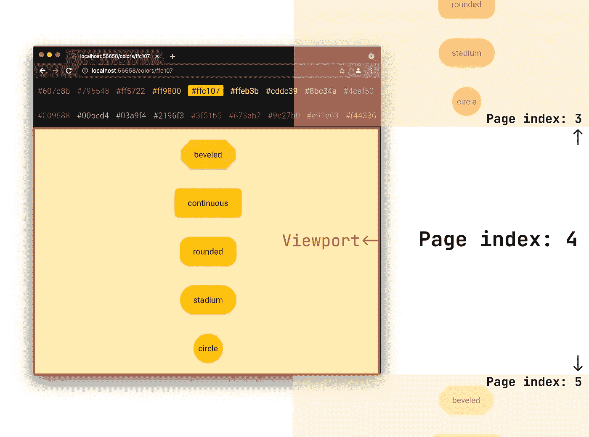
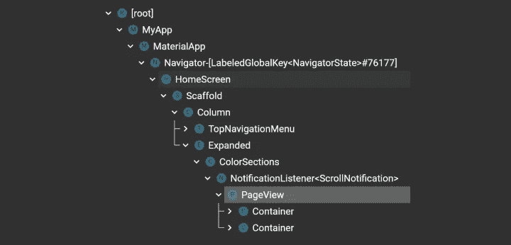
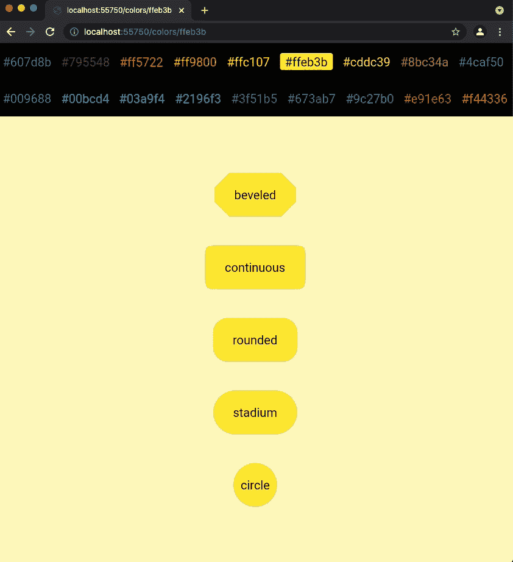
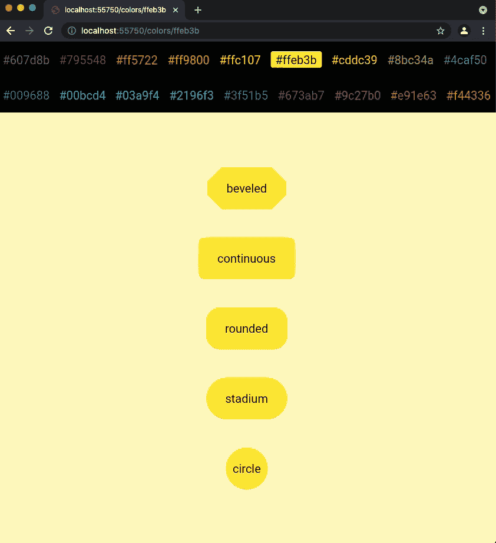
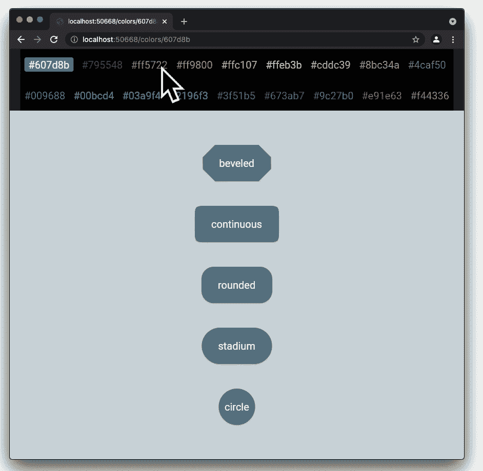
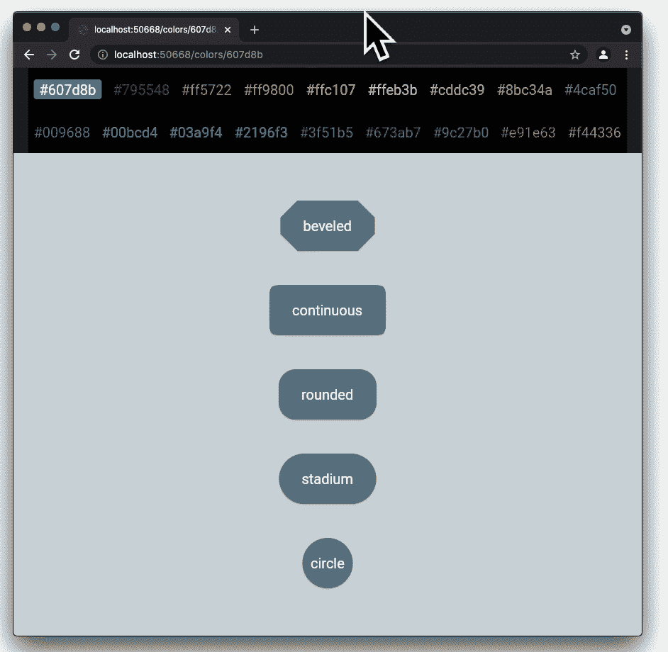
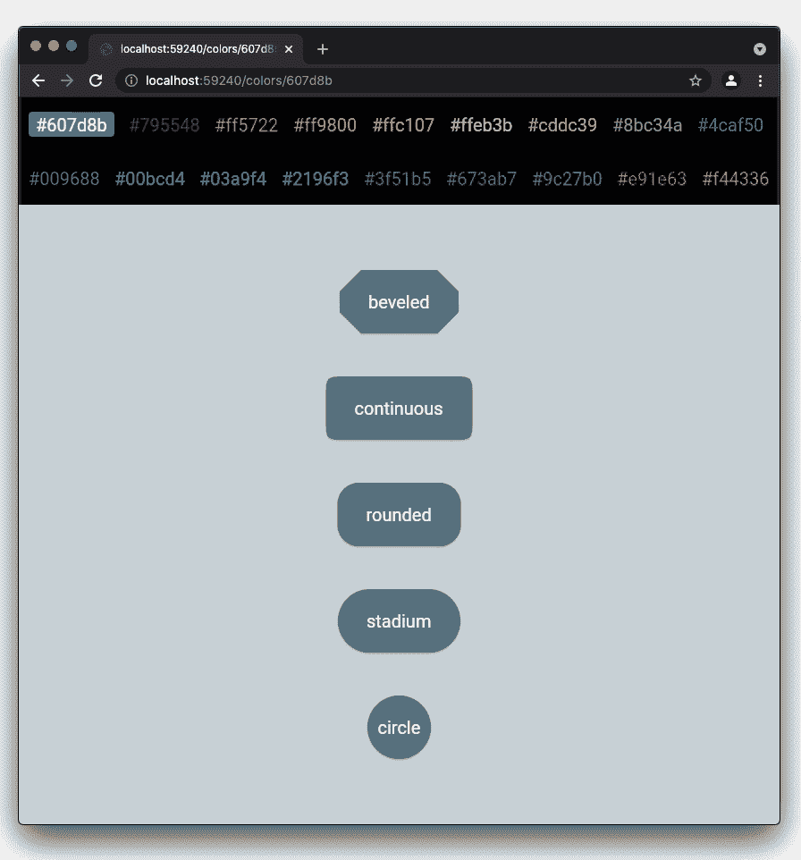
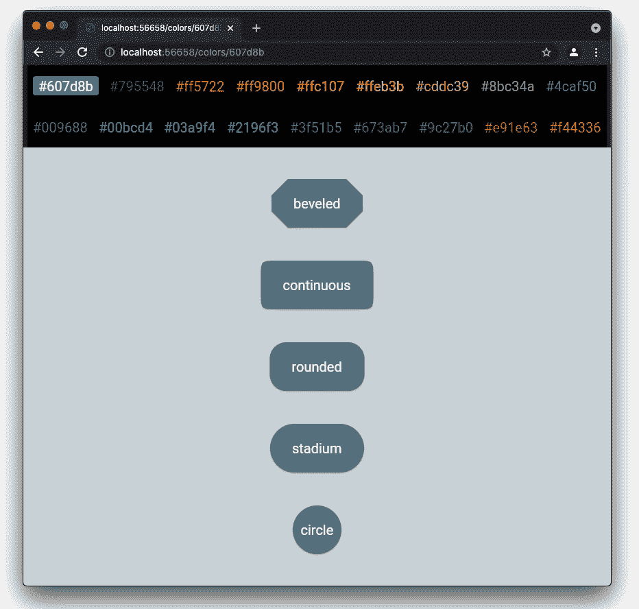
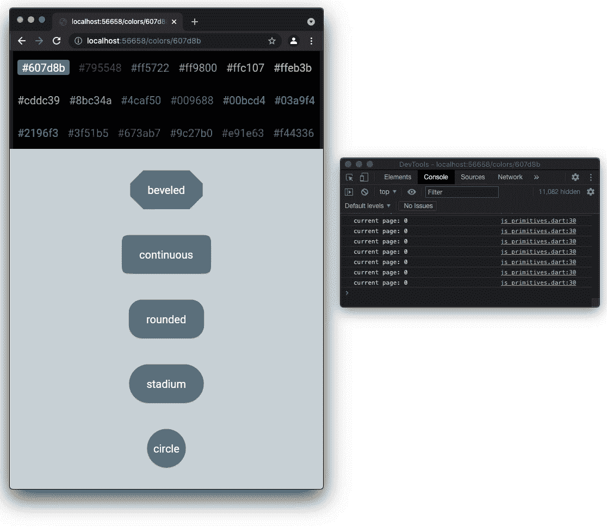
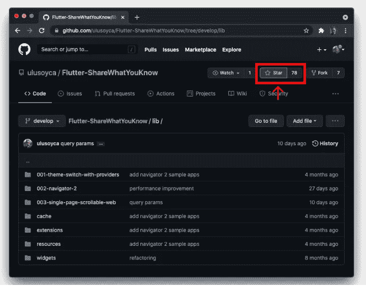

# Navigator 2.0 下的单页滚动网站——第三部分:滚动到页面

> 原文：<https://medium.com/geekculture/flutter-for-single-page-scrollable-websites-with-navigator-2-0-part-3-scroll-to-page-30b6c43bd41?source=collection_archive---------7----------------------->

在本系列的第二部分[，](https://ulusoyca.medium.com/flutter-navigator-2-0-for-authentication-and-bootstrapping-part-1-introduction-d7b6dfdd0849)中，我们讨论了使用`[ListView](https://api.flutter.dev/flutter/widgets/ListView/ListView.builder.html)`构建一个**单页可滚动网站** (SPSW)，该网站的各个部分是延迟构建的(按需)，并且具有相同的高度。在本文中，示例应用程序将与之前的应用程序非常相似，只有一点不同:在`ColorSections`小部件中，我们将使用`[PageView](https://api.flutter.dev/flutter/widgets/PageView-class.html)`，而不是`[ListView](https://api.flutter.dev/flutter/widgets/ListView/ListView.builder.html)`。

如果您没有读过前面的文章，我强烈建议您从本系列的第一部分开始，因为在这一部分中不会提到常见小部件的实现细节。

*   [第 1 部分:简介](https://ulusoyca.medium.com/flutter-for-single-page-scrollable-websites-with-navigator-2-0-part-1-introduction-c219b471bbec)
*   [第 2 部分:滚动到位置](https://ulusoyca.medium.com/flutter-for-single-page-scrollable-websites-with-navigator-2-0-part-2-scroll-to-position-4c09cbc9d975)
*   **第 3 部分:滚动到第**页
*   [第 4 部分:确保可见](https://ulusoyca.medium.com/flutter-for-single-page-scrollable-websites-with-navigator-2-0-part-4-ensure-visible-145eba88d742)
*   [第 5 部分:滚动至索引](https://ulusoyca.medium.com/flutter-for-single-page-scrollable-websites-with-navigator-2-0-part-5-scroll-to-index-c38ed06ddf08)
*   [第六部分:导航](https://ulusoyca.medium.com/flutter-for-single-page-scrollable-websites-with-navigator-2-0-part-6-navigation-16b4f5a1981f)
*   [第 7 部分:查询参数](https://ulusoyca.medium.com/flutter-for-single-page-scrollable-websites-with-navigator-2-0-part-7-query-params-deb0acfe09fa)

# 颜色部分

`[PageView](https://api.flutter.dev/flutter/widgets/PageView-class.html)` widget 是一个可滚动的列表，它的子控件具有相同的大小，默认情况下等于视窗大小。列表中的每个项目称为一个页面。

`[PageController](https://api.flutter.dev/flutter/widgets/PageController-class.html)`扩展了`[ScrollController](https://api.flutter.dev/flutter/widgets/ScrollController-class.html)`。允许使用`[animateToPage](https://api.flutter.dev/flutter/widgets/PageController/animateToPage.html)`、`[jumpToPage](https://api.flutter.dev/flutter/widgets/PageController/jumpToPage.html)`、`[nextPage](https://api.flutter.dev/flutter/widgets/PageController/nextPage.html)`、`[previousPage](https://api.flutter.dev/flutter/widgets/PageController/previousPage.html)`方法设置`[PageView](https://api.flutter.dev/flutter/widgets/PageView-class.html)`中哪个页面可见。我们可以使用它的`[viewportFraction](https://api.flutter.dev/flutter/widgets/PageController/viewportFraction.html)`属性来设置相对于视窗大小的页面大小。

我们可以将`[PageView](https://api.flutter.dev/flutter/widgets/PageView-class.html)`小部件视为`[ListView](https://api.flutter.dev/flutter/widgets/ListView/ListView.builder.html)`，但它更适合相同大小的项目。我们将使用`[builder](https://api.flutter.dev/flutter/widgets/PageView/PageView.builder.html)`构造函数在*垂直*滚动方向*慵懒*构建一个`[PageView](https://api.flutter.dev/flutter/widgets/PageView-class.html)`。默认情况下，`[PageView](https://api.flutter.dev/flutter/widgets/PageView-class.html)` widget 在滚动手势结束时将视口锁定到某个页面。我们将通过将它的`[pageSnapping](https://api.flutter.dev/flutter/widgets/PageView/pageSnapping.html)`属性设置为`false`来禁用这个特性。

page snapping on

page snapping off

## 收听颜色代码更新

一旦`ColorSections`小部件被插入到树中，我们就开始监听`colorCodeNotifier`更新。此时，`initState`方法被调用，`[PageController](https://api.flutter.dev/flutter/widgets/PageController-class.html)`没有任何客户端，因为`[PageView](https://api.flutter.dev/flutter/widgets/PageView-class.html)`尚未布局。

当我们接收到更新时，如果`[PageController](https://api.flutter.dev/flutter/widgets/PageController-class.html)`被附加到`[PageView](https://api.flutter.dev/flutter/widgets/PageView-class.html)`，并且更新的来源是**而不是**滚动，我们向`[PageController](https://api.flutter.dev/flutter/widgets/PageController-class.html)`的`[animateToPage](https://api.flutter.dev/flutter/widgets/PageController/animateToPage.html)`方法提供页面索引号，该方法以编程方式滚动到目标索引。

## 通知颜色代码

当用户滚动时，我们希望随着第一个可见的颜色代码部分(`trailingIndex`)的改变，更新`colorCodeNotifier`监听器。

当我们接收到一个`[UserScrollNotification](https://api.flutter.dev/flutter/widgets/UserScrollNotification-class.html)`时，我们从`[PageController](https://api.flutter.dev/flutter/widgets/PageController-class.html)`中获取当前的页面索引，并为相应的页面索引设置一个新的`colorCode`值。

Scrolling with trackpad

## 调整浏览器窗口的大小

在我们的用例中，我们将每个页面的高度设置为等于视口高度。当调整浏览器窗口大小时，我们希望确保即使在浏览器允许的最小高度下也能显示页面内容。我们将使用`[PageController](https://api.flutter.dev/flutter/widgets/PageController-class.html)`的`[viewportFraction](https://api.flutter.dev/flutter/widgets/PageController/viewportFraction.html)`属性来设置页面的最小高度。

属性`[viewportFraction](https://api.flutter.dev/flutter/widgets/PageController/viewportFraction.html)`在`[PageController](https://api.flutter.dev/flutter/widgets/PageController-class.html)`中被声明为`final`，所以我们不能动态设置它的值。我们将用一个`[LayoutBuilder](https://api.flutter.dev/flutter/widgets/LayoutBuilder-class.html)`类包装`[PageView](https://api.flutter.dev/flutter/widgets/PageView-class.html)`，以便能够根据新的大小约束为`[PageView](https://api.flutter.dev/flutter/widgets/PageView-class.html)`创建新的`[PageController](https://api.flutter.dev/flutter/widgets/PageController-class.html)`。

> …框架在布局时调用[构建器](https://api.flutter.dev/flutter/widgets/LayoutBuilder/builder.html)函数，并提供父小部件的约束。当父对象约束子对象的大小，而不依赖于子对象的固有大小时，这很有用。[布局附属建筑](https://api.flutter.dev/flutter/widgets/LayoutBuilder-class.html)的最终尺寸将匹配其子建筑的尺寸。

我们将根据以下公式计算可用大小的`[viewportFraction](https://api.flutter.dev/flutter/widgets/PageController/viewportFraction.html)`:

*   我们首先决定足以显示页面内容的最小高度。在本例中，我们将其设置为 800 像素。
*   第一次布局微件时，以及当父微件通过不同的布局约束时，将调用 [LayoutBuilder](https://api.flutter.dev/flutter/widgets/LayoutBuilder-class.html) 的 [builder](https://api.flutter.dev/flutter/widgets/LayoutBuilder/builder.html) 函数。每次调用这个方法时，我们都需要构造一个新的`[PageController](https://api.flutter.dev/flutter/widgets/PageController-class.html)`。
*   如果`[PageView](https://api.flutter.dev/flutter/widgets/PageView-class.html)`可以布局的可用高度大于`_minPageHeight`，那么`[viewportFraction](https://api.flutter.dev/flutter/widgets/PageController/viewportFraction.html)`等于 1，使得页面高度等于视口高度。
*   如果可用高度小于`_minPageHeight`，我们通过将`_minPageHeight`除以可用高度来计算`[viewportFraction](https://api.flutter.dev/flutter/widgets/PageController/viewportFraction.html)`。例如，如果视窗高度等于 400 像素，我们需要将`[viewportFraction](https://api.flutter.dev/flutter/widgets/PageController/viewportFraction.html)`设置为 2，这样页面高度将为 800 像素。

下面是`ColorsSection`小部件的完整代码:

## 调整大小的问题

当`[viewportFraction](https://api.flutter.dev/flutter/widgets/PageController/viewportFraction.html)`设置为小于或等于 1 时，我们实际上没有任何问题。然而，从颤振稳定版本 2.2.0 开始，我在使用大于 1 的`[viewportFraction](https://api.flutter.dev/flutter/widgets/PageController/viewportFraction.html)`时遇到了问题。

*   ***剪去第一页和最后一页***

`[PageView](https://api.flutter.dev/flutter/widgets/PageView-class.html)` widget 痴迷于将内容对齐到视口的中心。当`[viewportFraction](https://api.flutter.dev/flutter/widgets/PageController/viewportFraction.html)`大于 1 时，它计算要加到`minScrollContent`并从`maxScrollContent`中减去的`[_initalPageOffset](https://github.com/flutter/flutter/blob/2.2.0/packages/flutter/lib/src/widgets/page_view.dart#L370)`值，以将内容对齐中心。这个决定导致第一页和最后一页被剪切。

*   ***偏移后更新页面索引***

为了从`[PageController](https://api.flutter.dev/flutter/widgets/PageController-class.html)`中获取当前的页面索引，我们访问`page`属性，并将其取整。由于某种原因，页面直到某个偏移值才会更新。

在下面的记录中，您可以注意到当`[viewportFraction](https://api.flutter.dev/flutter/widgets/PageController/viewportFraction.html)`为 1 时，页面索引被正确显示。随着浏览器高度变小，我们将`[viewportFraction](https://api.flutter.dev/flutter/widgets/PageController/viewportFraction.html)`设置为大于 1。在录像中，当前页面索引小于 1，尽管`[PageView](https://api.flutter.dev/flutter/widgets/PageView-class.html)`实际上显示的是第 1 个索引。

请注意，这两个问题可能是预期的行为或错误。如果你有解决方案，请写在评论中，否则我会错过一些东西。

# 结论

在本文中，我们探索了如何使用一个`[PageView](https://api.flutter.dev/flutter/widgets/PageView-class.html)`小部件构建单页可滚动网站的各个部分。[在这个系列的第四部分](https://ulusoyca.medium.com/flutter-for-single-page-scrollable-websites-with-navigator-2-0-part-4-ensure-visible-145eba88d742)，我们将学习如何在一个`[SingleChildScrollView](https://api.flutter.dev/flutter/widgets/SingleChildScrollView-class.html)` + `[Column](https://api.flutter.dev/flutter/widgets/Column-class.html)`中同时建造所有的部分。

您可以通过右键单击项目源代码中的`[main_003.02.dart](https://github.com/ulusoyca/Flutter-ShareWhatYouKnow/blob/develop/003-single-page-scrollable-website/lib/003-02-scroll-to-page/main_003_02.dart)`文件来运行这个示例应用程序。如果你喜欢这篇文章，请按下拍手按钮，并**启动**示例应用程序的 [Github 库](https://github.com/ulusoyca/Flutter-ShareWhatYouKnow)。

