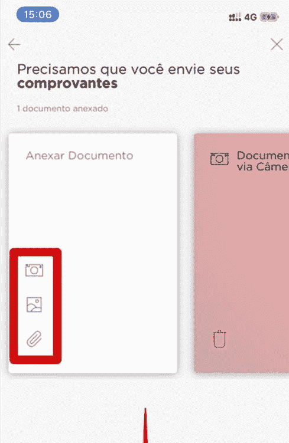
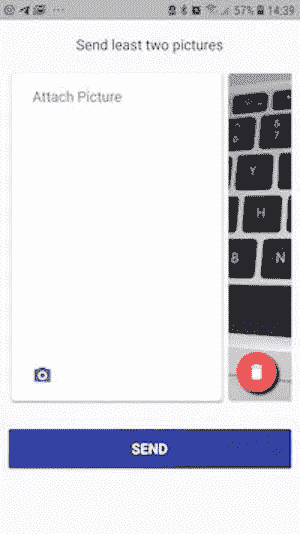
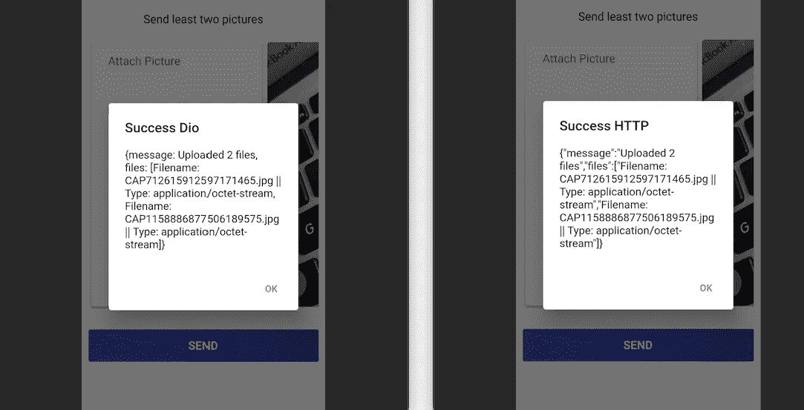
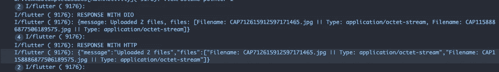

# Flutter:如何通过 HTTP 上传相机拍摄的照片(和其他文件)

> 原文：<https://medium.com/geekculture/flutter-how-to-upload-photos-taken-from-the-camera-and-other-files-via-http-386d04218e02?source=collection_archive---------0----------------------->


我们一直都在使用文件。它们在我们的社交网络、电子邮件和许多其他必要的场景中来来去去。现在，当我写这篇文章的时候，我正在使用一个文件。

这是一个常见的特性，知道如何实现它会带来更多的可能性。在这篇文章中，我想告诉你如何实现一个上传文件的应用程序。

在这里我们将上传照片。我们将做一些类似于**银行**(巴西最著名的金融科技之一)的事情

所以还是上传文件吧！！

# 步骤 0 —在我们开始之前

为此，我们需要:

*   可以使用相机(拍照)的应用程序
*   发送请求的一种方式
*   用于接收文件的后端

因此，我们将建立一个简单的应用程序，可以使用**相机**包拍照，我们的布局是受 **Nubank** 应用程序的启发。

一旦应用程序的布局准备就绪，我们将开始实现通过 HTTP 请求发送文件。为了更广泛地了解如何实现这个特性，我们将向您展示如何使用包 **http** (发布自 *dart.dev* ) 和 **dio** (发布自 *flutterchina.club* )发送文件。

最后，我们将展示一个简单的 C-Sharp 后端，它将接收并处理文件。基本上，后端与下面文章中使用的相同

[](/swlh/uploading-files-with-progress-monitoring-in-vanillajs-angular-and-vuejs-625e2491821) [## 在 VanillaJS、Angular 和 VueJS 中上传带有进度监控的文件

### 当我开始我的编程之旅时，我读了一本书，名叫《头先——PHP & MySQL》。这本书改变了我的…

medium.com](/swlh/uploading-files-with-progress-monitoring-in-vanillajs-angular-and-vuejs-625e2491821) 

看完当前文章可以去看看。

# 步骤 1 —让我们构建一个应用程序

下图展示了我们的灵感。



Image 1 — Nubank inspiration

正如我们已经提到的，这是 Nubank app 的一部分，nu bank app 是巴西最著名的金融技术之一。

我们不会建立完全相同的，我们将只复制机制和使用卡的水平列表元素，当使用卡上的点击相机将被打开。

首先，让我们使用命令创建项目

```
flutter create app_upload
```

除了入口点(main.dart)之外，我们还有两个主要组件。我们将有一个组件叫做 **CardPicture** 和 **TakePicture** 。第一个是展示卡片，比如我们的灵感，第二个是展示相机预览和拍照。让我们解剖它们。

## 卡片图片

是一个可以接收两个参数的 StatelessWidget。一个参数是 **onTap** 手势，另一个是**路径**。

基本上，当路径被传递给组件时，它显示从路径加载的图像，当路径没有被传递时，就附加上 **onTap** 手势。结果如下图所示。



Image 2 — CardPicture

下面我们可以看到并理解这个组件的代码。

CardPicture 可以在 onTap 中接收函数，在 imagePath 中接收字符串。在构建方法中，您可以看到对**图像路径**的检查。

如果 **imagePath** 不为空，则组件使用装饰容器()呈现卡片()，否则组件使用油墨池()包装容器()呈现卡片()。

使用`InkWell()`我们可以附加 **onTap** 手势并调用提供的 onTap 函数(第 54 行)

装饰后的容器使用`BoxDecoration()`和`DecorationImage()`来显示来自 path 的图像(第 20–24 行)。

## 拍照

是一个 StatefulWidget，它在构造函数中接收一个`CameraDescription`，并显示一个`CameraPreview`。它将用于`CardPicture`组件中的 **onTap** 手势处理器。呈现的组件如下所示。


Image 3 — TakePhoto widget

检查此组件的代码:

该组件使用**摄像机**包的 come 组件，可以使用命令`flutter pub add camera`安装。

该小部件的要点是:

*   **initState()** 方法——在`initState()`中，我们实例化并初始化`_cameraController`对象。这个对象是用来控制相机拍照的。
*   **拍照()**方法——使用`_cameraController`拍照。这个方法返回一个`XFile`，它是`File`的跨平台抽象。从`XFile`中，我们可以获得`path`、`mimeType`、`name`、`length`和其他一些从相机生成的文件信息，在我们的例子中是一张照片。
*   **build()** 方法—在构建过程中，我们使用一个简单的脚手架，它带有一个`AppBar()`和一个`FloatingActionButton()`，调用 onTap 手势处理程序中的 **takePicture()** 方法。在`body`中我们有一个`FutureBuilder()`附属于`_cameraController`的初始化。完成后，它显示来自`camera`包装的`CameraPreview`，否则它显示一个圆形装载机。

## 我的主页

是运行`flutter create`命令后创建的组件的修改版本。我们在 build 方法中使用了一个主体中带有 SingleChildScrollView 的脚手架，如下所示。

该小部件的要点是:

**initState()** —这里，使用相机包，我们在设备中获得可用的相机。此外，我们过滤摄像头，只获得背面摄像头(如果你需要/想要，你可以改变这一点)。得到想要的相机后，我们使用`setState()`在`_cameraDescription`中设置。

**build()** —在 build 方法中，我们绘制了显示在*图 2* 中的主要小部件。基本上，我们有一个带 T4 的 T3 来垂直容纳小部件。

纵向我们有一个`Text`、`Container`和一个带卡片的横向`ListView`以及一个包含`RawMaterialButton`的`Padding`小部件。

**on pressed**from**raw material button**—这个手势使用服务实例来发送图片(第 181–203 行)。接下来我们将重点关注这些服务。

其他有趣的方法是 presentLoader 和 presentAlert，它们分别是显示加载器和警告对话框的抽象。

# 步骤 2 — Flutter http 包

`http`是由 Dart 团队和 Pub Dev 开发的软件包，我们有:

> 这个包包含一组高级的函数和类，使得使用 HTTP 资源变得很容易。它是多平台的，支持移动、桌面和浏览器。

它使得处理 HTTP 请求更加容易和灵活。以下是如何使用 http.dart 调用端点的示例。

```
**import** 'package:http/http.dart' **as** http;...**var** url = Uri.parse('https://example.com/whatsit/create');
**var** response = **await** http.post(url, body: {'name': 'doodle', 'color': 'blue'});
print('Response status: ${response.statusCode}');
print('Response body: ${response.body}');
```

使用`URI.parse`定义`url`并使用`http`中的方法调用。在上面的例子中，我们发出了一个`POST`请求。注意像`statusCode`和`body`这样的响应信息检索。

# 步骤 3 —颤振 dio 封装

`dio`是`flutterchina.club`发布的包。这和`http`做的是一样的，但差别不大。它有更多封装的东西，并有一些功能来解决问题，如缓存请求，基本请求等等。

```
**import** 'package:dio/dio.dart';...**var** dio = Dio();
**final** response = **await** dio.**get**('https://google.com');
print(response.data);
```

上例显示了如何使用 **Dio** 发出`GET` 请求。基本上，我们实例化一个`dio`对象，用它我们可以创建请求方法。

# 步骤 4-准备要发送的照片

是时候准备上传文件到我们的后台了。基本上，我们将创建两个服务。这两个服务将做同样的事情，即通过 POST 发送文件，不同的是一个使用`http`而另一个使用`dio`。

## HttpUploadService

下面可以看到 **HttpUploadService** 的完整代码。

关键点是:

**上传照片**——班里唯一的方法。此方法接收字符串列表，其中列表中的每一项都是文件路径。

在方法体中，我们实例化 URI(第 8 行)并将其放入 MultipartRequest 实例(第 9 行)中，并从循环 for 中添加文件(第 11 行)。

**http。MultipartRequest 实例** —顾名思义，负责发送多部分请求的实例。

我们实例化它传递请求方法和 URI(第 9 行)。`http.MultipartRequest`的实例有一个名为`files`的属性，作为`http.MultipartFile`的列表。

正如您在第 11 行看到的，我们使用接收字段名和路径的`http.MultipartFile.fromPath`从每个条目添加文件。

**注意:**在这种情况下，您将准备一个包含名为 files 的字段的数组。如果希望每个文件有不同的字段名称，可以为每个文件更改它。

**http。StreamedResponse 实例** —从请求中调用`send()`方法后，我们得到一个`http.StreamedResponse`实例。

通过这个实例，我们可以得到响应。在第 15 行，我们从`response.stream.toBytes()`获得 responseBytes。一旦我们有了字节，我们就可以使用`dart:convert`包中的`utf8.decode`将其转换成 JSON 字符串(第 16 行)。

## DioUploadService

下面你可以看到 DioUploadService 的完整代码。

关键点是:

**上传照片** —类中唯一的方法。此方法接收字符串列表，其中列表中的每一项都是文件路径。

在方法体中，我们定义了一个列表`MultipartFile`(第 7 行),并使用`MultipartFile.fromFile`传递文件路径从`paths`的循环中填充它。

**表单数据实例** —在第 10 行我们定义了一个表单数据。这里的 FormData 类似于来自 Web APIs 的 FormData(参见参考资料),当我们将它传递给 Dio request 时，它将自动成为一个多部分请求。

我们的 FormData 实例由`FormData.fromMap`构成，我们定义了`files`字段。不，该名称与 HttpUploadService 中使用的名称相同。这个名字应该是`files`，因为我们的后端期望它。

**Dio()。post()** —这里是发送请求的地方。我们只需要传递 URL 和带有`FormData`实例的`data`。

# 步骤 5 —我们的后端

我们的后端代码是一个来自 Dotnet Web API 的简单控制器，它看起来像:

不知道`C#`也没关系。这里你需要理解的是，当调用端点`/upload-multiple`时，执行的是`ProfileController`类的`UploadMultiple`方法。

在方法参数中，我们可以看到基本接收文件的指令`[FromForm(Name = "files")] List<IFormFile> files`。注意`Name = "files"`,在这里我们将输入有效负载映射到方法中的对象。这就是为什么文件数组字段名必须是 **files** 的原因。

后端只接收文件并返回关于发送了多少文件的信息。

您可以使用自己喜欢的技术构建自己的后端。本文的目的不是后端，我们只是向您介绍在这种情况下如何更好地理解后端和前端通信。

# 第 6 步—结果

在我们做了所有的工作之后，是时候测试我们的应用程序了。所以打开应用程序，至少拍两张照片，然后点击发送按钮。这样做之后，您将会看到如下所示的结果。



Image 4 — Result in frontend

如果你检查发送按钮的 **onPress** 手势，你会看到方法调用后端并在使用警告对话框中显示响应。

在 Visual Studio 代码日志中，结果将如下所示。



Image 5 — Result of SEND button tap in the terminal

这些信息来自两个服务的方法**上传照片**。记住，在这些方法中，我们使用`print`来显示请求信息。

# 摘要

嘿，我们做到了。我们现在有一个上传文件的应用程序。是的，在我们的例子中，我们使用了相机中的照片，但是一旦你有了文件路径，你就可以上传任何文件。

我们简单的应用程序集合了一些有趣的概念，如相机的使用，文件操作，http 请求和上传。你现在可以扩展它，使用同样的概念创建更棒的应用程序。

阅读参考资料中的更多信息和这个中型简介中的更多帖子，如果这篇文章对你有用，请鼓掌。

仅此而已。再见！

# 参考

*   包含完整代码的资源库—[https://github . com/geek Silva 97/Medium/tree/master/app _ upload](https://github.com/geeksilva97/Medium/tree/master/app_upload)
*   Dio 包—【https://pub.dev/packages/dio 
*   Http 套餐—【https://pub.dev/packages/http 
*   表单数据 Web API—[https://developer.mozilla.org/pt-BR/docs/Web/API/FormData](https://developer.mozilla.org/pt-BR/docs/Web/API/FormData)
*   在 web 中上传进度文件—[https://medium . com/swlh/uploading-files-with-progress-monitoring-in-vanillajs-angular-and-vue js-625 e 2491821](/swlh/uploading-files-with-progress-monitoring-in-vanillajs-angular-and-vuejs-625e2491821)