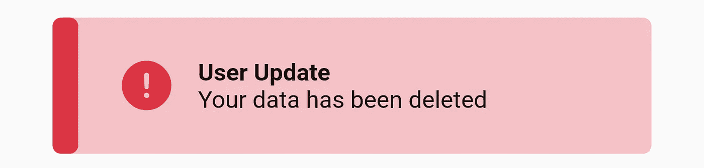
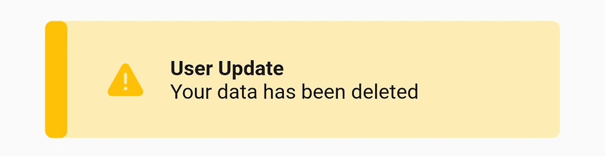

# 详细的颤动动作吐司

> 原文：<https://medium.com/geekculture/flutter-motion-toast-in-details-ee029a59c626?source=collection_archive---------12----------------------->


在本文中，我们将深入挖掘 flutter 包 motion_toast，看看我们可以用它来构建什么，以及如何改进它。

# **什么是运动吐司？**

Motion toast 是一个新的开源 flutter 包，可以让你以用户友好的方式显示消息，有多个内置主题，并可以创建自己的主题。

运动吐司也有内置的显示动画，你可以定义它的位置(中心，底部，顶部)。

# 装置

为了让 motion_toast 在您的项目上工作，您需要做的就是将这一行添加到您的`pubspec.yaml`文件的`dependencies`下

```
motion_toast: ^1.1.0
```

# 参数和构造函数

在深入讨论所有参数之前，让我强调一下，为了显示一个内置主题的动态吐司，你只需要一个参数`description`，为了创建一个自定义主题并显示它，你只需要传递三个参数`description` `icon`和`color`

现在让我给你解释一下你可以用来定制你自己的动作吐司的所有参数

`description`将在向用户显示的运动提示中使用的文本内容，该参数对于所有构造函数都是必需的

`icon`是将在运动吐司中呈现的图标，该参数仅在使用默认构造函数`MotionToast()`时可用

`color`是应用于 toast 的颜色，该颜色将在 toast 本身上带有一点不透明度，并且将在左边/右边的侧栏上，当使用默认构造函数时，该参数是必需的。

`title`toast 的标题，默认情况下，它是所有构造函数的空字符串。

`descriptionStyle`是将应用于描述文本的文本样式。

`titleStyle`与`descriptionStyle`相同，但这次应用在标题文本上。

`iconType``图标的样式类型(Cupertino 或材料设计)，此类型仅在您使用内置主题(成功、错误、警告、信息、删除)时可用。

`width``烤面包的宽度，不是必需的

`height``祝酒词的高度。

`iconSize``定义图标大小的双值。

`enableAnimation``定义吐司是否动画，默认为`true`

`layoutOrientation``定义如何将 toast 布局渲染为 LTR 或 RTL(对于阿拉伯文本)

`animationType``应用于 toast 的动画类型(从下、从左、从右、从上)默认设置为 FROM_BOTTOM

`animationDuration``动画的持续时间默认情况下动画需要 1.5 秒

`toastDuration``在退出屏幕之前吐司将持续的时间，默认情况下，吐司持续 3 秒钟

`animationCurve``动画渲染曲线，默认设置为`Curves.ease`

`position``吐司显示位置居中、底部或顶部。默认情况下，祝酒词显示在屏幕底部

`borderRadius``吐司边框的半径

# 例子

在这一节中，我们将深入挖掘一些 motion toast 用例的例子和代码片段，以及如何在您的项目中使用 motion toast。

运动吐司提供了多个内置的主题，成功，错误，信息，删除和警告，当然你可以创建自己的主题。

**成功主题**

只有一个参数，你可以创建一个成功的主题祝酒词

```
MotionToast.success(description: "Your data has been updated").show(context);
```

这是上面代码的结果


但是，如果您想要更多的定制，您可以添加其他参数，如下面的代码


对于其他主题，同样的参数是可用的，你只需要改变构造函数，如下所示

**错误动作吐司主题**



**信息动作祝酒主题**


**警告动作祝酒主题**



**删除动作吐司主题**


**创建自定义动作吐司**

为了创建定制的运动吐司，您需要使用所有必需的参数:

*   图标(图标数据)
*   描述(字符串文本)
*   颜色(颜色对象)

当然，正如我们在上一节中所讨论的，还有许多其他参数，但这些参数是创建自定义运动吐司所必需的

这段代码片段将呈现如下所示的祝酒词


# 我什么时候可以使用这个包？

这个包帮助你显示自定义优雅的消息给你的用户或重要的通知。

如果你要在你的应用中实现定制设计，使用这个包的最好方法是使用定制构造器选项来避免任何 UI 方面的不一致。

对于那些正在构建一个需要大量资源的应用程序，并且不希望任何包消耗过多资源的人来说，这个包不需要太多资源，而且在内存方面，这个包在 toast 完成后处理所有异步组件。

# 我应该在什么时候避免这个包？

motion toast 1.0.3 不支持在短时间内显示多个 toast，所以这可能会给你的应用程序带来问题，特别是当你需要快速显示多个 toast 的用例时。希望在下一个版本 1.0.4 中修复这个错误

# 结论

在这篇文章的结尾，我想强调的是这个包一直在发展，你可以期待新的版本和新的特性。

在本文中，我们讨论了如何使用这个包，可以用来定制它的显示的所有参数是什么，何时使用它，以及在什么情况下可以避免使用这个包。

你也可以查看下面 github 库的链接，如果你遇到了问题，你可以把你的问题发给我，还有 pub.dev 上官方包页面的链接

[](https://github.com/koukibadr/Motion-Toast) [## GitHub - koukibadr/Motion-Toast

### 一个新的精心设计的土司动画和多种内置类型的动画土司内置动画图标…

github.com](https://github.com/koukibadr/Motion-Toast) [](https://pub.dev/packages/motion_toast) [## motion_toast |颤振包

### 一个漂亮的设计动画烤面包片，包含多个内置设计，让你设计你的烤面包片

公共开发](https://pub.dev/packages/motion_toast) 

快乐编码，我希望你学到了新的东西！