# 用于认证和引导的 Flutter Navigator 2.0 第 5 部分:Web

> 原文：<https://medium.com/geekculture/flutter-navigator-2-0-for-authentication-and-bootstrapping-part-5-web-eeb4835804df?source=collection_archive---------0----------------------->

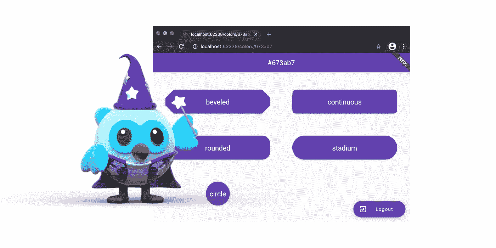

[Wizard Dashatar](https://dashatar-dev.web.app/#/)

*   [第一部分:简介](https://ulusoyca.medium.com/flutter-navigator-2-0-for-authentication-and-bootstrapping-part-1-introduction-d7b6dfdd0849)
*   [第二部分:用户互动](https://ulusoyca.medium.com/flutter-navigator-2-0-for-authentication-and-bootstrapping-part-2-user-interaction-5dc043e7e44a)
*   [第三部分:认证](https://ulusoyca.medium.com/flutter-navigator-2-0-for-authentication-and-bootstrapping-part-3-authentication-93dbcb5f0f0a)
*   [第 4 部分:引导](https://ulusoyca.medium.com/flutter-navigator-2-0-for-authentication-and-bootstrapping-part-4-bootstrapping-6ff60c845331)
*   **第五部分:网络**

在本系列的前几部分中，我们关注于使用 Navigator 2.0 API 为以下情况构建导航栈:

*   *用户交互、认证状态更新和引导导致的应用状态变化*。
*   *从操作系统弹出当前路径*请求。

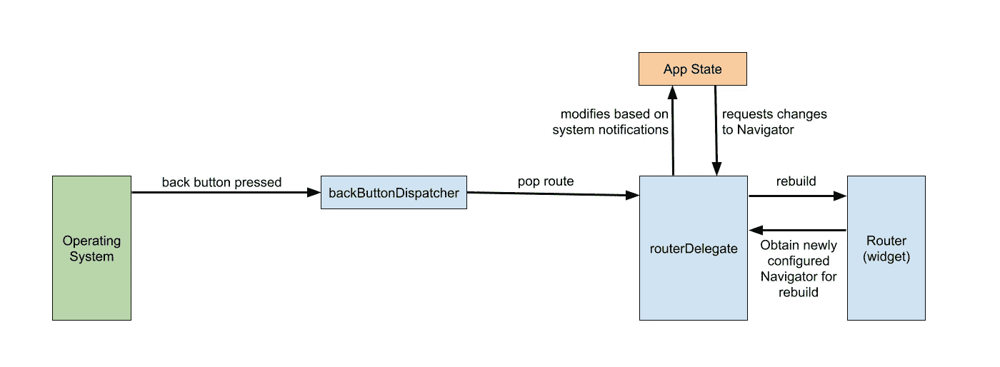

在本文中，我们将关注两件事:

1.  根据来自操作系统的新路线信息更新应用状态和导航栈。
2.  根据应用状态向操作系统报告新的路由信息。

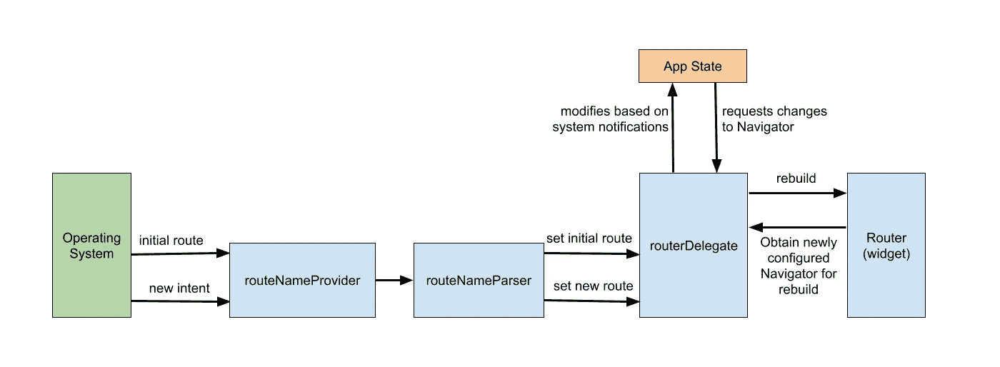

系好你的安全带，因为这里的东西会变脏！

## 网络体验

我们解析存储在`[RouteInformation](https://api.flutter.dev/flutter/widgets/RouteInformation-class.html)`的`[location](https://api.flutter.dev/flutter/widgets/RouteInformation/location.html)`字段中的 Web URL，为 Web 用户提供良好的用户体验。前面的示例适用于移动应用程序。然而，它们提供了糟糕的 Web 体验，因为当应用程序状态改变时，浏览器的地址栏不会正确更新。请看下面的录音，它展示了前一篇文章中在 Web 上运行的示例应用程序。

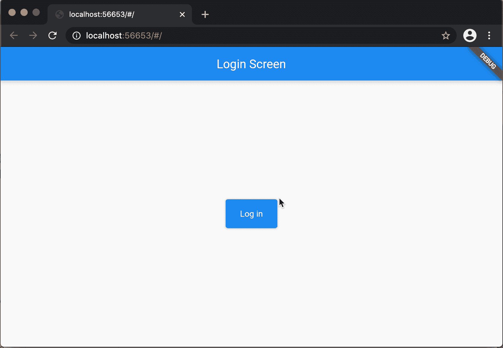

现在，让我们看看如何通过地址栏启用应用程序导航来提供更强大的 Web 体验。

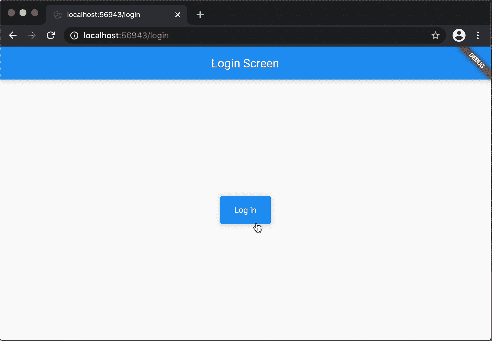

*请注意，本系列中的示例应用程序并没有专注于改善加载时间和屏幕过渡。*

## 路由器代表

您可能会觉得路由器代表使情况变得复杂，但是在本文中，我们将只关注`routeNameParser`和`routerDelegate`。虽然可以定制`routeNameProvider`委托来改变从操作系统获取路由名称(URL)的方式，但是在很多情况下，我们不需要定制它。因此，我们将让`[Router](https://api.flutter.dev/flutter/widgets/Router-class.html)`小部件使用默认的`routeNameProvider`实现。

我不知道为什么在[设计文档](https://docs.google.com/document/d/1Q0jx0l4-xymph9O6zLaOY4d_f7YFpNWX_eGbzYxr9wY/edit#heading=h.l6kdsrb6j9id)中，`routeNameProvider`和`routeNameParser`委托的命名与它们实际的类名`[RouteInformationProvider](https://api.flutter.dev/flutter/widgets/RouteInformationProvider-class.html)`和`[RouteInformationParser](https://api.flutter.dev/flutter/widgets/RouteInformationParser-class.html)`不同。当提到这些委托时，我将在本文中使用相应的类名。

文章的第一部分更具理论性。我建议保持耐心，直到第二部分展示如何在示例应用程序中实践这一理论。一开始不需要了解所有的细节。你可以在完成这篇文章后再读一遍理论部分。希望最终您能够在 Web 应用程序中轻松使用 Navigator 2.0 API。

# 1-信息流

## 1.1 路线信息

`[RouteInformation](https://api.flutter.dev/flutter/widgets/RouteInformation-class.html)`保存一条路线的`[location](https://api.flutter.dev/flutter/widgets/RouteInformation/location.html)`和`[state](https://api.flutter.dev/flutter/widgets/RouteInformation/state.html)`信息。`[location](https://api.flutter.dev/flutter/widgets/RouteInformation/location.html)`字段是一个`String`，它相当于一个 Web URL。在本文中，我们将重点关注`[location](https://api.flutter.dev/flutter/widgets/RouteInformation/location.html)`字段。

在移动和桌面应用程序中，让`[RouteInformation](https://api.flutter.dev/flutter/widgets/RouteInformation-class.html)`单向流动就足够了:从操作系统(OS)到`[Router](https://api.flutter.dev/flutter/widgets/Router-class.html)`小部件。当导航栈由于应用状态改变而更新时，操作系统通常不需要知道当前路线的`[location](https://api.flutter.dev/flutter/widgets/RouteInformation/location.html)`信息(URL)。

为了能够在 Web 浏览器的地址栏上显示正确的 URL，由应用程序状态更改引起的导航堆栈更新应该从 Flutter 框架层报告给 Flutter Web 引擎层。这就是为什么 Web 应用程序的`[RouteInformation](https://api.flutter.dev/flutter/widgets/RouteInformation-class.html)`流需要是双向的。

与移动应用不同，Flutter Web 应用不与操作系统通信，因为它们在浏览器应用中处于沙箱中。在本文中，我们将讨论操作系统和路由器部件之间的通信，以保持与设计文档的一致性和简单性。最终，Navigator 2.0 API 在框架层实现，它不需要知道引擎层的细节。

## 1.2 路由信息解析器

我们定制的`[RouteInformationParser](https://api.flutter.dev/flutter/widgets/RouteInformationParser-class.html)`是双向`[RouteInformation](https://api.flutter.dev/flutter/widgets/RouteInformation-class.html)`流的关键类，因为位置信息解析和恢复逻辑是在这个委托中实现的。

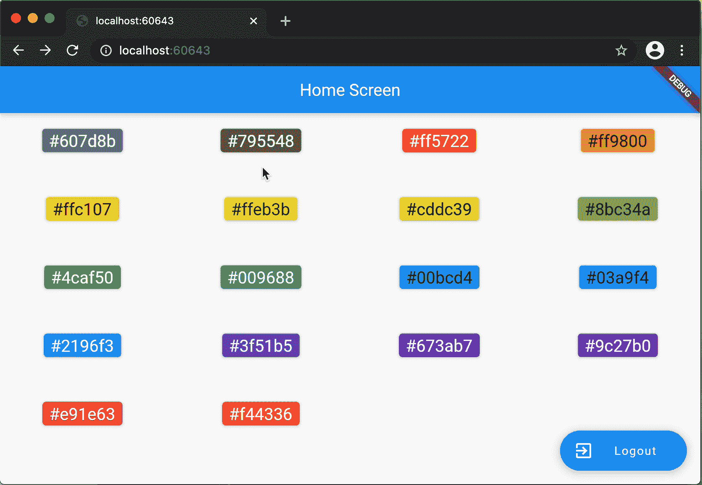

Flow 1: From OS to Router

***流程 1: OS 到路由器 widget***

*   操作系统想要显示一条路线(初始的或新的)
*   `[RouteInformationProvider](https://api.flutter.dev/flutter/widgets/RouteInformationProvider-class.html)`从操作系统接收路由名称`String` (URL)。
*   `[RouteInformationProvider](https://api.flutter.dev/flutter/widgets/RouteInformationProvider-class.html)`根据路径名生成`[RouteInformation](https://api.flutter.dev/flutter/widgets/RouteInformation-class.html)`实例，并通知`[Router](https://api.flutter.dev/flutter/widgets/Router-class.html)`小工具。
*   `[Router](https://api.flutter.dev/flutter/widgets/Router-class.html)`小部件获取`[RouteInformation](https://api.flutter.dev/flutter/widgets/RouteInformation-class.html)`并通过调用其`[parseRouteInformation](https://api.flutter.dev/flutter/widgets/RouteInformationParser/parseRouteInformation.html)`方法将其传递给`[RouteInformationParser](https://api.flutter.dev/flutter/widgets/RouteInformationParser-class.html)`委托。
*   `[RouteInformationParser](https://api.flutter.dev/flutter/widgets/RouteInformationParser-class.html)` delegate 解析`[RouteInformation](https://api.flutter.dev/flutter/widgets/RouteInformation-class.html)`的`[location](https://api.flutter.dev/flutter/widgets/RouteInformation/location.html)`字段，返回一个**自定义数据类型**的实例。这种数据类型的实例在设计文档中被称为*配置*，因为它解释了当前的应用状态。
*   `[Router](https://api.flutter.dev/flutter/widgets/Router-class.html)`小部件从`[RouteInformationParser](https://api.flutter.dev/flutter/widgets/RouteInformationParser-class.html)`获取`configuration`，并通过调用其`[setNewRoutePath](https://api.flutter.dev/flutter/widgets/RouterDelegate/setNewRoutePath.html)`方法将其发送给`[RouterDelegate](https://api.flutter.dev/flutter/widgets/RouterDelegate-class.html)`。
*   收到新配置后，`[RouterDelegate](https://api.flutter.dev/flutter/widgets/RouterDelegate-class.html)`会根据需要更新应用状态。
*   `[Router](https://api.flutter.dev/flutter/widgets/Router-class.html)` widget 请求`[RouterDelegate](https://api.flutter.dev/flutter/widgets/RouterDelegate-class.html)`根据当前应用状态构建一个新的`[Navigator](https://api.flutter.dev/flutter/widgets/Navigator-class.html)` widget。

***流程二:从路由器 widget 到 OS***

*   `[Router](https://api.flutter.dev/flutter/widgets/Router-class.html)`小部件为`[RouteInformation](https://api.flutter.dev/flutter/widgets/RouteInformation-class.html)`报告安排一个任务。
*   `[Router](https://api.flutter.dev/flutter/widgets/Router-class.html)`小部件从`[RouterDelegate](https://api.flutter.dev/flutter/widgets/RouterDelegate-class.html)`获取`[currentConfiguration](https://api.flutter.dev/flutter/widgets/RouterDelegate/currentConfiguration.html)`，并通过调用其`[restoreRouteInformation](https://api.flutter.dev/flutter/widgets/RouteInformationParser/restoreRouteInformation.html)`方法将其传递给`[RouteInformationParser](https://api.flutter.dev/flutter/widgets/RouteInformationParser-class.html)`。
*   在`[RouteInformationParser](https://api.flutter.dev/flutter/widgets/RouteInformationParser-class.html)`的`[restoreRouteInformation](https://api.flutter.dev/flutter/widgets/RouteInformationParser/restoreRouteInformation.html)`方法中，根据`[currentConfiguration](https://api.flutter.dev/flutter/widgets/RouterDelegate/currentConfiguration.html)`向`[Router](https://api.flutter.dev/flutter/widgets/Router-class.html)`小工具返回一个新的`[RouteInformation](https://api.flutter.dev/flutter/widgets/RouteInformation/RouteInformation.html)`。
*   `[Router](https://api.flutter.dev/flutter/widgets/Router-class.html)`小部件将`[RouteInformation](https://api.flutter.dev/flutter/widgets/RouteInformation/RouteInformation.html)`保存在其内部状态，以供操作系统使用。

Flow 2: From Router to OS

## 1.3 路由器授权

为了能够利用`Navigator 2.0` API 的`[RouteInformationParser](https://api.flutter.dev/flutter/widgets/RouteInformationParser-class.html)`组件，我们需要覆盖`[RouterDelegate](https://api.flutter.dev/flutter/widgets/RouterDelegate-class.html)`的`[setNewRoutePath](https://api.flutter.dev/flutter/widgets/RouterDelegate/setNewRoutePath.html)`方法和`[currentConfiguration](https://api.flutter.dev/flutter/widgets/RouterDelegate/currentConfiguration.html)` getter。

`[***setNewRoutePath***](https://api.flutter.dev/flutter/widgets/RouterDelegate/setNewRoutePath.html)`***:***

在 Web apps 中，当按下后退或前进按钮时，或者当在浏览器的地址栏中输入新的 URL 时，上面提到的`flow 1`(*OS 到路由器*)启动。`flow 1`中`[RouterDelegate](https://api.flutter.dev/flutter/widgets/RouterDelegate-class.html)`的作用是在构建下一个导航栈之前更新应用状态。

当`[Router](https://api.flutter.dev/flutter/widgets/Router-class.html)`小部件在其`[RouteInformationParser](https://api.flutter.dev/flutter/widgets/RouteInformationParser-class.html)`委托的帮助下解释操作系统的意图时，它调用`[RouterDelegate](https://api.flutter.dev/flutter/widgets/RouterDelegate-class.html)`的`[setNewRoutePath](https://api.flutter.dev/flutter/widgets/RouterDelegate/setNewRoutePath.html)`。我们应该重写这个方法，根据请求的配置调整应用程序状态，以便相应地构建下一个导航堆栈。

`[***currentConfiguration***](https://api.flutter.dev/flutter/widgets/RouterDelegate/currentConfiguration.html)`

*在`flow 2` ( *路由器到 OS* )中`[RouterDelegate](https://api.flutter.dev/flutter/widgets/RouterDelegate-class.html)`的作用是提供`[currentConfiguration](https://api.flutter.dev/flutter/widgets/RouterDelegate/currentConfiguration.html)`到`[Router](https://api.flutter.dev/flutter/widgets/Router-class.html)`小部件。然后`[Router](https://api.flutter.dev/flutter/widgets/Router-class.html)`小部件在其`[RouteInformationParser](https://api.flutter.dev/flutter/widgets/RouteInformationParser-class.html)`委托的帮助下恢复`[RouteInformation](https://api.flutter.dev/flutter/widgets/RouteInformation-class.html)`。*

*   *如果没有实现`[currentConfiguration](https://api.flutter.dev/flutter/widgets/RouterDelegate/currentConfiguration.html)` getter 方法，`[Router](https://api.flutter.dev/flutter/widgets/Router-class.html)`小部件不会报告`[RouteInformation](https://api.flutter.dev/flutter/widgets/RouteInformation-class.html)`，地址栏也不会更新。当我们使用旧的命令式导航器 API 时，情况就是这样。*
*   *如果`[currentConfiguration](https://api.flutter.dev/flutter/widgets/RouterDelegate/currentConfiguration.html)`执行没有反映当前应用状态，浏览器后退/前进按钮将无法正常工作。*

# ***2- Navigator 2.0 在行动！***

*信息太多，难以消化。让我们保持高动力，因为如果我们实现了正确的导航实现，我们将有一个新的平台来支持:WEB！*

**

*[Dashatar](https://dashatar-dev.web.app/#/)*

## *2.1 应用程序*

*在前面的示例中，我们将`[Router](https://api.flutter.dev/flutter/widgets/Router-class.html)`小部件作为`[MaterialApp](https://api.flutter.dev/flutter/material/MaterialApp-class.html)`的`home`注入。查看下面小部件树中`[MaterialApp](https://api.flutter.dev/flutter/material/MaterialApp-class.html)`和`[Navigator](https://api.flutter.dev/flutter/widgets/Navigator-class.html)`小部件之间的`[Router](https://api.flutter.dev/flutter/widgets/Router-class.html)`小部件。*

*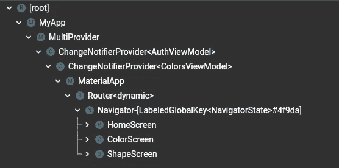*

*在这个示例中，我们使用了`[MaterialApp.router](https://api.flutter.dev/flutter/widgets/WidgetsApp/WidgetsApp.router.html)`构造函数，并将`[RouterDelegate](https://api.flutter.dev/flutter/widgets/RouterDelegate-class.html)`和`[RouteInformationParser](https://api.flutter.dev/flutter/widgets/RouteInformationParser-class.html)`提供给材质应用程序。因此，我们不将`[Router](https://api.flutter.dev/flutter/widgets/Router-class.html)`小部件实例化并注入到应用程序中。相反，应用程序在内部使用委托。注意在下面的窗口小部件树中，我们没有看到在`[MaterialApp](https://api.flutter.dev/flutter/material/MaterialApp-class.html)`和`[Navigator](https://api.flutter.dev/flutter/widgets/Navigator-class.html)`窗口小部件之间的`[Router](https://api.flutter.dev/flutter/widgets/Router-class.html)`窗口小部件。*

*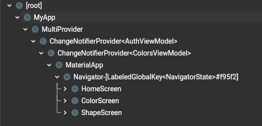*

## *2.2 自定义数据类型:` MyAppConfiguration '*

*自定义数据类型被`[Router](https://api.flutter.dev/flutter/widgets/Router-class.html)`小部件用来将`[RouteInformation](https://api.flutter.dev/flutter/widgets/RouteInformation-class.html)`转换为应用状态，并将应用状态作为`[RouteInformation](https://api.flutter.dev/flutter/widgets/RouteInformation-class.html)`报告给操作系统。我相信这部分是很多开发者不喜欢 Navigator 2.0 API 的原因，因为如何定义这个类完全取决于开发者。因此，我们需要聪明地考虑每一个细节。*

*在示例应用程序中，我使用了四个字段并声明了命名构造函数来表示每个配置。例如:*

*   *如果`loggedIn`字段是`null`，导航栈中的最后一条路线应该是`Splash`页面。*
*   *如果`loggedIn`字段被设置为`false`，那么应用程序配置应该告诉`[Router](https://api.flutter.dev/flutter/widgets/Router-class.html)`小部件，导航堆栈上的最后一条路线应该是`Login`页面。*
*   *如果`loggedIn`为`true`，设置了`colorCode`，但没有设置`shapeBorderType`，则最后一条进路应为`ColorPage`。*
*   *如果`loggedIn`是`true`，设置了`colorCode`，并且设置了`shapeBorderType`，那么最后一条路线应该是`ShapePage`。*
*   *如果`unknown`状态设置为真，我们会显示一个错误页面。*

## *2.3 RouteInformationParser*

*我们需要覆盖在`[Router](https://api.flutter.dev/flutter/widgets/Router-class.html)`小部件和操作系统之间的一个流中使用的`[RouteInformationParser](https://api.flutter.dev/flutter/widgets/RouteInformationParser-class.html)`的两个方法。*

****流程 1: OS 通过***`***parseRouteInformation***`***:***到路由器 widget*

*在这个方法中，我们需要从默认的`[RouteInformationProvider](https://api.flutter.dev/flutter/widgets/RouteInformationProvider-class.html)`委托提供的给定的`[RouteInformation](https://api.flutter.dev/flutter/widgets/RouteInformation-class.html)`中生成一个配置。注意，Flutter 默认使用散列(`/#/`)定位策略。在这个示例中，[我们将 URL 策略](https://flutter.dev/docs/development/ui/navigation/url-strategies)配置为`[PathUrlStrategy](https://master-api.flutter.dev/flutter/flutter_web_plugins/PathUrlStrategy-class.html)`。*

*我们解析存储在`[RouteInformation](https://api.flutter.dev/flutter/widgets/RouteInformation-class.html)`的`[location](https://api.flutter.dev/flutter/widgets/RouteInformation/location.html)`字段中的 URL。如何将 URL 与配置相关联取决于我们。以下是我的 URL 策略:*

*   **主页*是初始路线，默认用“`/`”表示。如果 URL 解析没有返回任何路径段，那么我们就在主页上，使用`MyAppConfiguration.home()`实例化返回的配置。请注意，除非我们自定义了`[RouteInformationProvider](https://api.flutter.dev/flutter/widgets/RouteInformationProvider-class.html)`，否则初始路由路径始终是``/``。虽然对于其他操作系统它可能会改变，但是对于网络和移动来说它是``/`'*

*   *如果路径段的数量是 1，我们允许访问主页或登录页面。例如，如果用户将`home`字符串附加到域中，比如`http://localhost:59358/home`，那么返回的配置应该通过调用`MyAppConfiguration.home()`来实例化。如果路径段是`login`，应该通过调用`MyAppConfiguration.login()`来实例化配置。*

*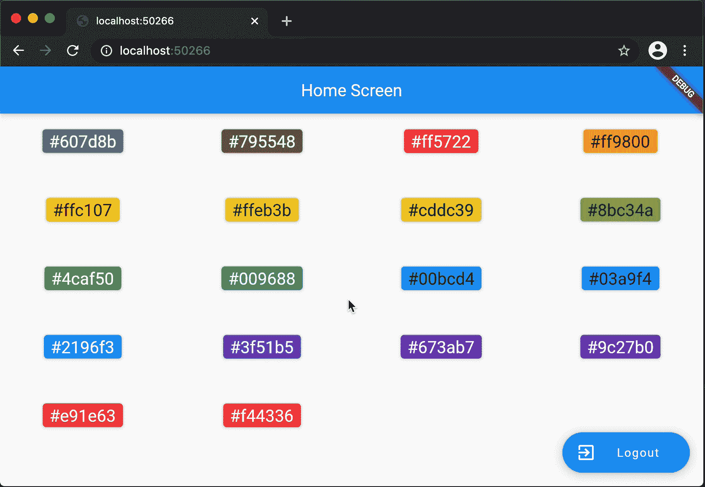*

*   *如果路径段的数量是 2，我们返回一个`MyAppConfiguration.color()`或`MyAppConfiguration.unknown()`配置。第一个路径段应始终是`colors`字符串，第二个路径段应始终是颜色代码，如`http://localhost:59358/colors/cddc39`。这里我们知道，如果第一个路径段不是`colors`或者第二个路径段不是十六进制颜色代码，那么我们应该返回`MyAppConfiguration.unknown()`配置。*

*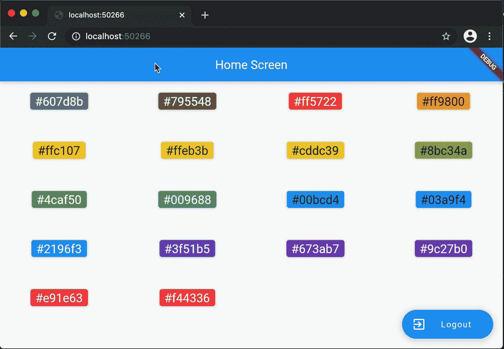*

*   *如果路径段的数量是 3，我们转发一个`MyAppConfiguration.shapeBorder()`或`MyAppConfiguration.unknown()`配置。第一个和第二个路径段的规则在这里也适用。我们希望第三个路径段是形状边框类型的名称。因为形状边界列表对所有用户都是一样的，我们不会异步获取它们，所以我们在`[RouteInformationParser](https://api.flutter.dev/flutter/widgets/RouteInformationParser-class.html)`中验证边界类型。*

*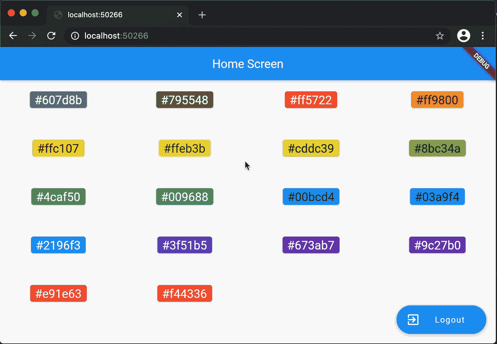*

*我想进一步澄清当 URL 没有路径段时，我们如何显示`LoginPage`或`HomePage`。起初，将`AuthenticationRepository`注入到`[RouteInformationParser](https://api.flutter.dev/flutter/widgets/RouteInformationParser-class.html)`类听起来是获得认证状态并做出相应决定的最简单的方法。然而，考虑到`[Router](https://api.flutter.dev/flutter/widgets/Router-class.html)` [小部件文档](https://api.flutter.dev/flutter/widgets/Router-class.html)中提到的异步问题，我个人不喜欢在`[RouteInformationParser](https://api.flutter.dev/flutter/widgets/RouteInformationParser-class.html)`中处理异步数据操作。*

*我认为`[RouteInformationParser](https://api.flutter.dev/flutter/widgets/RouteInformationParser-class.html)`的作用是尽可能地解释意图。意图会传递给`RouterDelegate`在构建导航栈时有最后决定权，所以`[RouteInformationParser](https://api.flutter.dev/flutter/widgets/RouteInformationParser-class.html)`返回错误的 app 配置是可以的。`[RouterDelegate](https://api.flutter.dev/flutter/widgets/RouterDelegate-class.html)`准备好根据应用状态进行修正。*

*在我们的实现中，当解析的`[RouteInformation](https://api.flutter.dev/flutter/widgets/RouteInformation-class.html)`是`/`时，我们在不知道认证状态的情况下返回`MyAppConfiguration.home()`，因为用户的意图实际上是查看主页。如果用户没有登录，我们应该显示登录页面。*

*同样，当用户的意图是查看`ColorPage`或`ShapePage`时，我们不知道从 URL 解析的十六进制颜色代码是否包含在颜色列表中，因为获取颜色列表是*异步*操作，我们不想在`[RouteInformationParser](https://api.flutter.dev/flutter/widgets/RouteInformationParser-class.html)`类中进行。我们无论如何都会将意图传递给`[RouterDelegate](https://api.flutter.dev/flutter/widgets/RouterDelegate-class.html)`。它将根据解释更新应用程序状态，并建立相应的导航堆栈。*

****流程二:路由器 widget 通过***`***restoreRouteInformation***`***:****

*与来自`[RouteInformation](https://api.flutter.dev/flutter/widgets/RouteInformation-class.html)`的解析路径相比，这个要简单得多。在这个流程中，我们只需要为给定的配置构造带有 URL 的`[RouteInformation](https://api.flutter.dev/flutter/widgets/RouteInformation-class.html)` 。*

*在我们的 app 中，如果 app 配置是`Splash`，我们不想改变 URL。在这种情况下，我们将返回`null`。不幸的是，到今天为止，当返回`null`时，API 会默默地抛出一个异常。*

## ***2.4 RouterDelegate***

*`[RouterDelegate](https://api.flutter.dev/flutter/widgets/RouterDelegate-class.html)`是大局的核心。在这个类中，我们考虑应用程序的状态来构建导航栈。在我们的示例应用程序中，应用程序状态由`_show404`、`_loggedIn`、`_colors`、`_selectedColorCode`和`_selectedShapeBorderType`属性表示。每当这些字段之一被更新时，`[RouterDelegate](https://api.flutter.dev/flutter/widgets/RouterDelegate-class.html)`通知`[Router](https://api.flutter.dev/flutter/widgets/Router-class.html)`小部件，然后`[Router](https://api.flutter.dev/flutter/widgets/Router-class.html)`小部件调用`[RouterDelegate](https://api.flutter.dev/flutter/widgets/RouterDelegate-class.html)`的`build`方法。*

****流程 1: OS 通过***`***setNewRoutePath***`***:***到路由器 widget*

*`[RouterDelegate](https://api.flutter.dev/flutter/widgets/RouterDelegate-class.html)`通过此方法接收`RouteInformation`解析后的配置。这种配置是操作系统意图的表现。因此，我们将根据这一意图更新应用程序状态。*

*在我们的实现中，我们为代表应用程序状态的每个字段使用 setter 方法。每个 setter 方法通知`Router`小部件应用程序状态已经改变。*

*   *如果解析的结果返回了`unknown`配置，我们将`show404`设置为 true。如果`show404`值为真，则在新构建之前，`show404`的 setter 方法内的`_selectedColorCode`和`_selectedShapeBorderType`状态被设置为`null`。*
*   *如果解释的配置是*登录*页面、*闪屏*页面或者*主页*页面，我们在新构建之前将`show404`设置为 false、`_selectedColorCode`和`_selectedShapeBorderType`设置为`null`。*
*   *如果配置被确定为*颜色*页面，在新构建之前，我们将`show404`设置为假，`_selectedColorCode`设置为已解析的颜色代码，`_selectedShapeBorderType`设置为`null`。*
*   *如果配置是*形状*页面，在新构建之前，我们将`show404`设置为 false，`_selectedColorCode`设置为已解析的颜色代码，`_selectedShapeBorderType`设置为`null`。*

*在上一节中，我们提到过`[RouteInformationParser](https://api.flutter.dev/flutter/widgets/RouteInformationParser-class.html)`可能会返回错误的应用配置，因为我们不喜欢在其中执行*异步*操作。在`RouterDelegate`类中，我们将在初始化期间异步获取登录状态和颜色列表，以便我们在`RouterDelegate`中保持正确的状态，并相应地构建导航堆栈。例如，当设置`_selectedColorCode`时，如果解析的十六进制颜色代码不包含在`colors`列表中，我们将`show404`状态设置为`true`。另一个例子是当构建导航栈时，我们根据内部的`_loggedIn`状态显示`_loggedInStack`或`_loggedOutStack`，不管`[RouteInformationParser](https://api.flutter.dev/flutter/widgets/RouteInformationParser-class.html)`将意图解释为主页、彩色页面或形状页面。*

****流程二:路由器 widget 通过***`[***currentConfiguration***](https://api.flutter.dev/flutter/widgets/RouterDelegate/currentConfiguration.html)`***:***到 OS*

*在这个 getter 方法中，我们将把应用程序状态反映给`[currentConfiguration](https://api.flutter.dev/flutter/widgets/RouterDelegate/currentConfiguration.html)`，以便`Router`小部件将这个配置传递给`[RouteInformationParser](https://api.flutter.dev/flutter/widgets/RouteInformationParser-class.html)`，解析器返回一个`[RouteInformation](https://api.flutter.dev/flutter/widgets/RouteInformation-class.html)` (URL)供操作系统使用。我们将所有可能的配置返回给`Router`，但是由`[RouteInformationParser](https://api.flutter.dev/flutter/widgets/RouteInformationParser-class.html)`将状态反映为浏览器地址栏中的 URL。*

# *结论*

*在本文中，我们了解到:*

1.  *通过解析 Web URL 链接来构建导航栈*
2.  *根据应用程序状态变化更新 Web 浏览器的地址栏。*

*这是 *Flutter Navigator 2.0 认证和引导*系列的最后一篇文章。在使用 Navigator 2.0*系列的 [*单页可滚动网站跳转中，您可以阅读如何使用路径变量和查询参数将 Navigator 2.0 API 用于单页可滚动网站。*](https://ulusoyca.medium.com/flutter-for-single-page-scrollable-websites-with-navigator-2-0-part-6-navigation-16b4f5a1981f)**

**如果你喜欢这篇文章，请按下鼓掌按钮，启动 [Github 库](https://github.com/ulusoyca/Flutter-ShareWhatYouKnow)。你可以在 [Github 页面](https://github.com/ulusoyca/Flutter-ShareWhatYouKnow/tree/develop/002-navigator2)找到源代码。该项目包括多个`main.dart`文件。运行示例应用程序最简单的方法是右键单击`main_002_04.dart`文件并选择`Run 'main_002_04.dart'`。**

**特别感谢 Jon Imanol Durán 审阅了本系列中这些文章的所有初始版本，并给了我有用的反馈。**