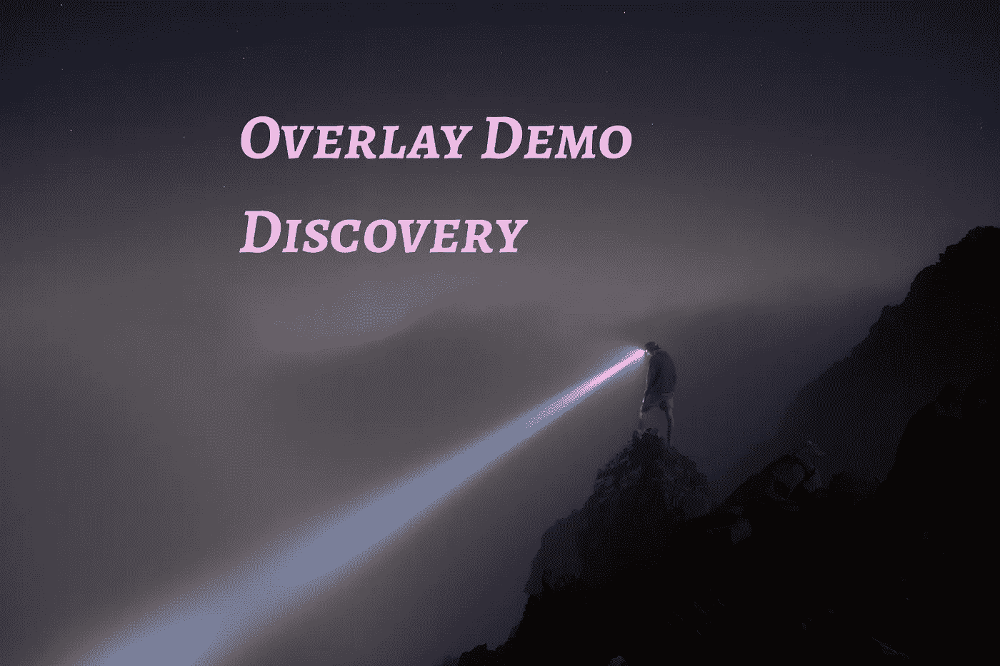

# 颤振叠加演示，发现

> 原文：<https://medium.com/geekculture/flutter-overlay-demo-discovery-928bd68ab208?source=collection_archive---------25----------------------->

Photo by [Issac Davis](https://unsplash.com/@isaacdavis?utm_source=unsplash&utm_medium=referral&utm_content=creditCopyText) on [Unsplash](https://unsplash.com/s/photos/discovery?utm_source=unsplash&utm_medium=referral&utm_content=creditCopyText)

一个人必须掌握的视觉设计解决方案之一是如何在颤振中使用覆盖。它们可以方便地构建工具提示、应用指南的发现叠加、弹出菜单(iOS 14)以及各种有用的东西。我将向您展示如何构建覆盖图的发现表单。

# 我们在建造什么？