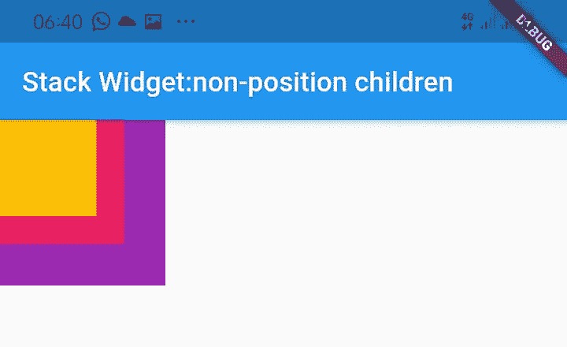
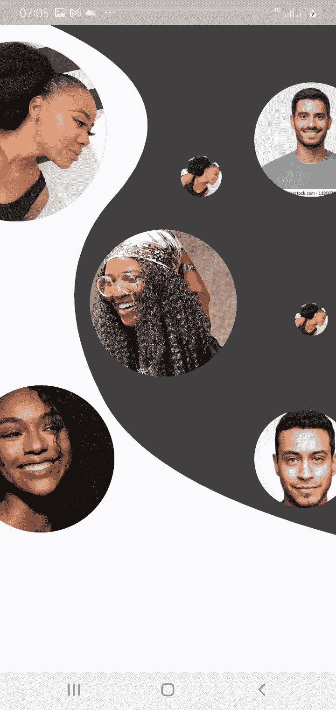

# 颤动:堆叠部件

> 原文：<https://medium.com/geekculture/flutter-stack-widget-bfdcf4c47212?source=collection_archive---------4----------------------->


image from unsplash.com

> 大家好。欢迎阅读另一篇关于 flutter 应用程序开发的文章。在我的上一篇文章中，我们使用自定义的油漆创建了一个漂亮的设计。在本文中，我们将借助于 ***堆栈*** 小部件来实现现有代码的另一个功能。我将使用几个月前开发的密码管理器应用程序的启动页面来解释这个堆栈小部件。

Stack 是一个小部件，它接受多个小部件，并允许我们在屏幕上从下到上对它们进行排序。在堆栈中，第一项在最底部，最后一项在最顶部。如果您想要重叠窗口小部件并在需要的地方显示，这是非常有用的。堆栈小部件使我们的 UI 更有吸引力。

每个子控件都需要在 stack 小部件中定位或对齐，否则默认情况下它会出现在左上角。堆栈中有两种类型的子元素:**已定位和未定位。**

**一个定位的子元素**被包装在一个至少有一个非空属性的定位小部件中。这个小部件根据它的 top、right、bottom 和 left 属性相对于堆栈放置。

**未定位的子部件**没有被包装在定位的小部件中。而是根据[对齐方式](https://api.flutter.dev/flutter/widgets/Stack/alignment.html)进行定位(在从左到右的环境中默认为左上角，在从右到左的环境中默认为右上角)。堆栈中的第一个子元素占用该大小，而其他子元素被放置在该大小上。

`Stack`的大小是层中最大的孩子的大小。因此，如果最底部的孩子占据了整个屏幕，那么堆栈的大小就是整个屏幕。

## 堆栈构造函数:

```
Stack(
{Key key,
AlignmentGeometry alignment: AlignmentDirectional.topStart,
TextDirection textDirection,
StackFit fit: StackFit.loose,
Overflow overflow: Overflow.clip,
Clip clipBehavior: Clip.hardEdge,
List<Widget> children: const <Widget>[]}
)
```

1.对齐:定义其子节点的位置。默认值是 topStart。以下是对齐的其他值:

```
*topLeft - align to top left corner.
topCenter - align to center point along the top edge.
topRight - align to top right corner.
centerLeft - align to center point along the left edge.
center - align to center point, both horizontally and vertically.
centerRight - align to center point along the right edge.
bottomLeft - align to bottom left corner.*
```

2.文本方向:从 *ltr* (从左到右)或 *rtl* (从右到左)放置文本。

3.Fit:确定未定位的子级如何调整大小以适合堆栈。该属性有三种类型:*松散*、*扩展、*和*穿越。*

*   **宽松**:将子 widget 尺寸设小。
*   **扩大**:尽可能扩大孩子的尺寸。
*   **passthrough** :根据父控件的位置设置子控件的相对位置。

4.溢出:控制子部件，当其内容溢出堆栈时，是可见的还是被剪切的。

5.ClipBehaviour:决定内容是否被剪辑。

> 让我们来看看非定位子在 Stack 中是如何工作的。

下面是堆栈中未定位的子级的示例。

```
import 'package:flutter/material.dart';void main() {
  runApp(MyApp());
}class MyApp extends StatefulWidget {
  @override
  _MyAppState createState() => _MyAppState();
}class _MyAppState extends State<MyApp> { @override
  Widget build(BuildContext context) {
    return MaterialApp(
      home: Scaffold(
        appBar: AppBar(
          title: Text('Stack Widget:non-position children'),
        ),
        body: Container(
            child: Stack(
          children: <Widget>[
            Container(
              width: 120,
              height: 120,
              color: Colors.*purple*,
            ),
            Container(
              width: 90,
              height: 90,
              color: Colors.*pink*,
            ),
            Container(
              width: 70,
              height: 70,
              color: Colors.*amber*,
            ),
          ],
        )),
      ),
    );
  }
}
```

结果:



image depicting non-positioned Stack

在本文中，我们将实现一个定位堆栈。所以，让我们直接开始吧！

我们希望实现以下设计:


首先，在`pubspec.yaml`文件中添加图像文件夹。

```
assets:
  - images/
```

接下来，添加堆栈小部件(这将是自定义 painter 的子部件)

```
child: Stack(
  children: [
    Positioned(
      top: 20,
      left: -90,
      child: CircleAvatar(
        radius: 110,
        backgroundImage: AssetImage('images/face1.jpeg'),
        //backgroundColor: Color(0xfffdea3a),
      ),
    ),
    Positioned(
      top: 70,
      right: -40,
      child: CircleAvatar(
        radius: 70,
        backgroundImage: AssetImage('images/face4.jpg'),
        //backgroundColor: Color(0xfffdea3a),
      ),
    ),
```

**代码解释**

`Positioned()` widget 允许我们给每个孩子一个明确的空间或位置。`top()`和`right()`属性用于实现设计。

`CircleAvatar()` widget 内置了 flutter SDK。它基本上是一个圆圈，我们可以在其中放置背景颜色、背景图像或一些文本。它通常使用用户的图像或首字母来描述用户。虽然我们可以从头开始创建一个类似的小部件，但是这个小部件对于快速应用程序开发非常有用。顾名思义，它为我们提供了一个圆形形状，因此您不必像使用容器小部件那样编写代码来获得一个圆形形状。

`radius`属性保存一个 *double* 值作为参数来决定 *CircleAvatar* 的半径大小。

`backgroundImage`属性将 *ImageProvider < T 扩展对象>类(final)* 作为参数。该属性将背景图像应用于 *CircleAvatar* 小部件。

**CircleAvatar 类的构造函数:**

```
const CircleAvatar(
{Key key,
Widget child,
Color backgroundColor,
ImageProvider<Object> backgroundImage,
void onBackgroundImageError(
dynamic exception,
StackTrace stackTrace
),
Color foregroundColor,
double radius,
double minRadius,
double maxRadius}
)
```

接下来，运行应用程序。

输出:



code output

接下来，添加包装在`Positioned()`小部件中的底部容器。

```
Positioned(
  bottom: 30,
  left: 80,
  child: Container(
    height: MediaQuery.*of*(context).size.height * 40,
    child: Column(
      mainAxisAlignment: MainAxisAlignment.end,
      mainAxisSize: MainAxisSize.max,
      crossAxisAlignment: CrossAxisAlignment.center,
      children: [
        Text(
          'Secure your Data from \n \t \t \t \t the Others',
          style: TextStyle(
            fontWeight: FontWeight.*bold*,
            fontSize: 22,
            color: Color(0xff404040).withOpacity(0.6),
          ),
        ),
        SizedBox(
          height: 20,
        ),
        Container(
          width: 100,
          child: LinearProgressIndicator(
            value: 0.85,
            backgroundColor: Color(0xfffbfaff).withOpacity(0.6),
            valueColor:
                AlwaysStoppedAnimation(Color(0xff404040)),
          ),
        ),
        SizedBox(
          height: 20,
        ),
        Container(
          height: 40,
          width: 200,
          decoration: BoxDecoration(
            borderRadius: BorderRadius.all(
              Radius.circular(25),
            ),
            boxShadow: [
              BoxShadow(
                  color: Color(0xffffffff).withOpacity(0.3),
                  offset: Offset.*zero*,
                  blurRadius: 1,
                  spreadRadius: 2),
            ],
            color: Color(0xff404040).withOpacity(0.6),
          ),
          constraints: BoxConstraints(maxHeight: 40),
          //alignment: Alignment.centerLeft,
          child: Text(
            'Get started',
            style: TextStyle(
              fontWeight: FontWeight.*bold*,
              fontSize: 20,
              color: Color(0xffffffff),
            ),
            textAlign: TextAlign.center,
          ),
        ),
      ],
    ),
  ),
)
```

**代码解释**

`Positioned()`小部件将`Container()`小部件保存在`Stack()`小部件中。`Container()`小部件将`Column()`小部件作为其子部件。`Column()`小部件接受水平放置的小部件列表。我们有用于文本的`Text()`部件和`LinearProgressIndicator()`部件。

`LinearProgressIndicator()`小部件用于以水平线显示任务的进度。

最后，运行 app。

结果:


final output

> 哇！那已经很多了😊。

在本文中，我们学习了如何在 Flutter 中使用 stack 类。请在下面的回复部分随意提问。
保留编码😊！！！

查看源代码 [**这里**](https://github.com/funmi-cod/password_manager_app/blob/main/lib/splashPage.dart)

❤ ❤谢谢你坚持到最后。❤❤

