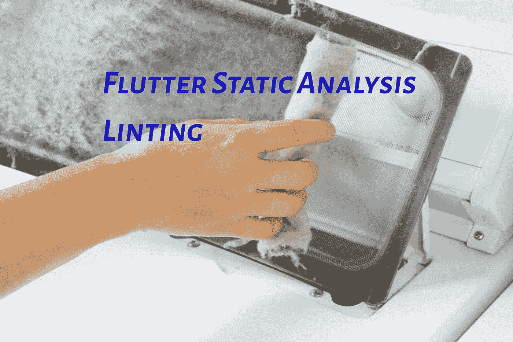

# 颤振静态分析，林挺

> 原文：<https://medium.com/geekculture/flutter-static-analysis-linting-5fb050128ead?source=collection_archive---------19----------------------->

静态分析允许您在执行一行代码之前就发现问题。有两大类静态分析，林挺和代码周期分析。在本文中，我将介绍如何使用 dart 分析器来 lint 分析颤振代码。

# **背景**

问题是，虽然谷歌在向你介绍小工具方面做得很好；这不是技术…