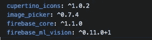
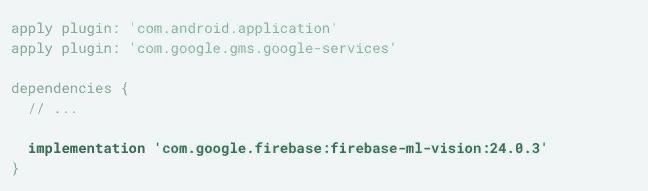
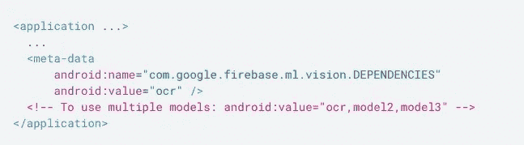
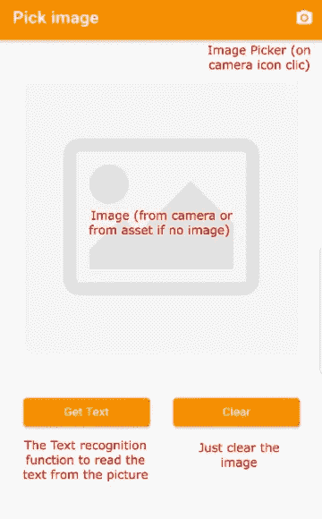
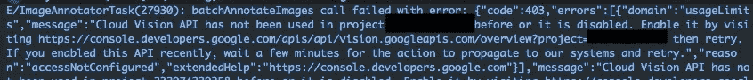
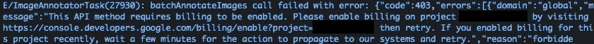
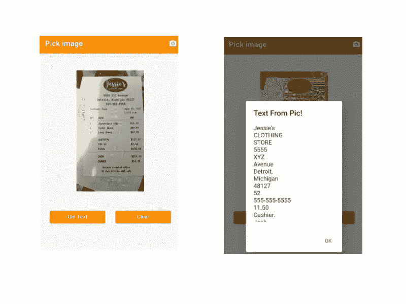

# 基于 Firebase ML 视觉的文本识别

> 原文：<https://medium.com/geekculture/flutter-text-recognition-with-firebase-ml-vision-80f887a0711a?source=collection_archive---------7----------------------->


## 这个项目是一个演示应用程序，可以从相机拍摄的图片中提取文本。我正在制作一个小的模拟应用程序，以草稿的形式展示给客户，这时我遇到了一些麻烦，主要是文档的一些问题。所以我决定把它写下来，这样我就不会忘记它，并且帮助其他将要使用这个插件的人。

首先要做的事情(除了创建一个新项目)是添加 firebase-ml-vision 插件，你可以在[这里](https://pub.dev/packages/firebase_ml_vision)找到它。在自述文件和安装部分告诉我们:“**您还必须为每个平台项目**配置 Firebase”。因此，如果您只将这个插件添加到 pubspec.yaml，您将会得到以下错误消息:

> *出错原因:评估项目时出现问题:“firebase_ml_vision”。
> 
> >找不到 firebase_core FlutterFire 插件，您是否已将其作为依赖项添加到您的 pubspec 中？
> 
> 哪里出错:配置项目时出现问题:firebase_ml_vision。
> 
> >未指定 compileSdkVersion。请将其添加到 build.gradle

所以，当你意识到一些显而易见的事情时，你也需要添加 firebase_core 插件。一旦你添加了 firebase-core 插件，第二个错误信息就会消失。所以我们的 pubspec.yaml 是这样的:(图像拾取器就是用相机拍一张图像):



**为了安装 firebase core 你需要遵循一些步骤，你可以在其他帖子中找到它们** [**这里**](/swlh/flutter-push-notifications-with-cloud-messaging-2559fbaf06f6#167c) 。

最后，你仍然需要根据[中的说明在这里](https://firebase.google.com/docs/ml-kit/android/recognize-text#before-you-begin)进行配置(对于 Android)。

在 app/build.gradle 中添加 ML Vision 依赖项:



可选但推荐的是，将您的应用配置为在从 Play Store 安装应用后自动将 ML 模型下载到设备:



现在，为了使用文本识别，我们将在“pages”文件夹下的一个新文件中创建一个简单的应用程序，文件名为“pick_page.dart ”,在那里我们将创建一个名为“PickReceipt”的新 StatefulWidget。该 Widget 将有一个图像拾取器，以便进行拾取(AppBar 上的相机图标按钮)并获取图片的文本。“PickReceipt”小部件将看起来像这样:



首先你必须初始化 firebase 来使用它:

对于应用程序，我们将使用一个具有一列的容器，该列包含树小部件、显示相机拍摄的图片的图像小部件和两个按钮，一个用于从图片中获取文本，另一个用于清除图片。

“拍照”方法仅使用图像拾取器用相机拍照。“showPic”方法使用 Image 小部件显示相机拍摄的照片，或者如果没有照片，则显示资产图像。

现在在按钮中，我们得到了“clearImage ”,它的唯一功能是清除相机拍摄的图像，还有“recognizeText”方法，它处理图像文本识别。

接下来你需要遵循插件文档中的步骤，你可以在[这里](https://pub.dev/packages/firebase_ml_vision#using-an-ml-vision-detector)找到。

> 1.首先要做的是创建检测器的一个实例:

```
final TextRecognizer _cloudRecognizer = FirebaseVision.instance.cloudTextRecognizer();
```

> 2.然后，我们必须从我们的相机图像创建一个 FirebaseVisionImage 对象:

```
final FirebaseVisionImage visionImage =FirebaseVisionImage.fromFile(_image);
```

> 3.我们需要用 visionImage 调用“processImage()”:

```
results = await _cloudRecognizer.processImage(visionImage);
```

> 4.最后一步我们需要提取数据，我们读取每个块，然后在对话框中显示图像中的文本(“showText”方法)。为了提取数据，我们使用“results”对象并获取它的 text 属性，最终首先读取块中的数据，然后读取行中的数据，最后读取每个行元素中的数据，因此最终的方法如下所示:

最后，使用 close()方法释放资源很重要:

```
@override
void dispose() {_cloudRecognizer.close();super.dispose();}
```

你还需要确保在项目中启用云视觉 API，为了做到这一点，你需要去谷歌开发者[控制台](https://console.cloud.google.com)并为你正在使用的项目启用 API。如果未启用，您将收到如下消息:



Error message Cloud Vision API not enabled

还要确保启用计费，否则您会收到以下错误消息:



Error message Billing not enabled

这是最后的结果:



Flutter Text Recognition Demo APP

[](https://imgur.com/a/6RNEnz9) [## 颤振文本识别演示应用程序

### 有 1 个视图的帖子。颤振文本识别演示应用程序

imgur.com](https://imgur.com/a/6RNEnz9) 

这就是我们如何使用 firebase_ml_vision 插件从图像中提取文本。app 用的是 flutter 2.0.5。请记住，使用这个插件时，事情可能会发生变化，所以请务必参考官方文档。

一如既往的项目代码在这里是可用的:【https://github.com/menagit/textrecognition】

****资源:****

*   **Firebase_ml_vision 插件:[https://pub . dev/packages/firebase _ ml _ vision # using-an-ml-vision-detector](https://pub.dev/packages/firebase_ml_vision#using-an-ml-vision-detector)**
*   **Firebase 核心配置示例:[https://medium . com/swlh/flutter-push-notifications-with-cloud-messaging-2559 fbaf 06 f 6 # 167 c](/swlh/flutter-push-notifications-with-cloud-messaging-2559fbaf06f6#167c)**
*   **Firebase 核心插件:[https://pub.dev/packages/firebase_core](https://pub.dev/packages/firebase_core)**
*   **谷歌云开发者控制台:[https://console.cloud.google.com](https://console.cloud.google.com)**