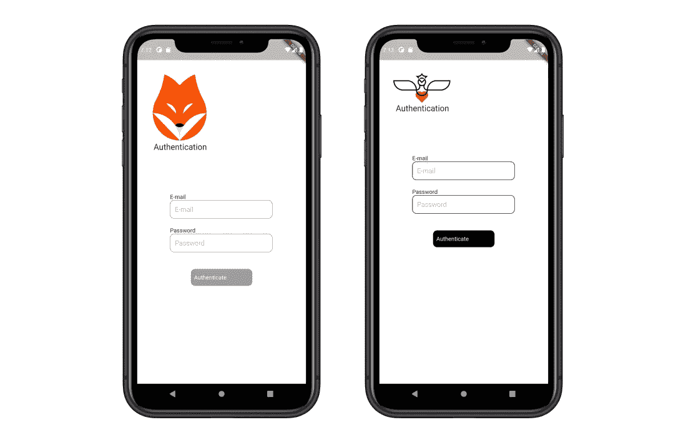
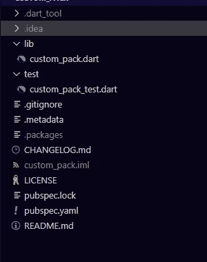

# 颤振:软件包的力量——第二部分

> 原文：<https://medium.com/geekculture/flutter-the-power-of-software-package-part-ii-56b825bf4a74?source=collection_archive---------54----------------------->


Photo by [Olav Ahrens Røtne](https://unsplash.com/@olav_ahrens?utm_source=medium&utm_medium=referral) on [Unsplash](https://unsplash.com?utm_source=medium&utm_medium=referral)

在我们讨论了软件打包的所有好处以及它如何成为公司发展业务和获得新客户的好选择之后

如果你没有阅读第一部分，你可以在这个链接中找到 [Flutter:软件包的力量—第一部分|作者 Badr Kouki | 2021 年 5 月| Medium](https://badrkouki.medium.com/flutter-the-power-of-software-package-part-i-ea5c6e145ca8)

在这一部分中，我们将使用 Flutter 来实现一个软件打包的例子，所以请准备好您的工作空间，但首先我们将阿瑟简要回顾一下软件打包

# 1 —软件打包和可编程应用

软件打包或可编程应用程序背后的想法是构建本身可以编程的应用程序，以便快速生成新版本或全新的完全不同的应用程序来满足所有客户的需求。

这个概念对于公司和开发者来说都是非常有益的，可以提高他们的技能，让他们的职业生涯更上一层楼，成为一个有经验的开发者，而不是普通的开发者。

在本文的剩余部分，我们将使用 Flutter 构建一个可编程应用程序的例子

# 2 —我们在构建什么？

为了从技术上理解软件打包是如何工作的，在本例中，我们将构建两个包含身份验证屏幕的示例应用程序，但第三个模块将在两个应用程序之间共享。

下面的屏幕描述了最终结果。



因此，第一步是构建公共模块，然后我们可以基于该包构建两个应用程序。

# 3 —创建包(插件)

为了在 flutter 中创建一个新的包，我们使用包名“custom_pack”执行下面的命令

```
flutter create --template**=**package custom_pack
```

该项目将只包含库和测试文件夹，你需要在你的新项目中找到这样的东西



Folders and files hierarchy in the new created project

在这个包中，我们将创建我们的自定义部件，这些部件将被集成到不同的应用程序中，但具有不同的参数。

在这个例子中，我们将只创建一个自定义输入字段和一个自定义按钮，但是在这个包中可以找到任何东西(其他复杂的小部件、业务逻辑、本机代码……)

**自定义按钮控件**

**自定义文本字段小工具**

此外，如果您在实现自己的包时遇到问题，也可以在这个库中找到完整的包

[](https://github.com/koukibadr/Custom-Pack) [## koukibadr/定制包装

### 一个新的颤振包计划。这个项目是 Dart 包的起点，Dart 包是一个包含代码的库模块…

github.com](https://github.com/koukibadr/Custom-Pack) 

# 4 —软件打包第一个示例应用程序

创建包后，下一步是使用它来创建我们想要的应用程序，并提供所有需要的配置。

**A —添加我们的定制包**

有许多方法可以将您的定制包集成为一个依赖项。在这个例子中，我们将使用 github 来引用我们的包。

在 pubspec.yaml 中，您可以执行以下操作来引用位于 Github 中的任何 flutter 包

**custom_pack :** 只是给包引用的一个名字，但是最好给它一个有意义的名字(包的名字)

**B —开始使用套餐**

在本例中，我们将使用自定义文本字段和自定义按钮小部件创建一个简单的身份验证屏幕。

此外，您可以完全访问这个存储库中的整个项目

[](https://github.com/koukibadr/Software_Packaging-FIrst-Example) [## koukibadr/Software _ Packaging-FIrst-Example

### 一个新的颤振项目。这个项目是颤振应用的起点。一些帮助您入门的资源…

github.com](https://github.com/koukibadr/Software_Packaging-FIrst-Example) 

# 5 —软件打包第二个示例应用程序

由于我们已经完成了第一个项目中的所有步骤，我们也将集成相同的包，但这里给 CustomTextField 和 CustomButton 的参数是不同的。

这里的链接给你第二个应用程序的完整代码，你会发现它类似于第一个。

[](https://github.com/koukibadr/Software-Packaging-Second-Example) [## koukibadr/软件-打包-第二个-示例

### 一个新的颤振项目。这个项目是颤振应用的起点。一些帮助您入门的资源…

github.com](https://github.com/koukibadr/Software-Packaging-Second-Example) 

# 6 —结论

也许你会发现我们在这里做的例子有点太简单了，但是这篇文章的主要目的是解释软件打包的力量。

正如我们在整篇文章中所看到的，我们只是在包中做了很少的工作，创建了两个定制的小部件(Button，TextField ),剩下的就是引用包并以我们想要的方式使用其中的任何小部件。

通过获得这个软件打包的小图片，你可以想象一个更大的情况，例如创建一个完整的定制部件(滑块、按钮……)，这些部件是特定于公司的，或者遵循一个定制图表，为了在公司每次启动一个新项目时创建这些高级组件，你和你的团队可以创建一个完整的私有框架，引用它并使用它的任何内容。

正如我们在第一部分中谈到的，软件打包不仅仅是针对图形组件的，你还可以向它添加业务逻辑以及高级计算，以便在以后的一些项目中使用它。

> “你可能不认为程序员是艺术家，但编程是一种极具创造性的职业。这是基于逻辑的创造力”——约翰·罗梅洛

我希望这篇文章能帮助你学习新的信息。谢谢你对我的关注。编码快乐！