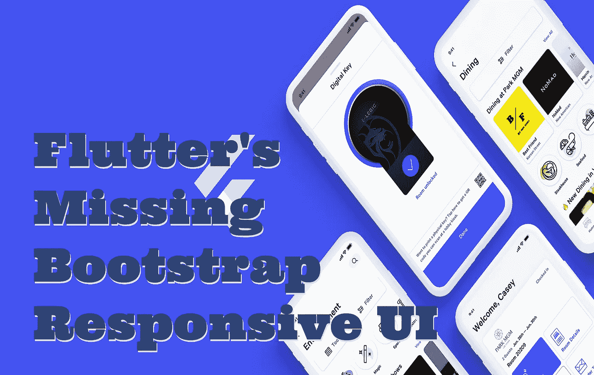

# Flutter 缺少引导响应 UI

> 原文：<https://medium.com/geekculture/flutters-missing-bootstrap-responsive-ui-dd9fb1fd5c76?source=collection_archive---------11----------------------->

随着 Web 现在进入稳定版本，桌面也将在接下来的几个月内进入稳定版本，很明显我们有一系列的 UI 布局问题。与最初创建 web bootstrap 所要解决的问题相同，即如何动态适应更大的屏幕，同时对计算足够敏感，不需要在资源受限的设备上进行像素级的媒体查询和计算 …