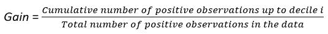
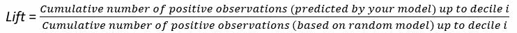
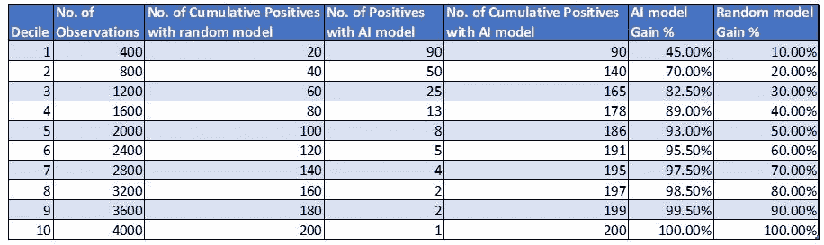
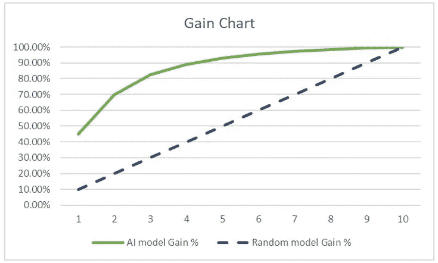
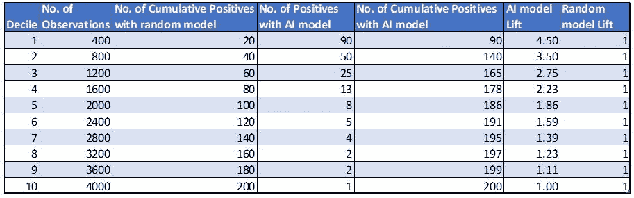
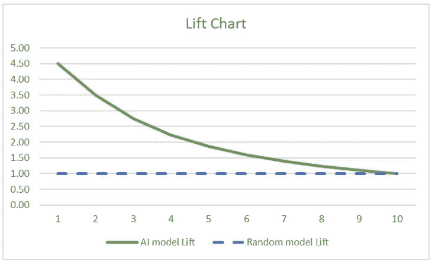

# 不要关注准确性，而要关注收益和提升

> 原文：<https://medium.com/geekculture/focus-not-on-accuracy-but-on-gains-and-lifts-35dece518296?source=collection_archive---------17----------------------->

## 客户和消费者人工智能

## 传达正确的业务指标，以实施您的人工智能解决方案

Image by [Mitchel Boot](https://unsplash.com/@valeon) on [Unsplash](https://unsplash.com/)

让我们假设你已经建立了一个很好的机器学习模型来预测消费者对给定营销活动的反应或参与倾向。关注 F1 分数、精确度、召回率、AUC、尤登指数、惩罚成本等指标是非常好的。在开发模型时。然而，当您用惊人的结果验证了您的模型后，您作为数据科学家的工作并没有马上结束。

> 你可能会对结果欣喜若狂，但业务涉众可能不会如此激动。如果没有他们的认可，你的模型永远不会投入生产。

# 为什么指针不动了？

在目标营销活动中，消费者的回应率通常很低(有时不到 1%)。许多组织打算利用人工智能模型来最大化此类活动的有效性，同时最小化成本。然而，尽管这些人工智能模型产生了令人鼓舞的结果，但实际部署的情况不到 25%。

虽然整个行业人工智能的低运营率有许多原因，但消费者分析和营销活动有效性改善解决方案的一个关键原因是使用了不正确的指标。你可能已经开发了一个很好的模型，它有很大的增加价值的潜力。但是如果你不能有效地与商业利益相关者沟通，你的模型就不太可能被生产。

> 模型准确性分数不会让业务中的关键决策者兴奋，除非您将它们转化为对他们更有业务意义的指标。

# 传达正确的指标

这就是增益图和提升图作为非常有效的沟通工具的地方。让我们继续用同样的例子来理解这些是什么。首先，让我们来谈谈机制。增益图和升程图可通过以下步骤获得:

1.用你的 AI 模型预测概率 Y=1(正类)。

2.按照预测概率的降序排列观察结果。

3.把数据分成十分之一。

4.计算每十分位数的阳性数(Y=1)以及每十分位数的累计阳性数。

> 增益是达到十分位数的阳性观察值的累积数与数据中阳性观察值总数的比率。

Image by author

增益图是以增益为纵轴，以十分位数为横轴绘制的图表。

> Lift 是达到十分位数的正面观察数(由您的模型预测)与达到十分位数的预期正面观察数(基于随机模型)的比率。

Image by author

提升图是以提升量为纵轴，十分位数为横轴绘制的图表。

# 增益图及其相关性

让我们假设我们有来自营销活动的 4000 个观察，其中只有 200 个观察(即 5%的响应)是正面的。在每个十分位数中，我们将有 400 个(4000 个的 10%)观察值。让我们假设下表总结了收益。

Image by author

由于数据中肯定的百分比为 5%，通过随机选择消费者，我们预计每 10 个消费者中有 20 个(400 个中的 5%)会做出肯定的回答。但是，通过使用该模型，然后按正面回答的概率降序排列观察结果，我们观察到在第一个十分位数中有 90 位消费者(所有正面回答的消费者的 45%)会做出正面回答。同样，在第二个十分位数中，你的模型预测有 50 个消费者会做出积极的回应，而随机模型预测只有 20 个。诸如此类。

Image by author

与随机模型相比，增益可以被解释为在识别可能对活动做出响应的消费者方面的增益。请注意，在随机模型中，营销团队必须瞄准 80%的消费者(即高达第 8 个十分位数)，以确保瞄准 80%的积极响应者(即 200 人中的 80% = 160 人)。而使用你的模型，营销团队只需要瞄准 30%的消费者(即，高达第三个十分位数)，就可以瞄准 80%以上的积极响应者(准确地说是 165)。

> 这就是你的模式带来的价值——营销成本降低了一半以上，同时保持了活动的积极响应水平！

# 提升图及其相关原因

现在让我们来讨论 Lift。下表总结了相同数据的提升量。

Image by author

Image by author

升力是对模型性能的一种度量。例如，在第一个十分位数中，与随机模型相比，使用您的模型锁定消费者可以获得 4.5 倍的积极响应者数量。

# 下一步做什么

当您使用正确的度量标准传达您的人工智能模型的商业价值时，相关的利益相关者将更有可能采用您的模型，并分配实现它所需的资源。然而，这仅仅是开始。为了成功地部署、扩展和操作您的模型，您必须考虑许多其他方面。但那是另一篇文章的单独主题！