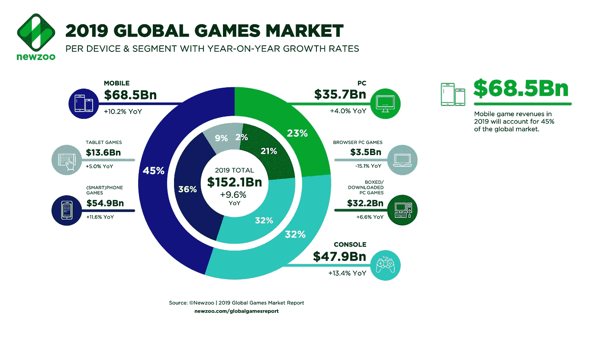
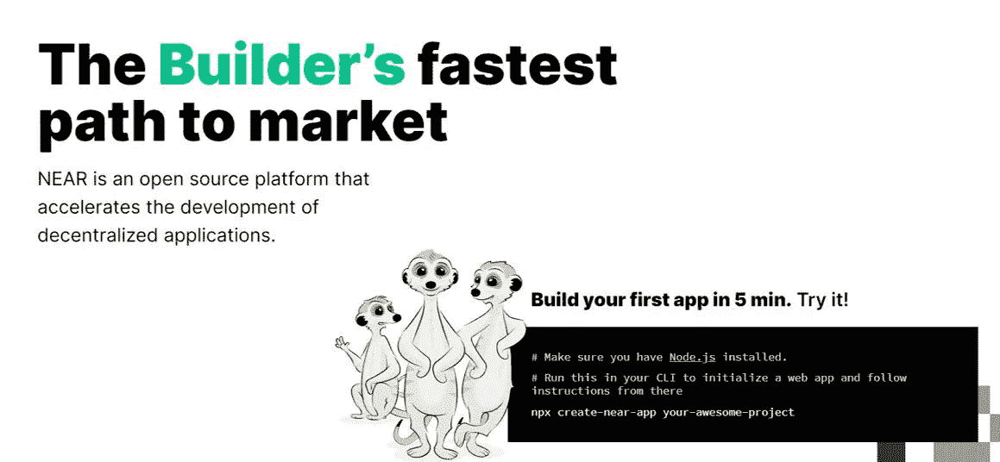

# 游戏行业:区块链应用的候选者——为什么——为什么不

> 原文：<https://medium.com/geekculture/focusing-on-gaming-sector-and-potential-for-blockchain-as-real-adoption-f790ab5dd590?source=collection_archive---------5----------------------->

[区块链技术](https://cryptopurview.com/how-far-we-are-in-adopting-blockchain-technology-a-view-from-blockchain-savvy-executives/)在不同的领域和部门有着非常广泛的应用，例如物联网、制造业和医疗行业供应链管理。然而，到目前为止，这些部门都没有成为区块链如何在完全接受和大规模采用的情况下实施的主要成功故事。

游戏显示了区块链真正采用的潜力:游戏，作为一种全球现象，每年产生超过 1500 亿美元的收入[，并且正在快速增长](https://newzoo.com/insights/articles/the-global-games-market-will-generate-152-1-billion-in-2019-as-the-u-s-overtakes-china-as-the-biggest-market/)。2019 年，全球游戏市场价值为 1515.5 亿美元，预计到 2025 年将达到 2569.7 亿美元，在预测期(2020 年至 2025 年)内，CAGR 将达到 9.17%。这是一个由有技术倾向的人经营的部门，而且主要是年轻人。区块链确实需要那一点点人物角色，以便尽早采用。

Global gaming market. Source: Newzoo.

玩过许多流行游戏的人都知道，对游戏虚拟物品的需求是巨大的。许多玩家沉迷于在游戏中前进的概念。

随着时间的推移，玩家建立自己的角色并收集游戏中的物品。这些物品可能是通过几个月的游戏获得的，需要相当大的努力。

# 一些例子说明了人们对游戏世界中虚拟物品的重视程度:

1.  在韩国，电脑游戏玩家数量庞大，一些报道称出现了帮派和黑手党。有实力的玩家偷窃，要求新手给他们虚拟货币作为“保护”。
2.  一名日本妇女因在流行游戏 MapleStory 中破坏了属于她“丈夫”的数据而被起诉。她因操纵电子数据面临最高[五年监禁](https://www.dailymail.co.uk/sciencetech/article-1080025/Japanese-woman-murdered-virtual-husband-online-game-faces-jail.html)或超过 3000 英镑的罚款。

在现实世界中，游戏中的物品，如角色/道具，已经获得了货币价值。易贝和专业交易网站允许玩家出售他们的虚拟物品。

这吸引了欺诈销售、洗钱、网络钓鱼攻击以及盗窃。此外，游戏数据库包含成千上万的信用卡信息，经常成为黑客攻击的目标。

此外，游戏行业还受到欺诈性下载的困扰。据估计，每销售和下载一个合法的虚拟物品，就有 [7.5 个虚拟物品](https://www.emarketer.com/Article/Rising-Tide-of-In-App-Fraud/1012731)下载因欺诈而损失。在中国等一些国家，这个数字可能更高。例如，每下载一个合法项目，就有 273 个欺诈性虚拟项目。这意味着所有虚拟商品购买中有惊人的 50%是非法的。你可以想象，如果没有这种欺诈性下载，会产生多少收入。

根据一份新的报告，流行的智能手机游戏，如“部落冲突”，正被用来代表信用卡窃贼洗钱数十万美元。

2015 年，据报道，世界上最受欢迎的 PC 游戏在线商店 Steam 的大约 77，000 个账户被劫持。

像《魔兽世界》、《最终幻想 XIV》和《英雄联盟》等游戏的在线留言板上充斥着用户帐户和虚拟物品被盗的故事。

因此，考虑到我上面提到的巨大规模和挑战，[博彩业确实显示了区块链产业的潜力](https://cryptopurview.com/gaming-potential-for-blockchain-as-a-real-adoption/)。以下是使用区块链解决游戏行业问题的所有方法，以保护玩家和游戏开发者的利益。

**(1)让支付处理变得安全:**游戏数据库包含了成千上万的信用卡详细信息。玩家担心这些信息的保护问题。有了区块链，游戏玩家可以远离他们的借记卡或信用卡。无论支付金额有多小，这项技术都提供了一种安全的支付方式。骗子没有办法窃取信息。

**(2)最大限度地减少欺诈下载:**游戏行业遭受在线欺诈下载的打击最大。通过根除每一个欺诈机会，区块链钱包可以节省数十亿美元。对于每次成功的购买或下载，购买者的公钥记录(将用于下载)被保存在分散的数据库中。

当玩家打开应用程序时，他们输入相关的私钥或使用钱包解锁并享受游戏。这相当于个人用户许可。黑客不可能篡改这个数据库来添加假账户。

**(3)虚拟物品的安全交易:**虚拟物品的交易网站经常成为黑客的目标，其安全性比购物网站或网上银行弱。使用区块链可以创建一个分散的市场，在那里可以安全可靠地交易物品。在游戏中获得的每个虚拟物品都与所有者的公钥(类似于所有权)相关联，黑客无法猜测个人账户的私钥(或解密密钥)。这将使得物品只有在拥有者用其秘密私钥批准交易时才能被交易。

**Sheldon gets hacked on World of Warcraft**

**谢耳朵会喜欢的。还记得《生活大爆炸》第四季第 19 集吗，谢尔顿在《魔兽世界》上被黑了。**如果这些游戏是在区块链进行的，就不会发生这种事，除非他使用了糟糕的密钥存储方法。了解谢尔登，他肯定会记得他的私人钥匙或安全地存储它。

游戏应用程序有可能使用区块链，并有助于转变传统复杂的商业模式，以增强安全性、透明度和降低成本。

尽管有这些好处，传统博彩业却袖手旁观。可扩展性是瓶颈之一，但是，对于传统游戏行业的玩家来说，单独解决这个问题并不能令人信服地进入这个领域。

缺乏开发人员友好的工具、基础设施负担以及不太容易的用户入职流程阻碍了 dApps 的发展。简而言之，除了可伸缩性，区块链应用程序需要提供与 Web2 应用程序相似的用户体验。

# 近协议—在其区块链体系结构和编程模型中引入了新思维:

NEAR 协议不仅解决了区块链的可扩展性问题，还解决了早期区块链协议中没有解决的用户和开发者适应性和可接受性等问题。

NEAR protocol 是一个分片的、开发人员友好的、证据确凿的可扩展公共区块链，从头开始构建，使开发人员能够更轻松地构建和搭载用户。

# 是什么让 [NEAR protocol](https://cryptopurview.com/near-usdt-price-live-charts/) 成为在其上构建游戏应用的完美区块链解决方案？

大规模采用区块链游戏应用面临的挑战之一是主流玩家难以加入。在大多数情况下，玩家需要下载 Metamask Chrome 扩展钱包，生成地址，注册交易所，购买 ETH，将 ETH 发送到他们的钱包，然后他们就可以开始游戏了。

对于一个精通加密的人来说，这可能听起来不太复杂，但是对于普通的 Bob 来说，这完全是令人厌烦的。因此，游戏开发者关注的焦点是从加密社区吸引玩家(用户)，限制他们的用户(或观众)基础。

[NEAR 协议](https://near.org/)解决了开发者代替用户支付交易费用的挑战。用户可以免费试用分散式应用，就像他们试用所有其他应用一样。开发人员可以为他们预付交易费用，这样他们的用户就不需要为了开始使用应用程序而想办法在外部交易所购买加密令牌。

为了避免普通 Bob 首先知道“什么是区块链或本机令牌”的复杂性，开发人员可以使用 NEAR 的渐进式安全功能，该功能允许用户注册(或注册)该应用程序，就像他们从 Web2 注册其他应用程序一样。

通过这种方式，用户可以逐步了解分散式应用程序，从而方便用户的加入。一旦用户准备好提交，他们就可以链接他们的帐户安全，而不需要任何浏览器扩展，如 Metamask。

此外，游戏用户可以授予应用程序代表他们签署区块链交易的权限，并可以随时撤销这些权限。已知世界中使用类似方法(渐进式学习)的一个例子是 Neon District，它负责监管玩家(或用户)，直到他们为区块链做好准备。一旦游戏玩家选择拥有他们的数字资产，这些资产就可以以分散的方式获得。

另一个在区块链游戏早期显而易见的挑战是缺乏开发人员友好的工具。

大部分区块链游戏的开发经验都是次优的。鉴于大多数开发人员极度关注构建游戏中使用的分散协议/智能合约，如果与通过集中工程工作构建的工具相比，最终结果(app)并没有很好地集成。

为了解决开发人员的困难，NEAR 协议提供了一个得到良好支持的 OSS 堆栈，开发人员可以使用熟悉的语言编写区块链智能合同，比如 Typescript 和 Rust，这些语言编译成 WebAssembly。这使得开发者更容易，因为他们不必学习一种新的领域语言来编写智能合同。

NEAR protocol 还为开发者提供了一个在线集成开发环境，为开发者提供软件开发的综合设施。使用在线 IDE，开发人员可以浏览、导航或可视化编程代码结构中的组件，还可以自动化/调试他们的智能合约。这使得开发过程简单、快速，开发者可以专注于构建功能丰富的应用，而不仅仅是基本的基础设施。

对于感兴趣的开发者来说， [NEAR 协议](https://near.org/)包括一个[开发者项目](https://near.org/developer-program/#faq)，开发者可以利用 [NEAR 漫游教程](https://docs.near.org/docs/tutorials/test-your-smart-contracts)来创建他们的第一个 dApps。一旦准备就绪，他们就可以使用 NEAR protocol 的测试环境来测试他们的区块链应用。此外，开发人员可以连接到 NEAR 的全球[社区](https://portal.near.org/)，他们将尽一切可能支持您构建和增强您的应用程序。

开发人员程序、测试环境、套件和以熟悉的编程语言开发智能合约的灵活性相结合，使开发人员能够以接近协议的方式构建功能丰富的应用程序，并提供愉快的用户(客户)体验。