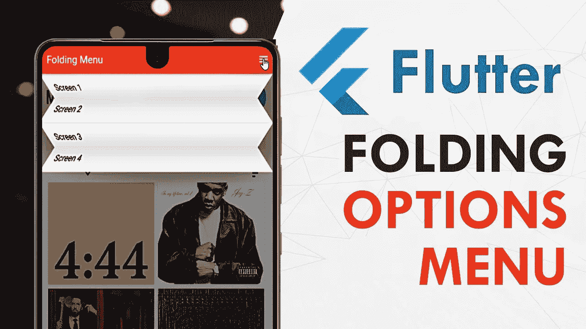
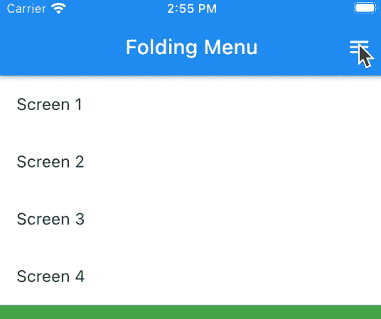
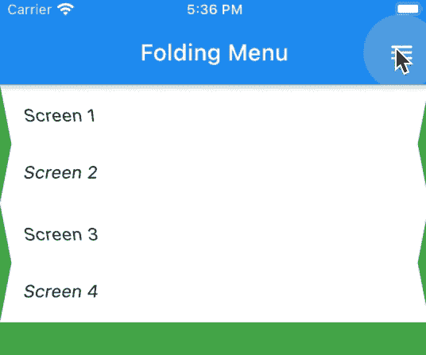

# Flutter 中的折叠选项菜单

> 原文：<https://medium.com/geekculture/folding-options-menu-in-flutter-c7dc8c95e6c5?source=collection_archive---------19----------------------->

菜单是任何现代移动应用程序中最重要的部分之一。应用程序中主要有两种类型的菜单，上下文菜单和选项菜单。我已经创建了一个[聚焦菜单](https://youtu.be/Y2XyyJcSTQo)包，它将帮助你获得应用程序上下文菜单的独特感觉，现在我想介绍这个[折叠菜单](https://pub.dev/packages/folding_menu)包，你可以在你的 Flutter 应用程序中使用它作为选项菜单。

使用包装是好的，但是在本文中，我将帮助您理解制作这个包的代码。首先，让我们看看这是如何工作的…

好吧，那我们开始吧

我们需要做的第一件事是创建一个名为 ***FoldingMenu 的新的有状态小部件。*** 该文件夹菜单工作所需的三个基本属性是:

1.  ***children:*** 显示为每个折叠图块的一组子部件。
2.  ***折叠:*** 从父控件控制菜单的折叠状态，即从屏幕的 AppBar 动作按钮控制该菜单的折叠。
3.  ***持续时间:*** 描述菜单折叠/展开所需的时间。它看起来会像这样:

生成的小部件看起来会像这样:

一旦这个完成了。我们需要关心的第一件事是，菜单小部件将如何响应 ***【折叠】*** 状态的变化。好了，为此我们有了一个很好的简单的覆盖***"***[***diddupdatewidget***](https://api.flutter.dev/flutter/widgets/State/didUpdateWidget.html)***"***由有状态小部件类给我们。这为我们提供了小部件的前一个实例，即 FoldingMenu，我们可以将其与当前实例进行比较，并根据结果决定执行一组操作。代码看起来会像这样:

现在我们知道，我们将如何检测折叠状态的变化，以及我们的小部件将如何响应。让我们来看看当折叠状态改变时我们需要做些什么…..你猜对了！我们需要制作小部件的动画，为此，我们需要在小部件中设置一个 [**动画控制器**](https://api.flutter.dev/flutter/animation/AnimationController-class.html) 和 [**动画**](https://api.flutter.dev/flutter/animation/Animation-class.html) 实例。因为我想让我们的动画有一个漂亮平滑的感觉，我还会在我们的状态中创建一个[**curved animation**](https://api.flutter.dev/flutter/animation/CurvedAnimation-class.html)的实例，这样我们就可以在所有的动画中使用它。我们还将在 ***initState*** 函数中向 AnimationController 实例添加一个监听器，用每个新值*(确保在 dispose 函数中处理它)*更新 UI。让我向您展示我们的代码此时应该是什么样子，然后我将解释一切是如何工作的:

现在，在上面的代码中，有一些事情可能会让你感到惊讶。你可以看到我们这里有两个动画实例，分别是 ***_animation*** 和 ***_transAnimation。*** 这是因为，当菜单关闭时，它的每一个磁贴都会同时平移(上下移动)和旋转，因此我们必须同时对它们进行动画处理。我们将对这些使用相同的 CurvedAnimation 和 AnimationController 实例。

与此同时，还有一个名为 ***的函数 initiate imations***，它采用了一个参数 ***【折叠】*** *。*基于这个折叠状态，我们初始化/复位***_ 动画*** 和***_ 动画*** 。transAnimation 的值将从 0 到 1，我们将 ***乘以这些瓷砖必须覆盖的距离(取决于瓷砖的高度)*** ，而 _animation 的值将从 0 到 1.57 弧度，相当于 90 度。同样，一旦我们在***initiate animations***中为动画设置了值，我们就必须重置 AnimationController 并通过调用 ***forward()*** 函数来重启它。

现在，我们在哪里调用这个***initiate imations***函数呢？

嗯，我们在初始化 AnimationController 和 CurvedAnimation 之后，在 ***initState*** 函数中使用这个函数，然后在 ***didUpdateWidget*** 函数中调用这个函数，以便根据新的折叠状态更新动画。

好了，只是为了一些视觉上的上下文，我将在 ***build*** 函数中添加一些代码，以基于 ***_animation*** 值来 ***转换*** 子部件。

在上面的代码中，我们使用一个列从上到下对子部件进行排序，并且我们将使用一个 Transform 部件分别对它们进行动画处理。

> 如果你不知道变换和透视是如何工作的，我建议你看看这篇令人惊叹的 [***文章***](/flutter-community/advanced-flutter-matrix4-and-perspective-transformations-a79404a0d828) 作者 [Deven Joshi](https://medium.com/u/abc8b1aeb318?source=post_page-----c7dc8c95e6c5--------------------------------) 。

现在让我们使用这个折叠菜单，看看我们的用户界面是什么样子的:

我们使用 Stack 作为父布局在我们的主屏幕内容上显示折叠菜单，目前，我们正在传递两个参数 ***子菜单*** *(带有 4 个 ListTile 小部件)* 和 ***折叠菜单*** *(值为“openMenu”)*来控制菜单*的折叠和展开。*结果将是这样的:

请注意，图块是如何旋转的，对齐方式为 ***顶部居中。*** 但是我们真的希望它们这样旋转吗？

如果你想一想，我们想要的行为是相对于百叶窗而言的。第一个图块(即奇数图块)应从其 ***顶部中心*** 旋转，而第二个图块(即偶数图块)应从其 ***底部中心*** 旋转。

此外，请注意，瓷砖是固定在一个位置，我们希望它们在菜单打开时向下移动，在菜单关闭时向上移动。为此，我们必须计算瓷砖的高度。请记住，每个瓷砖的高度应该相等。为了得到这个高度，我们可以使用 ***WidgetsBinding*** 类的***addpostframcallback***函数。当小部件的第一帧被渲染时，这个函数被调用。关于这个 [***你可以在这里***](https://api.flutter.dev/flutter/scheduler/SchedulerBinding/addPostFrameCallback.html) 了解更多。

这一切都很好，但是，即使在***addPostFrameCallback***中，我们如何在不引用每个图块的情况下获得图块的高度呢？为此，我们必须获取 FoldingMenu 中的*子元素，并遍历它们来创建一个新的 ***列表*** ，称为***“widgets”。*** 在这个循环中，我们将获取每个孩子并用容器小部件包装它，同时为它分配一个新的 ***GlobalKey*** 实例作为 key *(我们也将把它放在一个名为****【keys】****)*的列表中，我们将获取每个孩子的索引。我们将把这个值列表 ***【索引，容器】*** 添加到 ***【小部件】*** 列表中。这个索引将帮助我们检测列表平铺是偶数还是奇数。然后我们将在 **addPostFrameCallback** 中使用这个键来获得列表平铺的高度。除此之外，我们还必须获得每个图块的**位置**，以便在制作动画时将它们准确地转换到它们应该在的位置。我们将把这个放在一个名为 ***位置*** 的地图实例中。这段代码将进入 ***initState*** 函数，现在看起来像这样:*

*现在，让我们更新构建函数，以利用这些新的集合(键、小部件、位置等)*

*你可以看到，基于我们之前所做的，我们现在循环通过我们在 ***initState*** 中创建的列表***【widgets】***，而不是循环通过我们在 FoldingMenu 中接收的 raw "***widgets . children "***。我们还使用索引来检测奇数/偶数*图块并使用 ***isOdd*** 来选择适当的 ***对齐和旋转值。*** 这样的结果会是这样的:**

****

**With Rotation Transformation**

**现在，让我们进行图块翻译，为此我们将使用***_ transAnimation***实例和 ***位置*** 列表。在这段代码的前面，我们计算了瓷砖的高度，并将其存储在一个名为 ***elementHeight 的变量中。*** 现在使用这个，我们将从 FoldingMenu 的顶部平移瓷砖到每个瓷砖应该到达的位置。有了这个，我们的构建函数将如下所示:**

**对于平移，我们用另一个变换来包装先前的旋转变换。这种对齐将始终是 ***TopCenter*** 并且我们将使用 Matrix4 的***translation values***函数为 ***变换提供值。*** 我们只提供“Y”平移值*(上面代码片段的第 13、14 行)*，因为我们只需要垂直移动图块。经过这一小小的改动，我们的应用程序将如下运行:**

****

**有了这个，我们现在有了一个工作折叠菜单。唯一留下的就是你在原包装中看到的阴影。**

**因为这篇文章已经太长了，我把它作为一个挑战留给你🎯。如果你在实现阴影时有问题，你可以在这里查看原始的包代码:**

** [## 倒车影像/折叠 _ 菜单

### 一个用于颤振应用的简单易用的折叠菜单-retro portal studio/Folding _ Menu

github.com](https://github.com/retroportalstudio/folding_menu/blob/main/lib/folding_menu.dart) 

所以，我希望你从这篇文章中学到了很多。另外，查看在您自己的应用程序中使用这个包的教程。链接如下👇🏻：

> **Youtube:**[https://youtu.be/xheS5wDodX4](https://youtu.be/xheS5wDodX4)
> 
> **包:**https://pub.dev/packages/folding_menu

如果你想支持我的工作，请考虑关注我:

> *推特:* [*https://www.youtube.com/theretroportal*](https://www.youtube.com/theretroportal)
> 
> *Instagram:*[*https://www.instagram.com/retroportalstudio*](https://www.instagram.com/retroportalstudio)
> 
> *LinkedIn:*[*https://www.linkedin.com/in/parasjainrps*](https://www.linkedin.com/in/parasjainrps/)
> 
> *Github:* [*https://github.com/retroportalstudio*](https://github.com/retroportalstudio)

Happy Coding! ⚠️**