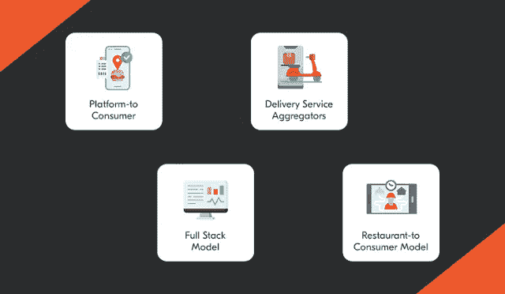

# 送餐业务模式——对送餐机构利润的贡献

> 原文：<https://medium.com/geekculture/food-delivery-business-models-contributing-to-profits-of-meal-delivery-setups-516cf210d04a?source=collection_archive---------22----------------------->

在疫情之后，几乎所有的网上商店，尤其是那些提供网上送餐的餐馆，都变得越来越受欢迎。受欢迎程度如此之高，以至于它的整体盈利范围也在扩大。这是为什么那些经营传统餐馆的人开始将他们的服务数字化的主要原因。换句话说，他们通过投资一个食品订购应用程序，为他们提供的服务提供了一个应用程序基础。尤其是考虑到市场上从 Zomato 到 Swiggy 再到 UberEats 的顶级食品配送应用，开发应用的动力就更大了。

因此，如果一家企业到目前为止一直离线提供食品配送服务，他们必须获得应用程序优势。

这是我们将在下面的文章中讨论的内容。让我们来了解一些数字，这些数字给出了在线食品订购和交付应用程序的盈利和利润范围的估计。

## 描绘食品订购应用程序有利可图范围的统计数据

*   食品配送部门目前的估值为 323.0 亿美元。
*   2022 年用户数量增长 23.7%。
*   预计到 2027 年，市场容量将达到 4662 亿美元。

所有这些估值足以估算出该行业，尤其是该应用的盈利范围。

那么，你想了解导致其受欢迎的食品配送商业模式吗？阅读下面几行，深入了解这一领域。

## 送餐业务模式——它由什么构成？

送餐业务模式由不同的技术组成，通过这些技术，送餐给消费者并赚取可观的利润。

**当我们区分它们时，它们被分为四类，即:**

*   平台到消费者
*   交付服务聚合器
*   全栈模型
*   餐馆到消费者模型

**让我们在下面的行中了解这些模型。**

**1。平台到消费者模式**

该模式包括第三方应用程序，列出餐馆，并让用户可以访问附近的餐馆，这样他们就可以很容易地从那里订餐。此后，在获得跟踪订单的适应性后，他们也会收到订单到达的通知。

**2。交付服务聚合器**

在这种模式下，一个平台充当顾客和众多当地餐馆之间的中介。这为这些机构提供了动力，让他们的服务更受关注，并直接获得收入。

**3。全栈模式**

这种模式涉及餐馆执行任务——从送餐到构建应用程序，再到让司机上车。由云厨房使用，该模型因向最终客户提供更高质量的送餐服务而闻名。

**4。餐厅对消费者模式**

麦当劳等品牌使用的这种模式涉及到他们与应用程序合作，以防他们在该地区不送餐，或者开发一个应用程序来列出他们提供的饭菜，以便他们的知名度得到成倍提高。

了解了这四种订餐 app 商业模式，我们相信你一定想知道如何为模式做出正确的选择，或者如何知道哪种模式适合我。要像专业人士一样执行此操作，请遵循以下步骤。

## 如何选择合适的送餐经营模式？

*   研究客户需求
*   了解市场指标
*   检查你的竞争对手的行动

遵循并坚持所有这些步骤，您将成功做出正确的商业模式选择，并为您的食品配送业务带来竞争优势。

现在，我们已经了解了不同的商业模式，以及采用何种技术会使选择变得更容易，让我们来讨论一下在线食品订购和交付应用程序。

## 关于订餐应用的一切

食品订购应用程序专注于简化将食物交付给客户的方式。通过极其简单的操作，该应用程序允许最终用户简单地输入位置细节，并获得附近餐馆的列表，他们可以根据这些列表灵活地选择用餐地点和用餐，并订购它们。简而言之，它对客户来说具有非常重要的价值。

此外，由于这些解决方案为餐厅和送货司机提供了最佳功能，因此在这些细分市场中也非常受欢迎。

其中一些特征如下-

*   设置可用性(针对驾驶员)
*   订单管理(餐厅)
*   菜单管理(餐厅)
*   应用内呼叫(针对司机)
*   库存管理(餐厅)
*   收入(司机)

## 如何用订餐 App 转型运营？

*   分析业务模型，并选择一个适合您将推出解决方案的地区以及您正在为其构建解决方案的用户的模型。
*   评估将简化所提供服务的功能。
*   检查技术堆栈，这些堆栈的添加将使应用程序功能强大。
*   通过研究，与离岸的专业送餐应用开发公司联系，获得一流的按需[送餐应用开发服务](https://www.fooddeliveryclone.com/)。

这会让你成功地从竞争对手中脱颖而出。

## 开发送餐应用程序的预计成本

作为一家通过在线食品订购和交付应用程序进入应用程序竞争世界的食品交付初创公司，成本因素必须得到关注。

根据您选择的商业模式、功能和设计，开发一个食品配送应用程序的成本大约在 25，000 美元到 35，000 美元之间。

因此，重要的是要记住一些要点，以便财务保持在检查范围内。**下面是同一个入伍者——**

*   保持设计简单。
*   仅添加相关功能。
*   避免在内部做项目——从印度、乌克兰等外包出去，以节省成本。

仔细遵循这些要点，你将能够成功地给你的食品配送创业所需的推动，而不需要花费太多的资金。

# 包扎

生活在一个食品订购应用已经成为日常秩序的时代，毫不奇怪，商业模式的知识也是一个值得关注的重要因素。在帮助创业公司评估和选择模式方面，还有很长的路要走。尽管如此，这仍是一场斗争。这是那些踏入这个竞争激烈的行业的人。它需要与海外的合作伙伴建立联系，这样他们就可以轻松做出选择。同时也让他们更容易利用回报和收入。所以，如果你还在纠结这个，今天就联系海外专门的送餐 app 开发公司吧。

了解你的业务需求，你的竞争对手等，将让你获得一个商业模式，让你赚取最大百分比的投资回报。