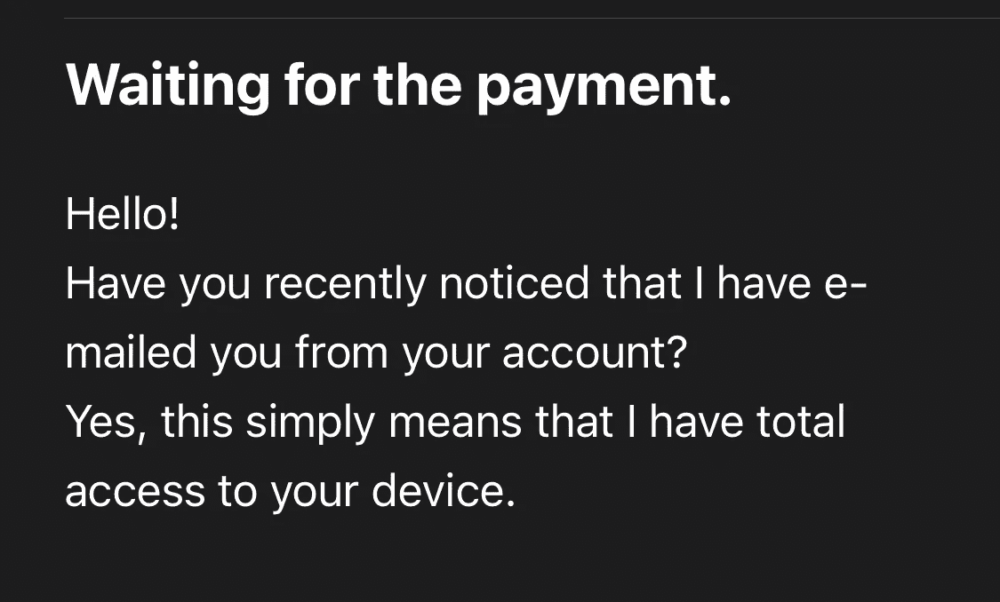

# 愚弄我一次

> 原文：<https://medium.com/geekculture/fool-me-once-5160cff9aea?source=collection_archive---------37----------------------->

这是一个关于我的 Outlook 账户如何被黑，需要什么，以及我如何纠正我的错误的故事。

The start of the Ransom Mail

让我以我曾经是个多么愚蠢的人来开始这篇文章。我是计算机专业的学生，我知道网络安全的重要性。但是像其他所有的懒人一样，我为我打开的所有网站保留了相同的密码。从社交媒体到投资应用，我的密码都是一样的，尽管我知道有风险。我以为我的…