# 足球分析:尝试使用概率图形方法改进当前的预期目标度量

> 原文：<https://medium.com/geekculture/football-analysis-attempt-to-improve-upon-the-current-expected-goals-metric-using-probabilistic-7372dbed7649?source=collection_archive---------31----------------------->

# 摘要

这个项目基于足球中 xG 度量的概念，它测量射门质量或平均射门得分的概率。目的是使用贝叶斯网络计算 xG 指标，并使用逻辑回归将结果与基线模型进行比较。

# 介绍

## 预期目标(xG)指标

> 巴洛特利，…..阿圭罗。我发誓你再也不会看到这样的事情了。所以看着它，喝进去。
> 
> ——2012 年马丁·泰勒，曼城对 QPR 英超冠军赛。

与其他运动相比，足球是一项得分相对较低的运动，因此在比赛中不可预测。1993 年至 2011 年间，英格兰、德国、西班牙、意大利和法国的顶级联赛平均每场进球 2.66 个，而在国家篮球协会，每场得分超过 160 分。

在足球中，比赛和锦标赛往往是由个人的辉煌时刻决定的。这就是这项运动的特别之处，它的球迷如此热情——然而对分析家来说却是一场噩梦。毕竟，一个潜在价值数百万美元的俱乐部做出的决定，不能仅仅基于当前的形式。

为了给这种混乱带来一些秩序，消除进球得分的不确定性，Sam Green 在 2012 年引入了预期进球(xG)指标。它衡量射门质量或平均射门得分的概率(图 1)。这意味着我们可以超越固有的随机的实际进球，来研究平均应该发生什么。

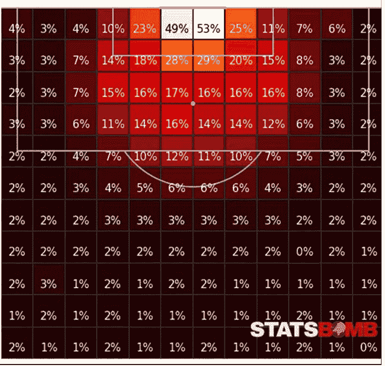

Figure 1: The probability of a shot resulting in a goal based on the location.

这很有用，因为足球俱乐部现在可以做出更明智的招聘或战术决定。例如，俱乐部可以超越一名球员的进球或助攻数量，并确定哪些球员可能运气不佳，但创造了高质量的机会。同样，他们也通过确保不会因为一个幸运的连续进球而为一名球员支付过高的价格来降低他们的招聘风险。

基于这一理论，利物浦俱乐部的分析师得出结论，多特蒙德的教练尤尔根·克洛普在上一个赛季运气不佳，多特蒙德实际上应该在最终的德甲积分榜上高出 5 位(图 2)。因此，尤尔根·克洛普被利物浦聘用，尽管他在多特蒙德的最后一年表现不佳。

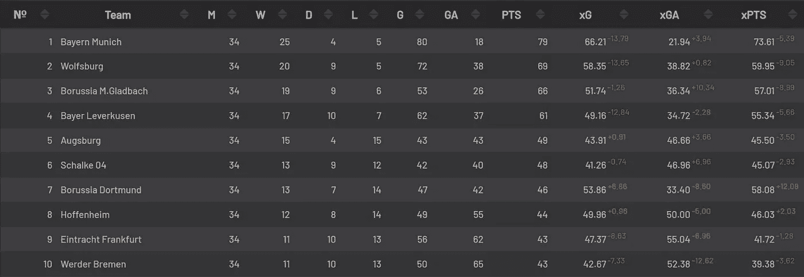

Figure 2: Bundesliga, 2014–15

预期目标是一个经典的监督学习问题，其中分类模型的任务是在给定拍摄时的上下文信息的情况下，识别一个镜头是否是目标。

因此，如果我们考虑一个伯努利随机变量，假设*是 _ 目标，*当射门得分时为 1，否则为 0。那么镜头的 xG 度量被定义为*的条件期望 is_goal，*因为

**E( *is_goal|* 地点，身体部位，…)= P(*is _ goal*= 1 |地点，身体部位，…)**

通常使用逻辑回归方法计算一个镜头的 xG，但是也可以使用其他分类算法，例如决策树和随机森林。在这个项目中，一个概率图形模型，更具体地说是一个贝叶斯网络，将用于计算 xG 指标。

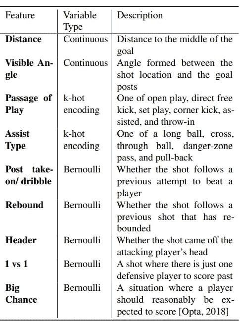

Table 1: Features used in the original xG model

与所有其他监督学习问题一样，选择学习的特征对获得的 xG 有很大影响。Sam Green 在他的原始模型中使用的数据如表 1 所示，其他分析师后来添加了许多其他特性。然而，由于可用数据和时间的限制，本项目中的分析基于有限数量的特征，这将在后续章节中讨论。

## 概率图形模型

一个图包括由链接连接的节点。在概率图形模型中，节点表示随机变量，链接表示变量之间的概率关系。然后，该图捕捉所有随机变量上的联合分布可以被分解的方式，从而可以看到节点之间的条件关系。这个项目将主要关注有向无环图或贝叶斯网。

贝叶斯网络具有带方向性的链接。它们对于表达随机变量之间的因果关系很有用。例如，让我们考虑一个简单的贝叶斯网络的 4 个变量:湿草(WG)，下雨(R)，多云(C)和喷头(S)。在没有任何进一步信息的情况下，联合概率分布可以写成—

## *P (WG，C，S，R) = P(WG|C，S，R) P(S|C，R) P(R|C) P(C)*

现在，假设我们能够了解变量之间的因果关系，如图 3 所示。

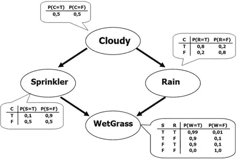

Figure 3: Sample Bayesian Network

那么联合概率可以分解如下，

## P (WG，C，S，R) = P(W|S，R) P(S|C) P(R|C) P(C)

与逻辑回归或其他分类问题相比，使用 PGM 的一个主要优势是，它允许我们计算对足球分析有用的边际条件分布，其中所有变量可能并不总是已知的。PGM 还提供了各种变量独立性的信息。

# 方法学

## 数据

D 该车型使用的数据可在:[https://www.kaggle.com/secareanualin/football-events](https://www.kaggle.com/secareanualin/football-events)获得。

该模型中考虑的特征是-

**位置** —球场被分成 11 个区域，分别表示为{ '禁区中心'、'困难角度和远距离'、'左边困难角度'、'右边困难角度'、'禁区左侧'、' 6 码禁区左侧'、' 6 码禁区右侧'、'非常近距离'、'禁区外'、'远距离'，而不是距离和角度。

**身体部位** —这个特征是指拍摄时是用右脚、左脚还是用头。

**辅助方法** —该特征指导致射门的传球类型。所有的助攻都分为五类，{无，传球，传中，头球，直传球}

**投篮位置**和**快攻* —** 投篮位置是指投篮的位置，例如左上角，快攻是一个伯努利变量，表示反击。

*这些特征尚未用于逻辑回归

此外，为了进一步分析，我只考虑了空位投篮，所有的点球、任意球和角球都被删除了。

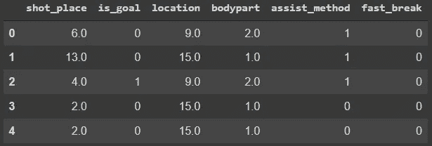

Figure 4: Sample of the Dataset

总共有 229135 次投篮出现在数据中，其中 192431 次投篮被考虑。

## 逻辑回归

在中，为了验证构建的贝叶斯网络，需要基线。在这个项目中，在与贝叶斯网络相同的特征上实现逻辑回归，并且比较两者预测的 xG。

在实现逻辑回归之前，可用的数据被矢量化，即所有特征被转换成 k-hot 向量。

例如，Body part = 3 被转换为 Bodypart = [0，0，1]

使用 PCA 降低了数据的维数，如图 5 所示。

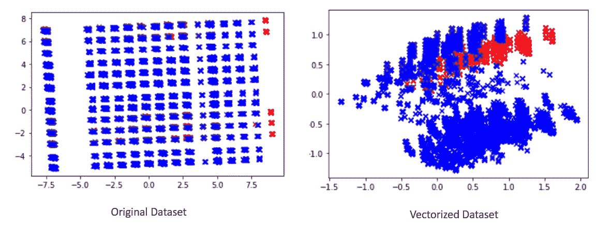

Figure 5: Original and Vectorized Dataset represented in 2 dimensions.

然而，现有数据严重偏向于未命中。

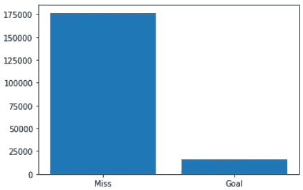

Figure 6: Distribution of Goals in the Dataset

因此，为了调整阶层不平衡，使用了加权逻辑回归。重量计算如下:

**权重= 0.5*(实例数/遗漏数)**

图 7 总结了未加权模型和加权模型的结果。

Figure 7: Logistic Regression

即使未加权的逻辑回归给出了更好的准确性，加权的逻辑回归被认为是基线模型，因为它对新数据的概括更好。

## 贝叶斯网络

贝叶斯网络的节点由{Location，Is_Goal，Shot_Place，Assist_Method，Bodypart，Fast_Break}给出。

为了学习网络的结构，使用了基于约束的结构学习，其中程序最初假设节点是独立的，然后验证该假设。获得的结构如图 8 所示。

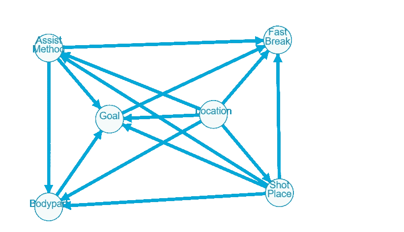

Figure 8: Bayesian Network Predicted by CBSL

一旦决定了结构，使用贝叶斯估计器计算每个节点的条件概率分布。

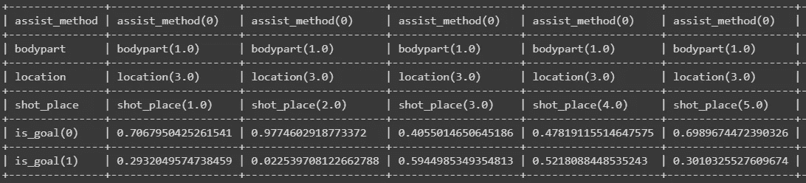

Figure 9: Portion of the CPD table for node — is_goal

一旦学习了贝叶斯网络的结构和参数，就可以通过生成对网络的查询来计算其他节点的边缘化概率条件。

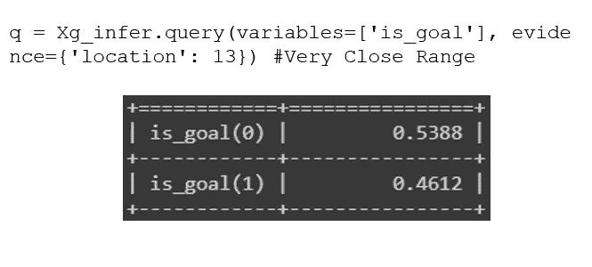

Figure 9: Query Result for Goal at Very Close Range

有关贝叶斯网络的结构和参数学习的更多信息，请查看博客末尾的附录。

# 结果

现在贝叶斯网络已经学会了，它可以用来找出许多我们对足球比赛不确定的事情的答案。

# 1.评估玩家表现

自从莱昂内尔·梅西和克里斯蒂亚诺·罗纳尔多首次亮相足球世界以来，他们已经完全垄断了世界足球的聚光灯。在过去的十年或更长的时间里，他们继续以许多人认为不可能的技巧和连贯性表演。在这段时间里，除了两人令人难以置信的进球，还有关于谁更优秀的争论。我们可能经常想要比较两个伟大的球员，即使这个模型是开放的解释，它也有希望提供一个关于有问题的球员的更清晰的图片。

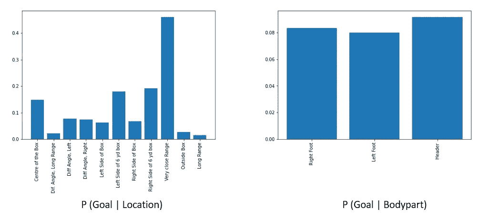

Figure 10: Conditional Xg for an Average Player

图 10 显示了普通玩家的条件 xG 给定身体部位或位置。正如所料，近距离射击的 xG 最高，一般来说，近距离射击比远距离射击有更高的 xG。

同样的，xG 是头球的最高分。这可以归因于这样一个事实，即头球通常是从可得分区域尝试的。右脚的 xG 略高，可能是因为右脚球员人数较多而有所偏差。

使用莱昂内尔·梅西和克里斯蒂亚诺·罗纳尔多的可用数据进行了类似的分析，如图 11 所示。

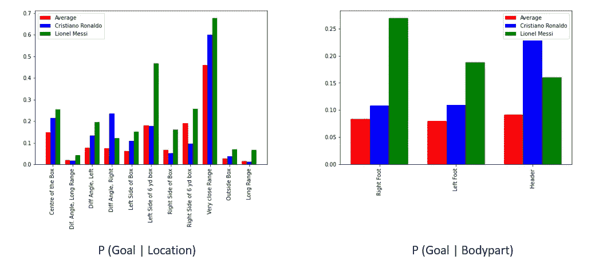

Figure 11: xG for Lionel Messi and Cristiano Ronaldo

从图表中可以清楚地看到，与平均水平相比，两位选手的水平都要高得多。然而，在他们两人中，梅西似乎在几乎每个位置上都表现得最好。事实上，罗纳尔多更好的唯一指标是从右边的困难角度，这可以被原谅，因为梅西是左脚球员，而罗纳尔多是右脚球员。

图表中一个令人惊讶的结果是，梅西右脚的表现更好。然而，这可能是因为梅西通常不会用右脚射门，但当他用右脚射门时，那是致命的(我想起了 2015 年 UCL 半决赛对阵拜仁的诺伊尔芯片)。此外，图表进一步巩固了罗纳尔多作为最佳头球之一的地位。

# 2.真实匹配分析

到目前为止，该模型已经在受控的模拟环境中进行了评估，为了更好地评估性能，必须为真实比赛计算 xG。

# 2015 年《经典》——伯纳乌的闪电

2015 年 11 月 21 日，西班牙足球的巨人，巴塞罗那和皇家马德里，在圣地亚哥伯纳乌迎来了本赛季的第一场经典比赛。加泰罗尼亚人由路易斯·恩里克率领，刚刚结束了一个三冠王赛季。与此同时，皇家马德里由去年夏天任命的新教练拉法·贝尼特斯领导。尽管巴塞罗那队开始时没有莱昂内尔·梅西，但路易斯·苏亚雷斯、内马尔和安德烈斯·伊涅斯塔等其他球员完全控制了比赛，并带领巴塞罗那队以 4 比 0 大胜，为连续两次成为西甲冠军铺平了道路。

比赛中尝试的射门总结在表 2 中。

Table 2: Shots in the match (Only shots with xG_BN > 0.1 are included)

然后使用逻辑回归和贝叶斯网络模型计算每个镜头的 xG。

Table 3: xG predicted by Logistic Regression and Bayesian Network

其中两种模型预测的总 xG 为—

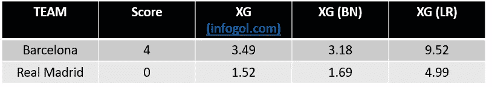

Table 4: xGpredicted by Logistic Regression and Bayesian Network

从表 4 中可以看出，贝叶斯网络模型比给定的数据好得多，逻辑回归分类器严重高估了 xG。事实上，考虑到数据的限制以及我们忽略了角球、任意球等的事实，贝叶斯网络表现得非常好。

# 结论

在这个项目中，实现了一个贝叶斯网络来计算射门成为进球的概率，给出了射门背后的上下文信息。逻辑回归也是使用作为上述模型基线的相同特征来实现的。

该模型用于比较玩家的表现，并在现实世界中使用，发现其表现比逻辑回归模型好得多。尽管使用的数据少得多，但该值也接近足球分析师预测的文献值，这就提出了在更大的数据集上应用贝叶斯网络的有趣问题。

# 未来作品

1.  相同的模型可以应用于扩展数据集，这可能会导致 xG 指标的新标准。
2.  可以使用 xG 提升算法来解决类别不平衡的问题。
3.  定位球可以单独考虑，也可以与开放式比赛目标一起考虑。
4.  除了理论工作，现有的模型可以用来回答很多实际问题，只受你想象力的限制。

作为注脚，这个项目用的代码已经上传到 Github 上了。任何感兴趣的人都可以公开查阅。

Github 链接:[https://github.com/Aranya3003/FootballXg](https://github.com/Aranya3003/FootballXg)

# 附录

## 基于约束的结构学习

贝叶斯网络中的结构学习指的是学习数据中隐藏的条件依赖。它的计算复杂度在最坏的情况下在节点数量上是超指数级的，在大多数真实世界场景下是多项式级的。有广泛的三种方法用于学习贝叶斯网络的结构，基于*约束、基于*分数和*混合*算法。在这个项目中，使用了基于约束的结构学习。

所有基于约束的结构学习算法共享下面给出的公共三阶段结构

**第一阶段:学习马克诺维克毛毯**

1.  对于每个变量 X，学习它的马尔可夫毯 B(X)。节点的马尔可夫链是指全部可用节点的子集，它包含关于该节点的所有有用信息。
2.  检查马尔可夫链的对称性。如果 X 属于 B(Y)，那么 Y 必定属于 B(X)。所有非对称节点都从各自的马尔可夫链中删除。

**第二阶段:学习邻居**

1.  对于每个变量 X，学习它的邻居的集合 N (X)(即 X 的父母和孩子)。等价地，对于每一对 X，Y，搜索所有节点的子集，给定该子集中的任何节点，X 和 Y 是独立的。如果不存在这样的子集，那么 X 和 Y 由一条弧连接。
2.  检查网络的对称性，类似于步骤 2。

**阶段 3:学习圆弧方向**

1.  对于每一对具有共同邻居 Z 的不相邻变量 X 和 Y，检查 X 和 Y 是否独立于给定的 Z，如果不独立，则设置弧线 X-Z 和 Z-Y 的方向以获得 V-结构 V = {X → Z← Y}。
2.  如果 X 与 Y 相邻，并且从 X 到 Y 有一条严格定向的路径(从 X 到 Y 的路径不包含无向弧)，则将 X-Y 的方向设置为 X → Y。
3.  如果 X 和 Y 不相邻，但 X → Z 和 Z Y 相邻，则将后者改为 Z → Y。

## **使用贝叶斯估计的参数学习**

贝叶斯参数估计(BPE)是一种广泛使用的技术，用于估计参数未知的随机变量的概率密度函数。假设我们有一个随机变量 X，它的分布取决于未知参数θ。在 Bayes 参数估计中，参数θ被视为服从分布 p(θ)的随机变量或随机向量。在贝叶斯估计中，给定数据的θ的概率是最大的，即 p(θ|S)。根据贝叶斯定理，

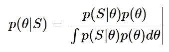

其中 p(θ)是先验概率，p(S|θ)是似然性。