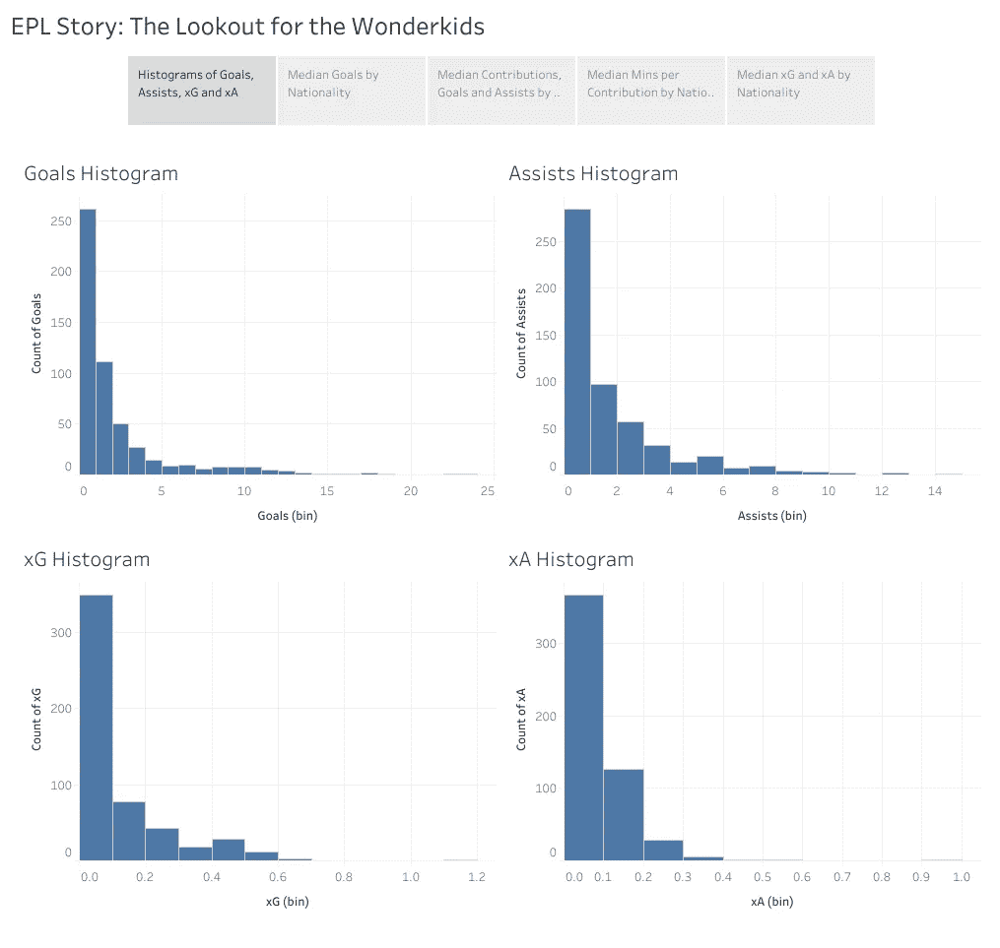
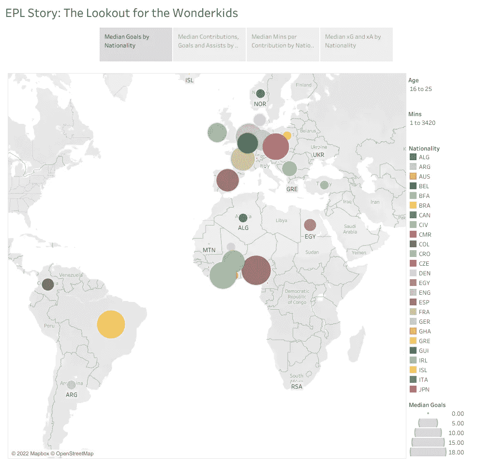
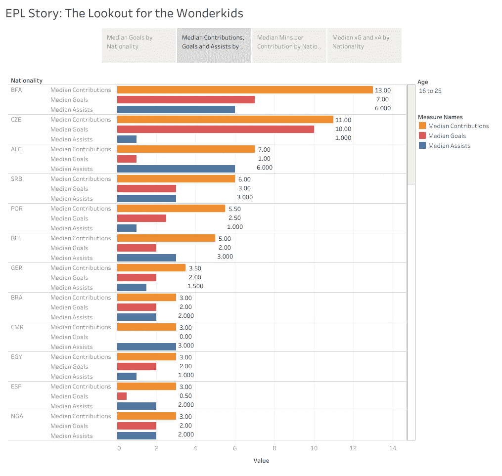
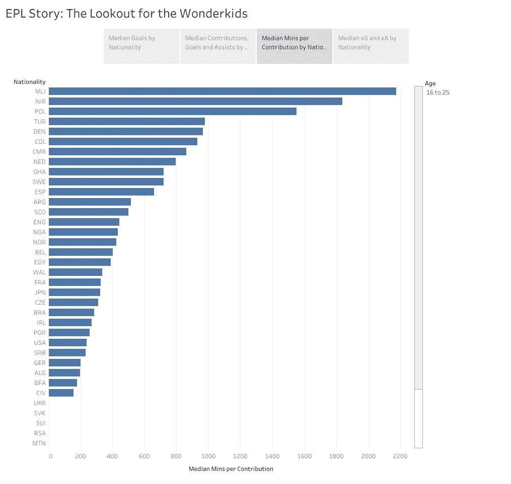
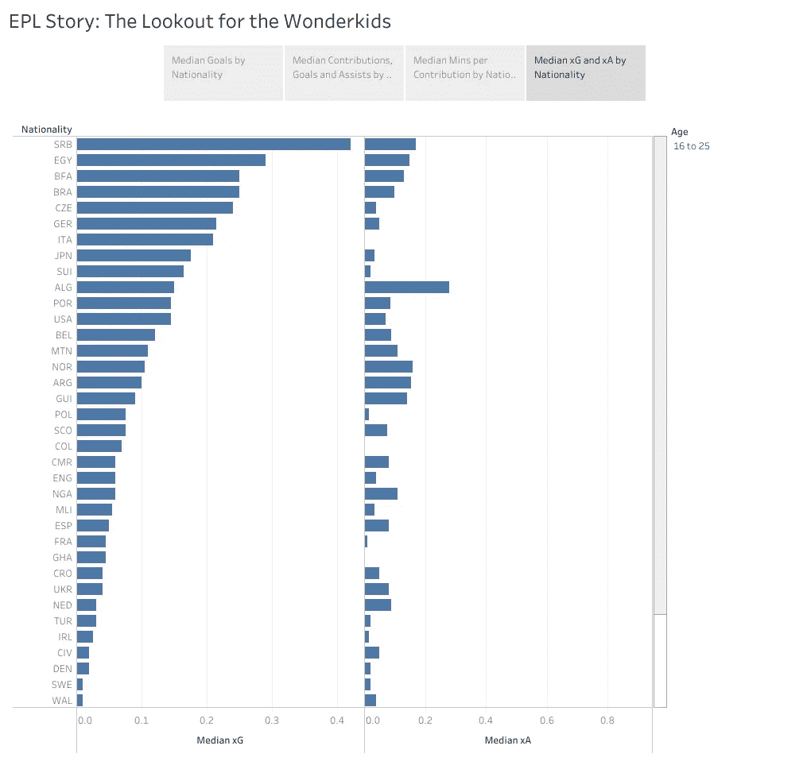

# 足球+数据:哪里能找到下一个 EPL 神童？

> 原文：<https://medium.com/geekculture/football-data-where-to-find-the-next-epl-wonderkid-90c93c401577?source=collection_archive---------8----------------------->

足球俱乐部总是在寻找伟大的天才，并愿意挥霍年轻和极具天赋的球员。

一个例子是皇马以€1.01 亿英镑的价格买下托特纳姆热刺队前锋加雷斯·贝尔，当时他 24 岁。

Gareth Bale playing for Real Madrid (Source: [Wikipedia](https://en.wikipedia.org/wiki/Gareth_Bale#/media/File:Gareth_Bale_-_CdR_-_RM_v_ATL.jpg))

正因为如此，许多足球俱乐部都是成功的企业——以低廉的价格购买有潜力的年轻人才，然后在他们吸引大俱乐部的目光时卖掉。这方面的一个例子是[多特蒙德足球俱乐部，因其高潜力的青训人才而闻名](https://www.firsttouchaf.com/newsroom/2020/1/29/how-did-borussia-dortmund-become-a-factory-for-talent)。

最重要的是，足球俱乐部花费数百万美元雇佣球探来寻找有潜力的人才加入他们的学院。

# 问题陈述

那么，**一个足球俱乐部如何知道去哪里寻找有潜力的神童呢？他们应该把球探派到哪里？**

一种方法是用数据来看全局。

在这篇文章中，我将使用 2020/2021 赛季英超联赛的球员数据来展示足球神童确定潜在球探位置的过程。数据集在 Kaggle [这里](https://www.kaggle.com/datasets/rajatrc1705/english-premier-league202021)可用，而仪表盘在[这里](https://public.tableau.com/app/profile/yh4306/viz/EPLStoryTheLookoutfortheWonderkids/EPLStoryTheLookoutfortheWonderkids)可用。

这一点要注意:

1.  我们将年轻定义为 25 岁及以下的玩家，这反映在 Tableau 仪表盘的过滤器中。
2.  我们将在此分析中使用中位数，因为进球(中位数= 6)和助攻(中位数= 9)数是正偏的，如下图所示:

# 按国籍划分的目标中位数

首先，我们按国籍来看目标中位数。

Median goals by nationality (Source: Author)

中值目标用圆圈的大小来表示，圆圈越大越好。这意味着一个典型的球员会进 X 个球。

一件有趣的事情是，有来自欧洲以外的优秀球员——布基那法索(BFA)、马里(MLI)、美国(美国)、尼日尼亚(NGA)和加纳(GHA)。

考虑到其他地区的人才竞争相当激烈，足球俱乐部可以瞄准这些国家寻找廉价但有潜力的足球人才。

# 按国籍划分的贡献、目标和协助的中位数

其次，我们看一下各国贡献、进球和助攻的中位数。

这里的贡献是进球和助攻的总和，也是我们在这里考虑的主要因素。

Median contributions (goals and assists) by nationality (Source: Author)

来自布基纳法索的玩家——再次出现，这一次，名列榜首，加入的还有阿尔及利亚、巴西、喀麦隆、埃及和尼日利亚等非欧洲国家。

# 按国籍划分的每次缴费分钟数中位数

第三，我们来看看按国籍划分的平均上场时间。

Median minutes per contribution by nationality (Source: Author)

这很重要，因为我们想知道一个球员需要踢多久才能以进球或助攻的形式留下印记。越短越好。

马里这次名列榜首，随后是喀麦隆、加纳、阿根廷和尼日利亚等非欧洲国家。

# 按国籍划分的 xG 和 xA 中位数

最后，我们来看看按国籍划分的 xG 和 xA 的中位数。

xG 和 xA 被称为预期进球和预期助攻，它们是通过公式计算出来的，代表了球员将贡献的估计进球和助攻，基于各种因素，如比赛风格、场上位置等。总之越高越好。

Median xG and xA by nationality (Source: Author)

然而，我们更重视进球，而不是助攻——因为进球机器比助攻王更容易上头条。知名度也影响球员的转会费。

请看图表，塞尔维亚这次名列榜首，紧随其后的是非欧洲国家，如埃及、布基纳法索、巴西、日本和阿尔及利亚。一个有趣的国家是毛利塔尼亚(MTN)，它进入了前 15 名。

# 结束语

通过观察上面的图像，如果我是一名足球球探，我会建议在马里、布基纳法索、喀麦隆、加纳和埃及等地区寻找人才。毛里塔尼亚是可选的，因为它是根据一个估计的指标 xG 来衡量的。

你对这个分析有什么想法？让我知道！

# 外部链接

1.  [Tableau 仪表盘](https://public.tableau.com/views/EPLStoryTheLookoutfortheWonderkids/EPLStoryTheLookoutfortheWonderkids?:language=en-US&:display_count=n&:origin=viz_share_link)
2.  [GitHub 资源库](https://github.com/yuenherny/epl-wonderkids-analysis)