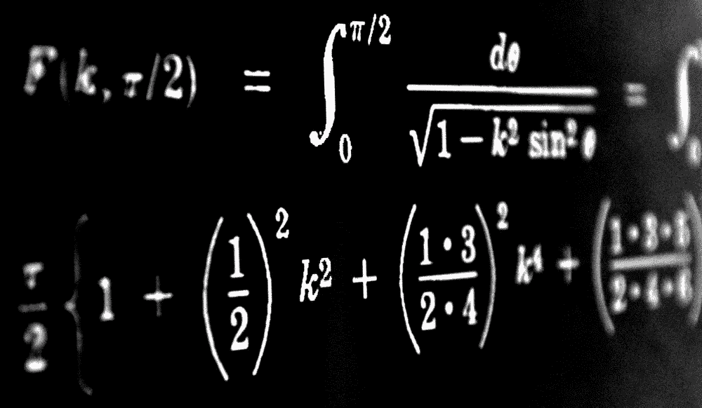
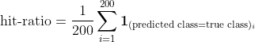
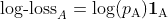
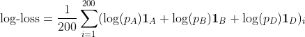
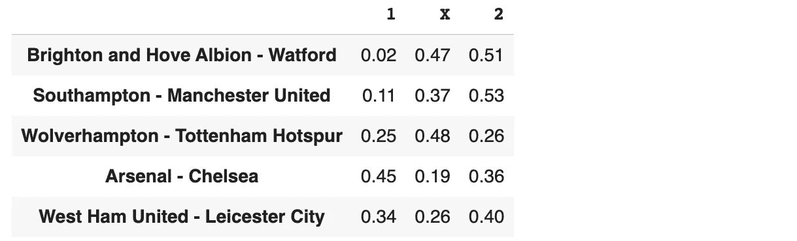
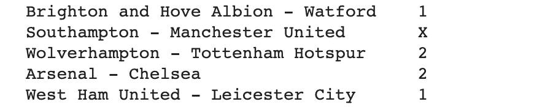

# 足球预测性能:如何计算命中率和对数损失

> 原文：<https://medium.com/geekculture/football-prediction-performance-how-to-calculate-hit-ratio-and-log-loss-1e5e22310497?source=collection_archive---------3----------------------->

## 机器学习变得简单

## 你永远不会做错



无论您是在做研究、打赌，还是只是比较预测，衡量模型的性能都是必不可少的一步。这篇短文展示了如何使用[代码](https://github.com/octosport/octopy/blob/master/notebooks/Football_Prediction_Performance.ipynb)和示例计算 1x2 足球预测的命中率和对数损失。这两个损失通常用于足球分析和全球机器学习。本文所用数据由 [Sportmonks](https://www.sportmonks.com/) 提供。

# 预测足球是一个概率分类问题

在衡量一个模型的性能之前，我们需要了解我们正在处理什么问题。我们希望预测 A 队和 B 队之间的足球比赛结果。结果和预测可以采用三个不同的值，称为*类*:**A 队赢**，**B 队赢**，**平局**。因为我们只有三个类别，所以这个问题是一个分类任务。但是，我们也对每个结果的概率感兴趣。这些概率给出了你对结果确信程度的信息。原来我们现在有一个**概率分类问题。**

> 我们只有三种结果，每场比赛都有同样多的概率。我们知道，这三种概率之和总是等于 1。因此，与最大概率相关联的预测类别将总是具有等于 1/3 的大概率。

在 1x2 预测情况下，A 队和 B 队之间比赛的预测结果有两个关联的答案:

*   **概率预测**:这是由数学模型、博彩公司、投票等完成的任务。
*   **类别预测**:这是与最大概率相关的结果。

例如，如果 A 队有 30%的获胜概率，B 队有 45%的获胜概率，平局是 25%，那么预测的级别(结果)是**B 队赢**。注意，我们有 30%+45%+25%=100%。

由于我们对预测问题有两个稍微不同的答案，所以我们有两个不同的性能度量。log-loss 衡量预测概率的质量，命中率衡量预测类的正确性。

# 对数损失和命中率

**命中率**(或准确度)可能是评估分类模型最常用和最容易理解的度量。很容易理解你 10%的预测是正确的。在我们的例子中，我们想要测量一个三类模型的命中率。

假设我们有 200 个与他们的结果和预测类相匹配的结果。我们需要做的就是将预测的类与实际结果进行比较。如果相同，则计为 1，如果不相同，则计为 0。我们对 200 个匹配进行这样的操作，取平均值，并获得命中率。数学上我们可以写:



the hit-ratio formula for 200 matches

我们希望命中率尽可能高，并且总是在 0 到 1 之间。

另一方面，****的对数损耗要复杂一点。这个损失给你一个概率质量的度量。思考这个问题的一种方法是分别考虑每种结果。****

****例如，以团队 A 获胜预测为例。如果实际结果是 A 队获胜，那么任何 A 队获胜概率超过 34%的模型都将做出正确的预测。但是，一个概率为 95%的模型应该被视为比预测概率为 55%的模型更好的模型。即使两者都有正确的结果。****

****正如你所看到的，我们所需要的是测量**当正确的结果为真**(分别为假)时，概率距离 1 (分别为 0) **有多远。事实上，如果 A 队赢了，已知的*概率*是 **1** ，我们想知道我们的预测与此有多远。“有多远”可以用不同的方法来计算，但我们将把重点放在对数损失上。在我们的团队中，成功的例子很简单:******

****

**the log-loss of A win**

**如果 A 队输了比赛，它就是 0，但是如果 A 队赢了，它就变得有趣了。在这种情况下，10%概率的损失值为-2.30，50%概率的损失值为-0.69，90%概率的损失值为-0.01。如果概率是 100%，损失是 0。事实上，**我们希望对数损耗尽可能接近零。**对数损失始终在 0 和负无穷大之间。概率越接近实际结果，对数损失越好。**

> **在这个例子中，我们知道 A 队赢了比赛。在这种情况下，另外两个结果的对数损失为 0。所以对于每场比赛来说，只有与正确结果相关的概率才是输球的关键。**

**如果我们再取 200 个匹配，则总对数损失为:**

****

**the log-loss formula for 200 matches**

**估计了命中率和对数损失。匹配的数量越多，这个估计就越准确。对于对数损失来说尤其如此，错误的概率会对对数损失平均值产生很大的负面影响。**

# **具体的例子**

**我们用数据算一个例子。计算这两个指标的 python 代码可以在 [GitHub](https://github.com/octosport/octopy) 上获得。这些功能非常简单，使用相同的输入。第一个参数是`probabilities`，一个 [pandas](https://pandas.pydata.org/docs/reference/api/pandas.DataFrame.html) dataframe，其中的列包含“1”、“2”和“X”结果的概率，每一行都是匹配的。第二个参数是包含真实结果的熊猫系列。检查输入以确保将返回正确的值。这两个功能是:**

```
def compute_1x2_log_loss(probabilities, true_results):
    *'''
    Compute the log-loss for 1x2 football results.

    '''* def compute_1x2_hit_ratio(probabilities, true_results):
    *'''
    Compute the hit-ratio for 1x2 football results.
*    *'''*
```

**例如，`probabilities`数据帧如下:**

****

**The probabilities pandas dataframe**

**而`true_results`将会是:**

****

**The true result pandas series**

**那么损耗可以很容易地计算如下:**

```
log_loss = compute_1x2_log_loss(probabilities,true_result)hit_ratio = compute_1x2_hit_ratio(probabilities,true_result)
```

**一个完整的例子可以在笔记本[这里](https://github.com/octosport/octopy/blob/master/notebooks/Football_Prediction_Performance.ipynb)找到。**

# **结论**

**本文展示了如何计算 1x2 概率模型的对数损失和命中率。我们还提供了代码，以便于理解和自己进行计算。所提出的函数可以扩展到其他类型的预测，如两队得分或比赛过多或过少。**