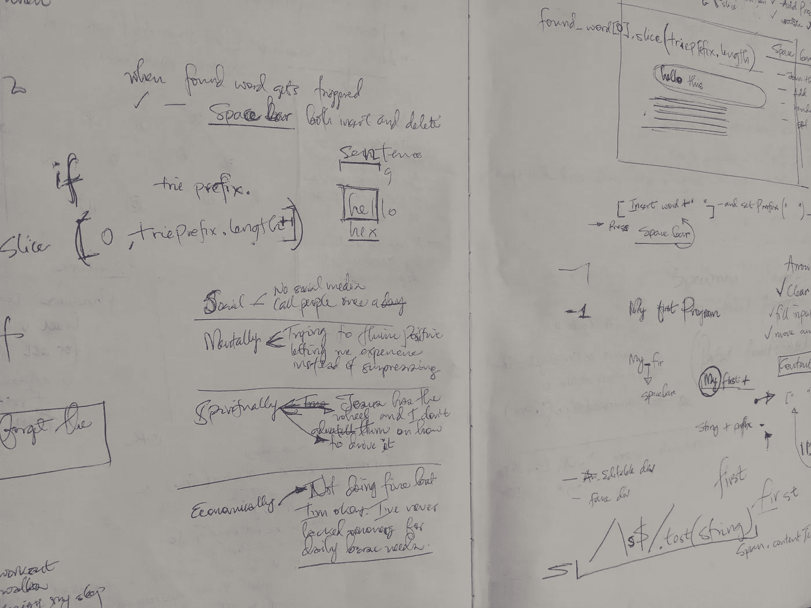

# 两年来我一直在编码而不是编程！

> 原文：<https://medium.com/geekculture/for-two-years-i-was-coding-instead-of-programming-62540f8c3cc6?source=collection_archive---------1----------------------->

改变对编程的看法后，我学到了什么。(来自个人经验的见解)

你是否曾被如何开始解决某个问题所困扰，甚至迷失在你自己的代码中！很长一段时间以来我就是这样。在进入 JavaScript 领域两年后，*冒名顶替综合症*开始发作。这是由以下原因造成的:-

*   *求职被拒*(我想每个人都应该习惯了)。
*   未能找出*为什么你的代码在一个小小的改变后就中断了*。
*   阅读*程序员自学几个月后找到好工作的成功故事*，而你仍然在努力合并拉取请求(当然这种比较不好，但该死，我们是人)。

> 但这是我一直以来最大的挫折。我真的无法开始一个有趣的项目或想法，除非先搜索如何解决它。嗯，谷歌搜索应该是每个程序员的技能，但我真的感觉很糟糕，也不感到自豪，因为大多数时候我没有或很少输入我想出的解决方案。我看不到我的投入，直到我开始用不同的方式思考编程，我认为你可以摘一两片叶子。

> 在开始一个项目之前，一定要有一支笔和一本编程书！

对，实体书。(好吧，不是很实际，有时是一个标签或便笺簿，但只要是可以自由书写和素描的东西。)为什么？你会在这篇文章的结尾知道它的重要性。

大多数时候，当我想开始一个项目时，我通常知道我最终想要实现什么，但很少想到如何实现它，换句话说，就是过程。知道我最终想要什么，自动让我意识到到底要谷歌什么，但我谷歌的都是解决方案(完成的想法/项目)，而不是过程(解决方案是如何实现的)，我能惊叹的是，无论是谁写了“工作解决方案”，都是如何真正思考的。实际上，我是一名程序员，但不是程序员。

> 程序员考虑如何找到解决方案，编码员用他们喜欢的“胡言乱语”语言写下解决方案。

我决心有一天也写一个“工作解决方案”，在我成功地在《极客文化》上发表了第一篇“工作解决方案”的文章后，我通读了它，实际上直到现在我仍然不相信是我写的，因为它解释了我想要解决的问题的过程。自从那篇文章之后，我开始学习一些技巧，这些技巧让我享受解决问题的过程，度过“困难”时刻，并为自己的工作感到自豪。

# 1.做一些你感兴趣的事情

作为一名程序员，你想尝试的事情的数量可以是无限的，但是如果你不是真的想知道它是如何工作的，很多事情都会半途而废。

想要知道事情背后的机制的冲动总是会给你很多没有答案的问题，最终会让你开始寻找答案，大多数时候一个答案会建立在另一个之上，让你更接近你的解决方案。这也让它变得有趣，就像一次探险。我在谷歌搜索栏中输入，这让我想知道谷歌到底有多了解我输入的单词。这种好奇心把我带进了一个兔子洞，产生了[这篇文章](/geekculture/a-simple-search-bar-auto-complete-implementation-reactjs-f08382742013)。

如果你一直想知道某个系统或功能是如何工作的，满足你的好奇心，*不要停止，直到你复制了相同的系统或功能*。一路上，你可以发现和学习很多东西。

> 做一个你感兴趣的项目比做一个推荐给你的项目更有趣。

# 2.利用草图、笔记和图表

虽然这是第二步，但却是最重要的一步。

> 光思考是不够的。通过勾画想法、做笔记、链接气泡图来帮助大脑更好地思考。

这就是编程书籍或标签和钢笔或铅笔的用武之地。思考如何最好地解决问题，写下来并画下来，当你陷入困境时，就是谷歌搜索的时候了(我将在下一点谈到这一点)。

> 至少要努力做到 ***只有在卡住的时候才谷歌。***

写下这个过程会给你一张地图，让你想象你的心理模型，让你感觉自己是解决方案的一部分(即使你在陷入困境时得到了一点帮助)。对我来说，*画草图，写笔记，画和链接图表，就是我考虑编程的内容。*

My sketches and notes of [this article](/geekculture/how-to-effortlessly-implement-an-autocomplete-data-structure-in-javascript-using-a-trie-ea87a7d5a804?source=rss----9758482ba857---4)

你不需要把整个解决方案写出来，但至少要有一个写在纸上的心理模型来指导你的编码。我总是回到我的编程速写本，它真的让我感到高兴，我变得如此善于思考解决方案。

> 如果编程是设计，每个程序员都需要一个速写本。

# 3.卡住了就只有谷歌了

> 没有什么比知道自己付出了大部分努力而拥有一个不会崩溃的工作解决方案或代码更令人自豪的了。

你可能有许多项目、解决方案、贡献甚至评论，但是没有什么比在所有的努力中有你的投入更令人满意的了。当你在做一个有趣的项目、解决方案或任务时，在寻找解决方案之前，努力想出一个解决方案。即使你没有找到一个可行的解决方案，你也比那些根本没有尝试过的人要好，而且大多数时候你找到的解决方案会留在你的记忆中。我曾经相信，如果我不知道如何思考解决方案，那么我就不是程序员。在开始谷歌搜索能帮我解决问题的程序之前，我会努力思考。

# 4.使用好的、不言自明的变量名

我知道你可能听说过这个，但让我强调一下，因为我发现它是一个宝石。因为我是用高级语言编写代码的，确切地说是 Python 和 JavaScript，所以当我读自己的代码时，我喜欢像读英语一样。说真的，你为什么要让自己的代码读起来很无聊呢？命名变量时我避免的事情；-

*   缩写单词；如果我选择了一个变量名，并且它不是那么长，我就照原样写。我宁愿`number`也不愿`num`。
*   使用“_”代替 camelCase 除非是遵循一定规则的团队项目，否则我宁愿声明`var previous_letters = ''`而不是`var previousLetters = ''`。

Choosing the right variables helps you read through the code easily

在变量名之上，我对我的代码进行注释，使它与我画的草图、笔记和图表押韵。这让我不用过多参考注释就能读懂代码，也让我记住了用简单英语无法读出的逻辑。

> “任何傻瓜都能写出计算机能理解的代码。优秀的程序员编写人类能够理解的代码”——马丁·福勒

在我思考了如何更好地用上面的想法进行编程之后，我总是为我的最终解决方案和输入感到自豪，至少开始觉得我真的没有我在编程方面想的那么糟糕。我希望您能在编程之旅中发现一二真知灼见。

如果你觉得这篇文章很有趣，很有见地，请给它一个掌声。干杯:)