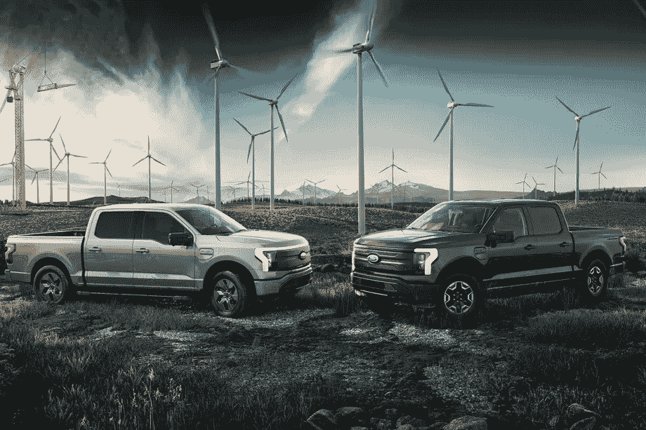

# 福特和通用要么打败特斯拉，要么拼命

> 原文：<https://medium.com/geekculture/ford-and-gm-will-beat-tesla-or-die-trying-1b3d839d0de9?source=collection_archive---------4----------------------->

## 让经验见鬼去吧，这些传统汽车制造商决心要赢

Photo via [Ford](https://www.theverge.com/2021/5/24/22450563/ford-f150-lightning-pro-electric-pickup-truck-commercial-fleets)

不管你喜不喜欢，汽车正在走向电动化。这是传统汽车公司已经接受的事实。这种转变正在快速发生。

这并不意味着内燃机将很快离开道路。通用和福特都将有一个…